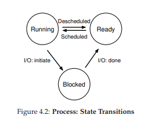
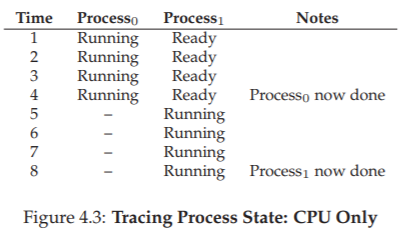
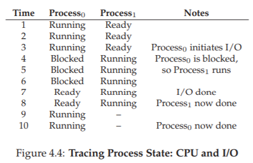
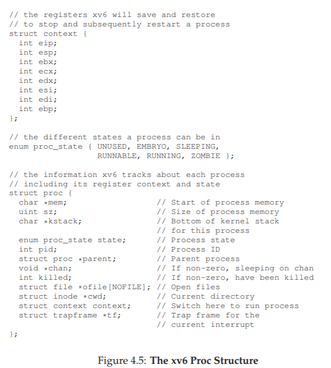

# 4. The Abstraction: The Process

この章では、OSがユーザに提供するもっとも基本的な抽象概念の1つ、すなわちプロセスについて説明します。プロセスの定義は、非公式には非常に単純です。実行中のプログラム[V+65、BH70]です。プログラム自体は特に意味のないものです。ディスク上に、一連の命令(例えば、いくつかの静的なデータ)があります。これらのバイトを取り込んで実行させるのは、オペレーティングシステムであり、プログラムを何か役に立つものに変えるものです。

一度に複数のプログラムを実行したいと思うことがよくあります。たとえば、Webブラウザー、メールプログラム、ゲーム、音楽プレーヤーなどを実行したいデスクトップパソコンやノートパソコンを考えてみましょう。実際、典型的なシステムは、見かけ上、数十から数百のプロセスを同時に実行している可能性があります。そうすることで、システムが使いやすくなります。CPUが利用可能かどうか心配する必要は決してありません。単にプログラムを実行するだけです。

>> 問題：  
>> どのように多くのCPUがあるように見せるのでしょうか？利用可能な物理CPUはほんのわずかですが、OSはどのようにしてこのCPUをほぼ無限に供給しているような錯覚をさせるのでしょうか？

OSはCPUを仮想化してこの錯覚を作り出します。1つのプロセスを実行し、それを停止し、別のプロセスを実行するなど、実際には1つの物理CPUしか存在しない場合でも、多くの仮想CPUが存在するという錯覚をつくりだすようなことがあります。CPUのtime sharingと呼ばれるこの基本的な技術は、ユーザーが好きなだけ多くの並行プロセスを実行できるようにします。しかし、並行処理はパフォーマンスとtrade offです。CPUを共有する必要がある場合は、それぞれがゆっくりと実行されるため、パフォーマンスが低下します。

CPUの仮想化を実装し、それをうまく実装するためには、低レベルのマシンといくつかの高レベルのインテリジェンスが必要です。私たちは、低レベルの機構メカニズム(low-level machinery mechanisms)と呼んでいます。メカニズムとは、必要な部分を実装する低レベルのメソッドまたはプロトコルです。たとえば、コンテキストスイッチを実装する方法を後で学習します。これにより、OSにあるプログラムの実行を停止し、特定のCPU上で別のプログラムを実行できるようになります。このtime sharing mechanismはすべての最新のOSで採用されています。

これらのメカニズムの上には、OSのインテリジェンスの一部がポリシーの形で存在します。ポリシーとは、OS内で何らかの決定を下すためのアルゴリズムです。たとえば、CPU上で実行可能なプログラムの複数があれば、どのプログラムをOSで実行する必要がありますか？OSのスケジューリング方針は、どのプログラムが実行されているかなどの仕事量に関する情報や、パフォーマンス指標など、履歴情報を使用してこの決定を行います。対話型パフォーマンスを最適化するシステム、またはスループット)を決定することができます。

>> TIP: USE TIME SHARING (AND SPACE SHARING)  
>> Time sharingは、OSがリソースを共有するために使用する基本的な手法です。リソースをある法則に従って少しずつ、次に少しずつ使用することを許可することにより、問題のリソース(例えば、CPUまたはネットワークリンク)を多くの人が共有することができます。time sharingの対応は、リソースを使用したい人の間で(空間内で)分け合う空間共有です。たとえば、ディスクスペースは当然スペース共有されたリソースです。ディスクスペースの領域のブロックがファイルに割り当てられると、ユーザーが元のファイルを削除するまで、通常は別のファイルに割り当てられません。

## 4.1 The Abstraction: A Process
実行中のプログラムのOSによって提供される抽象化は、プロセスと呼ばれるものです。上記のように、プロセスは実行中のプログラムのことです。どの瞬間においても、実行中にアクセスまたは影響を与えるシステムのさまざまな部分のインベントリを取ることによって、プロセスを要約することができます。

どのようなプロセスを構成するのかを理解するには、マシンの状態(machine state)を理解する必要があります。実行中にプログラムが読み書きできるものがあるのかを知る必要があります。

プロセスを構成するマシン状態の1つのとしてわかりやすいものは、メモリです。命令はメモリに置かれます。実行中のプログラムが読み書きするデータもメモリに格納されます。したがって、プロセスがアドレス指定できるメモリ(アドレス空間と呼ばれる)はプロセスの一部です。

また、プロセスのマシン状態の一部はレジスタです。多くの命令はレジスタを明示的に読み込んだり更新したりするので、プロセスの実行にとって重要です。

このマシン状態の一部を形成する特別なレジスタがいくつかあることに注意してください。例えば、プログラムカウンタ(PC)(命令ポインタまたはIPと呼ばれることもある)は、プログラムのどの命令が現在実行されているかを示します。同様に、スタックポインタと関連するフレームポインタを使用して、関数パラメータ、ローカル変数、およびリターンアドレスのスタックを管理します。  
最後に、プログラムはよくストレージデバイスにもアクセスします。そのようなI/O情報は、プロセスが現在開いているファイルのリストも含みます。

>> TIP: SEPARATE POLICY AND MECHANISM  
>> 多くのオペレーティングシステムで共通の設計は、低レベルのメカニズム[L+75]から高レベルのポリシーを分離することです。メカニズムは、システムに関する質問への答えを提供するものと考えることができます。たとえば、オペレーティングシステムはコンテキストスイッチをどのように実行するでしょうか？

ポリシーは質問に対する回答を提供します。たとえば、オペレーティングシステムは現在どのプロセスを実行する必要があるでしょうか？これらの2つを分離することで、メカニズムを再考する必要なしにポリシーを簡単に変更できるため、一般的なソフトウェア設計の原則であるモジュール性の一種です。

## 4.2 Process API
次の章まで実際のプロセスAPIの議論を延期しますが、ここではまずオペレーティングシステムのどのインタフェースに何が含まれなければならないかについていくつかの考えを示します。これらのAPIは、何らかの形で最新のオペレーティングシステムで使用できます。

- Create：オペレーティングシステムには、新しいプロセスを作成するためのメソッドが含まれている必要があります。シェルにコマンドを入力するか、アプリケーションアイコンをダブルクリックすると、OSが呼び出されて、指定したプログラムを実行するための新しいプロセスが作成されます。

- Destroy：プロセス作成用のインタフェースがあるため、システムはプロセスを強制的に破棄するインタフェースも提供します。もちろん、多くのプロセスが実行され、完了したばかりのプロセスは終了します。しかしながら、ユーザがそれらを止めることをしたいかもしれないので、暴走プロセスを止めるためのインタフェースは非常に有用です。

- Wait：プロセスが実行を停止するのを待つことが有用な場合があります。したがって、何らかの種類の待機インタフェースが提供されることが多いです。

-  Miscellaneous Control：プロセスを強制終了または待機する以外に、可能な他のコントロールがあることがあります。たとえば、ほとんどのオペレーティングシステムでは、プロセスを中断させて(しばらく実行しないようにする)何らかの方法を提供してから、プロセスを再開します(実行し続けます)。

- Status：通常、プロセスの実行時間や状態など、プロセスに関するステータス情報を得るためのインタフェースがあります。

## 4.3 Process Creation: A Little More Detail
私たちが少し疑問に思うことは、プログラムがプロセスにどのように変換されるかということです。具体的には、OSはどのようにプログラムを起動して実行しているのでしょうか？プロセスの作成は実際にどのように機能するのでしょうか？

プログラムを実行するためにOSが最初にしなければならないことは、そのコードおよび任意の静的データ(例えば、初期化された変数)をメモリにプロセスのアドレス空間にロードすることです。プログラムは、ある種の実行可能形式で、ディスク(または現代のシステムでは、フラッシュベースのSSD)に最初は常駐しています。したがって、プログラムと静的データをメモリにロードするプロセスでは、OSがディスクからこれらのバイトを読み込み、どこかのメモリに配置する必要があります(図4.1を参照)。

初期の(または単純な)オペレーティングシステムでは、ローディングプロセスは一回で完了させます。つまり、プログラムを実行する前に一度ロードをすべて終わらせます。現代のOSは、遅延的です。つまり、プログラムの実行中に必要とされるときにのみコードまたはデータの断片をロードすることによって、少しずつロードさせてプロセスを実行させます。コードやデータの遅延的な読み込みがどのように機能するかを本当に理解するには、ページングとスワッピングのメカニズムについてもっと理解しておく必要があります。今後はメモリの仮想化について議論します。今のところ、何かを実行する前に、重要なプログラムビットをディスクからメモリに取り込むためには、OSが何らかの作業を行う必要があることを覚えておいてください。

コードと静的データがメモリにロードされると、プロセスを実行する前にOSが行う必要のあることがあります。いくつかのメモリは、プログラムのruntime stack(または単にstack)に割り当てなければなりません。既に知っているはずのように、Cプログラムはローカル変数、関数のパラメータ、および戻りアドレスにスタックを使用します。OSはこのメモリを割り当て、プロセスに渡します。また、OSは引数でスタックを初期化します:具体的には、`main()`関数の引数、すなわちargcとargv配列に値を代入します。

OSは、プログラムのヒープ用にいくつかのメモリを割り当てることもできます。Cプログラムでは、明示的に要求された動的に割り当てられたデータにヒープが使用されます。プログラムは`malloc()`を呼び出してheap領域を要求し、`free()`を呼び出して明示的にheap領域を解放します。ヒープは、リンクリスト、ハッシュテーブル、ツリー、その他のデータ構造に必要です。最初のヒープ領域は小さいです。より多くのメモリを割り当てるときは、最初にプログラムが実行されるとき、また、`malloc()`ライブラリAPIを介してより多くのメモリを要求するときです。このとき、heap領域を大きくするためにOSが関与し、より多くのメモリをプロセスに割り当てるかもしれません。

OSは、特に入力/出力(I/O)に関連して、いくつかの他の初期化タスクも行います。たとえば、UNIXシステムでは、各プロセスは標準で入力、出力、およびエラーの3つのopen file discripterをデフォルトで持っています。これらのディスクリプタは、プログラムが端末からの入力を容易に読み取ることができるとともに、出力を画面に出力することを可能にします。永続性(persistence)に関する本の第3部では、I/Oやファイルディスクリプタなどについて学びます。

メモリにコードとスタティックデータをロードすることで、スタックを作成して初期化し、I/O設定に関連する他の作業を行うことで、OSはプログラム実行のステージを(最終的に)設定します。したがって、エントリポイント(プログラムを起動するところ)、最後に`main()`ルーチン(次の章で説明する特殊なメカニズムによって)にジャンプすることによって、CPUはCPUの制御を移します。そこで、新しく作成されたプロセスに渡され、プログラムが実行を開始します。

## 4.4 Process States
プロセスが何であるかについていくつかのアイデアがあるので(私たちはこの概念を改良し続けるつもりですが)、プロセスがどのように作成されるかについて、ある時点でプロセスができるさまざまな状態についてお話しましょう。プロセスがこれらの状態の1つになるという考えは、初期のコンピュータシステム[DV66、V+65]で生まれました。単純化されたビューでは、プロセスは次の3つの状態のいずれかになります。

- Running：実行中の状態では、プロセスがプロセッサ上で実行されています。これは命令を実行していることを意味します。

- Ready：レディ状態では、プロセスは実行準備が整っていますが、何らかの理由でOSがこの瞬間にプロセスを実行しないことを選択しました。

- Blocked：ブロックされた状態では、プロセスが何らかの操作を実行したため、他のイベントが発生するまで実行できません。一般的な例：プロセスがディスクへのI/O要求を開始すると、プロセスがブロックされるため、他のプロセスでプロセッサを使用することができます。

これらの状態をグラフにマッピングすると、図4.2の図になります。この図でわかるように、プロセスは、OSの裁量で、実行可能状態と実行状態の間で移動できます。準備完了から実行中に移行することは、プロセスがスケジュールされていることを意味します。実行中から準備完了に移行すると、そのプロセスはスケジュールされていません。プロセスがブロックされると(例えば、I/O動作を開始することによって)、OSは何らかのイベント(例えば、I/O完了)が発生するまでその状態を維持します。その時点で、プロセスは再び準備完了状態に移行します(OSが決定した場合は、すぐに再実行する可能性があります)  
2つのプロセスがこれらの状態のいくつかをどのように移行するかの例を見てみましょう。まず、2つのプロセスが稼働しているとします。それぞれのプロセスはCPUを使用しています(I/Oはありません)。この場合、各プロセスの状態のトレースは、このようになります(図4.3)。

この次の例では、最初のプロセスが実行した後にI/Oを発行します。その時点で、プロセスはブロックされ、他のプロセスに実行の機会が与えられます。図4.4に、このシナリオのトレースを示します。  
具体的には、Process0はI/Oを開始し、完了するのを待ってブロックされます。ディスクからの読み取りやネットワークからのパケットの待機など、プロセスはブロックされます。OSはProcess0がCPUを使用していないことを認識し、Process1の実行を開始します。Process1が実行されている間、I/Oは完了し、Process0を準備完了に戻します。最後に、Process1が終了し、Process0が実行されて終了します。

この簡単な例でも、OSが決定しなければならないことが、たくさんあることに注意してください。まず、Process0がI/Oを発行している間に、システムはProcess1を実行することを決定しなければなりませんでした。そうすることで、CPUをビジーに保つことによってリソースの使用率が向上します。第2に、システムはI/Oが完了したときにProcess0に戻らないことにしました。これが良い判断かどうかは不明です。みなさんはどう思いますか？これらのタイプの決定は、OSスケジューラによって行われます。これについては、今後いくつかの章で説明します。

## 4.5 Data Structures
OSはプログラムであり、どのプログラムでも、さまざまな関連情報を追跡するいくつかの重要なデータ構造を持っています。たとえば、各プロセスの状態を追跡するために、OSは、準備が整っているすべてのプロセスのプロセスリストと、現在実行中のプロセスを追跡するための追加情報を保持している可能性があります。OSはブロックされたプロセスを何らかの形で追跡しなければなりません。I/Oイベントが完了したら、OSは正しいプロセスを起動して、再度実行する準備をしておく必要があります。  
図4.5は、OSがxv6カーネル[CK+08]の各プロセスについてどのようなタイプの情報を追跡する必要があるかを示しています。Linux、Mac OS X、Windowsなどの「実際の」オペレーティングシステムにも同様のプロセス構造が存在します。それらを見てどのくらい複雑であるかを見てください。  
この図から、OSがプロセスについて追跡している重要な情報をいくつか確認できます。レジスタコンテキストは、停止されたプロセスに対して、そのレジスタの内容を保持する。プロセスが停止すると、そのレジスタはこのメモリ位置に保存されます。これらのレジスタを復元する(すなわち、それらの値を実際の物理レジスタに戻す)ことによって、OSはプロセスの実行を再開することができます。コンテキストスイッチと呼ばれるこの手法については、今後の章で詳しく説明します。

図から、プロセスが実行可能、準備完了、ブロックされている以外の状態がいくつかあることもわかります。場合によっては、プロセスが作成されているときにシステムが初期状態になることがあります。また、プロセスは終了したが、まだクリーンアップされていない最終状態に置くことができます(UNIXベースのシステムでは、ゾンビ状態1と呼ばれます)。この最終状態は、他のプロセス(通常はプロセスを作成した親プロセス)がプロセスの戻りコードを調べ、正常終了したプロセスが正常に実行されたかどうかを確認するのに便利です(UNIXベースシステムでは、彼らは正常にタスクを達成しており、それ以外の場合は0ではない)。終了すると、親は、子の完了を待つために1回の最終コール(例えば、`wait()`)を行い、現在絶滅しているプロセスを参照する関連するデータ構造をクリーンアップできることをOSに示します。

>> ASIDE: DATA STRUCTURE — THE PROCESS LIST  
>> オペレーティングシステムには、さまざまな重要なデータ構造があります。プロセスリストは、重要なデータ構造の一つです。これは単純なものの1つですが、確かに複数のプログラムを同時に実行する能力を持つOSは、システム内のすべての実行中のプログラムを追跡するために、この構造に似たものを持っています。時には、プロセスに関する情報を格納する個々の構造体をProcess Control Block(PCB)と呼ぶこともあります。Process Control Block(PCB)は、各プロセスに関する情報を含むC構造体に関する素晴らしい方法です。

## 4.6 Summary
我々はOSの最も基本的な抽象化を紹介した。プロセスというのは、それは非常に単純に実行中のプログラムとみなされることです。この概念を念頭に置いて、プロセスを実装するために必要な低レベルのメカニズムと、インテリジェントな方法でそれらをスケジューリングするために必要とされるより高いレベルのポリシーを扱います。メカニズムとポリシーを組み合わせることによって、オペレーティングシステムがCPUをどのように仮想化するかを理解していきます。

# 参考文献

[BH70] “The Nucleus of a Multiprogramming System”  
Per Brinch Hansen  
Communications of the ACM, Volume 13, Number 4, April 1970  
This paper introduces one of the first microkernels in operating systems history, called Nucleus. The idea of smaller, more minimal systems is a theme that rears its head repeatedly in OS history; it all began with Brinch Hansen’s work described herein.

[CK+08] “The xv6 Operating System”  
Russ Cox, Frans Kaashoek, Robert Morris, Nickolai Zeldovich  
From: https://github.com/mit-pdos/xv6-public  
The coolest real and little OS in the world. Download and play with it to learn more about the details of how operating systems actually work. We have been using an older version (2012-01-30-1-g1c41342) and hence some examples in the book may not match the latest in the source.

[DV66] “Programming Semantics for Multiprogrammed Computations”  
Jack B. Dennis and Earl C. Van Horn  
Communications of the ACM, Volume 9, Number 3, March 1966  
This paper defined many of the early terms and concepts around building multiprogrammed systems.

[L+75] “Policy/mechanism separation in Hydra”  
R. Levin, E. Cohen, W. Corwin, F. Pollack, W. Wulf  
SOSP 1975  
An early paper about how to structure operating systems in a research OS known as Hydra. While Hydra never became a mainstream OS, some of its ideas influenced OS designers.

[V+65] “Structure of the Multics Supervisor”  
V.A. Vyssotsky, F. J. Corbato, R. M. Graham  
Fall Joint Computer Conference, 1965  
An early paper on Multics, which described many of the basic ideas and terms that we find in modern systems. Some of the vision behind computing as a utility are finally being realized in modern cloud systems.

[prev](../03/03.md)|[next](../05/05.md)
