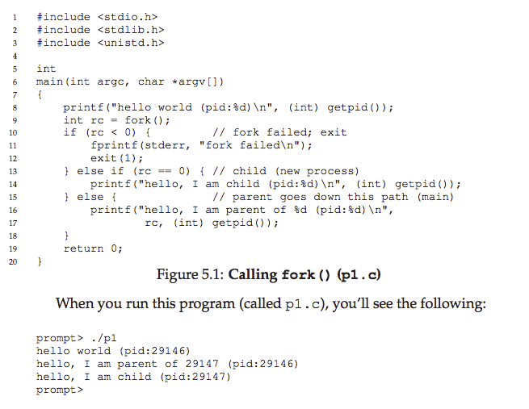
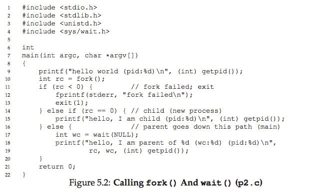
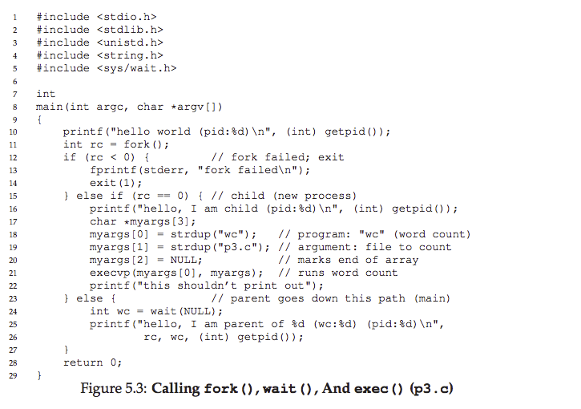
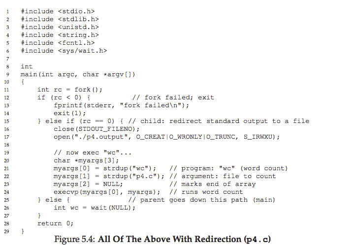

# 5. 間奏：プロセスAPI
>> ASIDE：INTERLUDES  
>> Interludesでは、オペレーティングシステムAPIに重点を置いて、それらを使用する方法など、システムのより実用的な側面について説明します。実用的なことが気に入らなければ、これらの間奏をスキップすることができます。しかし実用的なものが好きなのは、実は実生活では一般的に便利だからです。例えば、企業は、通常、あなたの非実用的なスキルのためにあなたを雇うことはありません。

この中で、UNIXシステムでのプロセス作成について説明します。UNIXは、fork（）とexec（）の2つのシステムコールを使用して、新しいプロセスを作成する最も興味深い方法の1つを提供します。3番目のルーチンwait（）は、作成したプロセスが完了するのを待つプロセスによって使用できます。ここでは、これらのインターフェースをいくつかの簡単な例を挙げてより詳細に提示し、私たちの動機づけを示します。

>> CRUX：プロセスの作成と制御方法  
>> プロセスの作成と制御のためにOSが提示すべきインタフェースは何ですか？これらのインターフェイスは、使いやすさとユーティリティ性を実現するためにどのように設計されるべきですか？

## 5.1 システムコール fork()
fork（）システムコールは新しいプロセス[C63]の作成に使用されます。具体的には、図5.1に示すようなコードを持つ実行プログラムがあります。コードを調べるか、それを入力して実行してください。



　p1.c.でもっと詳しく知りましょう。最初に実行を開始すると、プロセスはhello worldメッセージを出力します。そのメッセージにはプロセス識別子（PIDとも呼ばれます）が含まれています。このプロセスのPIDは29146です。UNIXシステムでは、PIDは、（例えば）実行を停止するなど、プロセスで何かをしたい場合にプロセスの名前を付けるために使用されます。  
　ここで面白い部分が始まります。このプロセスは、OSが提供するfork（）システムコールを呼び出して、新しいプロセスを作成します。作成されるプロセスは、呼び出しプロセスの（ほぼ）正確なコピーです。つまり、OSには、実行中のプログラムp1のコピーが2つあり、両方ともfork（）システムコールから復帰しようとしているようです。新たに作成されたプロセス（親とは対照的に、子と呼ばれる）はmain（）で動作を開始しません。（「hello、world」メッセージは一度だけ出力されます。むしろ、fork（）自体を呼び出したかのように、開始します。  
　気づいたかもしれません。子供は正確なコピーではありません。具体的には、アドレス空間（すなわち、自身のプライベートメモリ）のコピー、自身のレジスタ、それ自身のPCなどを持っていますが、fork（）の呼び出し元に返す値は異なります。具体的には、親が新しく作成された子のPIDを受け取っている間、子はゼロの戻りコードを受け取ります。この区別は、2つの異なるケースを扱うコードを書くのが簡単なので（上記と同様に）便利です。



　また気づいたかもしれません。出力（p1.cの）は決定的ではありません。子プロセスが作成されると、システムには親プロセスと子プロセスの2つのアクティブなプロセスがあります。単一のCPUを持つシステムで実行していると仮定すると（単純化のため）、その時点で子プロセスまたは親プロセスが実行される可能性があります。上の例では、親がメッセージを最初に出力しました。それ以外の場合は、この出力トレースに示すように、逆の場合があります。


　CPUスケジューラは、すぐに詳細に議論するトピックで、特定の瞬間に実行されるプロセスを決定します。スケジューラは複雑であるため、通常は何を選択するのか、したがってどのプロセスが最初に実行されるのかについて前提はできません。この非決定性は、特にマルチスレッドプログラムでは、いくつかの興味深い問題につながります。したがって、本書の第2部で並行性を学ぶと、非決定性がさらに増えます。

## 5.2 システムコール wait()
　これまでのところ、メッセージを出力して終了する子供を作成しました。時には、親プロセスが子プロセスの処理を完了するのを待つことは非常に便利です。このタスクは、wait（）システムコール（またはより完全な兄弟waitpid（））で実行されます。詳細は図5.2を参照してください。  
　この例（p2.c）では、親プロセスはwait（）を呼び出して、子プロセスの実行が終了するまでその実行を遅延させます。子が終了すると、wait（）は親に戻ります。  
　上記のコードにwait（）を追加すると、出力が決定的になります。


　このコードでは、子が常に最初に表示されることがわかりました。なぜ我々はそれを知っていますか？前と同じように最初に走って、親の前にプリントするかもしれません。しかし、親が最初に実行されると、すぐにwait（）が呼び出されます。このシステムコールは、子が実行されて終了するまで返されません。したがって、親が最初に実行されても、子が実行を終了するのを丁寧に待ってからwait（）が戻り、親がそのメッセージを表示します。

## 5.3 最後、システムコール exec()
　プロセス作成APIの最終的かつ重要な部分は、exec（）システムコールです。このシステムコールは、呼び出し元のプログラムとは異なるプログラムを実行する場合に便利です。たとえば、p2.cのfork（）の呼び出しは、同じプログラムのコピーを実行し続ける場合にのみ便利です。しかし、多くの場合、別のプログラムを実行する必要があります。exec（）はそれだけを行います（図5.3）。  
　この例では、子プロセスはexecvp（）を呼び出して、ワードカウントプログラムであるプログラムwcを実行します。実際には、ソースファイルp3.c上でwcを実行するので、ファイル内にいくつの行、単語、およびバイトがあるかがわかります。




　fork（）システムコールは異常です。犯罪のパートナーであるexec（）は普通ではありません。実行可能ファイルの名前（wcなど）といくつかの引数（p3.cなど）を指定すると、実行可能ファイルからコード（および静的データ）をロードし、現在のコードセグメント（および現在の静的データ）を上書きします。プログラムのメモリ空間のヒープおよびスタックおよび他の部分が再初期化されます。その後、OSは単にそのプログラムを実行し、そのプロセスのargvとして引数を渡します。したがって、新しいプロセスは作成されません。むしろ、現在実行中のプログラム（以前はp3）を別の実行中のプログラム（wc）に変換します。子の中でexec（）の後では、p3.cが決して走っていないかのようです。exec（）への呼び出しが成功すると、決して戻りません。

## 5.4 どうして？APIの動機付け
　もちろん、あなたが持っているかもしれない1つの大きな疑問：なぜ新しいプロセスを作成する単純な行為でなければならないものに対して、このような奇妙なインタフェースを構築するのでしょうか？fork（）とexec（）の分離はUNIXシェルを構築する上で不可欠です。なぜなら、シェルがfork（）の呼び出しの後、exec（）の呼び出しの前にコードを実行できるからです。このコードは実行しようとしているプログラムの環境を変更することができ、したがって様々な興味深い機能を容易に構築することができます。

>> ヒント：それを得る（ラムプーンの法律）  
>> Lampson氏が彼の著名な「コンピュータシステム設計のヒント」[L83]で述べているように、「それを正しくしてください。抽象化もシンプルさも、それを正しくするための代替手段ではありません」。時には、正しいことをしなければならない時もあります。プロセス作成のためのAPIを設計する方法はたくさんあります。しかし、fork（）とexec（）の組み合わせは単純で非常に強力です。ここでは、UNIXデザイナーは単にそれを正しく理解しました。そしてLampsonはしばしば「正しい」と言いましたので、私たちはその名誉の中で法律を名づけました。

　シェルは単なるユーザープログラムです。それはプロンプトを表示し、何かを入力するのを待ちます。次に、コマンド（実行可能プログラムの名前に加えて任意の引数）を入力します。ほとんどの場合、シェルはファイルシステム内で実行可能ファイルがどこにあるのかを確認し、fork（）を呼び出してコマンドを実行する新しい子プロセスを作成し、exec（）のいくつかの変種を呼び出してコマンドを実行します。Wait（）を呼び出してコマンドを実行することで完了します。子が完了すると、シェルはwait（）から戻り、プロンプトをもう一度出力して、次のコマンドの準備をします。  
　fork（）とexec（）を分離することで、シェルは便利なものを簡単に扱うことができます。
```
prompt> wc p3.c > newfile.txt
```

　上記の例では、プログラムwcの出力が出力ファイルnewfile.txtにリダイレクトされます（より大きい記号はリダイレクトがどのように示されているかです）。シェルがこのタスクを達成する方法は非常に簡単です。子が作成されるとき、exec（）を呼び出す前に、シェルは標準出力を閉じてファイルnewfile.txtを開きます。これにより、すぐに実行されるプログラムwcからの出力は、画面ではなくファイルに送信されます。  
　図5.4は、これを正確に実行するプログラムを示しています。このリダイレクションが機能する理由は、オペレーティングシステムがファイル記述子をどのように管理するかという仮定によるものです。具体的には、UNIXシステムはゼロでフリーファイル記述子を探し始めます。この場合、STDOUT FILENOが最初に使用可能になり、したがってopen（）が呼び出されるときに割り当てられます。その後、子プロセスによるprintf（）などのルーチンによる標準出力ファイル記述子への後続の書き込みは、画面ではなく新しく開いたファイルに透過的にルーティングされます。  
　次に、p4.cプログラムを実行した結果を示します。



　あなたは、この出力に関して（少なくとも）2つの面白い小物を気づくでしょう。まず、p4を実行すると、何も起こっていないかのように見えます。シェルはコマンドプロンプトを表示するだけで、すぐに次のコマンドの準備ができます。しかし、そうではありません。プログラムp4は実際にfork（）を呼び出して新しい子を作成し、execvp（）の呼び出しによってwcプログラムを実行しました。出力がファイルp4.outputにリダイレクトされたため、画面に出力が表示されません。次に、出力ファイルをキャッチすると、wcを実行したときに期待されるすべての出力が見つかることがわかります。  
　UNIXパイプも同様の方法で実装されますが、pipe（）システムコールが実装されています。この場合、1つのプロセスの出力はカーネル・パイプ（すなわち、キュー）に接続され、別のプロセスの入力はその同じパイプに接続されます。したがって、1つのプロセスの出力がシームレスに次の入力に使用され、長くて有効なコマンドのチェーンを一緒につなげることができます。簡単な例として、ファイル内の単語を探し、その単語が何回出現したかを数えます。パイプとユーティリティはgrepとwcで簡単です。 grep -o foo file | wc -l とプロンプトに入力します。  
　最後に、プロセスAPIを高レベルでスケッチしただけですが、これらの呼び出しが学習され、消化されることについての詳細がはるかに多くあります。本書の第3部でファイルシステムについて話すときに、たとえばファイル記述子についてもっと学びます。今のところ、fork（）/exec（）の組み合わせは、プロセスを作成して操作する強力な方法であると言うだけで十分です。

>> ASIDE：RTFM - 人のページを読む
>> 　この本では、特定のシステムコールやライブラリ呼び出しを参照するときに、マニュアルページやマニュアルページを読むことを何度も指示します。マニュアルページは、UNIXシステム上に存在するオリジナルのドキュメント形式です。Webと呼ばれるものが存在する前にそれらが作成されたことに気付きます。  
>> 　マニュアルページを読むのに時間を費やすことは、システムプログラマの成長の鍵となる一歩です。それらのページにはたくさんの便利な小技が隠されています。特に便利なページには、使用しているシェル（tcsh、bashなど）のマニュアルページと、プログラムが作るシステムコール（戻り値とエラー条件が存在するかどうかを確認するためのもの）があります。  
>> 　最後に、マニュアルページを読むことで、いくつかの恥ずかしさを軽減できます。fork（）の複雑さについて同僚に尋ねると、彼らは単に「RTFM」と返答するかもしれません。これは、あなたの同僚の読書の手引きを静かに促す方法です。

## 5.5 APIのその他の部分
　fork（）、exec（）、wait（）以外にも、UNIXシステムのプロセスとやりとりするための多くのインタフェースがあります。たとえば、kill（）システムコールは、スリープ状態に陥るか、死ぬか、その他の有用な命令を含む、シグナルをプロセスに送信するために使用されます。実際、シグナルサブシステム全体は、シグナルを受信して処理する方法を含め、プロセスに外部イベントを提供する豊富なインフラストラクチャを提供します。  
　便利な多くのコマンドラインツールがあります。たとえば、psコマンドを使用すると、実行中のプロセスを確認できます。psに渡す有用なフラグのマニュアルページを読んでください。ツールのトップは、システムのプロセスやCPUや他のリソースがどれくらい消費しているかを表示するので、非常に役立ちます。最後に、システムの負荷をすばやく把握するために使用できるさまざまな種類のCPUメーターがあります。たとえば、私たちはMacintosh Toolbars上で実行されているRaging MenaceソフトウェアのMenuMetersを常に保持しているので、いつどのCPUが使用されているかを見ることができます。一般的に、何が起こっているかについてのより多くの情報は、より良いものです。

## 5.6 要約
fork（）、exec（）、wait（）のような、UNIXプロセスの作成を扱ういくつかのAPIを紹介しました。しかし、私たちは表面を見ただけです。詳細については、StevensとRago [SR05]、特にプロセス制御、プロセス関係、および信号に関する章を読んでください。そこには学ぶべきことががたくさんあります。

>> ASIDE：コーディングの原点
>> コーディングの宿題は、現代のオペレーティングシステムが提供しなければならない基本的なAPIのいくつかの経験を得るために、実際のマシンで実行するコードを書く小さな練習です。結局のところ、（おそらく）あなたはコンピュータ科学者なので、コーディングするのは正しいでしょうか？もちろん、本当に専門家になるためには、少し時間をかけてマシンをハッキングする必要があります。実際には、いくつかのコードを書いて、それがどのように動作するかを見るためのあらゆる言い訳を見つけてください。時間を費やし、あなたができることを知っている賢いマスターになりなさい。

## 宿題（コード）
この課題では、読んだばかりのプロセス管理APIに精通する必要があります。 心配する必要はありません - それは聞こえるよりもさらに楽しいです！ 一般的には、コードを書くことができるくらい多くの時間を見つけた方がずっと良いでしょう。

## 問題
1. fork（）を呼び出すプログラムを記述します。 fork（）を呼び出す前に、メインプロセスに変数（たとえばx）にアクセスさせ、その値を何か（例えば100）に設定させます。 子プロセスの変数はどのような値ですか？ 子と親の両方がxの値を変更すると、変数には何が起こりますか？
2. ファイルをオープンする（open（）システムコールで）プログラムを作成し、fork（）を呼び出して新しいプロセスを作成します。 子と親の両方がopen（）によって返されたファイル記述子にアクセスできますか？ 同時にファイルに書き込むとき、つまり同時に実行するとどうなりますか？
3. fork（）を使用して別のプログラムを作成します。 子プロセスは "hello"を出力する必要があります。 親プロセスは "さようなら"を印刷する必要があります。 子プロセスが常に最初に印刷されるようにする必要があります。 あなたは親でwait（）を呼び出さずにこれを行うことができますか？
4. fork（）を呼び出し、exec（）の何らかの形式を呼び出してプログラム/ bin / lsを実行するプログラムを記述します。 execl（）、execle（）、execlp（）、execv（）、execvp（）、およびexecvP（）を含むexec（）のすべてのバリエーションを試すことができるかどうかを確認してください。 なぜ同じ基本的な呼び出しの多くの変種があると思いますか？
5. 子プロセスが親プロセスで終了するのを待つためにwait（）を使うプログラムを書いてください。 wait（）は何を返しますか？ 子でwait（）を使用するとどうなりますか？
6. Wait（）の代わりにwaitpid（）を使用して、前のプログラムのわずかな変更を書き込んでください。 waitpid（）はいつ有用でしょうか？
7. 子プロセスを作成し、子プロセスで標準出力（STDOUT FILENO）を閉じるプログラムを記述します。 子が記述子を閉じた後にprintf（）を呼び出して出力をプリントするとどうなりますか？
8. 2つの子を作成し、pipe（）システムコールを使用して、標準出力をもう一方の標準入力に接続するプログラムを記述します。

# 参考文献
[C63] “A Multiprocessor System Design”  
Melvin E. Conway  
AFIPS ’63 Fall Joint Computer Conference  
New York, USA 1963  
An early paper on how to design multiprocessing systems; may be the first place the term fork() was used in the discussion of spawning new processes.  

[DV66] “Programming Semantics for Multiprogrammed Computations”  
Jack B. Dennis and Earl C. Van Horn  
Communications of the ACM, Volume 9, Number 3, March 1966  
A classic paper that outlines the basics of multiprogrammed computer systems. Undoubtedly had great influence on Project MAC, Multics, and eventually UNIX.

[L83] “Hints for Computer Systems Design”  
Butler Lampson  
ACM Operating Systems Review, 15:5, October 1983  
Lampson’s famous hints on how to design computer systems. You should read it at some point in your life, and probably at many points in your life.

[SR05] “Advanced Programming in the UNIX Environment”  
W. Richard Stevens and Stephen A. Rago  
Addison-Wesley, 2005  
All nuances and subtleties of using UNIX APIs are found herein. Buy this book! Read it! And most importantly, live it.