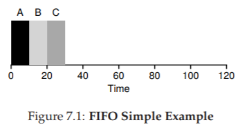
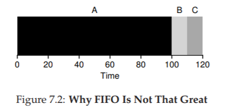
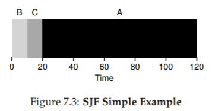
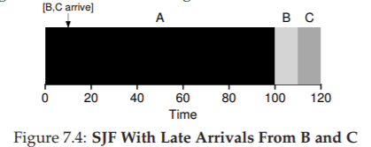
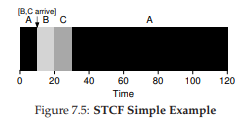
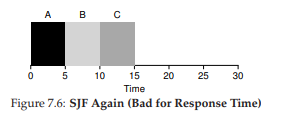
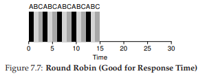
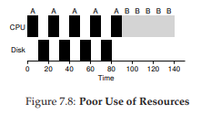
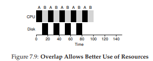

# 7. Scheduling: Introduction

現時点で、実行中のプロセスの低レベルのメカニズム(例えば、コンテキストの切り替え)は明確にわかっていないといけません。そうでない場合は、1つまたは2つの章に戻って、低レベルのメカニズムがどのように機能するかの説明を読んで理解してください。しかし、OSスケジューラが採用している高度なポリシーについてはまだ理解していません。これからは、さまざまな人々が長年にわたって開発してきた一連のスケジューリング方針(時には専門分野と呼ばれる)を提示します。

スケジューリングの起点は、実際には、コンピュータシステム以前からあります。初期のアプローチは運用管理の分野から取り上げられ、コンピュータに適用されました。このことは少しも不思議でないでしょう、流れ作業での組み立てやその他多くのことがらにはスケジューリングが必要であり、同様の問題の多くはそこにも存在するのですから。したがって、私たちの問題は以下のようになります。

>> THE CRUX: HOW TO DEVELOP SCHEDULING POLICY(スケジューリング方針を開発する方法)  
>> スケジューリング方針について考えるための基本的なフレームワークをどのように開発する必要があるでしょうか？主要な前提は何でしょうか？どのような指標が重要になるでしょうか？コンピュータシステムの初期段階ではどのような基本的なアプローチが使用されているのでしょうか？

## 7.1 Workload Assumptions
適応可能なポリシーの範囲に入る前に、まずシステム内で実行されているプロセスについて簡単に仮定を立てましょう。時にはまとめて仕事量と呼ばれます。仕事量を決定することは、ポリシー作成の重要な部分であり、仕事量について知るほどポリシーが細かく調整されます。

私たちがここで作った仕事量の仮定はほとんど非現実的ですが、それは問題ありません。私たちが行くにつれてリラックスし、最終的には...(思考停止)すべてに対応できる運用スケジューリング規律になるでしょう。
システムで実行されているプロセス(ジョブとも呼ばれる)について、次の前提を設定します。

1. 各ジョブは同じ時間実行されます。
2. すべてのジョブが同時に到着します。
3. 開始されると、各ジョブは完了まで実行されます。
4. すべてのジョブはCPUのみを使用する(すなわち、I/Oを実行しない)
5. 各ジョブの実行時間は既知である。

これらの前提の多くは非現実的であると言いましたが、オーウェルの動物園ではいくつかの動物が他の動物よりも同等であるように[O45]、いくつかの仮定はこの章の他の仮定よりも非現実的です。特に、各ジョブの実行時間はわかっているかもしれません。スケジューラはすべてを把握しているでしょう。しかし、スケジューラはすべてを把握できるようになりますが、すぐにはうまくいかないでしょう。

## 7.2 Scheduling Metrics
仕事量の前提をする以外にも、スケジューリング・メトリックという異なるスケジューリング・ポリシーを比較できるようにするには、もう1つ必要です。メトリックは、何かを測定するために使用するものであり、スケジューリングに意味があるさまざまなメトリックがあります。

しかし今のところ、単一の指標、つまりターンアラウンド・タイムを単に取るだけで、私たちの人生を単純化しましょう。ジョブの所要時間は、ジョブが完了した時刻からジョブがシステムに到着した時刻を引いた時刻として定義されます。より正式には、ターンアラウンドタイム$T_{turnaround}$は次の通りです:

$T_{turnaround} = T_{completion} - T_{arrival}$ (7.1)

すべての仕事が同時に到着すると仮定しているので、今のところ$T_{arrival} = 0$、したがって$T_{turnaround} = T_{completion}$.です。この事実は、前述の前提条件を緩和するにつれて変化します。ターンアラウンドタイムはパフォーマンスメトリックであることに注意してください。もう一つの測定基準は、Jainの公平指数(Jain's Fairness Index [J91])によって測定された公平さです。パフォーマンスと公平さは、スケジューリングにおいてよく不安定にさせるものです。例えば、スケジューラは性能を最適化することができるが、いくつかのジョブが実行されるのを防止し、公平性を低下させるといったことが考えられます。この難解は「人生はいつも完璧というわけではない」ことを示しています。

## 7.3 First In, First Out (FIFO)
実装可能な最も基本的なアルゴリズムは、FIFO(First In、First Out)スケジューリング、またはFirst Come、First Served FCFS)と呼ばれます。  
FIFOにはいくつかの肯定的な特性があります。これは明らかに単純で実装が容易です。そして、私たちの前提を考えれば、それはかなりうまくいくでしょう。簡単な例を一緒に考えましょう。ほぼ同時に($T_{arrival} = 0$). )、3つのジョブがシステムA、B、Cに到着したとします。FIFOは三つのうちからどれかをとって仕事を最初にしなければいけないので、Aが同時に到着したときに、AはCの前に僅差で到着したばかりのBの前に僅差で到着したと仮定しましょう。これらのジョブの平均所要時間はどのくらいですか？

図7.1から、Aは10で終了し、Bは20で、Cは30で終了したことがわかります。したがって、3つのジョブの平均所要時間は単純に$\frac{10+20+30}{3}=20$。ターンアラウンドタイムの計算は簡単です。

５つの前提条件のうちの1つを緩和させましょう。特に、仮説1を緩和して、それぞれのジョブが同じ時間実行されると仮定しないようにしてください。FIFOは今どのように機能しますか？FIFOのパフォーマンスを落とさせるためには、どのような仕事量を構築できますか？  
とりあえず、異なる長さのジョブがどのようにFIFOスケジューリングの問題を引き起こすかを示す例を見てみましょう。特に3つのジョブ(A、B、C)を仮定しますが、この時間Aは100秒、BとCはそれぞれ10回実行されます。

図7.2に示すように、ジョブAは100秒間完全に実行されてから、BまたはCが実行されます。したがって、システムの平均所要時間は高くなります.110秒($\frac{100 + 110 + 120}{3} = 110$)です。  
この問題は、一般的に、コンボイエフェクト[B+79]と呼ばれ、リソースの比較的短い潜在的なコンシューマの数が、重量のあるリソースコンシューマの後ろにキューイングされます。このスケジューリングのシナリオでは、食料雑貨品店での１コマを思い出させるかもしれません。レジに並んでいるときにすでに、あなたの目の前に人がいて、食料品などがいっぱいのカートが3つあります。しばらくレジ精算に時間がかかるでしょう。  
だから何をすべきでしょうか？さまざまな時間に実行される新しいジョブの現実に対処するために、より良いアルゴリズムを開発するにはどうすればよいでしょうか？

>> TIP: THE PRINCIPLE OF SJF(SJFの原則)  
>> SJFは、顧客(または、この場合は職種)ごとに認識されるターンアラウンドタイムが重要なシステムに適用できる一般的なスケジューリングの原則を表します。問題の施設が顧客満足を気にしている場合、SJFを考慮した可能性があります。たとえば、食料雑貨品店には、買う数少ない買い物客が、品数が多い買い物をする家族の後ろにつかないようにするため、一般に「10項目以下」のレジがあります。

## 7.4 Shortest Job First (SJF)
非常に単純なアプローチがこの問題を解決することが判明しました。実際には、オペレーションリサーチ[C54、PV56]から持ってきたアイデアであり、コンピュータシステムのジョブのスケジューリングに適用されます。この新しいスケジューリング規律はShortest Job First(SJF)と呼ばれています。この名前はポリシーを完全に記述しているため、覚えやすいはずです。まず最短のジョブを実行し、次に最短のジョブを実行します。

上記の例をSJFのスケジューリング方針として考えてみましょう。図7.3は、A、B、Cを実行した結果を示しています。この図から、SJFが平均ターンアラウンド時間に関してより優れたパフォーマンスを発揮する理由が分かりやすくなったといいでしょう。Aの前でBとCを実行するだけで、SJFは110秒から50秒( $\frac{10+20+120}{3} = 50$)に短縮し、2倍以上の改善をもたらします。  
事実、同時に到着するジョブについての仮定を仮定すると、SJFが実際に最適なスケジューリングアルゴリズムであることを証明することができます。しかし、理論や運用研究ではなく、システムに関する研究ですので証明することはしないです。

>> ASIDE: PREEMPTIVE SCHEDULERS  
>> バッチ・コンピューティングの昔は、多くの非プリエンプティブ・スケジューラーが開発されました。このようなシステムでは、新しいジョブを実行するかどうかを検討する前に、各ジョブを完了するまで実行します。事実上すべての現代のスケジューラはプリエンティブです、つまり、別のプロセスを実行するために1つのプロセスを停止させます。これは、スケジューラが以前に学んだメカニズムを採用していることを意味します。具体的には、スケジューラはコンテキストスイッチを実行して、実行中のプロセスを一時停止し、別のプロセスを再開(または開始)することです。

この結果から、我々はSJFでスケジューリングするための良いアプローチを考え付きますが、私たちの仮定はまだかなり非現実的です。もう一度リラックスして考えてみましょう。具体的には、仮定2を対象とすることができ、現在ではジョブをすべてではなくいつでも到着できると仮定しています。これはどのような問題につながるでしょうか？ここでは、例を使って問題を再び説明しましょう。今度は、Aがt = 0に到着し、100秒間実行する必要があると仮定します.BとCはt = 10に到達し、それぞれ10秒間実行する必要があります。純粋なSJFでは、図7.4のようなスケジュールになります。

この図から分かるように、Aの直後にBとCが到着したにもかかわらず、Aが完了するまで待たされ、同じ護送船の問題を抱えています。これら3つのジョブの平均所要時間は103.33秒( $\frac{100+(110−10)+(120−10)}{3}$)です。スケジューラは何をするべきでしょうか？

## 7.5 Shortest Time-to-Completion First (STCF)
この懸念に対処するためには、想定を緩和する必要があります(ジョブは完了するまで実行する必要があります)。また、スケジューラ自体の中にいくつかの仕組みが必要です。思い出してみましょう。前回の議論でtimer interrruptsとコンテクストスイッチの話題がありました。それらを当てはめて考えてみましょう。BとCが到着すると、スケジューラは何か他のことを行うことができます。つまり、ジョブAをプリエンティブして別のジョブを実行するとAは後で実行されます。

我々の定義によるSJFは、非プリエンティブなスケジューラであり、上述の問題を抱えています。幸いにも、STJF(最短完了までの最短完了)またはPSJF(Preemptive Shortest Job First)スケジューラ[CK68]と呼ばれるSJFにプリエンプションを追加するスケジューラがあります。新しいジョブがシステムに入るたびに、STCFスケジューラーは残りのジョブ(新しいジョブを含む)の中で最も時間が残っていないものを判別し、そのジョブをスケジュールします。したがって、この例では、STCFはAを優先してBとCを完了させます。終了したときにのみ、Aの残りの時間がスケジュールされます。図7.5に例を示します。

その結果、50秒($\frac{(120-0)+(20-10)+(30-10)}{3}$)の大幅に改善された平均所要時間が得られます。私たちの新しい前提を考慮すると、STCFは確かに最適です。すべての仕事が同時に到着した場合にSJFが最適であるとすれば、おそらくSTCFの最適性を見ることができます。

## 7.6 A New Metric: Response Time
したがって、ジョブの長さを知り、ジョブがCPUのみを使用し、唯一のメトリックがターンアラウンドタイムだった場合、STCFは素晴らしいポリシーになります。実際、多くの初期のバッチ・コンピューティング・システムでは、これらのタイプのスケジューリング・アルゴリズムが採用されていました。しかし、time sliceのマシンの導入はそれらの考えをすべて変えました。ユーザーは端末に座り、システムからのインタラクティブなパフォーマンスを要求するようになりました。そして、新しいメトリックが生まれました。それは応答時間です。応答時間は、ジョブがシステムに到着してからスケジュールされた最初の時間までの時間として定義されます。より正式には以下の式になります。

$T_{response} = T_{f irstrun}-T_{arrival}$ (7.2)

たとえば、上記のスケジュール(Aが時刻0に到着し、BとCが時刻10に到着した場合)では、各ジョブの応答時間は、ジョブAの場合は0、Bの場合は0、Cの場合は10 平均：3.33)になります。STCFと関連する分野は、特にレスポンスタイムには適していません。たとえば、3つのジョブが同時に到着した場合、3つ目のジョブは、前の2つのジョブが完全に実行されるのを待ってから、1回だけスケジュールされます。ターンアラウンドタイムには優れていますが、このアプローチは応答時間とインタラクティブ性にとって非常に悪いものです。実際には、ターミナルに座って入力し、システムからの応答を見るのに10秒待たなければならないと想像してください。したがって、まだ別の問題が残っています。「応答時間に敏感なスケジューラを構築するにはどうすればよいのか」ということです。

## 7.7 Round Robin
この問題を解決するために、我々は古典的にラウンドロビン(RR)スケジューリング[K64]と呼ばれる新しいスケジューリングアルゴリズムを導入します。基本的な考え方は簡単です。ジョブを完了して実行する代わりに、RRはtime sliceで(時にはスケジューリングクォンタムと呼ばれます)ジョブを実行し、実行キューの次のジョブに切り替えます。ジョブが終了するまで繰り返し実行します。このため、RRは時々time slicingと呼ばれます。タイムスライスの長さはタイマ割り込み期間の倍数でなければならないことに注意してください。したがって、タイマーが10ミリ秒ごとに割り込みする場合、タイムスライスは10,20、または10ミリ秒の任意の他の倍数になる可能性があります。

RRをより詳細に理解するために、例を見てみましょう。3つのジョブA、B、Cが同時にシステムに到着し、それぞれが5秒間実行したいとします。SJFスケジューラは、各ジョブを実行してから別のジョブを実行します(図7.6)。対照的に、タイムスライスが1秒のRRはジョブをすばやく循環します(図7.7)。RRの平均応答時間は、SJFの場合、$\frac{0+1+2}{3} = 1$で、平均応答時間は$\frac{0+5+10}{3} = 5$です。

ご覧のとおり、タイムスライスの長さはRRにとって重要です。応答時間メトリックの下でRRのパフォーマンスが良好なほど短くなればなります。ただし、タイムスライスを短くすることは時には問題になります。例えば、突然コンテキスト切り替えのコストが全体のパフォーマンスにかかってきます。したがって、タイムスライスの長さを決定することは、システム設計者とのトレードオフをもたらします。つまりシステムが応答しなくなるまでタイムスライスを長くするというのは、コンテクストスイッチのコストをなくす長さにもなります。

>> TIP: AMORTIZATION CAN REDUCE COSTS  
>> コストカットの一般的な手法は、あるオペレーションに固定費がかかる場合にシステムで一般的に使用されます。そのコストをより少なくする(すなわち、より少ない回数を実行することによって)、システムへの総コストが低減されます。例えば、タイムスライスが10msに設定され、コンテキストスイッチコストが1msである場合、約10％の時間がコンテキスト切り替えにかかり、浪費されます。このコストをカットしたい場合、タイムスライスを例えば100msに増加させます。この場合、1％未満の時間がコンテキスト切り替えに費やされるため、タイムスライスのコストがカットされます。

コンテキスト切替えのコストは、ただ単にいくつかのレジスタを保存して復元するOSの動作からは生じないことに注意してください。ここでいうコストというのは、プログラムが実行されると、CPUキャッシュ、TLB、分岐予測子、およびその他のオンチップハードウェアに大量の状態が構築されます。別のジョブに切り替えると、この状態がフラッシュされ、現在実行中のジョブに関連する新しい状態が持ち込まれます。これは、パフォーマンスコスト[MB91]を顕著にする可能性があります。

応答時間が私たちの唯一のメトリックであるなら、妥当なタイムスライスを持つRRは優れたスケジューラです。しかし、ターンアラウンドタイムはどうですか？上記の例をもう一度見てみましょう。それぞれ5秒の実行時間を有するA、B、およびCは同時に到着し、RRは(長い)1秒タイムスライスを有するスケジューラである。上記の画像から、Aは13で終了し、Bは14で終了し、Cは15で終了し、平均14であることがわかります。これはかなりひどい！

それはターンアラウンドタイム基準であるならば、RRは確かに最悪なポリシーの一つです。RRがやっていることは、できるだけ各ジョブを伸ばすことです。各ジョブを短い時間だけ実行してから、次のジョブに移動します。ターンアラウンドタイムはジョブが終了したときだけ気にするので、RRはほとんどの場合pessimalであり、多くの場合単純なFIFOよりも悪いです。

より一般的には、公正である(すなわち、小さな時間スケールでアクティブプロセス間でCPUを均等に分割する)RRなどのポリシーは、ターンアラウンドタイムなどでは、ほとんど機能しません。不公平の場合は、より短い仕事を完了まで実行することができますが、応答時間を犠牲にするしかありません。代わりに公正さを評価すると、応答時間は短縮されますが、ターンアラウンドタイムを犠牲にしています。この種のトレードオフはシステムでは一般的です。

我々は2種類のスケジューラを開発しました。最初のタイプ(SJF、STCF)はターンアラウンドタイムを最適化しますが、応答時間には悪いです。第2のタイプ(RR)は応答時間を最適化するが、ターンアラウンドには悪いです。また、仮定4(そのジョブはI/Oを実行しない)と仮定5(各ジョブの実行時間が分かっていること)という2つの仮定が緩和される必要があります。次に、これらの仮定に取り組んでみましょう。

>> TIP: OVERLAP ENABLES HIGHER UTILIZATION(オーバーラップはより高い活用を可能にする)  
>> 可能であれば、システムを最大限に活用するために操作を重複させてみてください。オーバーラップは、ディスクI/Oを実行するときやリモートマシンにメッセージを送信するときなど、多くの異なるドメインで役立ちます。いずれの場合でも、操作を開始してから他の作業に切り替えることは良いアイデアであり、システムの全体的な利用率と効率を向上させます。

## 7.8 Incorporating I/O
まず、仮定4を緩和します。もちろん、すべてのプログラムがI/Oを実行します。何も入力しなかったプログラムを想像してみましょう。毎回同じ出力を生成します。アウトプットのないものを想像してみましょう。そのプログラムは実行していても問題ありません。

スケジューラは、現在実行中のジョブがI/O中にCPUを使用しないため、ジョブがI/O要求を開始したときに決定することを明確に示しています。I/O完了を待ってブロックされます。I/Oがハード・ディスク・ドライブに送信されると、ドライブの現在の入出力負荷に応じて、プロセスが数ミリ秒以上ブロックされることがあります。したがって、スケジューラは、その時点でCPU上に別のジョブをスケジュールする必要があります。

スケジューラは、I/Oが完了したときにも決定を下す必要があります。これが発生すると割り込みが発生し、OSが実行されI/Oを発行したプロセスがブロックされて元の準備状態に戻ります。もちろんその時点でジョブを実行することもできます。OSはどのように各仕事を扱うべきでしょうか？

この問題をよりよく理解するには、それぞれ50ミリ秒のCPU時間が必要な2つのジョブAとBがあるとします。しかし、1つの明らかな違いがあります。Aは、10ミリ秒間実行され、その後、Bは単純に50ミリ秒のCPUを使用しないI/Oを実行しないのに対し、I/O要求(I/Oは、それぞれが10ミリ秒を取ることがここで仮定)を発行します。スケジューラはまずAを実行し、次にBを実行します(図7.8)。

STCFスケジューラーを構築しようとしているとします。このようなスケジューラは、Aが5つの10msサブジョブに分割されているのに対し、Bは単なる50msのCPU時間が必要であるという事実をどのように説明するのでしょうか？明らかに、I/Oを考慮する方法を考慮せずに1つのジョブを実行し、次に他のジョブを実行するだけでは意味がありません。

一般的なアプローチは、Aの各10msサブジョブを独立したジョブとして扱うことです。従って、システムが始動するときその選択は、10msAまたは50msBをスケジュールするかどうかです。STCFでは選択肢が明確です。この場合、より短いものを選択します。次に、Aのサブジョブが完了し、Bのみが残され実行が開始されます。次に、Aの新しいサブジョブが提出され、Bをプリエンプトして10ミリ秒間実行されます。そうすることで、オーバーラップが可能になり、別のプロセスのI/Oが完了するのを待っている間にCPUがあるプロセスによって使用されます。このようにシステムをより有効に利用することができます。(図7.9参照)

スケジューラーがI/Oをどのように組み込むのかを見ていきます。スケジューラは、各CPUバーストをジョブとして扱うことにより、「インタラクティブ」なプロセスが頻繁に実行されるようにします。これらの対話式ジョブはI/Oを実行していますが、CPUを大量に使用する他のジョブが実行されるため、プロセッサーをうまく活用できます。

## 7.9 No More Oracle
I/Oの基本的なアプローチでは、スケジューラは各ジョブの長さを知っていることを前提にしています。前にも述べたように、これはおそらく最悪の仮定である可能性があります。実際、一般的な汎用OS(私たちが気にするOSのような)では、OSは通常、各ジョブの長さについてほとんど知りません。なので、SJF/STCFのような振る舞いを各ジョブの長さを知らずに構築するにはどうすればよいでしょうか？さらに、RRスケジューラで見たアイディアのいくつかをどのように組み込んで、応答時間も非常に良いものにすればいいでしょうか？

## 7.10 Summary
スケジューリングの背後にある基本的なアイデアを紹介し、2つのアプローチを開発しました。最初のジョブは最短のジョブを実行し、したがってターンアラウンドタイムを最適化します。2番目のジョブはすべてのジョブを交互に実行し、応答時間を最適化します。両方が悪いのは、一方だけが良いことです。残念なことに、システムでは一般的なトレードオフです。

私たちはまた、I/Oをどのように組み込むかを図で見てきましたが、まだ問題を解決できていません。次に、最近の過去を使用して将来を予測するスケジューラを構築することによって、この問題を解決する方法を見ていきます。このスケジューラはmulti-level feedback queueと呼ばれ、次の章のトピックです。

#参考文献

[B+79] “The Convoy Phenomenon”  
M. Blasgen, J. Gray, M. Mitoma, T. Price  
ACM Operating Systems Review, 13:2, April 1979  
Perhaps the first reference to convoys, which occurs in databases as well as the OS.

[C54] “Priority Assignment in Waiting Line Problems”  
A. Cobham  
Journal of Operations Research, 2:70, pages 70–76, 1954  
The pioneering paper on using an SJF approach in scheduling the repair of machines.  

[K64] “Analysis of a Time-Shared Processor”  
Leonard Kleinrock  
Naval Research Logistics Quarterly, 11:1, pages 59–73, March 1964  
May be the first reference to the round-robin scheduling algorithm; certainly one of the first analyses of said approach to scheduling a time-shared system.

[CK68] “Computer Scheduling Methods and their Countermeasures”  
Edward G. Coffman and Leonard Kleinrock  
AFIPS ’68 (Spring), April 1968  
An excellent early introduction to and analysis of a number of basic scheduling disciplines.

[J91] “The Art of Computer Systems Performance Analysis:Techniques for Experimental Design, Measurement, Simulation, and Modeling”  
R. Jain  
Interscience, New York, April 1991  
The standard text on computer systems measurement. A great reference for your library, for sure.

[O45] “Animal Farm”  
George Orwell  
Secker and Warburg (London), 1945  
A great but depressing allegorical book about power and its corruptions. Some say it is a critique of Stalin and the pre-WWII Stalin era in the U.S.S.R; we say it’s a critique of pigs.

[PV56] “Machine Repair as a Priority Waiting-Line Problem”  
Thomas E. Phipps Jr. and W. R. Van Voorhis  
Operations Research, 4:1, pages 76–86, February 1956  
Follow-on work that generalizes the SJF approach to machine repair from Cobham’s original work; also postulates the utility of an STCF approach in such an environment. Specifically, “There are certain types of repair work, ... involving much dismantling and covering the floor with nuts and bolts, which certainly should not be interrupted once undertaken; in other cases it would be inadvisable to continue work on a long job if one or more short ones became available (p.81).”

[MB91] “The effect of context switches on cache performance”  
Jeffrey C. Mogul and Anita Borg  
ASPLOS, 1991  
A nice study on how cache performance can be affected by context switching; less of an issue in today’s systems where processors issue billions of instructions per second but context-switches still happen in the millisecond time range.

[W15] “You can’t have your cake and eat it”  
http://en.wikipedia.org/wiki/You can’t have your cake and eat it  
Wikipedia, as of December 2015  
The best part of this page is reading all the similar idioms from other languages. In Tamil, you can’t “have both the moustache and drink the soup.”
