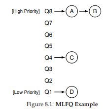
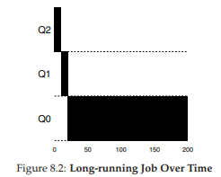
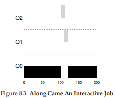
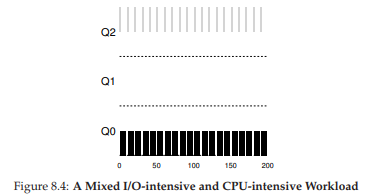
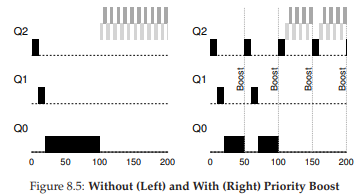
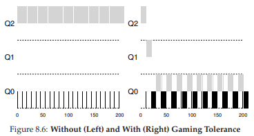
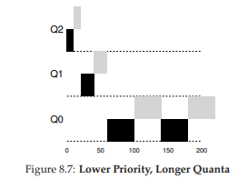

# 8. Scheduling:The Multi-Level Feedback Queue

この章では、マルチレベルフィードバックキュー(MLFQ)と呼ばれるスケジューリングの最もよく知られたアプローチの1つを開発するという課題に取り組んでいきます。マルチレベルフィードバックキュー(MLFQ)スケジューラは、Corbato et alによって生み出されました。互換性のあるタイムシェアリングシステム(CTSS)として知られているシステムで1962年に[C+62]、Multicsと言われるOSに適応させた。後に、Corbatoに最高の名誉であるTuring Awardを授与されました。そのスケジューラはその後、いくつかの最新のシステムでの実装に、長年にわたり改良を重ねてきてました。

MLFQが対処しようとしている基本的な問題は2つです。まず、ターンアラウンドタイムを最適化したいと思います。これは、前のメモで見たように、短いジョブを先に実行することによって行われます。残念ながら、OSは、SJF(またはSTCF)のようなアルゴリズムが必要とするジョブが実行される時間を一般に知りません。

第2に、MLFQは、対話型ユーザ(すなわち、スクリーンに座って、プロセスが終了するのを待っているユーザ)に応答するシステムを、応答時間を最小限にするようにしたい。残念ながら、Round Robinのようなアルゴリズムは応答時間を短縮しますが、ターンアラウンド時間は最悪です。したがって、私たちの問題は、「一般的にプロセスについて何も知らないので、これらの目標を達成するためにスケジューラをどのように構築できますか？」ということです。スケジューラは、システムの実行中に、実行中のジョブの特性をどのように学習して、スケジューリングをより適切に行うことができるのでしょうか？  

> THE CRUX:HOW TO SCHEDULE WITHOUT PERFECT KNOWLEDGE?(完全な知識なしにスケジュールを設定するにはどうすればよいでしょうか？)  
>> インタラクティブなジョブの応答時間を最小限に抑えながら、ジョブの長さを前もって知らなくてもターンアラウンドタイムを最小限に抑えるスケジューラを設計するにはどうすればよいでしょうか？

>> TIP: LEARN FROM HISTORY(歴史から学ぶ)  
>> マルチレベルフィードバックキューは、将来を予測するために過去から学習するシステムの優れた例です。このようなアプローチは、オペレーティングシステム(およびハードウェアブランチ予測子やキャッシングアルゴリズムを含む、コンピュータサイエンスの他の多くの場所)で一般的です。このようなアプローチは、ジョブが行動の段階を持ち、予測可能な場合に機能します。もちろん、それらは簡単に間違っている可能性があり、システムが全く知識なしで持っているよりも悪い決定を下さないように、そのような技術には注意を払わなければなりません。

## 8.1 MLFQ: Basic Rules
このようなスケジューラを構築するために、この章ではマルチレベルフィードバックキューの基本的なアルゴリズムについて説明します。多くの実装されたMLFQの詳細は異なりますが[E95]、ほとんどのアプローチは似ています。

私たちの処理では、MLFQにはいくつかの異なるキューがあり、それぞれ異なる優先順位が割り当てられています。任意の時点で、実行準備が整っているジョブは単一のキューにいます。MLFQは優先度を使用して、所定の時間に実行するジョブを決定します。優先度の高いジョブ(つまり、上位キューのジョブ)が選択されて実行されます。

もちろん、複数のジョブがキューに存在し、同じ優先度を持つ可能性があります。この場合、それらのジョブの間でラウンドロビンスケジューリングを使用します。

したがって、MLFQの最初の2つの基本的なルールに到達します。

- ルール1：優先度(A)> 優先度(B)の場合、Aが実行されます(Bは実行されません)。
- ルール2：優先順位(A)= 優先順位(B)の場合、AとBはRRで実行されます。

したがって、MLFQスケジューリングのカギとなる考えは、スケジューラが優先順位を設定する方法にあります。MLFQは、各ジョブに固定の優先順位を与えるのではなく、観察された動作に基づいてジョブの優先順位を変更します。例えば、キーボードからの入力を待っている間にジョブが繰り返しCPUを放棄した場合、MLFQは対話型プロセスがどのように動作するのかというと、優先度を高く保ちます。その代わりに、ジョブがCPUを集中的に長時間使用すると、MLFQは優先順位を下げます。このようにして、MLFQはプロセスが実行されるにつれてプロセスを学習しようとし、ジョブの履歴を使用して将来の動作を予測します。

与えられた瞬間に待ち行列がどのように見えるかを描写すると、次のようなものが見えます(図8.1)。図では、2つのジョブ(AとB)が最も高い優先順位にあり、ジョブCは中間にあり、ジョブDは最も低い優先順位にあります。MLFQがどのように動作するかについての現在の知識があれば、スケジューラはAとBの間でタイムスライスを交互に切り替えるだけです。poor jobsであるCとDは決して実行されないでしょう！

もちろん、いくつかのキューの静的なスナップショットを表示しても、MLFQの仕組みは分かりません。私たちが必要とするのは、時間の経過とともにどのようにジョブ優先度が変化するかを理解することです。そして、この本の章をはじめて読んでいる人にとっては驚いたことでしょう。実はこれが、次にやることなのです。

## 8.2 Attempt #1: How To Change Priority
我々は今、MLFQがジョブの存続時間に応じて優先順位をどのように変更するのか(したがって、それがどのキューにあるか)を決定する必要があります。これを実行するには、短期間実行している(頻繁にCPUを解放するかもしれない)インタラクティブなジョブと、CPU時間のかかる実行時間の長い「CPUバウンド」のジョブ応答時間は重要ではありません。優先度調整アルゴリズムでの最初の試みは次のとおりです。

- ルール3：ジョブがシステムに入ると、ジョブは最高優先順位(一番上のキュー)に配置されます。
- ルール4a：ジョブが実行中にタイムスライス全体を使い切った場合、ジョブの優先順位が下げられます(つまり、1つ下のキューに移動します)。
- ルール4b：タイムスライスが立ち上がる前にジョブがCPUを放棄した場合、ジョブは同じ優先順位のままです。

### Example 1: A Single Long-Running Job
いくつかの例を見てみましょう。まず、システム内で長時間実行されているジョブがあった場合にどうなるかを見ていきます。図8.2は、3つのキュースケジューラで時間の経過と共にこのジョブに何が起こるかを示しています。

この例でわかるように、ジョブは最高優先順位(Q2)で入力します。10msの単一のタイムスライスの後、スケジューラはジョブの優先度を1つ下げるので、ジョブはQ1上にあります。Q1でタイムスライスを実行した後、ジョブは最終的にシステム内の最も低い優先順位(Q0)に下げられ、残りはそのまま残ります。かなりシンプルでしょう？

### Example 2: Along Came A Short Job
もっと複雑な例を見て、MLFQがSJFに近づこうとしていることを願ってみましょう。この例では、長時間CPUを集中的に使用するジョブであるAと短時間実行する対話式ジョブであるBの2つのジョブがあります。Aがしばらく実行されていて、Bが到着したとします。何が起こるでしょうか？MLFQはBを実行する時にSJFと似ているでしょうか？図8.3は、このシナリオの結果を示しています。A(黒で表示)は、最も優先度の低いキューで実行されています(長時間実行されるCPUインテンシブジョブと同様)。B(灰色で示されている)は時刻T = 100に到着し、したがって最高の待ち行列に挿入される。実行時間が短い(わずか20ms)ので、Bは2つのタイムスライスでボトムキューに達する前に完了します。そして、Aは実行を再開します。(低い優先度で)

この例から、アルゴリズムの主要な目的の1つを理解できます。短期間の仕事であろうと長期間の仕事であろうと、それは短い仕事であろうと仮定しているため、ジョブの優先順位は高く与えられます。実際に短い仕事であれば、すぐに実行され完了します。短い仕事でなければ、ゆっくりとキューの下に移動していくため、すぐに、より長いバッチのようなプロセスであることがすぐに証明されます。このようにして、MLFQはSJFに似ています。

### Example 3: What About I/O?
ここで、いくつかのI/Oを持つ例を見てみましょう。ルール4bが上で述べたように、プロセスがタイムスライスを使い切る前にプロセッサを放棄した場合、そのプロセスを同じ優先度に保ちます。このルールの目的は簡単です。たとえば、インタラクティブジョブが(キーボードやマウスからのユーザー入力を待つなどして)多くのI/Oを実行している場合、タイムスライスが完了する前にCPUを放棄します。そのような場合、私たちはその仕事にペナルティを課すことはせず、単にジョブを同じレベルに保ちます。

図8.4は、これがどのように動作するかの例を示しています。長時間実行されるバッチジョブA(黒で表示)、I/Oを実行する前にCPUを1msだけ必要とするインタラクティブジョブB(灰色で表示)があります。つまり、ジョブAとジョブBはCPUの競合を起こす要因があります。MLFQのアプローチは、BがCPUを解放し続けるため、Bを最優先度に保ちます。Bがインタラクティブジョブの場合、MLFQはインタラクティブジョブをすばやく実行するという目標を達成します。

### Problems With Our Current MLFQ
このように、我々は基本的なMLFQを持っています。長時間実行されるジョブ間でCPUを公平に共有し、短時間またはI/O集約型のインタラクティブなジョブをすばやく実行できるように、かなり良い仕事をしているようです。しかし残念ながら、これまで開発してきたアプローチには重大な欠陥があります。あなたはどんなことを思いつくことができますか？(ちょっと立ち止まって考えてみましょう)

まず最初に、飢餓問題があります。システムにインタラクティブなジョブが多すぎると、すべてのCPU時間を消費するため、長時間実行されるジョブは決してCPU時間が与えられません。このシナリオでも、これらの仕事について少し考えていきたいと思います。

2番目に、頭のいいユーザは自分のプログラムをスケジューラのゲームに書き直すことができます。スケジューラーのゲームは、スケジューラーを騙して多くの利益を得ようとするずるい行為のことを一般的にさします。私たちが記述したアルゴリズムは、次の攻撃の影響を受けやすいです。タイムスライスが終了する前に、I/O操作を発行してCPUを解放します。そうすることで、同じキューに留まることができ、CPU時間の割合が高くなります。(CPUを放棄する前に99％のタイムスライスを実行するなどして)正しく実行された場合、ジョブはCPUをほぼ独占することができます。

最後に、プログラムは時間の経過とともに行動を変えるかもしれません。CPUバウンド(実行時間の中がジョブ)は、インタラクティブ(実行時間の短いジョブ)に移行する可能性があります。現在のアプローチでは、このようなジョブに対しては考慮されていないため、システム内の他の対話式ジョブと同様に扱われません。

## 8.3 Attempt #2: The Priority Boost
ルールを変更して、飢餓の問題を回避できるかどうかを見てみましょう。CPUバウンドジョブが公平に扱われることを保証するために、どうすればよいのでしょうか？ここでの簡単な考え方は、システム内のすべてのジョブの優先度を定期的に高めることです。これを達成するには多くの方法がありますが、単純なことをしましょう。一番上のキューにすべてを投げるようにします。したがって、新しいルールは以下の通りになります。

- ルール5：ある期間Sの後、システム内のすべてのジョブを一番上のキューに移動します。

この新しいルールは、1度に2つの問題を解決します。まず、プロセスが枯渇しないことが保証されます。トップキューに座ると、ジョブはCPUを他の優先順位の高いジョブとラウンドロビン方式で共有し、最終的にサービスを受け取ります。第2に、CPUバウンドジョブがインタラクティブになった場合、スケジューラは優先順位ブーストを受信すると、それを適切に処理します。

例を見てみましょう。このシナリオでは、短時間実行される2つのインタラクティブなジョブ、長時間実行されるジョブがCPU競合する場合の動作を示します。図8.5に2つのグラフを示します。左には優先順位の上昇はないので、2つの短い仕事が到着すると長時間実行されるジョブは飢餓状態に陥ってしまいます。右側には、50ミリ秒ごとに優先順位が上がります(値が小さすぎる可能性がありますが、ここでは例として使用しています)。したがって、長時間実行されるジョブが進歩し、50 msごとに最高の優先度を持ち、したがって定期的に実行されます。

もちろん、期間Sの追加について質問したいことがあるでしょう。それはSはどのように設定すべきですか？ということです。よく研究されているシステム研究者であるJohn Ousterhout [O11]は、それらを正しく設定するためにある種の黒魔術を必要としていたため、システムのvoo-doo定数でそのような値を呼んでいました。残念ながら、Sにはその加減を考える必要があります。Sが高すぎると、長く実行されるジョブは飢餓状態になってしまう可能性があります。逆に低すぎると、短時間実行されるインタラクティブなジョブがCPUの適切なシェアを得られない可能性があります。

## 8.4 Attempt #3: Better Accounting
解決すべきもう一つの問題があります。私たちのスケジューラーのズルを防ぐ方法はどうするでしょう？あなたが推測したように、実際の原因はルール4aと4bであり、タイムスライスの有効期限が切れる前にCPUを放棄することでジョブが優先順位を保持できるようになります。つまりこれらに対して何をするべきでしょうか？

ここでの解決策は、MLFQの各レベルでのCPU時間のより良いアカウンティングを実行することです。つまり、あるレベルで使用されているプロセスをどれだけtime sliceするかを忘れる代わりに、スケジューラは追跡しておく必要があります。具体的には、プロセスがCPU割り当てを使用すると、次の優先順位のキューに降格されます。1つの長いバーストでタイムスライスを使用するのか、小さなバーストで使用するのかは関係ありません。したがって、ルール4aと4bを次の単一ルールに書き換えます。

- ルール4：ジョブが所定のレベルでtime sliceを使い切れば(CPUを何回諦めたかにかかわらず)、その優先順位は低下します(つまり、1つのキューに移動します)。

例を見てみましょう。図8.6は、古いルール4aと4b(左側)とズル対策をした新しいルール4を使用して、スケジューラを試してみると仕事量がどうなるかを示しています。タイムスライスの直前にI/Oが終了し、CPU時間を支配します。このような保護機能を使用すると、プロセスのI/O動作に関係なく、キューレベルをゆっくりと移動させることができ、CPUの不公平な分担をになることはできません。

## 8.5 Tuning MLFQ And Other Issues
MLFQスケジューリングでは、他にもいくつかの問題があります。1つの大きな問題は、そのようなスケジューラをどのようにパラメータ化するかです。たとえば、いくつのキューが必要になるでしょうか？タイムスライスはキューごとにどのくらいの大きさにする必要があるでしょうか？飢餓状態を回避し、行動変化(長いジョブから短いジョブ)があったとき、どのくらいの頻度で優先順位を上げるべきでしょうか？これらの質問には簡単な答えはないので、仕事量の経験とそれに続くスケジューラのチューニングだけが満足できるバランスにつながっていきます。

例えば、ほとんどのMLFQの変形では、異なるキュー間でタイムスライスの長さを変えることができます。高優先度キューには通常、短い時間スライスが与えられます。結局、対話型ジョブから構成され、それらの間で迅速に交互になることが合理的です。(例えば、10ミリ秒以下)一方、低優先度キューには、CPUにバインドされた長時間実行ジョブが含まれています。したがって、より長い時間スライスがうまく機能します(例えば、100ms)。図8.7は、2つの長時間実行ジョブが最高キューで10ミリ秒、中に20個、最低で40個実行される例を示しています。

>> TIP: AVOID VOO-DOO CONSTANTS (OUSTERHOUT’S LAW)  
>> 可能な限り、voo-doo定数を避けることは良いアイデアです。残念ながら、上記の例のように困難です。システムが良い価値を学ばせるようにすることもできますが、それは簡単ではありません。そのため、設定ファイルにデフォルトのパラメータ値が入力されています。一応、何かが正常に動作していないときに熟練した管理者が微調整できます。  
しかし、一般的にこれらは変更されないままにされることが多いので、デフォルトがフィールドでうまくいくでしょう。このヒントは、私たちの古いOSの教授であるJohn Ousterhoutによってもたらされました。それで、私たちはそれをOusterhoutの法則と呼んでいます。

Solaris MLFQの実装では、Time Sharing scheduling class(TS)が特に簡単に構成できます。プロセスの優先度がライフタイム全体でどのように変更され、どのタイムスライスがどのくらいの期間、どのくらいの頻度でジョブの優先度を上昇させるかを正確に決定する一連のテーブルを提供します[AD00]。管理者はスケジューラを異なる方法で動作させるために、このテーブルを使用することができます。テーブルのデフォルト値は60キューであり、タイムスライスの長さは20ミリ秒(最優先)から数百ミリ秒(最低)までゆっくりと増加し、プライオリティは1秒程度でキューレベルが上昇していきます。

他のMLFQスケジューラでは、この章で説明しているテーブルやルールは使用しません。むしろ数式を使って優先順位を調整します。たとえば、FreeBSDスケジューラ(バージョン4.3)は、ジョブの現在の優先度を計算するために式を使用し、プロセスが使用したCPUの量[LM+89]に基づいています。さらに、使用時間の経過とともに減衰し、ここで記載された方法とは異なる方法で望んだ優先順位ブーストを提供します。そのような減衰利用アルゴリズムとそのプロパティ[E95]の優れた概要については、Epemaの論文を参照してください。

最後に、多くのスケジューラには、あなたが今後、知るかもしれないある他の機能がいくつかあります。たとえば、一部のスケジューラでは、オペレーティングシステムの作業に最も高い優先順位が設定されています。したがって、典型的なユーザジョブは、システム内で最高レベルの優先順位を得ることができません。一部のシステムでは、ユーザーのアドバイスによって優先順位を設定することもできます。たとえば、コマンドラインユーティリティniceを使用すると、ジョブの優先度を(多少)増減させることができ、したがって、任意の時点で実行する可能性を増減できます。詳細については、manページを参照してください。

## 8.6 MLFQ: Summary
マルチレベルフィードバックキュー(MLFQ)と呼ばれるスケジューリング手法について説明しました。複数のレベルのキューがあり、フィードバックを使用して特定のジョブの優先順位を判断する理由がわかりました。歴史はそのガイドです。つまり、時間の経過とともにどのように行動するかに注意を払い、それに応じて対応していきます。

>> TIP: USE ADVICE WHERE POSSIBLE(可能性のあるアドバイスを使用する)  
>> オペレーティングシステムは、システムのあらゆるプロセスに対して最適な方法は知らないため、ユーザーや管理者がOSにいくつかのヒントを提供するためのインターフェイスを提供すると便利なことがよくあります。OSは必ずしもそれに注意を払う必要はないので、そのようなヒントのアドバイスと呼ぶことが多いです。  
>> しかし、より良い決定をするためにアドバイスを考慮することが必要でしょう。このようなヒントは、スケジューラ(例えば、nice)、メモリマネージャ(例えば、madvise)、およびファイルシステム(例えば、通知プリフェッチおよびキャッシング[P+95])を含む、OSの多くの部分において有用である。

MLFQルールの洗練されたセットは、この章全体に広がっています。

- ルール1：優先度(A)> 優先度(B)の場合、Aが実行されます(Bは実行されません)。
- ルール2：優先順位(A)= 優先順位(B)の場合、A＆BはRRで実行されます。
- ルール3：ジョブがシステムに入ると、ジョブは最高優先順位(一番上のキュー)に配置されます。
- ルール4：ジョブが所定のレベルで時間割り当てを使い切れば(CPUを何回諦めたかにかかわらず)、その優先順位が下げられます(つまり、1つのキューに移動します)。
- ルール5：ある期間Sの後、システム内のすべてのジョブを一番上のキューに移動します。

MLFQは次の理由から面白いです。ジョブの性質に関する前情報を要求するのではなく、ジョブの実行を観察し、それに応じて優先順位を付けます。このようにして、短期間のインタラクティブなジョブのための優れた全体的なパフォーマンス(SJF/STCFに似ています)を提供することができ、長期にわたるCPU集約的なジョブのために公平な割り当てをします。このため、BSD UNIX派生物[LM+89、B86]、Solaris [M06]、およびWindows NT以降のWindowsオペレーティングシステム[CS97]を含む多くのシステムが、基本スケジューラとしてMLFQの形式を使用しています。

# 参考文献

[AD00] “Multilevel Feedback Queue Scheduling in Solaris”  
Andrea Arpaci-Dusseau  
Available: http://www.ostep.org/Citations/notes-solaris.pdf  
A great short set of notes by one of the authors on the details of the Solaris scheduler. OK, we are probably biased in this description, but the notes are pretty darn good.

[B86] “The Design of the UNIX Operating System”  
M.J. Bach  
Prentice-Hall, 1986  
One of the classic old books on how a real UNIX operating system is built; a definite must-read for kernel hackers.

[C+62] “An Experimental Time-Sharing System”  
F. J. Corbato, M. M. Daggett, R. C. Daley  
IFIPS 1962  
A bit hard to read, but the source of many of the first ideas in multi-level feedback scheduling. Much of this later went into Multics, which one could argue was the most influential operating system of all time.

[CS97] “Inside Windows NT”  
Helen Custer and David A. Solomon  
Microsoft Press, 1997  
The NT book, if you want to learn about something other than UNIX. Of course, why would you? OK, we’re kidding; you might actually work for Microsoft some day you know.

[E95] “An Analysis of Decay-Usage Scheduling in Multiprocessors”  
D.H.J. Epema  
SIGMETRICS ’95  
A nice paper on the state of the art of scheduling back in the mid 1990s, including a good overview of the basic approach behind decay-usage schedulers.

[LM+89] “The Design and Implementation of the 4.3BSD UNIX Operating System”  
S.J. Leffler, M.K. McKusick, M.J. Karels, J.S. Quarterman  
Addison-Wesley, 1989  
Another OS classic, written by four of the main people behind BSD. The later versions of this book, while more up to date, don’t quite match the beauty of this one.

[M06] “Solaris Internals: Solaris 10 and OpenSolaris Kernel Architecture”  
Richard McDougall  
Prentice-Hall, 2006  
A good book about Solaris and how it works.

[O11] “John Ousterhout’s Home Page”
John Ousterhout
Available: http://www.stanford.edu/˜ouster/
The home page of the famous Professor Ousterhout. The two co-authors of this book had the pleasure of
taking graduate operating systems from Ousterhout while in graduate school; indeed, this is where the
two co-authors got to know each other, eventually leading to marriage, kids, and even this book. Thus,
you really can blame Ousterhout for this entire mess you’re in.

[P+95] “Informed Prefetching and Caching”
R.H. Patterson, G.A. Gibson, E. Ginting, D. Stodolsky, J. Zelenka
SOSP ’95
A fun paper about some very cool ideas in file systems, including how applications can give the OS
advice about what files it is accessing and how it plans to access them