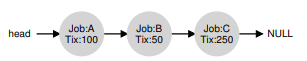
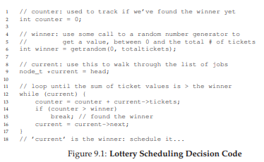
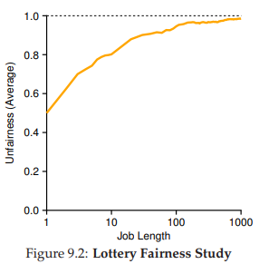

# 9. Scheduling: Proportional Share
この章では、proportional share scheduler(比例共有スケジューラ)と呼ばれる別のタイプのスケジューラを検討します。これは、時々 fair share schedulerとも呼ばれます。比例共有は、単純な概念に基づいています。つまり、処理時間や応答時間を最適化する代わりに、スケジューラは各ジョブがCPU時間の一定割合を取得することを保証します。

比例配分スケジューリングの優れた現代的な例は、Waldspurger and Weihl [WW94]の研究で発見され、宝くじスケジューリングと呼ばれています。しかし、この考えは確かにはるかに古いです[KL88]。基本的な考え方は非常に単純です。たいていの場合、宝くじを開催して、次に実行するプロセスを決定します。より頻繁に実行されるプロセスには、宝くじに勝つチャンスが与えられます。

>> CRUX: HOW TO SHARE THE CPU PROPORTIONALLY(CPUを比例的に共有する方法)  
>> 比例的にCPUを共有するスケジューラを設計するにはどうすればよいでしょうか？そうするための鍵となる仕組みは何でしょうか？スケジューラはどれくらい効果的でしょうか？

## 9.1 Basic Concept: Tickets Represent Your Share
基本的な宝くじスケジューリングはの基本概念の1つです。具体的には、プロセス(またはユーザーなど)が受け取るべきリソースのシェアを表すために使用されるチケットです。プロセスが持つチケットの割合は、問題のシステムリソースのシェアを表します。

例を見てみましょう。AとBの2つのプロセスを想像してみましょう。さらにAには75のチケットがあり、Bには25しかありません。したがって、AはCPUの75％、Bは残りの25％を受け取ります。

宝くじのスケジューリングは、頻繁に(例えば、毎回のタイムスライス)毎回宝くじを開催することによって、確率論的に(決定論的ではない)決まっていきます。宝くじを開催することは簡単です。スケジューラはチケットがいくつあるかを知る必要があります(この例では100です)。その後、スケジューラは0から99までの番号の勝ちのチケットを選びます。Aが0から74、Bが75から99までのチケットを保留していると仮定すると、勝ちのチケットは単にAかBのどちらが実行されたかを判断するだけです。スケジューラは、その勝利したプロセスの状態をロードし、実行します。

>> TIP: USE RANDOMNESS  
>>  宝くじスケジューリングの最も美しい面の1つは、ランダム性の使用です。決定を下さなければならないときは、ランダム化されたアプローチを使用することは堅牢で簡単な方法です。  
ランダムアプローチには、従来の決定よりも少なくとも3つの利点があります。まず、ランダムはより伝統的なアルゴリズムが扱いにくいかもしれない変わったケースの振る舞いを避けます。たとえば、LRU置換ポリシー(仮想メモリの章で詳細に説明する)を考えてみましょう。多くの場合、適切な置換アルゴリズムであるにもかかわらず、LRUは、いくつかの循環して連続的に起こること(同じ事象)に対して弱いです。一方、ランダムは、そのような最悪の場合はありません。  
二つ目はランダムも軽量であり、状態を追跡するためのものは必要ありません。伝統的な公平スケジューリングアルゴリズムでは、各プロセスがどれだけのCPUを受け取ったかを追跡するには、プロセスごとのアカウンティングが必要です。プロセスごとのアカウンティングは、各プロセスの実行後に更新する必要があります。これをランダムに行うと、プロセスごとの状態の最小限度(例えば、それぞれが有するチケットの数)だけが必要となります。  
最後に、ランダム化はかなり速くなる可能性があります。乱数の生成が迅速であれば、決定を下すこともでき、したがって、速度が必要な多くの場所でランダムを使用することができます。ただし、速いほど、ランダムは疑似乱数に向かう傾向が強くなります。

宝くじスケジューラーの勝利チケットの出力例:
63 85 70 39 76 17 29 41 36 39 10 99 68 83 63 62 43 0 49 49

スケジュールの結果:
```
A   A A   A A A A A A   A   A A A A A A
  B     B             B   B
```

この例からわかるように、宝くじスケジューリングでのランダム化の使用は、望ましい比率に合致する確率的正確性につながりますが、保証はありません。上記の例では、Bは、望ましい25％の割り当てではなく、20のタイムスライス(20％)のうちの4つのみを実行します。しかし、これらの2つのジョブ(長い時間が必要なジョブ)が競合するほど、望ましい割合を達成する可能性が高くなります。

>> TIP: USE TICKETS TO REPRESENT SHARES(代表者に株式を提示するためのチケットを使用する)  
>> 抽選(およびストライド)スケジューリングの設計における最も強力な(そして基本的な)メカニズムの1つは、チケットのスケジューリングです。これらの例では、チケットはCPUのプロセスシェアを表すために使用されていますが、より広範囲に適用できます。たとえば、ハイパーバイザーの仮想メモリ管理に関する最近の作業では、Waldspurgerはチケットを使用してゲストOSのメモリシェア[W02]を表す方法を示しています。なので、所有権の割合を表すためのメカニズムを必要としている場合、このコンセプトはピッタリかもしれません。

## 9.2 Ticket Mechanisms
宝くじスケジューリングでは、チケットを異なる方法で、時には有用な方法で操作するためのメカニズムもいくつか用意されています。1つの方法はチケット通貨のコンセプトです。通貨では、チケットのセットを持つユーザーは、自分の好きな通貨で自分の仕事にチケットを割り当てることができます。システムはその通貨を正しいグローバル値に自動的に変換します。

たとえば、ユーザーAとBにそれぞれ100個のチケットが与えられているとします。ユーザーAは2つのジョブA1とA2を実行しており、ユーザーAの通貨でそれぞれ500チケット(合計1000通)を提供します。ユーザーBは1ジョブのみを実行しており、10チケット(合計10件)を提供します。システムはA1とA2の配分をAの通貨でそれぞれ500からグローバル通貨でそれぞれ50に変換します。同様にB1の10枚のチケットは100枚のチケットに変換されます。抽選はグローバルチケット通貨(200トータル)で行われ、どのジョブが実行されているかが決まります。  
```
User A -> 500 (A’s currency) to A1 -> 50 (global currency)  
       -> 500 (A’s currency) to A2 -> 50 (global currency)  
User B -> 10 (B’s currency) to B1 -> 100 (global currency)  
```  
もう1つの便利なメカニズムはチケットの転送です。転送によって、プロセスはそのチケットを別のプロセスに一時的に渡すことができます。この機能は、クライアントプロセスがクライアントに代わって何らかの作業を要求するメッセージをサーバーに送信するクライアント/サーバー設定で特に便利です。作業をスピードアップするために、クライアントはチケットをサーバーに渡すことができるため、サーバーがクライアントの要求を処理している間にサーバーのパフォーマンスを最大化しようとします。終了すると、サーバーはチケットをクライアントに転送し、以前と同じ状態になります。

最後に、チケットのインフレは時には有用なテクニックです。インフレでは、プロセスが所有するチケットの数を一時的に増減できます。もちろん、互いを信頼しないプロセスとの競合を起こすときは、これはほとんど意味がありません。1つの貪欲なプロセスが、膨大な数のチケットを手に入れてマシンを引き継ぐ可能性があります。どちらかというと、プロセスのグループがお互いを信頼する環境でインフレを適用することができます。このような場合、あるプロセスがCPU時間を必要としていることが分かっている場合、そのプロセスの必要性をシステムに反映させる方法としてチケットの価値を高めることができます。

## 9.3 Implementation
おそらく、宝くじスケジューリングに関する最も驚くべきことは、その実装の単純さです。必要なのは、勝ちのチケットを選ぶための良い乱数ジェネレータ、システムのプロセス(例えば、リスト)を追跡するためのデータ構造、およびチケットの総数です。プロセスをリストにしておくとしましょう。ここでは、A、B、Cの3つのプロセスで構成された例を示します。各プロセスにはいくつかのチケットがあります。  

  

スケジューリングの決定をするには、最初に、チケットの総数(400)から乱数(勝者)を選択する必要があります。次に、300という数字を選びましょう。次に、簡単なカウンターを使ってリストをトラバースすることで勝者が確定します(図9.1)

  

コードはプロセスのリストを調べ、値が勝者を超えるまでカウンタに各チケットの値を追加します。そのようになると、現在のリスト要素が勝者になります。勝利チケットの例が300の場合、次のことが行われます。まず、Aのチケットを計上するためにカウンタを100にインクリメントします。100が300未満であるため、ループは継続します。その後、カウンターは150(Bのチケット)に更新され、まだ300未満です。最後に、カウンタは400(明らかに300を超える)に更新され、したがって、現在のC(勝者)を指してループから抜け出します。

このプロセスを最も効率的にするには、一般的に、チケットの最高数から最低数までソート順にリストを整理することが最善の方法です。順序付けはアルゴリズムの正確さには影響しません。しかし、特にほとんどのチケットを所有するプロセスがいくつかある場合は、リストの反復回数を最小限に抑えることができます。

## 9.4 An Example
宝くじスケジューリングの動きを理解しやすくするために、チケット数が同じ(100回)、ランタイムが同じ(Rは変化します)の2つのジョブの完了時間について簡単に検討します。

このシナリオでは、各ジョブがほぼ同時に終了するようにしたいと思いますが、抽選スケジュールがランダムであるため、あるジョブが他のジョブより先に終了することがあります。この差を定量化するために、簡単な不公平度メトリックUを定義します。Uは、最初のジョブが完了した時刻を2番目のジョブが完了した時刻で割ったものです。例えば、R = 10で、第1のジョブが時間10(および第2のジョブが20)で終了する場合、$ U = \ frac {10} {20} = 0.5$両方のジョブがほぼ同時に終了すると、Uは1に非常に近くなります。このシナリオでは、それが目標です。完全に公平なスケジューラはU = 1を達成します。



図9.2は、2つのジョブ(R)の長さが30回の試行にわたって1から1000まで変化したときの平均不公平をプロットしたものです(結果は章の最後に用意されているシミュレータを介して生成されます)。グラフからわかるように、ジョブの長さがそれほど長くない場合、平均的な不公平さが最悪です。長いタイムスライスのジョブが実行される場合にのみ、宝くじスケジューラは望んだ結果に近づきます。

## 9.5 How To Assign Tickets?
宝くじスケジューリングで取り上げなかった問題の1つは、チケットをジョブに割り当てる方法です。この問題は難しいです。もちろん、システムの動作はチケットの割り当て方法に大きく依存します。1つのアプローチは、ユーザーが最もよく知っていると仮定することです。このような場合、各ユーザーにはいくつかのチケットが渡され、ユーザーは希望どおりに実行する任意のジョブにチケットを割り当てることができます。しかし、このソリューションは非効率です。実際はユーザーが何をすべきかを教えてくれないことがほとんどでしょう。そのため、「チケット割り当て問題」はいまだに残っています。

## 9.6 Why Not Deterministic?
疑問に思うかもしれません。なぜ乱数を使うのでしょうか？上の説明で見たように、ランダム化はシンプルな(そしてほぼ正しい)スケジューラをもたらしますが、時には特に短い時間を超えたスケールで正確な正しい比率を提供しないことがあります。この理由から、Waldspurgerはstride schedulingを発明しました。これは確定的なfair share schedulerです[W95]。

stride schedulingも簡単です。システム内の各ジョブにはstrideがあり、チケットの数に比例して逆になります。上記の例では、ジョブA、B、C(それぞれ100,50,250枚)を使用して、各プロセスが割り当てられたチケットの数で大きな数を除算して、それぞれの歩数を計算することができます。たとえば、チケットの値ごとで10,000を割ると、A、B、Cのstride値は100、200、40になります。この値を各プロセスのstrideと呼びます。プロセスが実行されるたびに、グローバルな進捗状況を追跡するために、strideによってカウンタをインクリメントします(パス値と呼ばれます)。

スケジューラは次に、ストライドとパスを使用して、次に実行するプロセスを決定します。基本的なアイデアは簡単です。いつでも、パスの値が最も低い実行プロセスを選択します。プロセスを実行すると、そのストライドによってパスカウンタがインクリメントされます。擬似コードの実装は、Waldspurger [W95]によって提供されています。

current = remove_min(queue); // クライアントの最小パスを取り出す  
schedule(current); //　リソースを使用する  
current->pass += current->stride; // 現在のストライド値をパスに加算する  
insert(queue, current); // キューの中に戻す  

この例では、ストライド値が100,200、40の3つのプロセス(A、B、C)から始まり、パスの値はすべて最初は0です。したがって、最初はいずれかのプロセスが実行され、それらの合格値も同様に低いからです。Aを選択すると仮定します(任意に、ローパス値が等しいプロセスのいずれかを選択できます)Aが実行されます。タイムスライスを終了すると、パスの値は100に更新されます。次に、パスの値が200に設定されたBを実行します。最後に、パスの値が40にインクリメントされたCを実行します。Cの最小パス値を選んで実行し、パスを80に更新します(Cのストライドは40です)。その後、Cは再び実行され(最低のパス値)、パスは120に上がります。次にAが実行され、パスは200に更新されます(現在はBに等しくなります)。次に、Cは2回以上実行され、パスは160、次に200に更新されます。この時点で、すべてのパス値は再び等しくなり、プロセスは無期限に繰り返されます。図9.3は、時間の経過によるスケジューラの動作を示しています。

図からわかるように、Cは5回、Aは2回、Bは1回実行された。正確には、250、100、50というチケットの値が比例していった。ストライドスケジューリングは各スケジューリングサイクルの終わりにそれらを正確に得ます。

ストライドスケジューリングの正確さを考えれば、どうして宝くじスケジューリングを使うのでしょうか？実は、宝くじのスケジューリングは、ストライドスケジューリングがないという素晴らしい特性を持っています。グローバルな状態がありません。上記のストライドスケジューリングの例の真ん中に新しい仕事が入ったとします。その合格値はどう設定しますか？0に設定します？もし0に設定したとしたら、CPUを独占してしまいます。宝くじスケジューリングでは、プロセスごとにグローバルな状態はありません。どのようなチケットを持っていても新しいプロセスを追加し、一つしかないのグローバル変数を更新して、合計チケット数を追跡し、そこから移動するだけです。このようにして、宝くじは新しいプロセスを合理的な方法で組み込むことをはるかに容易にします。

## 9.7 Summary
比例配分スケジューリングの概念を紹介し、宝くじとストライドスケジューリングという2つの実装について簡単に説明しました。宝くじは比例的なシェアを達成するための巧妙な方法でランダム化を使用します。ストライドは決定的にそうです。両方とも概念的に興味深いものですが、さまざまな理由でCPUスケジューラとして広く普及していません。  
1つは、そのようなアプローチがI/O[AC97]と特によく合わないということです。もう1つは、チケットの割り当てという難しい問題を残すことです。つまり、ブラウザに割り当てられるチケットの数はどのように判断できますか？汎用スケジューラ(以前に議論したMLFQや他の同様のLinuxスケジューラなど)は、より優雅に機能し、より広く展開されています。

結果として、比例配分スケジューラは、これらの問題のいくつか(例えば、株式の割当)が比較的解決しやすい領域において、より有用です。たとえば、仮想化されたデータセンターでは、CPUサイクルの4分の1をWindows VMに割り当て、残りを基本Linuxインストールに割り当てることができます。比例的な共有はシンプルで効果的です。VMWareのESX Serverで今回紹介したような比例的にメモ​​リを共有する方法については、Waldspurger [W02]を参照してください。

# 参考文献

[AC97] “Extending Proportional-Share Scheduling to a Network of Workstations”  
Andrea C. Arpaci-Dusseau and David E. Culler  
PDPTA’97, June 1997  
A paper by one of the authors on how to extend proportional-share scheduling to work better in a clustered environment.

[D82] “Why Numbering Should Start At Zero”  
Edsger Dijkstra, August 1982  
http://www.cs.utexas.edu/users/EWD/ewd08xx/EWD831.PDF  
A short note from E. Dijkstra, one of the pioneers of computer science. We’ll be hearing much more on this guy in the section on Concurrency. In the meanwhile, enjoy this note, which includes this motivating quote: “One of my colleagues — not a computing scientist — accused a number of younger computing scientists of ’pedantry’ because they started numbering at zero.” The note explains why doing so is logical.

[KL88] “A Fair Share Scheduler”  
J. Kay and P. Lauder  
CACM, Volume 31 Issue 1, January 1988  
An early reference to a fair-share scheduler.  

[WW94] “Lottery Scheduling: Flexible Proportional-Share Resource Management”  
Carl A. Waldspurger and William E. Weihl  
OSDI ’94, November 1994  
The landmark paper on lottery scheduling that got the systems community re-energized about scheduling, fair sharing, and the power of simple randomized algorithms.

[W95] “Lottery and Stride Scheduling: Flexible  
Proportional-Share Resource Management”  
Carl A. Waldspurger  
Ph.D. Thesis, MIT, 1995  
The award-winning thesis of Waldspurger’s that outlines lottery and stride scheduling. If you’re thinking of writing a Ph.D. dissertation at some point, you should always have a good example around, to give you something to strive for: this is such a good one.

[W02] “Memory Resource Management in VMware ESX Server”  
Carl A. Waldspurger  
OSDI ’02, Boston, Massachusetts  
The paper to read about memory management in VMMs (a.k.a., hypervisors). In addition to being relatively easy to read, the paper contains numerous cool ideas about this new type of VMM-level memory management.

[prev](../08/08.md)|[next](../10/10.md)
