# 10. Multiprocessor Scheduling (Advanced)

この章では、マルチプロセッサスケジューリングの基本について説明します。このトピックは比較的後の章で学ぶようなものが含んでいるので、並行性のトピック(つまり、本の第2の主要な「簡単な部分」)を勉強した後に、もう一度戻ってくるのが最善の方法です。  
マルチプロセッサシステムは、コンピューティング分野のハイエンドでのみ長年存在していますが、ますます普及しており、デスクトップマシン、ラップトップ、さらにはモバイルデバイスにまで浸透しています。複数のCPUコアが1つのチップに集積されたマルチコアプロセッサの登場は、この普及の源です。これらのチップは、作るのは難しいですが「あまり多くの電力を使用することなく、単一のCPUをより速くすること」が現在コンピュータアーキテクトとして求められています。そして、現在私たちは皆、いくつかのCPU(優れたCPU達)をベンダーは私たちに提供してくれています。これはいいことですよね？  
もちろん、1つ以上のCPUになると多くの問題が発生します。主なものは、典型的なアプリケーション(つまり、あなたが書いたCプログラム)は単一のCPUしか使用しないということです。より多くのCPUを追加しても、その単一のアプリケーションをより速く実行することはできません。この問題を解決するには、スレッドを使用して並列実行するようにアプリケーションを書き直す必要があります(詳細は第2章で詳しく説明しています)。マルチスレッド・アプリケーションは、複数のCPUにまたがって作業を分散させることができ、したがって、より多くのCPUリソースが与えられた場合、より速く実行されます。

>> ASIDE: ADVANCED CHAPTERS  
>>この章では、書籍の幅広い部分を真に理解するために必要な材料があります。たとえば、マルチプロセッサスケジューリングに関するこの章では、並行処理の中で最初に読んだ後のほうが意味があります。しかし、それは論理的には本の部分(一般的に)とCPUスケジューリング(具体的には)の部分ではこの順番で合っています。従って、そのような章は順不同になるため、後でもう一度読むことをおすすめします。今回の場合は、並行性の部分の後にもう一度ここを読むことをおすすめします。

アプリケーション以外にも、オペレーティングシステムで発生する新たな問題は、マルチプロセッサスケジューリングの問題です(驚くことではありません)。ここまでは、シングルプロセッサスケジューリングの原則についていくつか議論しました。これらのアイデアをどのように拡張して複数のCPUで動作させることができますか？どんな新しい問題を克服する必要がありますか？したがって、私たちの問題は以下のようになります。

>> CRUX: HOW TO SCHEDULE JOBS ON MULTIPLE CPUS  
>> OSは複数のCPU上でジョブをどのようにスケジュールするべきですか？新しい問題は何でしょうか？同じ古い技法が機能するのですか？、新しいアイデアが必要ですか？

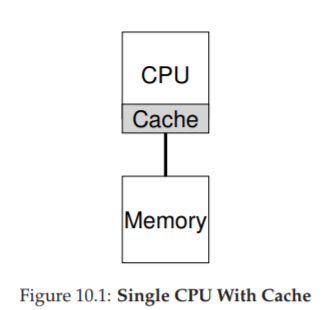

## 10.1 Background: Multiprocessor Architecture
マルチプロセッサスケジューリングを取り巻く新たな問題を理解するためには、シングルCPUハードウェアとマルチCPUハードウェアの新しく根本的な違いを理解する必要があります。この違いは、ハードウェアキャッシュ(図10.1など)の使用と、データが複数のプロセッサでどのように共有されるかを中心にしています。今度は、この問題についてより高いレベルで議論します。詳細は他の場所[CSG99]で利用可能であり、特に高学年またはおそらく大学院生向けのコンピュータアーキテクチャーコースです。

単一のCPUを持つシステムでは、ハードウェアキャッシュの階層があり、一般に、プロセッサがプログラムをより速く実行するのに役立ちます。キャッシュは、(一般的に)システムのメインメモリにある一般的なデータのコピーを保持する小さくて速いメモリです。対照的に、メインメモリはすべてのデータを保持しますが、この大きなメモリへのアクセスは遅くなります。頻繁にアクセスされるデータをキャッシュに保存することで、システムは大規模で低速なメモリを高速に見せることができます。

一例として、明示的なロード命令を発行してメモリから値をフェッチするプログラムと、単一のCPUのみを持つシンプルなシステムを考えます。CPUには小さなキャッシュ(たとえば64 KB)と大きなメインメモリがあります。

プログラムが初めてこの負荷を発生させると、データはメインメモリに格納されます。したがって、フェッチに時間がかかります(おそらく数十ナノ秒、または数百ナノ秒)。プロセッサは、データが再使用されることが予想される場合、ロードされたデータのコピーをCPUキャッシュに格納します。プログラムがこの同じデータ項目を後で再び取り出す場合、CPUは最初にキャッシュ内のデータ項目をチェックします。もしそれが見つかると、データははるかに速く(例えば数ナノ秒)フェッチされるので、プログラムはより速く実行されます。

したがって、キャッシュは局所性の概念に基づいており、その中には時間的局所性と空間的局所性という2つの種類があります。時間的局所性の背後にあるアイデアは、あるデータにアクセスすると、近い将来再びアクセスされる可能性があるということです。変数や命令自体がループ内で繰り返しアクセスされることを想像してください。空間的局所性の背後にある考え方は、プログラムがアドレスxのデータ項目にアクセスすると、xの近くのデータ項目にもアクセスする可能性があるということです。ここでは、配列を介してストリーミングされたプログラム、または順次実行される命令を考える。これらのタイプの局所性は多くのプログラムに存在するため、ハードウェアシステムは、どのデータをキャッシュに入れるかをよく推測し、うまく機能します。

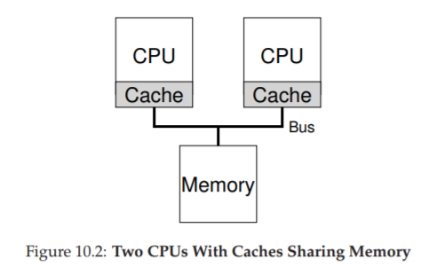

複雑な部分については、図10.2に示すように、1つのシステムに複数のプロセッサを搭載し、1つの共有メインメモリを使用するとどうなりますか？判明したように、複数のCPUを使ったキャッシュははるかに複雑です。

例えば、CPU1上で動作するプログラムがアドレスAでデータ項目(値Dを持つ)を読み込むとします。データはCPU1上のキャッシュにないので、システムはそれを主メモリから取り出し、値Dを得ます。プログラムは次にアドレスAの値を変更し、キャッシュを新しい値D'で更新するだけです。メインメモリにデータを書き込むのが遅いため、システムは(通常)後でそれを行います。次に、OSがプログラムの実行を停止してCPU 2に移動することを決定したと仮定します。プログラムはアドレスAの値を再読み取りします。そのようなデータCPU2のキャッシュは存在しないので、システムは主メモリから値を取り出し、正しい値D'の代わりに古い値Dを得ます。…あれれ～おかしいぞ～？

この一般的な問題はキャッシュ一貫性の問題と呼ばれ、問題の解決に関わるさまざまなことを記述した膨大な研究文献があります[SHW11]。ここでは、すべてのニュアンスをスキップしていくつかの大きなポイントを立てます。コンピュータ・アーキテクチャー・クラス(または3つ)で詳細は確認してください。

基本的な解決策は、ハードウェアによって提供されます。メモリアクセスを監視することによって、ハードウェアは基本的に「正しいこと」が起こり、単一の共有メモリのビューが保持されることを保証できます。バスベースのシステムでこれを行う方法の1つは、バススヌーピング[G83]と呼ばれる古い技術を使用することです。各キャッシュは、それらを主メモリに接続するバスを観察することによってメモリ更新に注意を払います。

CPUがキャッシュ内に保持しているデータ項目の更新を見ると、その変更を認識してそのコピーを無効にするか(つまり、それを自分のキャッシュから削除する)、または更新する(すなわち、キャッシュに新しい値を入れるあまりにも)。上記で暗示されているように、ライトバックキャッシュはこれをもっと複雑にしますが(メインメモリへの書き込みは後で見ることができないため)、基本的な仕組みがどのように機能するか想像することができます。

## 10.2 Don’t Forget Synchronization
キャッシュが一貫性を提供するために、このすべての作業を行うとすれば、プログラム(またはOS自体)は共有データにアクセスする際に何かを心配する必要があるでしょうか？残念なことに、答えは「はい」です。この本の第2部では、並行処理のトピックについて詳しく説明しています。ここでは詳しく説明しませんが、ここでは基本的なアイデアの一部をスケッチ/レビューします(同時実行性に慣れていると仮定します)。

CPU間で共有データ項目や構造体にアクセスする場合(特に更新する場合)、相互排他プリミティブ(ロックなど)を使用して正確性を保証する必要があります(ロックフリーのデータ構造を構築するなどの他のアプローチは複雑で、時には詳細については、並行処理に関するデッドロックの章を参照してください)。たとえば、複数のCPUで同時に共有キューにアクセスしているとします。ロックがなければ、キューから要素を同時に追加または削除することは、基本的な一貫性の定義があっても、期待どおりに機能しません。データ構造を新しい状態に原子的に更新するためのロックが必要です。

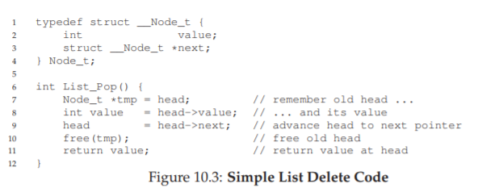

これをより具体的にするには、図10.3に示すように、共有リンクリストから要素を削除するために使用されるこのコードシーケンスを想像してください。2つのCPU上のスレッドが同時にこのルーチンに入る場合を想像してください。スレッド1が最初の行を実行すると、tmp変数にheadの現在の値が格納されます。スレッド2が最初の行を実行しても、それ自身のプライベートtmp変数に格納されているheadの値と同じになります(スタックにはtmpが割り当てられ、各スレッドに専用のプライベートストレージが割り当てられます)。したがって、各スレッドがリストの先頭から要素を削除するのではなく、各スレッドは同じヘッド要素を削除しようとします。この場合、4行目のhead要素のダブルフリー化が試行されます同じデータ値を2回返す可能性があります)。

もちろん、解決策は、ロックによって正しいルーチンを作成することです。この場合、単純なミューテックス(例えば、pthread mutex tm;)を割り当ててから、ルーチンの始めにロック(＆m)を追加し、最後にunlock(＆m)を追加すると、問題が解決され、コードが実行されます望んだ通りに。残念なことに、わかるように、このようなアプローチは、特にパフォーマンスに関して問題がないわけではありません。具体的には、CPUの数が増えると、同期共有データ構造へのアクセスが非常に遅くなります。

## 10.3 One Final Issue: Cache Affinity
最後に、キャッシュアフィニティとして知られるマルチプロセッサキャッシュスケジューラを構築する際に、1つの問題が発生します。この概念は単純です。プロセスは特定のCPU上で実行されると、CPUのキャッシュ(およびTLB)に多くの状態ビットを構築します。次回のプロセス実行時には、そのCPU上のキャッシュに状態の一部がすでに存在する場合に、より速く実行されるため、同じCPU上で実行することがかなり有効です。その代わりに毎回異なるCPUでプロセスを実行すると、プロセスが実行されるたびに状態をリロードする必要があるため、プロセスのパフォーマンスは悪化します(ハードウェアのキャッシュ一貫性プロトコルのおかげでおかげで異なるCPU上で正しく動作することに注意してください)したがって、マルチプロセッサスケジューラは、スケジューリングの決定を行う際にキャッシュの親和性を考慮する必要があります。可能であれば、同じCPUにプロセスを保持する方が望ましいでしょう。

## 10.4 Single-Queue Scheduling
この背景に基づいて、マルチプロセッサシステム用のスケジューラを構築する方法について説明します。最も基本的なアプローチは、スケジューリングが必要なすべてのジョブを1つのキューに入れることによって、単一プロセッサスケジューリングの基本フレームワークを単純に再利用することです。このsinglequeue multiprocessor schedulingまたはSQMSを簡潔に呼んでいます。このアプローチには単純さの利点があります。次に実行する最適なジョブを選択し、複数のCPU(2つのCPUがある場合など、実行するには最適な2つのジョブを選ぶ可能性があります)で動作するような既存のポリシーが必要ありません。

しかし、SQMSには明らかな欠点があります。第1の問題はスケーラビリティの欠如です。スケジューラが複数のCPUで正しく動作するように、開発者は上記のようにコードに何らかのロックを挿入します。ロックは、SQMSコードが単一のキューにアクセスして(たとえば、実行する次のジョブを見つけるために)正しい結果が得られるようにします。

残念なことに、ロックはパフォーマンスを大幅に低下させる可能性があります。特に、システム内のCPUの数が増えると、パフォーマンスが低下する可能性があります[A91]。このような単一のロックの競合が増えるにつれて、システムはロックオーバーヘッドに多くの時間を費やし、システムが実行すべき作業を短時間で済ませることができます(注：将来的にはこれを実際に測定するのは素晴らしいことです)。

SQMSの第2の主な問題は、キャッシュ親和性です。たとえば、実行する5つのジョブ(A、B、C、D、E)と4つのプロセッサがあるとします。スケジューリングキューは次のようになります。

時間の経過とともに、各ジョブがタイムスライスで実行され、次に別のジョブが選択されたと仮定すると、ここではCPU間で可能なジョブスケジュールがあります:

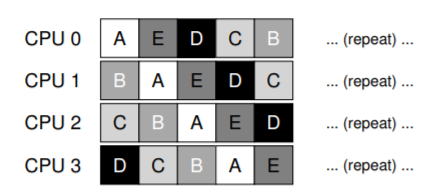

各CPUは単にグローバルに共有されたキューから実行する次のジョブを選択するため、各ジョブはCPUからCPUにバウンドして終了し、キャッシュの親和性の観点からは正反対の動作をします。  
この問題を処理するために、ほとんどのSQMSスケジューラには、可能であればプロセスが同じCPU上で実行し続ける可能性を高めるために、ある種の親和性メカニズムが組み込まれています。具体的には、一部のジョブに対して親和性を提供するかもしれませんが、負荷を均衡させるために他の人を動かします。たとえば、次のようにスケジュールされた同じ5つのジョブを想像してみてください。

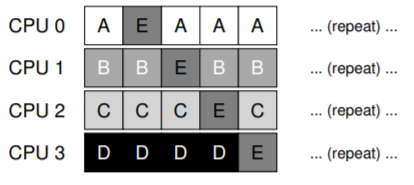

この構成では、ジョブAからDはプロセッサ間で移動されず、ジョブEのみがCPUからCPUに移行し、ほとんどの場合親和性が維持されます。次回に別のジョブを移行することもできます。これにより、ある種の親和性の公平性も実現します。しかしながら、そのようなスキームを実装することは複雑になります。したがって、SQMSのアプローチには長所と短所があることがわかります。既存のシングルCPUスケジューラを実装するのは簡単ですが、定義上は単一のキューしかありません。ただし、(同期のオーバーヘッドのために)規模が大きくならず、キャッシュの親和性が容易に保持されません。

## 10.5 Multi-Queue Scheduling
シングルキュースケジューラで生じる問題のため、いくつかのシステムでは、複数のキューが選択されます(たとえば、CPUごとに1つ)。この手法をmulti queue multiprocessor scheduling (またはMQMS)と呼びます。MQMSでは、基本スケジューリングフレームワークは複数のスケジューリングキューで構成されています。各キューは、ラウンドロビンなどの特定のスケジューリングルールに従う可能性がありますが、もちろんどのアルゴリズムでも使用できます。ジョブがシステムに入ると、あるヒューリスティック(例えば、ランダムまたは他のジョブよりも少ないジョブを選択する)に従って、正確に1つのスケジューリング・キューに置かれる。したがって、本質的に独立してスケジュールされるため、単一キュー方式で見られる情報の共有と同期の問題は回避されます。

たとえば、CPUが2つしかないシステム(CPU 0とCPU 1というラベルが付いているシステム)があり、いくつかのジョブがシステムに入っているとします(A、B、C、Dなど)。各CPUにスケジューリング・キューがある場合、OSは各ジョブを配置するキューを決定する必要があります。それは次のようなことをするかもしれません：

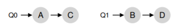

キューのスケジューリング方針に応じて、各CPUは何を実行すべきかを決定する際に、2つのジョブを選択できるようになりました。たとえば、ラウンドロビンを使用すると、次のようなスケジュールが生成されることがあります。

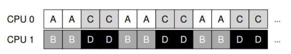

MQMSには本質的にスケーラビリティがあるという点でSQMSの明確な利点があります。CPUの数が増えるにつれて、キューの数も増えるので、ロックとキャッシュの競合が中心的な問題ではありません。さらに、MQMSは本質的にキャッシュ親和性を提供します。ジョブは同じCPU上に留まり、キャッシュされたコンテンツをその中に再利用する利点を得ます。
しかし、注意を払っていれば、マルチ・キュー・ベースのアプローチの基本である新しい問題があることがわかります。負荷の不均衡です。上記と同じ設定(4つのジョブ、2つのCPU)があるとしますが、ジョブの1つ(Cなど)が終了したとします。これで、次のスケジューリングキューが作成されたとします。

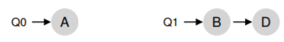

次に、システムの各キューでラウンドロビンポリシーを実行すると、結果として得られるスケジュールが表示されます。

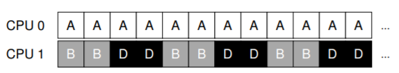

この図から分かるように、AはBとDの2倍のCPUを取得しますが、これは望ましい結果ではありません。さらに悪いことに、AとCの両方が終了し、ジョブBとDだけがシステムに残っているとしましょう。スケジューリングキューは次のようになります。

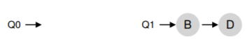

その結果、CPU 0はアイドル状態のままです。CPU使用のタイムラインは悲惨です。

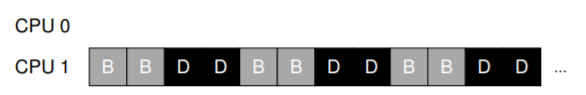

なので、貧弱なMQMSは何をすべきでしょうか？負荷の不均衡という問題をどのように克服すればよいでしょうか？

>> CRUX: HOW TO DEAL WITH LOAD IMBALANCE  
>> MQMSは、ロード・インバランスをどのように処理して、望ましいスケジューリング目標をより良く達成する必要がありますか？

このクエリーに対する明白な答えは、ジョブを移動することです。これは、マイグレーションとも呼ばれる手法です。1つのCPUから別のCPUへジョブを移行することにより、真のロードバランスを達成できます。明快さを加えるためにいくつかの例を見てみましょう。もう一度、1つのCPUがアイドル状態で、もう1つが何らかのジョブを持っている状況があります。

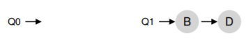

この場合、必要な移行は容易に理解できます。つまり、OSはBまたはDのいずれかをCPU 0に単に移動する必要があります。この単一のジョブの移行結果は均等に均等に分散され、誰もが満足しています。以前の例では、AがCPU 0に、BとDがCPU 1に交互に置かれていたより複雑なケースが発生します。

もちろん、可能な他の多くの移行パターンが存在します。しかし、難しい部分が存在します。それは、システムはどのようにしてそのような移行を制定するべきですか？という問題です。1つの基本的なアプローチは、ワーク・スティール[FLR98]として知られる技法を使用することです。ワーク・スティールのアプローチでは、ジョブが少ない(ソース)キューは、別の(ターゲット)キューを時々見て、そのキューがどれくらい完全であるかを確認します。ターゲットキューが(特に)ソースキューよりもいっぱいの場合、ソースはターゲットキューからの1つ以上のジョブを「盗み」、負荷のバランスをとるのに役立ちます。

もちろん、そのようなアプローチには自然な負荷があります。あまりにも頻繁に他のキューを見回すと、オーバーヘッドが大きくなり、スケーリングに問題が発生します。これは、最初に複数のキュースケジューリングを実装する目的全体です。一方、他のキューを非常に頻繁に見ないと、重大な負荷の不均衡に苦しむ危険があります。システムポリシーの設計でよく見られるように、正しい閾値を見つけることは、黒魔術です。

## 10.6 Linux Multiprocessor Schedulers
興味深いことに、Linuxコミュニティでは、マルチプロセッサスケジューラを構築するための共通の解決方法はありませんでした。時間の経過とともに、O(1)スケジューラ、CFS(Complete Fair Scheduler)、BFSスケジューラ(BFS)という3つの異なるスケジューラが発生しました。スケジューラの長所と短所の優れた概要については、Meeheanの論文を参照してください[M11]。ここでは基本のいくつかを要約します。  
O(1)とCFSは複数のキューを使用しますが、BFSは単一のキューを使用し、両方のアプローチが成功することを示しています。もちろん、これらのスケジューラを分ける他の多くの詳細があります。例えば、O(1)スケジューラは、様々なスケジューリング目標を達成するために、時間の経過とともにプロセスの優先度を変更し、次に優先度の高いスケジューラ(前述のMLFQと同様)である。インタラクティビティは特に重要です。これとは対照的に、CFSは決定論的な比例的なアプローチ(前述のように、ストライドスケジューリングに似ています)です。BFSは、3つのキュー間の唯一のキュー方式でもあり、比例配分ですが、EEVDF(EEVDVD)[SA96]というより複雑な方式に基づいています。これらの近代的なアルゴリズムの詳細については、お読みください。あなたは彼らが今やっていることを理解することができるはずです！

## 10.7 Summary
マルチプロセッサスケジューリングにはさまざまなアプローチがあります。シングルキューアプローチ(SQMS)はロードバランスを取ように構築するのは簡単ですが、本質的には多くのプロセッサとキャッシュの親和性にスケーリングすることが難しいです。マルチキュー方式(MQMS)は、スケーラビリティとキャッシュアフィニティをうまく処理しますが、負荷の不均衡に問題があり、より複雑です。どのようなアプローチをとっても、簡単な答えはありません。一般的なスケジューラを構築するのは難しい作業です。小さなコード変更は大きな動作上の違いにつながります。

#参考文献

[A90] “The Performance of Spin Lock Alternatives for Shared-Memory Multiprocessors”  
Thomas E. Anderson  
IEEE TPDS Volume 1:1, January 1990  
A classic paper on how different locking alternatives do and don’t scale. By Tom Anderson, very well known researcher in both systems and networking. And author of a very fine OS textbook, we must say.

[B+10] “An Analysis of Linux Scalability to Many Cores Abstract”  
Silas Boyd-Wickizer, Austin T. Clements, Yandong Mao, Aleksey Pesterev, M. Frans Kaashoek, Robert Morris, Nickolai Zeldovich  
OSDI ’10, Vancouver, Canada, October 2010  
A terrific modern paper on the difficulties of scaling Linux to many cores.

[CSG99] “Parallel Computer Architecture: A Hardware/Software Approach”  
David E. Culler, Jaswinder Pal Singh, and Anoop Gupta
Morgan Kaufmann, 1999  
A treasure filled with details about parallel machines and algorithms. As Mark Hill humorously observes on the jacket, the book contains more information than most research papers.

[FLR98] “The Implementation of the Cilk-5 Multithreaded Language”  
Matteo Frigo, Charles E. Leiserson, Keith Randall  
PLDI ’98, Montreal, Canada, June 1998  
Cilk is a lightweight language and runtime for writing parallel programs, and an excellent example of the work-stealing paradigm.

[G83] “Using Cache Memory To Reduce Processor-Memory Traffic”  
James R. Goodman  
ISCA ’83, Stockholm, Sweden, June 1983  
The pioneering paper on how to use bus snooping, i.e., paying attention to requests you see on the bus, to build a cache coherence protocol. Goodman’s research over many years at Wisconsin is full of cleverness, this being but one example.

[M11] “Towards Transparent CPU Scheduling”  
Joseph T. Meehean  
Doctoral Dissertation at University of Wisconsin—Madison, 2011  
A dissertation that covers a lot of the details of how modern Linux multiprocessor scheduling works. Pretty awesome! But, as co-advisors of Joe’s, we may be a bit biased here.

[SHW11] “A Primer on Memory Consistency and Cache Coherence”  
Daniel J. Sorin, Mark D. Hill, and David A. Wood  
Synthesis Lectures in Computer Architecture  
Morgan and Claypool Publishers, May 2011  
A definitive overview of memory consistency and multiprocessor caching. Required reading for anyone who likes to know way too much about a given topic.

[SA96] “Earliest Eligible Virtual Deadline First: A Flexible and Accurate Mechanism for Proportional Share Resource Allocation”  
Ion Stoica and Hussein Abdel-Wahab  
Technical Report TR-95-22, Old Dominion University, 1996  
A tech report on this cool scheduling idea, from Ion Stoica, now a professor at U.C. Berkeley and world expert in networking, distributed systems, and many other things.

[prev](../09/09.md)|[next](../13/13.md)
