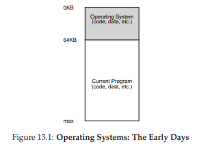
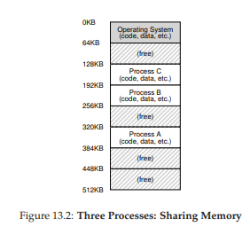
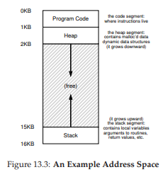

# 13 The Abstraction: Address Spaces

初期のコンピュータシステムの構築は簡単でした。なぜでしょうか？実はユーザーはあまり期待していなかったのです。「使いやすさ」、「高性能」、「信頼性」など、これらの頭痛に本当に悩まされているのは、期待しているユーザーです。

## 13.1 Early Systems
メモリの観点から、初期のマシンはユーザーにあまり抽象的なものを提供しませんでした。基本的には、マシンの物理メモリは図13.1のようになりました。



OSはメモリにあるルーチン(実際にはライブラリである)であり、物理メモリにある実行中のプログラム(プロセス)が1つあります。この例では64k)、残りのメモリを使用しました。ここには錯覚はほとんどなく、ユーザーはOSからあまり期待していませんでした。当時のOS開発者にとって、設計は簡単だったでしょうか？

## 13.2 Multiprogramming and Time Sharing
しばらくすると、マシンが高価だったため、人々はマシンをより効果的に共有し始めました。このように、マルチプログラミングの時代は、複数のプロセスがある時点で動作する準備が整った状態で生まれました[DV66]。そして、例えば、I/Oを実行することが決定されたときなど、OSはそれらの間で切り替わります。そうすることで、CPUの有効利用が増えました。このような効率の向上は、各マシンのコストが数十万ドルから数百万ドルに達したときに特に重要でした(Macが高価だと思っていました)。

まもなく、人々はより多くの機械を要求し始め、time sharingの時代が生まれました[S59、L60、M62、M83]。具体的には、バッチ・コンピューティングの限界を認識していました。特に、プログラム・デバッグ・サイクルに長い時間がかかっていたため、プログラム・デバッグ・サイクルに疲れてしまったプログラマー自身にとっては限界がありました[CV65]。多くのユーザーが現在実行中のタスクからタイムリーな応答を待っている(または望んでいる)マシンを同時に使用している可能性があるため、対話性の概念が重要になりました。

タイムシェアリングを実装する1つの方法は、すべてのメモリ(図13.1、ページ113)に完全にアクセスできるようにしながら、1つのプロセスを実行してから停止し、すべての状態を何らかの種類のディスク(すべての物理メモリ)を読み込み、他のプロセスの状態をロードし、しばらく実行して、マシンの粗い共有を実行します。[M+63]

残念ながら、このアプローチには大きな問題があります。それは遅すぎます。特にメモリが増えるほどです。レジスタレベルの状態(PC、汎用レジスタなど)の保存と復元は比較的高速ですが、メモリの内容全体をディスクに保存することは残念ながら効果がありません。したがって、私たちがやりたいことは、プロセスをメモリに置き換えながらプロセスを残し、OSが効率的に時間を共有できるようにすることです(図13.2)。



この図には3つのプロセス(A、B、C)があり、それぞれに512KBの物理メモリの一部が彫られています。単一のCPUを想定すると、OSはプロセスの1つ(たとえばA)を実行することを選択し、他のプロセス(BおよびC)は実行待ちのレディキューに入ります。

time sliceが普及するにつれて、おそらくオペレーティングシステムに新しい要求が加えられたと推測できます。特に、複数のプログラムを同時にメモリに常駐させることで、重要な問題が保護されます。プロセスが他のプロセスのメモリを読み書きできるようにしたり、悪化させたりすることは望ましくありません。

## 13.3 The Address Space
しかし、私たちはこれらの厄介なユーザーを念頭に置いておく必要があります。そのためには、OSが物理メモリーの使いやすい抽象化を作成する必要があります。この抽象概念はアドレス空間と呼ばれ、実行中のプログラムのシステム内のメモリのビューです。メモリのこの基本的なOS抽象化を理解することは、メモリがどのように仮想化されているかを理解するうえで重要です。

プロセスのアドレス空間には、実行中のプログラムのすべてのメモリ状態が含まれます。例えば、プログラムのコード(命令)はどこかのメモリになければならないため、アドレス空間にあります。プログラムが実行されている間、スタックを使用して関数呼び出しチェーン内のどこにあるかを追跡し、ローカル変数を割り当て、ルーチンとの間でパラメータと戻り値を渡します。最後に、ヒープは、Cで`malloc()`を呼び出したときやC++やJavaなどのオブジェクト指向の言語で新しいときなど、動的に割り当てられたユーザー管理のメモリーに使用されます。もちろん、他にも静的に初期化された変数などがありますが、ここではコード、スタック、ヒープの3つのコンポーネントを想定します。



図13.3(115ページ)の例では、小さなアドレス空間(16KBのみ)があります。プログラムコードは、アドレス空間の先頭にあります(この例では0から始まり、アドレス空間の最初の1Kにパックされています)。コードは静的であり(したがってメモリに配置するのが簡単なので)、アドレス空間の先頭に配置することができ、プログラムが実行されるにつれてそれ以上のスペースは必要ないことがわかります。

次に、プログラムが実行されている間に拡大(縮小)するアドレス空間の2つの領域があります。それらはヒープ(上部)とスタック(下部)です。それぞれが成長したいと思っているため、アドレス空間の両端に配置することで、このような成長を可能にします。逆方向に成長するだけです。したがって、ヒープはコードの直後(1KB)から始まり、下向きに成長します(ユーザーが`malloc()`でより多くのメモリを要求したとき)。スタックは16KBから始まり、上に向かって(ユーザが手続き呼び出しを行ったときなどに)成長します。ただし、このスタックとヒープの配置は単なる規則です。もし望むのであれば、アドレス空間を別の方法で整理することができます(後で、出てきますが、複数のスレッドがアドレス空間に共存するとき、アドレス空間を分ける良い方法はもうありません)。

もちろん、アドレス空間について説明するとき、OSが実行中のプログラムに提供している抽象概念が記述されています。プログラムは実際には物理アドレス0〜16KBのメモリにありません。むしろ、任意の物理アドレス(複数可)にロードされます。図13.2のプロセスA、B、Cを調べます。そこでは、各プロセスが異なるアドレスのメモリにどのようにロードされているかを見ることができます。したがって、問題は以下のようになります。

>> THE CRUX: HOW TO VIRTUALIZE MEMORY  
>> OSは、単一の物理メモリの上に複数の実行中のプロセス(すべての共有メモリ)のプライベートな、潜在的に大きなアドレス空間のこの抽象化をどのように構築できますか？

OSがこれを実行すると、実行中のプログラムは特定のアドレス(例えば0)でメモリにロードされ、潜在的に非常に大きなアドレス空間(32ビットまたは64ビットなど)を持つと考えているため、現実は全く異なっています。

たとえば、図13.2のプロセスAがアドレス0(仮想アドレスと呼ぶ)で負荷を実行しようとすると、何らかのハードウェアサポートと並行して、OSは実際には負荷が実際には発生しないことを確認する必要があります物理アドレス0に行くのではなく、物理アドレス320KB(Aはメモリにロードされます)に行きます。これは、世界のあらゆる最新のコンピュータシステムの基礎をなすメモリの仮想化の鍵です。

>> TIP: THE PRINCIPLE OF ISOLATION  
>> 信頼性の高いシステムを構築する上で、分離は重要な原則です。2つのエンティティが互いに適切に分離されている場合、これは一方が他方に影響を与えずに失敗することができます。オペレーティングシステムは、プロセスをお互いに分離するように努力し、このようにして、他のプロセスを害するのを防止します。メモリ分離を使用することにより、OSは、実行中のプログラムが基礎となるOSの動作に影響を与えないことをさらに保証します。最近のOSの中には、OSの他の部分からOSの一部を切り離すことによって、さらに孤立しているものもあります。したがって、このようなマイクロカーネル[BH70、R+89、S+03]は、典型的なモノリシックカーネル設計よりも高い信頼性を提供することができます。

## 13.4 Goals
このように、私たちはOSの仕事に、メモリを仮想化するというこの一連のノートに着きます。OSはメモリを仮想化するだけでなく、それはスタイルでそうするでしょう。OSがそうしていることを確認するには、私たちを導くいくつかの目標が必要です。私たちは前にこれらの目標を見てきましたが(序論を考えてください)、我々はそれらをもう一度見ていきますが、確かに繰り返す価値があります。

仮想メモリ(VM)システムの1つの主な目標は透明性です。OSは実行中のプログラムには見えない方法で仮想メモリを実装する必要があります。したがって、プログラムはメモリが仮想化されているという事実を認識すべきではありません。むしろ、プログラムはあたかも独自の物理メモリを持つかのように動作します。背後では、OS(およびハードウェア)は、さまざまなジョブ間でメモリを多重化するためのすべての作業を行い、したがって錯覚を実装します。

VMのもう1つの目標は効率です。OSは、時間の点(すなわち、プログラムをはるかにゆっくりと実行させない)、およびスペース(すなわち、仮想化をサポートするために必要な構造に対してあまりにも多くのメモリを使用しない)の両方において、仮想化をできるだけ効率的にするよう努力すべきです。時間効率の高い仮想化を実現するには、TLBなどのハードウェア機能を含むハードウェアサポートにOSを依存させる必要があります(当然のことながらこれについて学びます)。

最後に、第3のVM目標は保護です。OSはプロセス同士を保護し、OS自体をプロセスから保護する必要があります。1つのプロセスがロード、ストア、または命令フェッチを実行する場合、他のプロセスまたはOS自体のメモリ内容(つまり、アドレス空間外のもの)には何らかの形でアクセスまたは影響を与えるべきではありません。したがって、保護はプロセス間の分離の性質を提供することを可能にします。各プロセスは、他の障害のあるプロセスや悪意のあるプロセスから安全な、独自の隔離された繭で実行されている必要があります。

>> ASIDE: EVERY ADDRESS YOU SEE IS VIRTUAL  
>> ポインタを出力するCプログラムを書いたことがありますか？表示されている値(大きい値、16進数で表示されることが多い)は、仮想アドレスです。あなたのプログラムのコードがどこにあるのだろうか？あなたもそれを印刷することができます。はい、print文で出力することができれば、それは仮想アドレスです。実際、ユーザーレベルのプログラムのプログラマーとして見えるアドレスはすべて仮想アドレスです。メモリを仮想化するトリッキーなテクニックによって、これらの命令とデータ値がマシンの物理メモリのどこにあるのかを知るのは、OSだけです。プログラムのアドレスをプリントアウトすると、それは仮想的なものです。物事がメモリにどのようにレイアウトされているかの錯覚です。OS(およびハードウェア)だけが本当の真実を知っています。  
`main()`ルーチン(コードが存在する場所)、`malloc()`から返されたヒープ割り当て値の値、スタック上の整数の位置を出力する小さなプログラムです。

```c
#include <stdio.h>
#include <stdlib.h>
int main(int argc, char *argv[]) {
    printf("location of code : %p\n", (void *) main);
    printf("location of heap : %p\n", (void *) malloc(1));
    int x = 3;
    printf("location of stack : %p\n", (void *) &x);
    return x;
}
```

>>64bit Macで動かしたときは以下のようになります。  
```
location of code : 0x1095afe50
location of heap : 0x1096008c0
location of stack : 0x7fff691aea64
```
このことから、コードがアドレス空間で最初に来てからヒープになり、スタックがこの大きな仮想空間の反対側にあることが分かります。これらのアドレスはすべて仮想アドレスであり、実際の物理ロケーションから値を取得するためにOSとハードウェアによって変換されます。

次の章では、ハードウェアとオペレーティングシステムのサポートを含め、メモリを仮想化するために必要な基本的なメカニズムについて説明します。また、空き容量を管理する方法や、空き容量が少なくなったときにメモリから解放されるページなど、オペレーティングシステムで発生するより関連性の高いポリシーのいくつかについても調査します。そうすることで、現代の仮想メモリシステムが実際にどのように機能するかを理解していきます。

## 13.5 Summary
私たちは主要なOSサブシステム、仮想メモリの導入を見てきました。VMシステムは、その命令およびデータをすべてその中に保持する、プログラムに大きな、まばらな、プライベートなアドレス空間の錯覚を提供する責任があります。いくつかの重要なハードウェアの助けを借りて、OSはこれらの仮想メモリ参照をそれぞれ取り出し、それらを物理アドレスに変換して、物理メモリに提示して必要な情報を取り出すことができます。OSはこれを、多くのプロセスで同時に実行し、プログラムを互いに保護し、OSを保護するようにします。全体的なアプローチには、多くの仕組み(低レベルマシンがたくさんあります)と、いくつかの重要なポリシーが必要です。重要なメカニズムを最初に説明して、下から上へと学んでいきます。

# 参考文献
[BH70] “The Nucleus of a Multiprogramming System”  
Per Brinch Hansen  
Communications of the ACM, 13:4, April 1970  
The first paper to suggest that the OS, or kernel, should be a minimal and flexible substrate for building customized operating systems; this theme is revisited throughout OS research history.

[CV65] “Introduction and Overview of the Multics System”  
F. J. Corbato and V. A. Vyssotsky  
Fall Joint Computer Conference, 1965  
A great early Multics paper. Here is the great quote about time sharing: “The impetus for time sharing first arose from professional programmers because of their constant frustration in debugging programs at batch processing installations. Thus, the original goal was to time-share computers to allow simultaneous access by several persons while giving to each of them the illusion of having the whole machine at his disposal.”

[DV66] “Programming Semantics for Multiprogrammed Computations”  
Jack B. Dennis and Earl C. Van Horn  
Communications of the ACM, Volume 9, Number 3, March 1966  
An early paper (but not the first) on multiprogramming.

[L60] “Man-Computer Symbiosis”  
J. C. R. Licklider  
IRE Transactions on Human Factors in Electronics, HFE-1:1, March 1960  
A funky paper about how computers and people are going to enter into a symbiotic age; clearly well ahead of its time but a fascinating read nonetheless.

[M62] “Time-Sharing Computer Systems”  
J. McCarthy  
Management and the Computer of the Future, MIT Press, Cambridge, Mass, 1962  
Probably McCarthy’s earliest recorded paper on time sharing. However, in another paper [M83], he claims to have been thinking of the idea since 1957. McCarthy left the systems area and went on to become a giant in Artificial Intelligence at Stanford, including the creation of the LISP programming language. See McCarthy’s home page for more info: http://www-formal.stanford.edu/jmc/

[M+63] “A Time-Sharing Debugging System for a Small Computer”  
J. McCarthy, S. Boilen, E. Fredkin, J. C. R. Licklider  
AFIPS ’63 (Spring), New York, NY, May 1963  
A great early example of a system that swapped program memory to the “drum” when the program wasn’t running, and then back into “core” memory when it was about to be run.

[M83] “Reminiscences on the History of Time Sharing”  
John McCarthy  
Winter or Spring of 1983  
Available: http://www-formal.stanford.edu/jmc/history/timesharing/timesharing.html  
A terrific historical note on where the idea of time-sharing might have come from, including some doubts towards those who cite Strachey’s work [S59] as the pioneering work in this area.

[NS07] “Valgrind: A Framework for Heavyweight Dynamic Binary Instrumentation”  
Nicholas Nethercote and Julian Seward  
PLDI 2007, San Diego, California, June 2007  
Valgrind is a lifesaver of a program for those who use unsafe languages like C. Read this paper to learn about its very cool binary instrumentation techniques – it’s really quite impressive.

[R+89] “Mach: A System Software kernel”  
Richard Rashid, Daniel Julin, Douglas Orr, Richard Sanzi, Robert Baron, Alessandro Forin, David Golub, Michael Jones  
COMPCON 89, February 1989  
Although not the first project on microkernels per se, the Mach project at CMU was well known and influential; it still lives today deep in the bowels of Mac OS X.

[S59] “Time Sharing in Large Fast Computers”  
C. Strachey  
Proceedings of the International Conference on Information Processing, UNESCO, June 1959  
One of the earliest references on time sharing.  

[S+03] “Improving the Reliability of Commodity Operating Systems”  
Michael M. Swift, Brian N. Bershad, Henry M. Levy  
SOSP 2003  
The first paper to show how microkernel-like thinking can improve operating system reliability.

[prev](../10/10.md)|[next](../14/14.md)