## 17 Free-Space Management
この章では、mallocライブラリ(プロセスのヒープのページを管理する)であろうと、OS自体(アドレスの一部を管理するものであろうと)を問わず、メモリ管理システムの基本的な側面について議論するために、プロセスのスペース)。具体的には、free space managementを取り巻く課題について議論していきます。

問題をより具体的にしましょう。空き領域を管理することは確実に簡単です。ページングの概念について議論するときにわかります。管理しているスペースが固定サイズのユニットに分割されている場合は簡単です。このような場合、これらの固定サイズのユニットのリストを保持するだけです。クライアントがそのうちの1つを要求すると、最初のエントリを返します。

free space managementがより難しくなる(興味深い)のは、管理している空き領域が可変サイズのユニットで構成されている場合です。これは、ユーザレベルのメモリ割り当てライブラリ(`malloc()`および`free()`)や、セグメンテーションを使用して仮想メモリを実装する際に物理メモリを管理するOSで発生します。どちらの場合でも、存在する問題は外部断片化として知られています。空き領域はサイズの小さな断片に細断され、断片化されます。空き領域の合計量が要求のサイズを超えていても、要求を満たすことができる連続した1つの領域がないため、後続の要求が失敗する可能性があります。

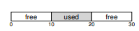

図はこの問題の例を示しています。この場合、使用可能な空き領域の合計は20バイトです。残念ながら、サイズ10の2つのチャンクに分割されています。その結果、20バイトの空きがあっても15バイトの要求は失敗します。そこで、この章で取り上げる問題に到達します。

>>CRUX: HOW TO MANAGE FREE SPACE  
>>可変サイズの要求を満たす場合、空き領域をどのように管理するべきか？断片化を最小限に抑えるためにどのような戦略を使用できますか？代替アプローチの時間と空間のオーバーヘッドはどのくらいですか？

## 17.1 Assumptions
この議論の大部分は、ユーザレベルのメモリ割り当てライブラリにあるアロケータの偉大な歴史に焦点を当てています。私たちはウィルソンの優れた調査[W+95]を参考にしていますが、興味を持った読者がソースドキュメント自体に行くことを勧めます。

`malloc()`と`free()`が提供するような基本的なインタフェースを想定しています。具体的には、void * malloc(size t size)は、アプリケーションによって要求されたバイト数であるsizeという単一のパラメータをとります。そのサイズの領域(またはそれ以上の大きさ)にポインタ(特定の型のないポインタ、またはC言語のvoidポインタ)を返します。void free(void * ptr)はポインタをとり、対応するチャンクを解放します。インターフェイスの意味に注意してください。ユーザーはスペースを解放するときにライブラリにサイズを通知しません。したがって、ライブラリは、メモリへのポインタが渡されたときに、メモリのチャンクがどれだけ大きいかを把握できる必要があります。この章の後半でこれを行う方法について説明します。

このライブラリが管理する領域は歴史的にヒープとして知られており、ヒープの空き領域を管理するために使用される汎用データ構造は何らかのフリーリストです。この構造体には、メモリの管理対象領域内の空きチャンクのすべてへの参照が含まれます。もちろん、このデータ構造はリストそのものでなくても、空き領域を追跡するためのデータ構造の一種である必要はありません。

さらに、主に、前述のように外部断片化に関心があると仮定します。アロケータは、もちろん、内部断片化の問題を抱えている可能性もあります。割り振り者が要求された量よりも多くのメモリを渡すと、そのようなチャンク内の未使用の(したがって未使用の)スペースは内部断片化とみなされます(割り当てられたユニットの内部で発生するため)。しかし、単純化のため、主に外部フラグメンテーションに焦点を当てます。

また、クライアントにメモリを渡すと、メモリ内の別の場所に移動することはできません。たとえば、プログラムが`malloc()`を呼び出し、ヒープ内のいくつかの領域へのポインタが与えられた場合、そのメモリ領域は、プログラムが対応するメモリ領域を介して返すまで、プログラムによって"所有"されます(ライブラリによっては移動できません)`free()`を呼び出します。したがって、断片化に対抗するのに有用な空き領域の圧縮は不可能です。しかし、セグメンテーションを実装する際に、断片化に対処するために、空き領域の圧縮をOSで使用することができます(セグメンテーションの章で説明したように)。

最後に、アロケータが連続したバイトの領域を管理していると仮定します。場合によっては、アロケータがその領域の拡張を要求することもできます。例えば、ユーザレベルのメモリ割り当てライブラリは、スペースを使い果たしたときにカーネルを呼び出して(sbrkなどのシステムコールを介して)ヒープを拡張することができます。しかし、わかりやすくするために、領域は一生を通して固定された単一のサイズであると仮定します。

## 17.2 Low-level Mechanisms
いくつかのポリシーの詳細を調べる前に、まず大部分のアロケータで使用されるいくつかの一般的なメカニズムについて説明します。まず、ほとんどのアロケータで一般的な手法である分割と融合の基本について説明します。次に、割り当てられた領域のサイズをどのように素早く簡単に追跡できるかを示します。最後に、空き領域内に単純なリストを作成し、空き領域と空でない領域を追跡する方法について説明します。

###Splitting and Coalescing 
空きリストには、まだヒープに残っている空き領域を記述する要素のセットが含まれています。したがって、次の30バイトのヒープを想定します。

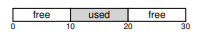

このヒープの空きリストには2つの要素があります。1つのエントリは最初の10バイトの空きセグメント(バイト0〜9)を記述し、1つのエントリは他の空きセグメント(バイト20〜29)を記述します。

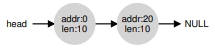

上記のように、10バイトを超えるリクエストは失敗します(NULLを返します)。利用可能なサイズのメモリが連続して1つだけはありません。いずれかのフリーチャンクによって、そのサイズ(10バイト)を正確に満たすことができます。しかし、要求が10バイトより小さいものの場合はどうなりますか？

ただ1バイトのメモリが要求されているとします。この場合、アロケータは分割と呼ばれるアクションを実行します。要求を満たすことができ、2つに分割する空きメモリを見つけます。

最初のチャンクは呼び出し元に戻ります。2番目のチャンクはリストに残ります。したがって、上記の例では、1バイトの要求が行われ、アロケータが2つの要素のうち2番目の要素を使用して要求を満たすことにした場合、`malloc()`の呼び出しは20を返します1バイトの割り当て領域)、リストは次のようになります。

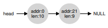

上記のように、10バイトを超えるリクエストは失敗します(NULLを返します)。利用可能なサイズのメモリが連続して1つだけはありません。いずれかのフリーチャンクによって、そのサイズ(10バイト)を正確に満たすことができます。しかし、要求が10バイトより小さいものの場合はどうなりますか？

ただ1バイトのメモリが要求されているとします。この場合、アロケータは分割と呼ばれるアクションを実行します。要求を満たすことができ、2つに分割する空きメモリを見つけます。

最初のチャンクは呼び出し元に戻ります。2番目のチャンクはリストに残ります。したがって、上記の例では、1バイトの要求が行われ、アロケータが2つの要素のうち2番目の要素を使用して要求を満たすことにした場合、`malloc()`の呼び出しは20を返します。1バイトの割り当て領域)、リストは次のようになります。

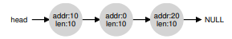

この問題に注意してください。ヒープ全体が空いている間は、見かけ上10バイトの3つのチャンクに分割されています。したがって、ユーザーが20バイトを要求した場合、単純なリストの探索ではそのような空きチャンクを見つけず、失敗を返します。

この問題を回避するためにアロケータが行うことは、メモリのチャンクが解放されたときの空き領域の合体です。アイデアは簡単です：メモリに空きチャンクを返すときは、空き領域の近くのチャンクだけでなく、返すチャンクのアドレスも注意深く見てください。新しく作成されたスペースが既存の空きチャンクの1つ(またはこの例では2つ)のすぐ隣にある場合は、それらを1つの大きな空きチャンクにマージします。したがって、合体によって、最終的なリストは次のようになります。


確かに、これは割り当てが行われる前のヒープリストの最初のようなものです。合体により、アロケータは、アプリケーションに大きな空き領域があることを確認できます。

### Tracking The Size Of Allocated Regions
free(void * ptr)のインタフェースがsizeパラメータを取っていないことに気づいたかもしれません。mallocライブラリは解放されたメモリ領域のサイズを素早く決定し、空きリストにスペースを組み込むことができると仮定されています。

[](./img/fig17_1.PNG)

このタスクを達成するために、大部分のアロケータは、メモリ内に保持されたヘッダブロックに、通常はメモリのチャンクの直前に少しの余分な情報を格納します。もう一度例を見てみましょう(図17.1)。この例では、ptrが指す、20バイトの割り当てブロックを調べています。ユーザが`malloc()`と呼ばれ、その結果をptrに格納すると想像してください。たとえば、ptr = malloc(20);となります。

ヘッダーには、割り当てられた領域のサイズが最小限含まれます。(この場合は20)それは、割り当て解除を高速化するための追加ポインタ、追加の完全性チェックを提供するためのマジックナンバー、および他の情報を含むこともできます。領域のサイズとマジックナンバーを含む単純なヘッダを仮定しましょう。
```c
typedef struct __header_t {
int size;
int magic;
} header_t;
```

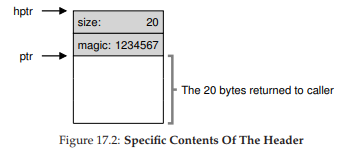

上記の例は、図17.2のようになります。ユーザーがfree(ptr)を呼び出すと、ライブラリは単純なポインタ演算を使用して、ヘッダーの開始位置を特定します。

```c
void free(void *ptr) {
header_t *hptr = (void *)ptr - sizeof(header_t);
...
```
このようなヘッダへのポインタを取得した後、ライブラリはマジックナンバーがサニティチェック(assert(hptr-> magic == 1234567))として期待値と一致するかどうかを簡単に判断し、新たに解放された領域の合計サイズを単純な数学(すなわち、領域のサイズにヘッダのサイズを加える)。最後の文では小さいながらも重要なことに注意してください。空き領域のサイズは、ヘッダーのサイズにユーザーに割り当てられたスペースのサイズを加えたものです。したがって、ユーザーがNバイトのメモリーを要求すると、ライブラリーはサイズNの空きチャンクを検索しません。むしろ、サイズNのフリーチャンクとヘッダーのサイズを検索します。

### Embedding A Free List
これまでのところ、私たちは単純なフリーリストを概念実体として扱ってきました。それはヒープ内のメモリの空きチャンクを記述する単なるリストです。しかし、空き領域の中にこのようなリストをどうやって作りますか？

より典型的なリストでは、新しいノードを割り当てるときに、ノードのためのスペースが必要なときに`malloc()`を呼び出すだけです。残念ながら、メモリ割り当てライブラリ内では、これを行うことはできません。代わりに、空き領域内にリストを構築する必要があります。

4096バイトのメモリを管理する(つまり、ヒープは4KB)と仮定します。これをフリーリストとして管理するには、最初に前記リストを初期化する必要があります。最初は、リストにはサイズ4096(ヘッダサイズを引いたもの)のエントリが1つあります。リストのノードの説明は次のとおりです。

```c
typedef struct __node_t {
int size;
struct __node_t *next;
} node_t;
```
次に、ヒープを初期化し、空きリストの最初の要素をそのスペース内に配置するコードを見てみましょう。ヒープは、システムコールmmapの呼び出しによって取得された空き領域内に構築されていると仮定しています。このようなヒープを作成する唯一の方法ではありませんが、この例ではうまく機能します。
```c
// mmap() returns a pointer to a chunk of free space
node_t *head = mmap(NULL, 4096, PROT_READ|PROT_WRITE,
MAP_ANON|MAP_PRIVATE, -1, 0);
head->size = 4096 - sizeof(node_t);
head->next = NULL;
```
このコードを実行すると、リストのステータスは、サイズが4088の単一のエントリを持つことになります。はい、これは小さなヒープですが、ここではわかりやすい例です。ヘッドポインタはこの範囲の先頭アドレスを含みます。それが16KBであると仮定しましょう(仮想アドレスは問題ありません)。視覚的には、ヒープは図17.3のようになります。

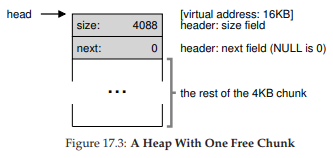

さて、メモリのチャンクが要求されたとしましょう。たとえば、100バイトのサイズです。この要求を処理するために、ライブラリは最初に要求を収容するのに十分な大きさを見つけます。空きチャンク(サイズ：4088)が1つしかないため、このチャンクが選択されます。次に、チャンクは2つに分割されます。1つのチャンクは要求(および前述のヘッダー)を処理するのに十分な大きさで、空きチャンクは残りのチャンクです。8バイトのヘッダ(整数サイズと整数のマジックナンバー)を仮定すると、ヒープ内のスペースは図17.4のようになります。

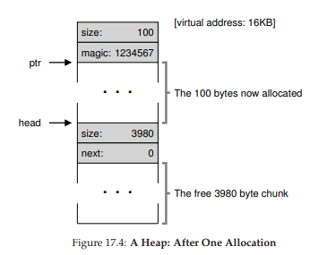

したがって、100バイトの要求時に、ライブラリーは既存の1つの空きチャンクから108バイトを割り当て、(上の図でptrとマークされた)ポインターを戻し、割り当てられたスペースの直前のヘッダー情報を後で使用できるように`free()`を呼び出し、リスト内の1つの空きノードを3980バイト(4088から108)に縮小します。

次に、割り当てられた3つの領域がある場合のヒープを見てみましょう。各領域は100バイト(またはヘッダーを含む108)です。このヒープの可視化を図17.5に示します。

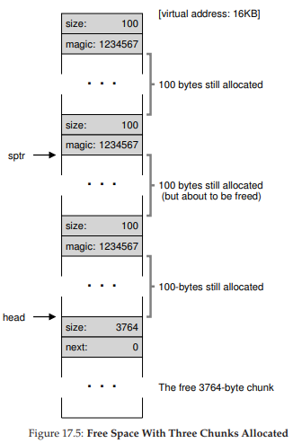

そこから見ることができるように、最初のヒープの324バイトが割り当てられているので、その領域に3つのヘッダーがあり、呼び出し元のプログラムで3つの100バイトの領域が使用されています。フリーリストは興味深いもので、ただ1つのノード(頭が指している)ですが、今は3つの分割後のサイズが3764バイトです。しかし、呼び出し元のプログラムが`free()`でメモリを返すとどうなりますか？

この例では、アプリケーションはfree(16500)を呼び出すことによって割り当てられたメモリの中央のチャンクを返します(値16500は、メモリ領域の先頭16384を前のチャンクの108に追加することによって到着します。このチャンクのヘッダー)この値は前の図にポインタsptrで示されています。

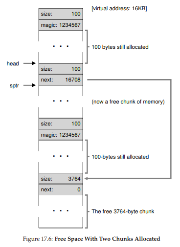

ライブラリは空き領域のサイズをすぐに把握し、空きチャンクを空きリストに戻します。空きリストの先頭に挿入すると、スペースは次のようになります(図17.6)。そして今、私たちは小さなフリーチャンク(100バイト、リストの先頭を指す)と大きな空きチャンク(3764バイト)で始まるリストを持っています。

私たちのリストには、最終的に1つ以上の要素があります！そして、はい、free spaceは断片化していますが、残念ながら一般的なことです。

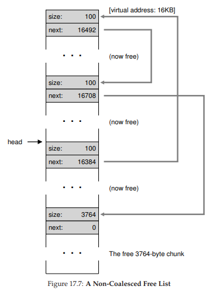

1つの最後の例：最後の2つの使用中チャンクが解放されたと仮定しましょう。合体しないと、断片化しているフリーリストになる可能性があります(図17.7参照)

図からわかるように、今は大きな混乱があります！どうしてでしょう？シンプルなので、リストをまとめるのを忘れてしまいました。メモリはすべてfreeされていますが、断片化したメモリとして見えます。解決策は簡単です：リストを通って隣接チャンクをマージします。終了すると、ヒープは再び全体になります。

### Growing The Heap
私たちは、多くの割り当てライブラリ内で見つかった1つの最後のメカニズムについて議論すべきです。具体的には、ヒープにスペースがなくなったらどうしたらいいですか？最も簡単なアプローチは失敗することです。場合によってはこれが唯一のオプションであるため、NULLを返すことは名誉あるアプローチです。

従来のほとんどのアロケータは、小さなヒープから始めて、ヒープがなくなったときに、OSからより多くのメモリを要求します。通常、これはヒープを成長させてそこから新しいチャンクを割り当てるために何らかの種類のシステムコール(例えば、ほとんどのUNIXシステムではsbrk)を行うことを意味します。sbrk要求を処理するために、OSは空きの物理ページを見つけ、要求元のプロセスのアドレス空間にマップしてから、新しいヒープの終わりの値を返します。その時点で、より大きいヒープが利用可能であり、要求を正常に処理することができます。

## 17.3 Basic Strategies
今ではいくつかの機械を手に入れましたので、空き領域を管理するための基本的な戦略について説明しましょう。これらのアプローチは、ほとんどあなたが自分自身を考えることができる非常にシンプルなポリシーに基づいています。

理想的なアロケータは高速であり、断片化を最小限に抑えます。残念なことに、割り振りと空き要求の流れは任意です(結局、プログラマーによって決定されます)。間違った入力を考えると、どのような戦略もかなり悪いことがあります。したがって、私たちは「最良の」アプローチについては説明しませんが、むしろいくつかの基本について話し、賛否両論について議論します。

### Best Fit
ベストフィット戦略は非常に単純です。まず、フリーリストを検索し、要求されたサイズよりも大きいか大きいサイズの空きメモリを探します。そのグループの中で最も小さいグループを返します。これはいわゆるベストフィットチャンクです(最小適合とも呼ぶことができます)。空きリストを1回通過するだけで正しいブロックが返されます。

ベストフィットの背後にある直感は簡単です。ユーザーが求めるものに近いブロックを返すことで、ベストフィットは無駄なスペースを減らそうとします。しかし、コストがあります。素朴な実装では、正しい空きブロックの網羅的な検索を実行すると、パフォーマンスが大幅に低下します。

### Worst Fit
Worst Fitアプローチはベストフィットの逆です。最大のチャンクを見つけて要求された量を返します。残りの(大)チャンクを空きリストに残しておきます。Worst Fitは、ベストフィット手法から生じる可能性のある小さなチャンクの代わりに、大きなチャンクを自由に残そうとします。しかし、もう一度、空き領域を完全に検索する必要があり、この方法はコストがかかる可能性があります。さらに悪いことに、ほとんどの調査ではパフォーマンスが悪く、余分な断片化が発生していますが、依然として高いオーバーヘッドが発生しています。

### First Fit
First Fit方法は、単に十分に大きい最初のブロックを見つけ、要求された量をユーザーに返します。前と同様に、残りの空き領域は、後続の要求で空きにされます。

First Fitはスピードの長所を持っています。空き領域を網羅的に検索する必要はありませんが、小さなオブジェクトで空きリストの先頭を汚染することがあります。したがって、アロケータが空きリストの順序をどのように管理するかが問題になります。1つのアプローチは、アドレスベースの順序付けを使用することです。リストを空き領域のアドレス順に並べることにより、合体が容易になり、断片化が減少する傾向があります。

### Next Fit
リストの始めに最初に適合する検索を常に開始するのではなく、次の適合アルゴリズムは、リスト内で最後に探していた場所への余分なポインタを保持します。このアイデアは、リスト全体に空きスペースの検索をより均一に広げることで、リストの先頭が崩れないようにすることです。このようなアプローチのパフォーマンスは、完全な検索が再び回避されるため、first fitと非常に似ています。

### Examples
上記の戦略のいくつかの例を示します。サイズが10,30、および20の3つの要素を持つフリーリストを想像してください。(ヘッダーやその他の詳細は無視されます)

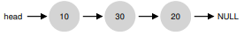

ベストフィット手法はリスト全体を検索し、要求に対応できる最小の空き領域であるため、20が最適であることがわかります。

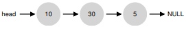

この例のように、最もよく合ったアプローチでよく起こりますが、小さなfreeチャンクが残ります。worst fitアプローチも同様ですが、この例では最大のチャンクが見つかります。

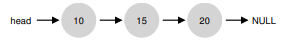

ファーストフィット戦略は、この例では、worst fitと同じことを行い、要求を満たすことができる最初のフリーブロックを見つけます。違いは検索コストです。リスト全体の見方がベストフィットとワーストフィットは違います。ファーストフィットは、適合するものが見つかるまでフリーチャンクを調べるだけで検索コストを削減します。

これらの例は、割り当て方針の表面を触っているだけです。より深い理解のためには、実際の仕事量とより複雑なアロケータの振る舞い(例えば、合体)によるより詳細な分析が必要です。

## 17.4 Other Approaches
上記の基本的なアプローチ以外にも、何らかの方法でメモリ割り当てを改善するための多くの提案されたテクニックとアルゴリズムがあります。

### Segregated Lists
1つの興味深いアプローチは、分離されたリストの使用です。基本的な考え方は単純です。特定のアプリケーションが一般的なサイズの要求を1つ(またはいくつか)持っている場合は、そのサイズのオブジェクトを管理するためだけに別のリストを保持します。他のすべての要求は、一般的なメモリアロケータに転送されます。

そのようなアプローチの利点は明らかです。1つの特定のサイズの要求専用のメモリチャンクを持つことで、断片化の懸念が大幅に減ります。さらに、リストの複雑な検索が不要であるため、割り振り要求および空き要求は、適切なサイズのものであれば、すばやく処理できます。

ちょうどいいアイデアのように、このアプローチはシステムにも新しい複雑さをもたらします。たとえば、一般プールとは異なり、特定のサイズの特別なリクエストを処理するメモリプールにどれだけのメモリを割り当てる必要がありますか？1つの特定のアロケータである、Uber engineerのJeff Bonwick(Solarisカーネル用に設計された)のスラブアロケータは、この問題をかなりうまく処理します[B94]。

具体的には、カーネルが起動すると、頻繁に要求される可能性が高いカーネルオブジェクト(ロック、ファイルシステムのinodeなど)に多数のオブジェクトキャッシュを割り当てます。このようにして、オブジェクトキャッシュは、与えるのサイズの空きリストをそれぞれ分離し、メモリ割り当ておよび空き要求を迅速に提供します。与えられたキャッシュが空き容量が少なくなったときには、より一般的なメモリアロケータから要求された量のスラブ(要求された合計量がページサイズの倍数と問題のオブジェクトです)を要求します。逆に、与えられたのスラブ内のオブジェクトの参照カウントがすべてゼロになると、汎用アロケータは、VMシステムがより多くのメモリを必要とするときによく行われる特別なアロケータからメモリを再要求することができます。

>> ASIDE: GREAT ENGINEERS ARE REALLY GREAT  
>> Jeff Bonwick(ここで言及したスラブアロケータを書いただけでなく、すばらしいファイルシステムの先駆けでもあったZFS)のようなエンジニアは、シリコンバレーの中心です。ほぼすべての偉大な製品や技術の背後には、才能、能力、献身が平均以上の人間(または少人数のグループ)があります。Mark Zuckerberg(Facebookの)は次のように述べています。「自分の役割において例外的な人は、少しだけ良い人ではありません。かなり良い人です。彼らは100倍も優れています。」これは、今日でも、世界の顔を永遠に変える会社(Google、Apple、Facebook)を1〜2人が立ち上げることができる理由です。懸命に働いて、あなたはそのような"100x"人になるかもしれません。それに失敗するかもしれません。しかし、そのような人と働くとあなたは1ヶ月以内に多くを学ぶよりも、1日で多くを学ぶでしょう。

スラブアロケータはまた、リスト上の空きオブジェクトを事前初期化状態に保つことによって、ほとんどの分離リスト手法を超えています。Bonwickは、データ構造の初期化と破壊はコストがかかることを示しています[B94]。しかし、スラブアロケータは、解放されたオブジェクトを初期化された状態の特定のリストに保持することにより、オブジェクトごとの頻繁な初期化および破棄サイクルを回避し、オーバーヘッドを顕著に低減することができます。

### Buddy Allocation
合体はアロケータにとって重要なので、いくつかのアプローチは合体を簡単にすることを目的として設計されています。1つの良い例がバイナリバディアロケータ[K65]にあります。

このようなシステムでは、空きメモリは、概念的には、サイズ2Nの1つの大きな空間と考えます。メモリの要求が行われると、空き領域の探索は、要求を収容するのに十分な大きさのブロックが見つかるまで、空き領域を2つに再帰的に分割します(さらに2つに分割すると、スペースが小さくなります)。この時点で、要求されたブロックがユーザーに返されます。ここでは、7KBブロックの検索で64KBの空き領域を分けた例を示します。

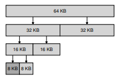

この例では、左端の8KBブロックが割り当てられ(暗い影の灰色で示されるように)、ユーザーに返されます。このスキームでは、2つのサイズのブロックを出力することだけが許可されているため、内部の断片化に悩まされる可能性があることに注意してください。

バディ割り当ての美しさは、そのブロックが解放されたときに何が起こるかで見られます。8KBのブロックを空きリストに戻すとき、アロケータは「バディ」8KBが空いているかどうかをチェックします。そうであれば、2つのブロックを合併して16KBのブロックにする。次に、アロケータは、16KBブロックのバディがまだフリーであるかどうかをチェックします。そうであれば、それらの2つのブロックを結合する。この再帰的な結合プロセスは、ツリー全体を再構築し、空き領域全体を復元するか、バディが使用中であることが判明したときに停止します。

バディ割り当てがうまく機能する理由は、特定のブロックのバディを決定するのが簡単だからです。どうやって調べるでしょうか？上記の空き領域にあるブロックのアドレスについて考えてみましょう。よく注意深く考えてみると、各バディーペアのアドレスは1ビットだけ異なることがわかります。このビットはバディツリーのレベルによって決まります。したがって、バイナリバディ割り当て方式がどのように機能するかという基本的な考え方があります。詳細については、いつものように、Wilson調査[W+95]を参照してください。

### Other Ideas
上記の多くのアプローチの1つの大きな問題は、スケーリングの欠如です。具体的には、リストの検索は非常に遅くなる可能性があります。したがって、高度なアロケータは、これらのコストに対処するために、より複雑なデータ構造を使用し、パフォーマンスを単純化します。例としては、バランスのとれたバイナリツリー、スプレイツリー、または部分的に順序付けられたツリー[W+95]があります。

現代のシステムでは複数のプロセッサがあり、マルチスレッドの仕事量を実行することが多いため(詳細については、同時実行に関する本のセクションで詳しく説明します)、マルチプロセッサベースのシステムでアロケータをうまく動作させるために多くの努力が費やされたことは驚くことではありません。2つの素晴らしい例がBerger et al[B+00]とエバンス[E06]。詳細を確認してください。

これらは、メモリアロケータについて人々が時間をかけて持っている何千ものアイデアのうちの2つに過ぎません。好奇心が強い場合は、あなた自身で読んでください。それに失敗した場合、glibcアロケータがどのように動作するかを読んで[S15]、実際の世界がどのようなものかを理解してください。

## 17.5 Summary
この章では、最も基本的な形のメモリアロケータについて説明しました。そのようなアロケータはどこにでも存在し、あなたが書いたすべてのCプログラムにリンクされているだけでなく、独自のデータ構造のためにメモリを管理している基礎となるOSにも存在します。多くのシステムと同様に、そのようなシステムを構築するには多くのトレードオフがあります。アロケータに与えられる正確な仕事量について知るほど、その仕事量に対してよりうまく動作するよう調整することができます。広範囲の仕事量でうまく動作する、空間効率の良い高速でスケーラブルなアロケータを作成することは、現代のコンピュータシステムにおいて進行中の課題です。

# 参考文献

[B+00] “Hoard: A Scalable Memory Allocator for Multithreaded Applications”  
Emery D. Berger, Kathryn S. McKinley, Robert D. Blumofe, and Paul R. Wilson  
ASPLOS-IX, November 2000  
Berger and company’s excellent allocator for multiprocessor systems. Beyond just being a fun paper, also used in practice!

[B94] “The Slab Allocator: An Object-Caching Kernel Memory Allocator”  
Jeff Bonwick  
USENIX ’94  
A cool paper about how to build an allocator for an operating system kernel, and a great example of how to specialize for particular common object sizes.

[E06] “A Scalable Concurrent malloc(3) Implementation for FreeBSD”  
Jason Evans  
http://people.freebsd.org/˜jasone/jemalloc/bsdcan2006/jemalloc.pdf  
April 2006  
A detailed look at how to build a real modern allocator for use in multiprocessors. The “jemalloc” allocator is in widespread use today, within FreeBSD, NetBSD, Mozilla Firefox, and within Facebook.

[K65] “A Fast Storage Allocator”  
Kenneth C. Knowlton  
Communications of the ACM, Volume 8, Number 10, October 1965  
The common reference for buddy allocation. Random strange fact: Knuth gives credit for the idea not to Knowlton but to Harry Markowitz, a Nobel-prize winning economist. Another strange fact: Knuth communicates all of his emails via a secretary; he doesn’t send email himself, rather he tells his secretary what email to send and then the secretary does the work of emailing. Last Knuth fact: he created TeX, the tool used to typeset this book. It is an amazing piece of software.

[S15] “Understanding glibc malloc”  
Sploitfun  
February, 2015  
https://sploitfun.wordpress.com/2015/02/10/understanding-glibc-malloc/  
A deep dive into how glibc malloc works. Amazingly detailed and a very cool read.  

[W+95] “Dynamic Storage Allocation: A Survey and Critical Review”  
Paul R. Wilson, Mark S. Johnstone, Michael Neely, David Boles  
International Workshop on Memory Management  
Kinross, Scotland, September 1995  
An excellent and far-reaching survey of many facets of memory allocation. Far too much detail to go into in this tiny chapter!

[prev](../16/16.md)|[next](../18/18.md)
