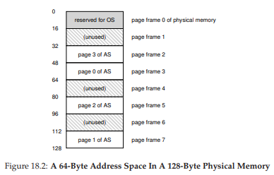
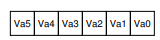
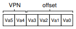
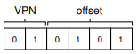
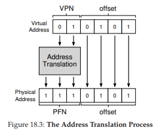
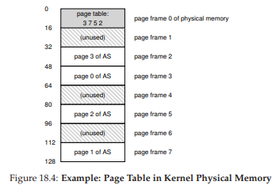
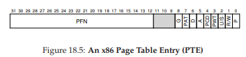
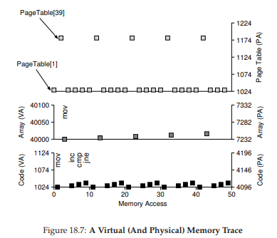

# 18 Paging: Introduction
スペース管理問題を解決するには、オペレーティングシステムが2つのアプローチのうちの1つをとると言われることがあります。第1のアプローチは、仮想メモリのセグメンテーションで見たように、可変サイズの断片に分割することです。残念なことに、この解決策には固有の難点があります。特に、スペースを異なるサイズのチャンクに分割すると、スペース自体が断片化する可能性があり、時間の経過とともに割り当てがより困難になります。

したがって、第2のアプローチを検討する価値があるかもしれません。スペースを固定サイズの断片に切り詰めることです。仮想メモリでは、このアイディアをページングと呼びますが、これは初期の重要なシステムであるAtlas [KE+62、L78]に戻ります。プロセスのアドレス空間をいくつかの可変長論理セグメント(例えば、コード、ヒープ、スタック)に分割するのではなく、固定サイズの単位に分割します。それぞれはページと呼ばれます。これに対応して、物理メモリは、ページ・フレームと呼ばれる固定サイズのスロットの配列と見なします。これらの各フレームには単一の仮想メモリページを含めることができます。

>>THE CRUX:HOW TO VIRTUALIZE MEMORY WITH PAGES  
>>セグメント化の問題を避けるために、どのようにしてページを使ってメモリを仮想化できますか？基本的なテクニックは何ですか？最小限のスペースと時間のオーバーヘッドで、これらのテクニックをどのようにうまく機能させるにはどうすればよいでしょう？

## 18.1 A Simple Example And Overview


このアプローチをより明確にするために、簡単な例をあげて説明しましょう。図18.1は、4つの16バイトページ(仮想ページ0,1,2、および3)を持つ64バイトのサイズの小さなアドレス空間の例を示しています。実際のアドレス空間は、もちろん32ビットであり、したがって4GBのアドレス空間、さらには64ビットも同様です。この本では、小さな例を使ってダイジェストを簡単にすることがよくあります。



図18.2に示すように、物理メモリも固定サイズのスロット(この場合は128バイトの物理メモリを作成しますが、限りなく小さくします)が8ページのフレームで構成されています。図でわかるように、仮想アドレス空間のページは物理メモリ全体の異なる場所に配置されています。このダイアグラムは、物理メモリの一部を使用しているOSも示しています。

ページングには、これまでのアプローチよりも多くの利点があります。おそらく、最も重要な改善は柔軟性です。完全に開発されたページング手法では、システムがアドレス空間をどのように使用するかにかかわらず、アドレス空間の抽象化を効果的にサポートできます。たとえば、ヒープとスタックの成長方向と使用方法については想定しません。

もう1つの利点は、ページングが提供するfree space managementの単純さです。たとえば、OSが8ページの物理メモリに小さな64バイトのアドレス空間を配置したい場合、OSは単に4つの空きページを見つけます。おそらくOSはこのためのすべての空きページのフリーリストを保持しており、このリストから最初の4つの空きページだけを取得します。この例では、OSは、物理フレーム3のアドレス空間(AS)の仮想ページ0、物理フレーム7のASの仮想ページ1、フレーム5のページ2、フレーム2のページ3を配置しています。ページフレーム1、4、および6は現在フリーです。

アドレス空間の各仮想ページが物理メモリに配置される場所を記録するために、オペレーティングシステムは通常、ページテーブルと呼ばれるプロセス単位のデータ構造を保持します。ページテーブルの主な役割は、アドレス空間の各仮想ページのアドレス変換を格納することで、各ページが物理メモリのどこにあるのかを知ることができます。(仮想ページ0→物理フレーム3)、(VP1→PF7)、(VP2→PF5)、(VP3→PF2)の4つのエントリがページテーブルにあります。

このページテーブルはプロセスごとのデータ構造であることを覚えておくことが重要です(ほとんどのページテーブル構造についてはプロセスごとの構造ですが、ここで触れる例外は逆ページテーブルです)。上記の例で別のプロセスを実行する場合、仮想ページは明らかに別の物理ページにマップされるため(別のページテーブルを管理する必要があります)

さて、アドレス変換の例を実行するのに十分なことは分かっています。その小さなアドレススペース(64バイト)を持つプロセスがメモリアクセスを実行しているとします。
```
movl <virtual address>, %eax
```
具体的には、アドレス\<virtual address\>からレジスタeaxへのデータの明示的なロードに注意を払いましょう(したがって、先に起こっていなければならない命令フェッチを無視します)。

プロセスが生成したこの仮想アドレスを変換するには、仮想ページ番号(VPN)とページ内のオフセットの2つのコンポーネントに分割する必要があります。この例では、プロセスの仮想アドレス空間が64バイトであるため、仮想アドレス(2^6 = 64)に合計6ビット必要です。したがって、仮想アドレスは次のように概念化できます。



この図において、Va5は仮想アドレスの最上位ビットであり、Va0は最下位ビットです。ページサイズ(16バイト)を知っているので、仮想アドレスをさらに次のように分割することができます。



ページサイズは、64バイトのアドレス空間では16バイトごとです。したがって、4ページを選択できる必要があり、アドレスの上位2ビットはそれを選択するためにあります。したがって、2ビットの仮想ページ番号(VPN)があります。残りのビットは、ページのどのバイトにいるのかを示します。この場合は4ビットです。これをオフセットと呼びます。

プロセスが仮想アドレスを生成する場合、OSとハードウェアを結合して意味のある物理アドレスに変換する必要があります。たとえば、上記の負荷が仮想アドレス21であると仮定します。
```
movl 21, %eax
```
「21」をバイナリ形式にすると、「010101」が得られます。したがって、この仮想アドレスを調べて、仮想ページ番号(VPN)とオフセットに分解する方法を確認できます。



したがって、仮想アドレス「21」は、仮想ページ「01」(または「1」)の5番目(「0101」番目)のバイト上にある。仮想ページ番号を使用して、ページテーブルをインデックス化し、仮想ページ1がどの物理フレーム内に存在するかを見つけることができます。上記のページテーブルでは、物理フレーム番号(PFN)(物理ページ番号またはPPNとも呼ばれます)は7(バイナリ111)です。したがって、VPNをPFNに置き換えてこの仮想アドレスを変換し、物理メモリにロードします。(図18.3)



オフセットは、ページ内のどのバイトを必要としているかを示すだけなので、オフセットは同じである(つまり、変換されない)ことに注意してください。私たちの最終的な物理アドレスは1110101(10進数では117)であり、正確に必要なデータをロードして取得します。(図18.2)

この基本的な概要を念頭に置いて、ページングに関するいくつかの基本的な質問をすることができます。たとえば、これらのページテーブルはどこに格納されていますか？ページテーブルの典型的な内容とそのテーブルの大きさは何ですか？ページングはシステムをかなり遅くしますか？これらの疑問やその他の疑問に答える質問は、少なくとも部分的には以下の本文で回答しています。さぁ、読んでいきましょう！

## 18.2 Where Are Page Tables Stored?
ページ・テーブルは、以前に議論した小さなセグメント・テーブルまたはベース/境界ペアよりもはるかに大きくなることがあります。たとえば、典型的な32ビットのアドレス空間で、4KBのページがあるとします。この仮想アドレスは、20ビットのVPNと12ビットのオフセットに分割されます(1KBのページサイズには10ビットが必要で、4KBになるにはさらに2つ追加する必要があります)。

20ビットのVPNは、各プロセスでOSが管理しなければならない2^20の変換があることを示しています(これはおよそ100万です)。実際の変換に加えてページテーブルエントリ(PTE)あたり4バイトが必要であれば、各ページテーブルに必要なメモリは4MBになります。それはかなり大きいです。100個のプロセスが実行されているとしましょう。つまり、これらのアドレス変換だけで400 MBのメモリが必要です。機械のギガバイトの記憶がある現代でさえ、変換のためだけに大きな塊を使用するのは少しおかしいですね。そのようなページテーブルが64ビットのアドレス空間にどれだけ大きなものになるかについても考えたくもないですね。

ページテーブルは非常に大きいので、現在実行中のプロセスのページテーブルを格納するための特別なオンチップハードウェアをMMUに保持しません。代わりに、各プロセスのページテーブルをどこかのメモリに格納します。ページテーブルがOSが管理する物理メモリに存在すると仮定してみましょう。後でわかるように、OSのメモリそのものを仮想化することができるので、ページテーブルをOSの仮想メモリに格納することができます(そしてディスクにスワップすることもできます)。しかし、これは今のところ混乱するでしょう。図18.4に、OSメモリ内のページテーブルの写真を示します。そこには小さな変換がありますか？



## 18.3 What’s Actually In The Page Table?
ページテーブルの構成について少し話をしましょう。ページテーブルは、仮想アドレス(または実際には仮想ページ番号)を物理アドレス(物理フレーム番号)にマッピングするために使用される単なるデータ構造です。したがって、どのようなデータ構造でも機能します。最も簡単な形式は線形ページテーブルと呼ばれ、単なる配列です。OSは配列を仮想ページ番号(VPN)で索引付けし、その索引でページ表エントリ(PTE)を検索して、必要な物理フレーム番号(PFN)を見つけます。今のところ、この単純な線形構造を仮定します。後の章では、より高度なデータ構造を使用して、ページングに関するいくつかの問題を解決していきます。

各PTEの内容については、いくつかのレベルで理解する価値のあるさまざまなビットがあります。有効なビットは、特定の変換が有効かどうかを示すために一般的です。たとえば、プログラムの実行が開始されると、コードとヒープ、そのアドレス空間の一方の端にスタック、その他があります。その間の未使用スペースはすべて無効とマークされ、プロセスがこのようなメモリにアクセスしようとすると、OSにトラップが生成され、プロセスが終了する可能性があります。従って、有効ビットは、未割り当てアドレス空間をサポートするために重要です。単にアドレス空間内の未使用ページをすべて無効にするだけで、それらのページに物理フレームを割り当てる必要がなくなり、メモリを大幅に節約することができます。

また、ページの読み込み、書き込み、実行が可能かどうかを示す保護ビットがあります。ここでも、これらのビットによって許可されていない方法でページにアクセスすると、OSにトラップが生成されます。

重要ないくつかのビットがありますが、今はあまり話しません。presentビットは、このページが物理メモリ内にあるかディスク上にあるか(すなわち、スワップアウトされたか)を示します。物理メモリよりも大きいアドレス空間をサポートするために、アドレス空間の一部をディスクにスワップする方法を調べるときに必要になります。スワップは、ほとんど使用されないページをディスクに移動することによって、OSが物理メモリを解放することができます。dirtyビットも一般的であり、ページがメモリに格納されてから変更されたかどうかを示します。

referenceビット(a.k.aアクセスビット)は、ページがアクセスされたかどうかを追跡するために使用されることがあり、どのページが頻繁にアクセスされて必要であり、メモリに保持されるべきかを決定するのに有用です。このような知識は、ページの置換時に重要です。トピックについては、以降の章で詳しく説明します。



図18.5に、x86アーキテクチャ[I09]のページテーブルエントリの例を示します。presentビット(P)、このページに書き込みが許可されているかどうかを判定するread/writeビット(R/W)、ユーザモードプロセスがページにアクセスできるかどうかを決定するuser/supervisorビット(U/S)、これらのページのハードウェアキャッシングがどのように機能するかを決定する数ビット(PWT、PCD、PAT、およびG)、accessedビット(A)、dirtyビット(D)、最後に、ページ・フレーム番号(PFN)を含みます。

x86ページングのサポートの詳細については、インテルアーキテクチャマニュアル[I09]を参照してください。しかし、あらかじめ注意してください。これらのマニュアルを読むことは、かなり有益ですが(もちろん、OSでそのようなページテーブルを使用するコードを書く人にとっては必要です)、最初は挑戦的かもしれません。ちょっとした忍耐と多くの好奇心が必要です。

## 18.4 Paging: Also Too Slow
メモリ内のページテーブルでは、大きすぎる可能性があることを既に認識しています。それが判明したので、落ち着いてページテーブルを考えることができます。例題として簡単なものを考えていきましょう：
```
movl 21, %eax
```
繰り返しますが、アドレス21への明示的な参照を調べて、命令フェッチについて心配することはありません。この例では、ハードウェアが変換を実行すると仮定します。必要なデータをフェッチするために、システムは最初に仮想アドレス(21)を正しい物理アドレス(117)に変換しなければいけません。従って、アドレス117からデータをフェッチする前に、システムはまず、プロセスのページテーブルから適切なページテーブルエントリをフェッチし、変換を実行し、次に物理メモリからデータをロードしなければいけません。

そのためには、ハードウェアはページテーブルが現在実行中のプロセスのどこにあるのかを知る必要があります。ここでは、単一のページテーブルベースレジスタに、ページテーブルの開始位置の物理アドレスが含まれていると仮定します。目的のページテーブルエントリー(PTE)の場所を見つけるために、ハードウェアは次の機能を実行します。

```c
VPN = (VirtualAddress & VPN_MASK) >> SHIFT
PTEAddr = PageTableBaseRegister + (VPN * sizeof(PTE))
```
この例では、VPN Maskは0x30(16進数、または110000)に設定され、フル仮想アドレスからVPNビットが選択されます。SHIFTは4(オフセットのビット数)に設定されているため、正しい整数仮想ページ番号を形成するためにVPNビットを下に移動します。たとえば、仮想アドレス21(010101)で、マスクするとこの値は010000になります。それをシフトさせると01になります。それが仮想ページ1になります。次にこの値を、ページテーブルベースレジスタが指し示すPTEの配列へのインデックスとして使用します。

この物理アドレスがわかれば、ハードウェアはメモリからPTEを取り出し、PFNを抽出し、仮想アドレスからのオフセットと連結して必要な物理アドレスを形成することができます。具体的には、SHIFTによって左シフトされたPFNを考えることができます。次に、オフセットとORを取って最終アドレスを次のようにします。
```c
offset = VirtualAddress & OFFSET_MASK
PhysAddr = (PFN << SHIFT) | offset
```

```c
 // Extract the VPN from the virtual address
 VPN = (VirtualAddress & VPN_MASK) >> SHIFT

 // Form the address of the page-table entry (PTE)
 PTEAddr = PTBR + (VPN * sizeof(PTE))

 // Fetch the PTE
 PTE = AccessMemory(PTEAddr)

 // Check if process can access the page
 if (PTE.Valid == False)
 RaiseException(SEGMENTATION_FAULT)
 else if (CanAccess(PTE.ProtectBits) == False)
 RaiseException(PROTECTION_FAULT)
 else
 // Access is OK: form physical address and fetch it
 offset = VirtualAddress & OFFSET_MASK
 PhysAddr = (PTE.PFN << PFN_SHIFT) | offset
 Register = AccessMemory(PhysAddr)

 // Figure 18.6: Accessing Memory With Paging
```
最後に、ハードウェアはメモリから必要なデータを取り出し、それをレジスタeaxに入れることができます。プログラムはメモリから値をロードするのに成功しました！

要約すると、各メモリ参照で何が起きるかについての初期プロトコルを説明します。図18.6に基本的なアプローチを示します。すべてのメモリ参照(命令フェッチまたは明示的なロードまたはストア)にかかわらず、ページングでは、最初にページテーブルから変換をフェッチするために1つの余分なメモリ参照を実行する必要があります。それはたくさんの仕事です！余分なメモリ参照はコストがかかり、この場合、プロセスが2倍以上遅くなる可能性があります。

そして今、解決しなければならない2つの本当の問題があります。ハードウェアとソフトウェアの両方を慎重に設計しなければ、ページテーブルはシステムの動作が遅くなり過ぎるだけでなく、あまりにも多くのメモリを占有します。メモリ仮想化ニーズのための一見すばらしい解決策ですが、これらの2つの重大な問題をまず解決する必要があります。

## 18.5 A Memory Trace
終了する前に、単純なメモリアクセスの例をトレースして、ページングを使用したときに発生するすべてのメモリアクセスを実証します。興味のあるコードスニペット(C言語のarray.cというファイル)は次のようになります。
```c
int array[1000];
...
for (i = 0; i < 1000; i++)
array[i] = 0;
```

>> ASIDE: DATA STRUCTURE — THE PAGE TABLE  
>> 現代のOSのメモリ管理サブシステムにおける最も重要なデータ構造の1つは、ページテーブルです。一般に、ページテーブルは仮想アドレスから物理アドレスへの変換を格納しているので、アドレス空間の各ページが実際に物理メモリ内に存在する場所をシステムに知らせることができます。各アドレス空間はそのような変換を必要とするため、一般に、システムにはプロセスごとに1つのページテーブルがあります。ページテーブルの正確な構造は、ハードウェア(古いシステム)によって決定されるか、またはOS(現代システム)によってより柔軟に管理されます。

We compile array.c and run it with the following commands:
```
prompt> gcc -o array array.c -Wall -O
prompt> ./array
```
もちろん、このコードスニペット(単純に配列を初期化する)にアクセスするメモリが本当に理解できるようにするには、さらにいくつかのことを知っておく必要があります。まず、結果のバイナリを(Linuxではobjdump、Macではotoolを使用して)逆アセンブルして、どのアセンブリ命令を使ってループ内の配列を初期化するかを調べる必要があります。結果のアセンブリコードは次のとおりです。

```
1024 movl $0x0,(%edi,%eax,4)
1028 incl %eax
1032 cmpl $0x03e8,%eax
1036 jne 0x1024
```
コードは、あなたが少しx86を知っていれば、実際にはかなり理解しやすいです。最初の命令は、値のゼロ(\$0x0として表示)を配列の場所の仮想メモリアドレスに移動します。このアドレスは、％ediに％eaxを加算して％eaxに4を掛け合わせて計算します。したがって、％ediは配列のベースアドレスを保持しますが、％eaxは配列index(i)を保持します。配列は4バイトの整数の配列であるため、4を掛けます。

2番目の命令は、％eaxに保持されている配列インデックスをインクリメントし、3番目の命令は、そのレジスタの内容を16進値0x03e8または1000に比較します。比較によって、2つの値が等しくないのであれば、4番目の命令はループの先頭にジャンプします。

この命令シーケンスがどのようなメモリアクセスを行うか(仮想レベルと物理レベルの両方で)を理解するためには、仮想メモリ内のどこにコードスニペットと配列があるのか​​とページテーブルの内容と場所を知る必要があります。

この例では、サイズが64KB(非現実的に小さい)の仮想アドレス空間を想定しています。また、1KBのページサイズを想定しています。

ここで知る必要があるのは、ページテーブルの内容とその物理メモリ内の場所です。線形(配列ベース)ページテーブルを持ち、それが物理アドレス1KB(1024)にあると仮定しましょう。その内容に関しては、この例のためにマップしたことを心配する必要のある仮想ページがほんの少しあります。まず、コードが存在する仮想ページがあります。ページサイズは1KBなので、仮想アドレス1024は仮想アドレス空間の2番目のページにあります(VPN = 1、最初のページはVPN = 1)。この仮想ページが物理フレーム4(VPN 1→PFN 4)にマップされているとします。

次に、配列自体があります。そのサイズは4000バイト(1000個の整数)で、仮想アドレス40000〜44000(最後のバイトは含まない)に存在すると仮定します。この小数点範囲の仮想ページは、VPN = 39 ... VPN = 42です。したがって、これらのページのマッピングが必要です。例(VPN 39→PFN 7)、(VPN 40→PFN 8)、(VPN 41→PFN 9)、(VPN 42→PFN 10)の仮想 - 物理マッピングを想定してみましょう。

これで、プログラムのメモリ参照をトレースする準備ができました。実行されると、各命令フェッチは2つのメモリ参照を生成します。1つはページテーブルに命令が存在する物理フレームを見つけるためのもの、もう1つは処理のためにCPUにフェッチする命令です。さらに、1つの明示的なメモリ参照がmov命令の形式で存在します。これは最初に別のページテーブルアクセスを追加し(配列の仮想アドレスを正しい物理アドレスに変換します)、次に配列アクセス自体を追加します。



最初の5回のループ反復のプロセス全体が、図18.7に示されています。一番下のグラフはy軸の命令メモリ参照を黒で示しています(仮想アドレスは左に、実際の物理アドレスは右にあります)。真ん中のグラフは、暗い灰色の配列アクセスを示しています(再び左上の仮想と右の物理を示します)最後に、一番上のグラフは、ページテーブルのメモリアクセスを明るい灰色で示しています(この例のページテーブルは物理メモリに存在します)トレース全体のx軸は、ループの最初の5回の反復でのメモリアクセスを示します。ループ当たり10回のメモリアクセスがあります。これには、4回の命令フェッチ、1回の明示的なメモリ更新、これらの4回のフェッチと1回の明示的な更新を変換する5回のページテーブルアクセスが含まれます。

この視覚化に現れるパターンを理解できるかどうかを確認してください。特に、ループが最初の5回の反復を超えて実行されると、何が変わるでしょうか？どの新しいメモリ位置にアクセスするのでしょうか？

これはちょうど例のほんの一例です(Cコードのほんの数行だけです)。しかし、実際のアプリケーションの実際のメモリ動作を理解することの複雑さをすでに感じ取っているかもしれません。これ以上はメカニズムを複雑にするだけなので、ここまで終わりです。ごめんなさい！

## 18.6 Summary
私たちは、メモリを仮想化するという課題に対する解決策として、ページングの概念を導入しました。ページングには、以前のアプローチ(セグメンテーションなど)に比べて多くの利点があります。第1に、ページング(設計による)はメモリを固定サイズの単位に分割するため、外部の断片化につながることはありません。第2に、これは非常に柔軟であり、仮想アドレス空間の未使用部分を使用可能、使用不可の両方に対応してくれます。  
ただし、ページングのサポートを気にせずに実装すると、マシンが遅くなり(ページテーブルにアクセスするために余分なメモリアクセスが増えます)、メモリが無駄になります(有用なアプリケーションデータではなくページテーブルでメモリがいっぱいになります)。私たちは、ページングシステムを思いつくのはちょっと難しいと思うでしょう。次の2つの章では、幸いにも、マシンを速くする方法、メモリの無駄をなくす方法を教えてくれるでしょう。

# 参考文献

[KE+62] “One-level Storage System”  
T. Kilburn, and D.B.G. Edwards and M.J. Lanigan and F.H. Sumner  
IRE Trans. EC-11, 2 (1962), pp. 223-235  
(Reprinted in Bell and Newell, “Computer Structures: Readings and Examples” McGraw-Hill, New York, 1971).
The Atlas pioneered the idea of dividing memory into fixed-sized pages and in many senses was an early form of the memory-management ideas we see in modern computer systems.

[I09] “Intel 64 and IA-32 Architectures Software Developer’s Manuals”  
Intel, 2009  
Available: http://www.intel.com/products/processor/manuals  
In particular, pay attention to “Volume 3A: System Programming Guide Part 1” and “Volume 3B: System Programming Guide Part 2”

[L78] “The Manchester Mark I and atlas: a historical perspective”  
S. H. Lavington  
Communications of the ACM archive  
Volume 21, Issue 1 (January 1978), pp. 4-12  
Special issue on computer architecture  
This paper is a great retrospective of some of the history of the development of some important computer systems. As we sometimes forget in the US, many of these new ideas came from overseas.