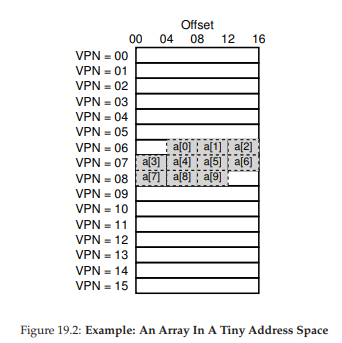
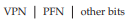
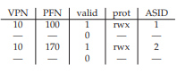
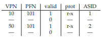

# 19 Paging: Faster Translations (TLBs)
仮想メモリをサポートするためのコアメカニズムとしてページングを使用すると、パフォーマンスのオーバーヘッドが発生する可能性があります。アドレス空間を小さい固定サイズの単位(すなわち、ページ)にすることにより、ページングは大量のマッピング情報を必要とします。そのマッピング情報は一般的に物理メモリに格納されるため、ページングは論理的にはプログラムによって生成された各仮想アドレスに対して余分なメモリルックアップを必要とします。命令のフェッチや明示的なロードやストアの前に、変換情報のためのメモリへの移動は非常に遅いです。

>> THE CRUX:HOW TO SPEED UP ADDRESS TRANSLATION  
>> どのようにしてアドレス変換を高速化し、ページングに必要な余分なメモリ参照を避けることができますか？どんなハードウェアサポートが必要ですか？どのようなOSの関与が必要ですか？

物事を速くしたいとき、OSは通常何らかの助けを必要とします。また、ハードウェアから助けを得ていることがよくあります。アドレス変換を高速化するために、(歴史的な理由で[CP78]と呼ばれる)変換ルックアサイドバッファ、すなわちTLB [CG68、C95]を追加します。TLBは、チップのメモリ管理ユニット(MMU)の一部であり、一般的な仮想から物理へのアドレス変換のハードウェアキャッシュです。したがって、より良い名前はアドレス変換キャッシュになります。各仮想メモリ参照時に、ハードウェアは最初にTLBをチェックして、その中に所望の変換が保持されているかどうかを調べます。そうであれば、ページテーブル(すべての変換が含まれています)を参照することなく、変換が(迅速に)実行されます。パフォーマンスに大きな影響を与えるため、実際の意味でのTLBは仮想メモリを可能にします[C95]。

## 19.1 TLB Basic Algorithm


図19.1は、単純な線形ページテーブル(すなわち、ページテーブルが配列)とハードウェア管理TLBです。ハードウェアがページ変換の多くを処理すると仮定して、ハードウェアが仮想アドレス変換を処理する方法の概略を示しています。テーブルのアクセスについては、後で詳しく説明します。

ハードウェアが従うアルゴリズムは次のとおりです。まず、仮想アドレス(図19.1の1行目)から仮想ページ番号(VPN)を抽出し、TLBがこのVPN(2行目)の変換を保持しているかどうかを確認します。もしそうなら、私たちはTLBヒットを持っています。これは、TLBが変換を保持していることを意味します。ここで、関連するTLBエントリからページフレーム番号(PFN)を抽出し、元の仮想アドレスからのオフセットに連結し、望んだ物理アドレス(PA)を形成し、メモリを保護することができます(5-7行目)チェックは失敗しません(4行目)。

CPUがTLB(TLBミス)で変換を見つけられない場合は、さらに処理する必要があります。この例では、ハードウェアがページテーブルにアクセスして変換を検索し(11〜12行目)、プロセスによって生成された仮想メモリ参照が有効でアクセス可能であると仮定すると(13行目、15行目)TLBの更新(18行目)。これらの一連のアクションは、主にページテーブルにアクセスするために必要な余分なメモリ参照が原因でコストがかかります(12行目)。最後に、TLBが更新されると、ハードウェアは命令を再試行します。今回はTLBに変換があり、メモリ参照は素早く処理されます。

TLBは、すべてのキャッシュと同様に、一般的なケースでは、キャッシュ内に変換がある(すなわち、ヒットしている)という前提で構築されています。TLBが処理コアの近くにあり、非常に高速になるように設計されているため、オーバーヘッドはほとんどありません。ミスが発生すると、ページングのコストが高くなります。変換を見つけるためにページテーブルにアクセスしなければならず、余分なメモリ参照(またはより複雑なページテーブルを含む)が結果として生じます。これが頻繁に発生する場合、プログラムは著しく遅く実行される可能性があります。ほとんどのCPU命令と比較してメモリアクセスは非常にコストがかかり、TLBミスはより多くのメモリアクセスにつながります。したがって、可能な限りTLBミスを避けることが重要です。

## 19.2 Example: Accessing An Array
TLBの動作を明確にするために、単純な仮想アドレストレースを調べて、TLBがどのように性能を向上させるかを見てみましょう。この例では、仮想アドレス100から始まる、メモリ内に10個の4バイト整数の配列があるとしましょう。さらに、16バイトページを持つ小さな8ビット仮想アドレス空間があるとします。したがって、仮想アドレスは4ビットのVPN(16の仮想ページがあります)と4ビットのオフセット(各ページに16バイトあります)に分割されます。



図19.2に、16バイトページにレイアウトされた配列を示します。ご覧のとおり、配列の最初のエントリ(a [0])は(VPN = 06、offset = 04)から始まります。そのページには3つの4バイト整数しか収まりません。配列は次のページ(VPN = 07)に進み、次の4つのエントリ(a [3] ... a [6])が見つかります。最後に、10エントリ配列(a [7] ... a [9])の最後の3つのエントリは、アドレス空間の次のページ(VPN = 08)に配置されます。次に、各配列要素にアクセスする単純なループを考えてみましょう。C言語では次のようになります。

```c
int sum = 0;
  for (i = 0; i < 10; i++) {
    sum += a[i];
}
```
簡単にするために、私たちは、ループに対して生成される唯一のメモリアクセスが配列に対するものであると推測します(変数iとsum、および命令自体は無視します)。最初の配列要素(a [0])がアクセスされると、CPUは仮想アドレス100へのロードを認識します。ハードウェアはこの(VPN = 06)からVPNを抽出し、それを使用してTLBの有効な変換をチェックします。プログラムが配列に初めてアクセスすると仮定すると、結果はTLBミスになります。

次のアクセスは[1]へのアクセスです。TLBヒット！配列の2番目の要素は最初の要素の隣にいるため、同じページに存在します。配列の最初の要素にアクセスするときにすでにこのページにアクセスしているので、変換はすでにTLBにロードされています。[2]へのアクセスは、[0]と[1]と同じページにも存在するため、同様の成功(別のヒット)に遭遇します。

残念ながら、プログラムが[3]にアクセスすると、別のTLBミスが発生します。しかし、TLB内のすべてのエントリがメモリ内の同じページに存在するため、次のエントリ(a [4] ... a [6])が再びヒットします。

最後に[7]にアクセスすると、最後のTLBミスが1つ発生します。ハードウェアは、再び、物理メモリ内のこの仮想ページの位置を把握するためにページテーブルを参照し、それに応じてTLBを更新します。TLB内のすべてのエントリがメモリ内の同じページに存在するため、最後の2回のアクセス(a [8]とa [9])には、再びヒットします。

ヒット、ヒット、ミス、ヒット、ヒット、ヒット、ミス、ヒット、ヒット、配列への10回のアクセス中にTLBアクティビティを要約しましょう。したがって、ヒット数をアクセス総数で割ったTLBヒット率は70％です。これはあまり高くありませんが(確かに、ヒット率は100％に近づいています)、これは非ゼロです。これは驚くかもしれません。プログラムが配列にアクセスするのはこれが初めてですが、TLBは空間的局所性のためにパフォーマンスを向上させます。配列の要素は、ページに密接にパックされている(すなわち、それらは互いに空間的に近い)ので、ページ上の要素への最初のアクセスのみがTLBミスをします。

この例では、ページサイズが果たす役割にも注意してください。ページ・サイズが単に2倍の大きさ(16バイトではなく32バイト)であれば、配列アクセスにはより少ないミスしか生じません。一般的なページサイズは4KBに似ていますので、これらのタイプの密な配列ベースのアクセスは優れたTLBパフォーマンスを実現し、1ページのアクセス当たり1回のミスに遭遇します。

TLBのパフォーマンスに関する最後の1つは、このループが完了してすぐにプログラムが再び配列にアクセスすると、必要な変換をキャッシュするのに十分なTLBがあると仮定すると、ヒット、ヒット、ヒット、ヒット、ヒット、ヒット、ヒット、ヒットになります。この場合、時間的局所性、すなわち時間的にメモリ項目の迅速な再参照のためにTLBヒット率が高くなります。キャッシュと同様、TLBはプログラムのプロパティである成功のために空間的(キャッシュの大きさ)および時間的局所性(再びアクセスされる可能性)に依存しています。関心のあるプログラムがそのような局所性(および多くのプログラム)を示す場合、TLBのヒット率は高くなる可能性が高いです。

>> TIP: USE CACHING WHEN POSSIBLE  
>> キャッシングは、コンピュータシステムで最も基本的なパフォーマンス手法の1つです。それは、「共通の高速化」[HP06]を何度も繰り返すことです。ハードウェアキャッシュの背後にあるアイデアは、命令とデータ参照における局所性を利用することです。通常、時間的局所性と空間的局所性の2つのタイプがあります。時間的局所性を考慮すると、最近アクセスされた命令またはデータ項目は、将来すぐに再アクセスされる可能性が高いという考えがあります。ループ変数や命令をループ内で考えてみましょう。それらは時間の経過と共に繰り返しアクセスされます。空間的局所性では、プログラムがアドレスxのメモリにアクセスすると、xの近くのメモリにすぐにアクセスする可能性があるという考えがあります。1つの要素にアクセスしてから次の要素にアクセスする何らかの配列をストリーミングすることを想像してください。もちろん、これらの特性はプログラムの正確な性質に依存するため、厳しい法則ではなく、より大雑把なルールです。  
ハードウェアキャッシュは、命令、データ、アドレス変換(TLBのように)を問わず、メモリのコピーを小型で高速なオンチップメモリ​​に保存することでローカリティを利用します。要求を満たすために(遅い)メモリに移動する代わりに、プロセッサは、まず、近くのコピーがキャッシュ内に存在するかどうかをチェックすることができます。そうであれば、プロセッサは迅速に(すなわち、数CPUサイクルで)アクセスし、メモリにアクセスするのに費やす時間(多くのナノ秒)を費やすことを回避することができます。  
あなたは疑問に思うかもしれません。(TLBのような)キャッシュがすばらしいのであれば、もっと大きなキャッシュを作り、その中にすべてのデータを保存してみてください。残念ながら、これは物理学のようなより基本的な法則に踏み込んでいます。高速キャッシュが必要な場合は、光速や他の物理的な制約などの問題が関連するため、キャッシュを小さくする必要があります。定義どおりの大規模なキャッシュはすべて遅いため、目的が破綻してしまいます。したがって、私たちは小さくて高速なキャッシュが必要なのです。残っている問題は、パフォーマンスを向上させるためにそれらを最適に使用する方法です。

## 19.3 Who Handles The TLB Miss?
私たちは答えなければならない1つの質問があります。誰がTLBミスを処理するのですか？ハードウェアまたはソフトウェア(OS)の2つの答えが可能です。昔、ハードウェアには複雑な命令セット(複雑な命令セットのコンピュータではCISCと呼ばれることもあります)がありました。ハードウェアを構築した人々は、OSの人たちをあまり信頼しませんでした。したがって、ハードウェアはTLBミスを完全に処理します。これを行うには、ハードウェアはページテーブルがメモリ内のどこにあるのかを(図19.1の11行目で使用されているページテーブルベースレジスタを使用して)正確に知る必要があります。欠落していると、ハードウェアはページテーブルを「歩いて」、正しいページテーブルエントリを見つけて、必要な変換を抽出し、TLBを更新し、命令を再試行します。ハードウェア管理TLBを持つ「古い」アーキテクチャの例は、固定マルチレベルページテーブルを使用するIntel x86アーキテクチャです(詳細は次の章を参照してください)。現在のページテーブルはCR3レジスタ[I0​​9]によって指示されます。
```c
 VPN = (VirtualAddress & VPN_MASK) >> SHIFT
 (Success, TlbEntry) = TLB_Lookup(VPN)
 if (Success == True) // TLB Hit
 if (CanAccess(TlbEntry.ProtectBits) == True)
 Offset = VirtualAddress & OFFSET_MASK
 PhysAddr = (TlbEntry.PFN << SHIFT) | Offset
 Register = AccessMemory(PhysAddr)
 else
 RaiseException(PROTECTION_FAULT)
 else // TLB Miss
 RaiseException(TLB_MISS)
// Figure 19.3: TLB Control Flow Algorithm (OS Handled)
```
より近代的なアーキテクチャ(例えば、MIPS R10k [H93]またはSunのSPARC v9 [WG00]、RISCまたは縮小命令セットコンピュータ)は、ソフトウェア管理TLBとして知られているものを持っています。TLBミスでは、ハードウェアは単に現在の命令ストリームを一時停止し、特権レベルをカーネルモードに持ち上げ、トラップハンドラにジャンプする例外(図19.3の11行目)を生成するだけです。ご想像のとおり、このトラップハンドラは、TLBミスを処理する明白な目的で書かれたOS内のコードです。実行されると、コードはページテーブルの変換を検索し、特殊な"特権"命令を使用してTLBを更新し、トラップから戻ります。この時点で、ハードウェアは命令をリトライします(結果としてTLBヒットとなります)。

重要な詳細をいくつか議論しましょう。まず、return from trap命令は、システムコールを処理する前に見たトラップからの復帰とは少し異なる必要があります。後者のソフトウェアの場合、プロシージャコールからのリターンがプロシージャへのコールの直後の命令に戻るのと同様に、return from trapはOSへのトラップ後の命令で実行を再開する必要があります。  
前者のハードウェアの場合、TLBミスハンドリングトラップから復帰するとき、ハードウェアはトラップを引き起こした命令で実行を再開しなければいけません。この再試行により、命令が再び実行され、今回はTLBヒットとなります。したがって、トラップや例外がどのように発生したかによって、ハードウェアはOSにトラップするときに別のPC(プログラムカウンタ)を保存しなければならず、その時間が到来したときに適切に再開する必要があります。

第2に、TLBミス・ハンドリング・コードを実行するとき、OSは無限のTLBミス・チェインが発生しないように注意する必要があります。その問題に対しては多くの解決策が存在します。たとえば、TLBミスハンドラを物理メモリに保存しておくことができます(アドレス変換が行われていない場合)。または、ハンドラコード自体を永続的に有効な変換のTLBにエントリとして予約します。これらの有線変換は常にTLBでヒットします。

ソフトウェア管理アプローチの主な利点は柔軟性です。OSは、ハードウェアの変更を必要とせずに、ページテーブルを実装したい任意のデータ構造を使用できます。別の利点は単純さです。TLBの制御フロー(図19.3の11行目と、図19.1の11行目とは対照的に)で見られるように、ハードウェアはミスで多くを行う必要はありません。例外が発生し、OSのTLBミスハンドラが残りの処理を行います。

>> ASIDE: RISC VS. CISC  
>> 1980年代には、コンピュータアーキテクチャのコミュニティで大きな戦いが起こりました。一方は複雑な命令セットコンピューティングのためのCISCでした。もう一方の側では、RISCがReduced Instruction Set Computing [PS81]でした。RISC側はBerkeleyのDavid PattersonとStanfordのJohn Hennessy(有名な著書[HP06]の共著者でもある)が主導していましたが、後にJohn CockeはRISCに関する彼の初期の研究でTuring賞を受賞しました[CM00]。CISC命令セットは多くの命令を持つ傾向があり、各命令は比較的強力です。たとえば、2つのポインタと長さを取り、ソースからデスティネーションにバイトをコピーする文字列コピーが表示されます。CISCの背後にある考え方は、命令はハイレベルのプリミティブでなければならず、アセンブリ言語そのものを使いやすくし、コードをよりコンパクトにする必要があるということでした。  
RISC命令セットはまったく逆です。RISCの背後にある重要なことは、命令セットは実際にコンパイラターゲットであり、実際にはすべてのコンパイラが高性能コードを生成するために使用できる単純なプリミティブであることです。したがって、RISCの主張者は、可能な限りハードウェア(特にマイクロコード)から多くのものを取り除き、単純なもの、均一で速いものを残しておきたいと主張しました。  
初期段階では、RISCチップは著しく高速であったため、大きなインパクトを与えました[BC91]。多くの論文が書かれました。いくつかの企業が形成された(例えば、MIPSおよびSun)。しかし、インテルなどのCISCメーカは、複雑な命令をマイクロ命令に変換したパイプラインステージを早期に追加するなど、RISCのような処理が可能な、多くのRISC技術をプロセッサのコアに組み込んでいました。これらのイノベーションに加え、各チップ上のトランジスタ数の増加により、CISCは競争力を維持することができました。最終的な結果は、議論が崩れ落ちたことです。今日、両方のタイプのプロセッサを高速に動作させることができます。  

## 19.4 TLB Contents: What’s In There?
ハードウェアTLBの内容をより詳しく見てみましょう。一般的なTLBは、32,64、または128のエントリを持ち、fully associative(完全連想型)と呼ばれるものです。基本的には、TLB内の任意の変換が可能であり、TLB全体を並行して検索して目的の変換を見つけることを意味します。TLBエントリは次のようになります。



変換がこれらの場所のいずれかに終わる可能性があるため、VPNとPFNの両方が各エントリに存在することに注意してください(TLBは完全連想型キャッシュと呼ばれます)。ハードウェアはエントリを並行して検索し、一致するエントリがあるかどうかを確認します。

>> ASIDE: TLB VALID BIT 6= PAGE TABLE VALID BIT  
よくある間違いは、TLBで見つかった有効なビットをページテーブルで見つかったものと混同することです。ページテーブルでは、ページテーブルエントリ(PTE)が無効とマークされている場合、ページがプロセスによって割り当てられていないことを意味し、正常に動作するプログラムによってアクセスされるべきではありません。無効なページがアクセスされたときの通常の応答は、プロセスを強制終了することによって応答するOSにトラップすることです。  
>> TLB有効ビットは、対照的に、単にTLBエントリ内に有効な変換があるかどうかを示します。例えば、システムがブートするとき、アドレス変換がそこにキャッシュされていないので、各TLBエントリの共通初期状態は無効に設定されます。仮想メモリが有効になり、プログラムの実行が開始されて仮想アドレス空間にアクセスすると、TLBにはゆっくりとデータが読み込まれ、有効なエントリがすぐにTLBを満たします。  
>> TLBの有効ビットはコンテキストスイッチを実行するときにも非常に便利です。これについては後で詳しく説明します。すべてのTLBエントリを無効に設定することにより、システムは実行しようとしているプロセスが前のプロセスからの仮想から物理への変換を誤って使用しないようにすることができます。

もっと興味深いのは「その他のビット」です。たとえば、TLBには通常、エントリが有効な変換を持つかどうかを示す有効ビットがあります。また、ページにアクセスする方法を決定するプロテクションビットもあります(ページテーブルのように)。たとえば、コード・ページは読み取りと実行のマークが付けられ、ヒープ・ページは読み取りと書き込みのマークが付けられます。また、アドレス空間識別子、ダーティビットなど、いくつかの他のフィールドがあるかもしれません。詳細は以下を参照してください。

## 19.5 TLB Issue: Context Switches
TLBでは、プロセス(したがってアドレス空間)を切り替えるときにいくつかの新しい問題が発生します。具体的には、TLBには、現在実行中のプロセスに対してのみ有効な仮想から物理への変換が含まれています。これらの変換は、他のプロセスにとって意味がありません。結果として、あるプロセスから別のプロセスに切り替えるときに、ハードウェアまたはOS(またはその両方)は、実行しようとしているプロセスが以前に実行されたプロセスの変換を誤って使用しないように注意する必要があります。

この状況をよりよく理解するために、例を見てみましょう。1つのプロセス(P1)が実行されているときには、TLBが有効な変換、すなわちP1のページテーブルから来た変換をキャッシュしていると仮定します。この例では、P1の10番目の仮想ページが物理フレーム100にマッピングされていると仮定します。

この例では、別のプロセス(P2)が存在し、OSがすぐにコンテキストスイッチを実行して実行することを決定する場合があります。ここでは、P2の10番目の仮想ページが物理フレーム170にマッピングされているものとします。両方のプロセスのエントリがTLBにある場合、TLBの内容は次のようになります。


上記のTLBでは、VPN 10はPFN 100(P1)またはPFN 170(P2)のいずれかに変換されますが、ハードウェアはどのプロセスがどのエントリを意味するのかを区別できません。 したがって、TLBが複数のプロセス間で仮想化を正確かつ効率的にサポートするためには、さらにいくつかの作業を行う必要があります。なので、以下が問題になります。

>>THE CRUX:HOW TO MANAGE TLB CONTENTS ON A CONTEXT SWITCH  
>>プロセス間のコンテキスト切り替え時に、最後のプロセスのTLB内の変換は、実行しようとしているプロセスにとって意味がありません。この問題を解決するには、ハードウェアやOSは何をすべきですか？

この問題にはいくつかの解決策があります。1つのアプローチは、単にコンテキストスイッチ上でTLBをフラッシュし、次のプロセスを実行する前にTLBを空にすることです。ソフトウェアベースのシステムでは、これは明示的な(および特権の)ハードウェア命令で実現できます。ハードウェア管理のTLBでは、ページテーブルのベースレジスタが変更されたときにフラッシュすることができます(OSはコンテキストスイッチ上でPTBRを変更する必要があります)。いずれの場合も、フラッシュ動作はすべての有効ビットを単に0に設定し、本質的にTLBの内容をクリアします。

各コンテキストスイッチでTLBをフラッシュすることにより、TLB内の誤った変換にプロセスが偶然に遭遇することはないので、今や実用的な解決策があります。しかし、コストがかかります。プロセスが実行されるたびに、TLBミスがデータ・ページやコード・ページに接触すると、TLBミスが発生する必要があります。OSがプロセス間で頻繁に切り替わると、このコストが高くなる可能性があります。

このオーバーヘッドを減らすために、コンテキストスイッチ間でTLBを共有できるようにするハードウェアサポートが追加されているシステムもあります。特に、一部のハードウェアシステムでは、TLBにアドレス空間識別子(ASID)フィールドが用意されています。ASIDはプロセス識別子(PID)と考えることができますが、通常はビット数が少なくなります(たとえば、ASIDの場合は8ビット、PIDの場合は32ビット)。

上記の例のTLBを上から取り、ASIDを追加すると、プロセスがTLBを容易に共有できることがわかります。それ以外は同一の変換を区別するためには、ASIDフィールドだけが必要です。ここに、追加されたASIDフィールドを含むTLBの描写があります。



したがって、アドレス空間識別子を使用すると、TLBは混乱を起こさずに異なるプロセスからの変換を同時に保持できます。もちろん、ハードウェアは変換を実行するために現在どのプロセスが実行されているかを知る必要があるため、OSはコンテクストスイッチ上で現在のプロセスのASIDにいくつかの特権レジスタを設定する必要があります。別として、TLBの2つのエントリが非常に似ている別のケースも考えているかもしれません。この例では、2つの異なるプロセスに2つのエントリがあり、2つの異なるVPNが同じ物理ページを指しています。



この状況は、たとえば、2つのプロセスがページ(コードページなど)を共有する場合に発生する可能性があります。上記の例では、プロセス1が物理ページ101をプロセス2と共有しています。P1はこのページをアドレス空間の10番目のページにマッピングし、P2はアドレス空間の50番目のページにマッピングします。コードページ(バイナリまたは共有ライブラリ)の共有は、使用されている物理ページの数を減らし、メモリのオーバーヘッドを削減するので便利です。

## 19.6 Issue: Replacement Policy
他のキャッシュと同様に、TLBも同様に、考慮すべきもう一つの問題はキャッシュの置き換えです。具体的には、TLBに新しいエントリをインストールするときに、古いエントリを置き換える必要があります。

>> THE CRUX: HOW TO DESIGN TLB REPLACEMENT POLICY  
>> 新しいTLBエントリを追加する際に、どのTLBエントリを置き換える必要がありますか？もちろん、目標はミス率を最小限に抑える(またはヒット率を高める)ことで、パフォーマンスを向上させることです。

ページをディスクにスワップする問題に取り組む際に、このようなポリシーを詳細に検討します。ここでは、いくつかの典型的なポリシーを強調します。最も一般的な方法の1つは、最も最近に使用されたエントリ(LRUエントリ)を削除することです。LRUは、最近使用されていないエントリが追い出される可能性が高いと仮定して、メモリ参照ストリームの局所性を利用しようとします。別の典型的な手法は、無作為にTLBマッピングを退去させるランダムポリシーを使用することです。このようなポリシーは、その単純さとコーナーケースの振る舞いを回避する能力のために有用です。たとえば、LRUなどの「合理的な」ポリシーは、プログラムがサイズnのTLBを使用してn + 1ページにわたってループするとき、非常に不合理な振る舞いをします。この場合、LRUはすべてのアクセス時にミスします。一方、ランダムはn + 1ページあるうち、ランダムに1つを選ぶだけなので、はるかに優れています。

## 19.7 A Real TLB Entry


最後に、実際のTLBを簡単に見てみましょう。この例は、ソフトウェア管理のTLBを使用する最新のシステムであるMIPS R4000 [H93]の例です。わずかに単純化されたMIPSのTLBエントリを図19.4に示します。MIPS R4000は、4KBページの32ビットアドレス空間をサポートしています。したがって、一般的な仮想アドレスでは20ビットのVPNと12ビットのオフセットが予想されます。ただし、TLBに表示されているように、VPNには19ビットしかありません。結果として、ユーザーアドレスはアドレス空間の半分(カーネル用に予約されている残り)からしか得られないため、19ビットのVPNしか必要としません。VPNは最大24ビットの物理フレーム番号(PFN)に変換されるため、最大64GBの(物理的な)メインメモリ(2^24 4KBページ)を持つシステムをサポートできます。

MIPS TLBには他にも興味深いビットがいくつかあります。プロセス間でグローバルに共有されるページに使用されるグローバルビット(G)があります。従って、グローバルビットがセットされている場合、ASIDは無視されます。また、OSがアドレス空間を区別するために使用できる8ビットのASIDも表示されています(前述)。1つの質問：256(2^8)を超えるプロセスが同時に実行されている場合、OSはどうすべきですか？最後に、ページがハードウェアによってどのようにキャッシュされるかを決定する3つのCoherence(C)ビットがあります(これらの注釈の範囲を少し超えています)。ページが書き込まれたときにマークされるdirtyビット(これは後で使用します)。エントリに有効な変換が存在するかどうかをハードウェアに知らせるvaildビット。複数のページサイズをサポートするpage mask field(図示せず)もあります。なぜ大きなページを持つことが有用なのかを後で見ていきます。最後に、64ビットのうちのいくつかは未使用(図では網掛けのグレー)です。

MIPS TLBには通常32または64のエントリがあり、そのほとんどはユーザプロセスが実行されるときに使用されます。しかし、いくつかはOS用に予約されています。wired registerは、OSによって予約されるTLBのスロット数をハードウェアに伝えるためにOSによって設定できます。OSは、(例えば、TLBミスハンドラ内で)TLBミスが問題となる重要な時間にアクセスしたいコードおよびデータに対して、これらの予約されたマッピングを使用します。

MIPS TLBはソフトウェアで管理されているため、TLBを更新する手順が必要です。MIPSは、以下の4つの命令を提供しています。TLBP：TLBを調べて、特定の変換がそこにあるかどうかを調べます。TLBRエントリの内容をレジスタに読み込むTLBR。特定のTLBエントリを置き換えるTLBWI。ランダムなTLBエントリを置き換えるTLBWR。OSはこれらの命令を使用して、TLBの内容を管理します。もちろん、これらの命令は特権です。ユーザプロセスがTLBの内容を変更する可能性がある場合(ヒント：マシンの引き継ぎ、悪意のある「OS」の実行、またはSunの消滅を含む)について何ができるか想像してください。

>>TIP: RAM ISN’T ALWAYS RAM (CULLER’S LAW)  
>> ランダムアクセスメモリ(RAM)という用語は、言葉の通り、ランダムに別のRAMに速くアクセスできます。TLBなどのハードウェア/OS機能のために、RAMをこのように考えるのは一般的には良いですが、特にそのページが現在TLBによってマップされていない場合は、メモリの特定のページにアクセスするとコストがかかる可能性があります。したがって、実装のヒントを覚えておくとよいでしょう。RAMは常にRAMであるとは限りません。場合によっては、アクセスされたページ数がTLBカバレッジを超えた場合など、アドレス空間にランダムにアクセスすると、パフォーマンスが著しく低下する可能性があります。当社の顧問の一人、David Cullerは、多くの業績上の問題の原因として常にTLBを指していたため、この法律の名誉を「Culler's Law」と名付けました。

## 19.8 Summary
私たちは、ハードウェアがアドレス変換を高速化するためにどのように役立つかを見てきました。アドレス変換キャッシュとして小型の専用オンチップTLBを提供することにより、主メモリ内のページテーブルにアクセスすることなく、ほとんどのメモリ参照がうまく処理されます。したがって、一般的なケースでは、プログラムのパフォーマンスは、メモリがまったく仮想化されていないか、オペレーティングシステムにとって優れた成果であり、現代システムでのページングの使用に不可欠です。

しかし、TLBは存在するすべてのプログラムのために、その性能を提供できません。特に、プログラムが短期間にアクセスするページ数がTLBに収まるページ数を超える場合、プログラムは多数のTLBミスを生成し、したがってかなり遅く実行されます。この現象はTLBの適用範囲を超えていると言い、特定のプログラムではかなり問題になる可能性があります。次の章で説明するように、1つのソリューションは、より大きなページサイズのサポートを含めることです。キーデータ構造を、より大きなページによってマッピングされるプログラムのアドレス空間の領域にマッピングすることによって、TLBの有効範囲を拡大することができる。ラージ・ページのサポートは、大規模でランダムにアクセスされる特定のデータ構造を持つデータベース管理システム(DBMS)などのプログラムによって利用されることがよくあります。

言及に値する他のTLBの問題の1つは、TLBアクセスがCPUパイプラインのボトルネックになりやすいことです。特に、physical indexキャッシュと呼ばれます。このようなキャッシュでは、キャッシュにアクセスする前にアドレス変換が行われなければなりません。そのため、かなり遅くなる可能性があります。この潜在的な問題のために、人々は仮想アドレスを持つキャッシュにアクセスするためのあらゆる種類の賢明な方法を検討しているため、キャッシュヒットの場合には高価な変換手順を避けています。このようなvirtual indexキャッシュは、パフォーマンス上の問題を解決しますが、ハードウェア設計にも新たな問題をもたらします。詳細についてはWigginsの詳細な調査を参照してください[W03]。

# 参考文献

[BC91] “Performance from Architecture: Comparing a RISC and a CISC  
with Similar Hardware Organization”  
D. Bhandarkar and Douglas W. Clark  
Communications of the ACM, September 1991  
A great and fair comparison between RISC and CISC. The bottom line: on similar hardware, RISC was about a factor of three better in performance.

[CM00] “The evolution of RISC technology at IBM”  
John Cocke and V. Markstein  
IBM Journal of Research and Development, 44:1/2  
A summary of the ideas and work behind the IBM 801, which many consider the first true RISC microprocessor.

[C95] “The Core of the Black Canyon Computer Corporation”  
John Couleur  
IEEE Annals of History of Computing, 17:4, 1995  
In this fascinating historical note, Couleur talks about how he invented the TLB in 1964 while working for GE, and the fortuitous collaboration that thus ensued with the Project MAC folks at MIT.

[CG68] “Shared-access Data Processing System”  
John F. Couleur and Edward L. Glaser  
Patent 3412382, November 1968  
The patent that contains the idea for an associative memory to store address translations. The idea, according to Couleur, came in 1964.

[CP78] “The architecture of the IBM System/370”  
R.P. Case and A. Padegs  
Communications of the ACM. 21:1, 73-96, January 1978  
Perhaps the first paper to use the term translation lookaside buffer. The name arises from the historical name for a cache, which was a lookaside buffer as called by those developing the Atlas system at the University of Manchester; a cache of address translations thus became a translation lookaside buffer. Even though the term lookaside buffer fell out of favor, TLB seems to have stuck, for whatever reason.

[H93] “MIPS R4000 Microprocessor User’s Manual”.  
Joe Heinrich, Prentice-Hall, June 1993  
Available: http://cag.csail.mit.edu/raw/  
documents/R4400 Uman book Ed2.pdf  

[HP06] “Computer Architecture: A Quantitative Approach”  
John Hennessy and David Patterson  
Morgan-Kaufmann, 2006  
A great book about computer architecture. We have a particular attachment to the classic first edition.

[I09] “Intel 64 and IA-32 Architectures Software Developer’s Manuals”  
Intel, 2009  
Available: http://www.intel.com/products/processor/manuals  
In particular, pay attention to “Volume 3A: System Programming Guide Part 1” and “Volume 3B: System Programming Guide Part 2”

[PS81] “RISC-I: A Reduced Instruction Set VLSI Computer”  
D.A. Patterson and C.H. Sequin  
ISCA ’81, Minneapolis, May 1981  
The paper that introduced the term RISC, and started the avalanche of research into simplifying computer chips for performance.

[SB92] “CPU Performance Evaluation and Execution Time Prediction  
Using Narrow Spectrum Benchmarking”  
Rafael H. Saavedra-Barrera  
EECS Department, University of California, Berkeley  
Technical Report No. UCB/CSD-92-684, February 1992  
www.eecs.berkeley.edu/Pubs/TechRpts/1992/CSD-92-684.pdf  
A great dissertation about how to predict execution time of applications by breaking them down into constituent pieces and knowing the cost of each piece. Probably the most interesting part that comes out of this work is the tool to measure details of the cache hierarchy (described in Chapter 5). Make sure to check out the wonderful diagrams therein.

[W03] “A Survey on the Interaction Between Caching, Translation and Protection”  
Adam Wiggins  
University of New South Wales TR UNSW-CSE-TR-0321, August, 2003  
An excellent survey of how TLBs interact with other parts of the CPU pipeline, namely hardware caches.  

[WG00] “The SPARC Architecture Manual: Version 9”  
David L. Weaver and Tom Germond, September 2000  
SPARC International, San Jose, California  
Available: http://www.sparc.org/standards/SPARCV9.pdf