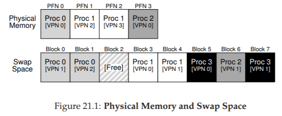
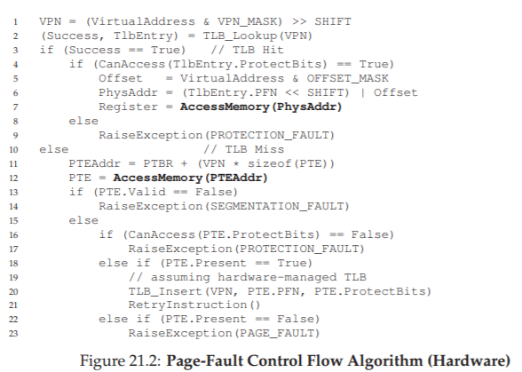
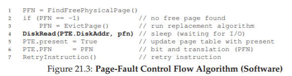

# 21 Beyond Physical Memory: Mechanisms
ここまでは、アドレス空間は非現実的に小さく、物理メモリに収まると仮定しました。実際には、実行中のすべてのプロセスのアドレス空間がすべてメモリに収まると仮定しています。我々は今、これらの大きな仮定を緩和し、多数の並行して動作する大規模なアドレス空間をサポートしたいと仮定します。

これを行うには、メモリ階層に追加のレベルが必要です。ここまでは、すべてのページが物理メモリに存在すると仮定しています。しかし、大規模なアドレス空間をサポートするために、OSは現在大きな需要がないものはアドレス空間の一部を移動する場所が必要です。一般に、そのような場所の特徴は、メモリよりも容量が大きいことです。その結果、一般的に速度が遅くなります(速度が速ければメモリとして使用します)。現代のシステムでは、この役割は通常、ハードディスクドライブによって提供されます。したがって、私たちのメモリ階層では、容量が大きくて速度が遅いハードドライブが一番上にあり、容量が小さくて速いメモリは一番下にあります。

>> THE CRUX: HOW TO GO BEYOND PHYSICAL MEMORY  
>> OSはどのようにして、より大きい、より遅いデバイスを使って、大きな仮想アドレス空間の錯覚を透過的に提供することができますか？

1つ疑問を持っているかもしれません。それは、プロセスのために単一の大きなアドレス空間をサポートしたいのはなぜ？ということです。その答えは利便性と使いやすさです。アドレス空間が大きいと、プログラムのデータ構造に十分な余裕があれば心配する必要はありません。むしろ、必要に応じてメモリを割り当て、自然にプログラムを書くだけです。OSが提供する強力な錯覚です。メモリオーバーレイを使用していた旧式のシステムでは、プログラマは必要に応じてコードやデータを手動でメモリ内外に移動する必要がありました[D97]。関数の呼び出しやデータへのアクセスの前に、まずコードやデータをメモリに配置する必要があります。

>> ASIDE: STORAGE TECHNOLOGIES  
>> I/Oデバイスが実際にどのように後で動作するかについてもっと深く掘り下げて調べます(I/Oデバイスの章を参照)。もちろん、低速デバイスはハードディスクである必要はありませんが、FlashベースのSSDなど、よりモダンなものになる可能性があります。それらについても話します。現時点では、物理メモリよりも大きな非常に大きな仮想メモリの錯覚を構築するのに役立つ大きなデバイスと比較的遅いデバイスがあると仮定します。

単一のプロセスだけではなく、スワップ空間を追加することで、複数の同時に実行されているプロセスに対して、大きな仮想メモリの錯覚をOSがサポートできるようになります。初期のマシンはすべてのプロセスが必要とするすべてのページを一度に保持することができないため、マルチプログラミング(複数のプログラムを「すぐに」実行して、マシンをより良く利用する)は、ほとんどのページを交換する能力を要求しました。したがって、マルチプログラミングと使いやすさの組み合わせにより、物理的に利用可能なメモリよりも多くのメモリを使用することがサポートされるようになります。これは、現代のすべてのVMシステムが行うことです。

## 21.1 Swap Space
最初に行う必要のある作業は、ページを前後に移動するためにディスク上にスペースを確保することです。オペレーティングシステムでは、スワップスペースと呼ばれるスペースは、メモリの外にページをスワップして、ページをメモリ内にスワップするためです。したがって、OSはページサイズ単位でスワップ領域の読み書きを行うことができます。これを行うには、OSは特定のページのディスクアドレスを覚えておく必要があります。

スワップスペースのサイズは重要です。最終的には、特定の時間にシステムが使用できるメモリページの最大数を決定します。わかりやすくするために、今のところそれは非常に大きいものとしましょう。

ちょっとした例(図21.1)では、4ページの物理メモリと8ページのスワップ領域の小さな例を見ることができます。この例では、3つのプロセス(Proc 0、Proc 1、およびProc 2)が物理メモリを積極的に共有しています。しかし、3つのそれぞれは有効なページの一部のみをメモリに持ち、残りの部分はディスクのスワップ領域に配置します。4番目のプロセス(Proc 3)は、すべてのページをディスクにスワップアウトしているため、現在実行中ではありません。スワップのブロックは空きのままです。この小さな例からも、スワップスペースを使用すると、システムが実際よりも大きなメモリをまとめることができるようになります。

スワップスペースは、トラフィックをスワップするためのディスク上の唯一の場所ではありません。たとえば、プログラムバイナリ(たとえば、ls、または独自のコンパイルされたメインプログラム)を実行しているとします。このバイナリのコードページは、ディスク上に最初に発見され、プログラムが実行されるとメモリにロードされます(プログラムの実行開始時に一度に、現代システムでは一度に1ページずつ必要に応じてロードされます)。ただし、システムが他のニーズに合わせて物理メモリに空き領域を確保する必要がある場合は、後からでも、ファイルシステム内のディスク上にあるバイナリを再度スワップすることができるため、これらのコードページのメモリ領域を安全に再利用できます。

## 21.2 The Present Bit
ディスク上にスペースを確保したので、ディスクとのスワップページをサポートするために、いくつかのマシンをシステムに追加する必要があります。わかりやすくするために、ハードウェア管理TLBを備えたシステムを想定してみましょう。

まず、メモリ参照で何が起こるかを思い出してください。実行中のプロセスは、仮想メモリ参照(命令フェッチまたはデータアクセス用)を生成します。この場合、ハードウェアはメモリから目的のデータをフェッチする前に、それらを物理アドレスに変換します。

ハードウェアは最初に仮想アドレスからVPNを抽出し、TLBに一致(TLBヒット)をチェックし、ヒットした場合に結果の物理アドレスを生成してメモリからフェッチします。これは速い(追加のメモリアクセスを必要としない)ので、これは一般的なケースです。

VPNがTLBに見つからない場合(TLBミス)、ハードウェアは(ページテーブルベースレジスタを使用して)ページテーブルをメモリに配置し、VPNを使用してインデックスを特定し、このページのページテーブルエントリ(PTE)を検索します。ページが有効で物理メモリに存在する場合、ハードウェアはPTEからPFNを抽出し、それをTLBにインストールし命令を再試行します。今回はTLBヒットを生成します。ここまでは順調ですね。

しかし、ページをディスクにスワップさせたい場合は、さらにメカニズムを追加する必要があります。具体的には、ハードウェアがPTEを調べると、ページが物理メモリに存在しないことがあります。ハードウェア(またはソフトウェア管理のTLBアプローチにおけるOS)がこれを判断する方法は、現在のビットと呼ばれる各ページテーブルエントリ内の新しい情報によって行われます。現在のビットが1に設定されている場合、ページが物理メモリに存在し、すべてが上記のように進行することを意味します。ゼロに設定されている場合、ページはメモリにではなく、ディスクのどこかにあります。物理メモリにないページにアクセスする行為は、通常、ページフォルトと呼ばれます。

>> ASIDE: SWAPPING TERMINOLOGY AND OTHER THINGS  
>> 仮想メモリシステムの用語は、マシンやオペレーティングシステムでは多少混乱し、変わる可能性があります。例えば、ページフォールトは、より一般的には、何らかの種類のフォールトを生成するページテーブルへの参照にアクセスすることができることです。これは、ここで議論しているフォールトのタイプ、すなわちページが存在しないフォールトを含むことができます。しかし、不正なメモリアクセスを参照した場合はどうでしょう。確かに、プロセスの仮想アドレス空間にマップされたページへの法的なアクセス(当然のことながら物理メモリではない)を「障害」と呼ぶことは間違いありません。より正確には、それをページミスと呼ばれるべきです。しかし、プログラムが「ページフォールト」であると言うと、OSがディスクにスワップアウトした仮想アドレス空間の一部にアクセスしていることをよく意味します。
>> 私たちは、この動作が「障害」として知られるようになった理由は、それを処理するオペレーティングシステムのメカニズムに関係していると考えています。めったに起きない何かが起こったとき、すなわち、ハードウェアが何らかの処理方法を知らないとき、ハードウェアは制御をOSに移し、処理してくれることを望むでしょう。この場合、プロセスがアクセスしたいページがメモリから欠落しています。ハードウェアが可能なのは例外を発生させ、そこからOSが引き継ぎます。これは、プロセスが何らかの違法行為を行った場合と同じであるため、アクティビティを「障害」と呼ぶのは驚くことではありません。

ページフォルトが発生すると、OSはページフォールトを処理するために呼び出されます。ここで説明するように、ページフォルトハンドラと呼ばれる特定のコードが実行され、ページフォルトを処理する必要があります。

## 21.3 The Page Fault
TLBミスでは、ハードウェア管理されたTLB(ハードウェアがページテーブルを参照して目的の変換を検索する)とソフトウェア管理TLB(OSが実行する場所)の2種類のシステムがあります。いずれのタイプのシステムにおいても、ページが存在しない場合、ページフォールトを処理するためにOSが担当します。適切に指定されたOSページフォルトハンドラが実行され、何をすべきかが決定されます。事実上、すべてのシステムがソフトウェアのページフォルトを処理します。ハードウェア管理のTLBを使用しても、ハードウェアはこの重要な義務を管理するためにOSを信頼します。

ページが存在せず、ディスクにスワップされている場合、OSはページフォールトを処理するためにページをメモリにスワップする必要があります。ここに疑問が生じます。OSは、どのようにして目的のページを見つけるかを知っていますか？多くのシステムでは、ページテーブルはそのような情報を格納するための自然な場所です。一般的なOSの場合は、ページのPFNなどのデータに通常使用されるPTEのビットをディスクアドレスとして使用できます。OSがページのページフォールトを受信すると、OSはPTEを調べてアドレスを見つけ、ディスクに要求を発行してページをメモリにフェッチします。

>> ASIDE: WHY HARDWARE DOESN’T HANDLE PAGE FAULTS  
>> TLBを学んだ経験から、ハードウェア設計者は、OSに任せるのを嫌っています。では、なぜ彼らはOSにページ違反を処理するのを信頼しているのでしょうか？主な理由はいくつかあります。まず、ディスクへのページフォルトは遅いです。OSが大量の命令を実行してフォールトを処理するのに時間がかかる場合でも、ディスク操作そのものは伝統的に遅すぎて、逆に実行中のソフトウェアの様々なオーバーヘッドを最小限に抑えられます。次に、ページフォルトを処理できるようにするために、ハードウェアはスワップ領域、I/Oをディスクに発行する方法、および現在はあまり知られていないその他多くの詳細を理解する必要があります。したがって、パフォーマンスとシンプルさの両方の理由から、OSはページフォールトを処理し、ハードウェアタイプも満足できるものになります。

ディスクI/Oが完了すると、OSはページテーブルを更新してページを現在のものとしてマークし、ページテーブルエントリ(PTE)のPFNフィールドを更新して、新たにフェッチされたページのメモリ内の位置を記録し、命令を再試行します。この次の試行は、TLBミスを生成し、サービスされ、TLB変換を更新します(このステップを回避するためにページフォールトを処理するときにTLBを交互に更新することができます)。最後に、最後の再起動はTLB内の変換を見つけ、変換された物理アドレスのメモリから望んだデータまたは命令をフェッチすることに進みます。

I/Oが実行されている間は、プロセスはブロックされた状態になります。従って、ページフォールトが処理されている間に、OSは他の準備完了プロセスを自由に実行することができる。I/Oは高価なので、あるプロセスのI/O(ページフォールト)と他のプロセスの実行とのオーバーラップは、マルチプログラムされたシステムがそのハードウェアを最も効果的に使用できるもう1つの方法です。

## 21.4 What If Memory Is Full?
上記のプロセスでは、スワップ領域からページをページインするための空きメモリが十分にあると想定していることがわかります。もちろん、これは当てはまらないかもしれません。つまり、メモリがいっぱい(またはそれに近い)かもしれません。したがって、OSは、最初に1つまたは複数のページをページアウトして、そのOSが投入しようとしている新しいページのためのスペースを作りたいと思うかもしれません。プロセスを選んでキックアウトまたは置換することをページ置換ポリシーといいます。

上記のように、間違ったページを見つけキックアウトや置換をすると、プログラムのパフォーマンスに大きなコストをかけることになります。そのため、良いページ置換ポリシーを作成することに多くの考えがあります。間違った決定をすると、プログラムはメモリのようなスピードではなく、ディスクのようなスピードで動作する可能性があります。現在の技術では、プログラムが1万分の1倍または10万分の1倍遅く実行される可能性があります。したがって、そのようなポリシーは我々がある程度詳細に研究すべきでしょう。それはまさに次の章でやることです。今のところ、ここに記載されているメカニズムの上に構築されたこのようなポリシーが存在することを理解するだけで十分です。

## 21.5 Page Fault Control Flow
この知識がすべて整ったら、メモリアクセスの完全な制御フローを概略的にスケッチすることができます。言い換えれば、誰かが「プログラムがメモリからデータを取り込むときにどうなるか」と尋ねるとき、あなたはすべての異なる可能性についてかなり良い考えを持っているはずです。詳細は、図21.2および図21.3の制御フローを参照してください。最初の図は、変換中にハードウェアが何をするかを示し、2番目はページフォルト時にOSが行うことを示しています。

図21.2のハードウェア制御のフロー図から、TLBミスが発生したときを理解する重要な3つのケースがあることに注意してください。まず、ページが存在し、有効であったこと(18-21行目)。この場合、TLBミスハンドラは、単にPTEからPFNを取り込み、命令を再試行し(今度はTLBヒットを生じる)、前に説明したように(何度も)続行することができます。2番目のケース(22-23行目)では、ページフォルトハンドラを実行する必要があります。これはアクセスするプロセスの正当なページでしたが(結局のところ有効です)、物理メモリには存在しません。3番目(最後に)、プログラムのバグなどの理由で、無効なページにアクセスする可能性があります(行13-14)。この場合、PTEの他のビットは実際には重要ではありません。ハードウェアがこの無効なアクセスをトラップし、OSトラップハンドラが実行され、問題のプロセスが終了する可能性があります。

図21.3のソフトウェア制御フローから、ページフォルトを処理するためにOSが大まかに何をしなければならないかを見ることができます。第1に、OSは、間もなくフォールトインされるページが存在する物理フレームを見つける必要があります。そのようなページがない場合は、置換アルゴリズムが実行され、メモリからいくつかのページが蹴られるまで、メモリを解放するまで待たなければなりません。物理的なフレームがあれば、ハンドラはスワップ領域からページを読み込むためのI/O要求を発行します。最後に、その低速動作が完了すると、OSはページテーブルを更新して命令を再試行します。再試行によりTLBミスが発生し、次に別の再試行時にTLBヒットが発生し、その時点でハードウェアは所望のアイテムにアクセスすることができる。

## 21.6 When Replacements Really Occur
これまでのところ、置き換えがどのように行われるかを記述したところでは、OSはメモリが完全にいっぱいになるまで待ってから、他のページのためのスペースを作るためにページを置き換える(追い出す)だけです。しかし、これは少し現実的ではありません。OSがメモリの一部をもっと積極的に解放する理由はたくさんあります。

少量のメモリを確保するために、ほとんどのオペレーティングシステムは、メモリからページを取り出す開始時期を決定するために、ある種の上限値(HW)と下限値(LW)を持っています。これがどのように機能するかは次のとおりです。利用可能なLWページ数が少ないことをOSが認識すると、メモリの解放を担当するバックグラウンドスレッドが実行されます。スレッドは、利用可能なHWページがあるところまでページを退去させます。つまり、あるHWで設定している上限値を超えているページをHWに移動させます。また、あるLWで設定している下限値を下回っているページをLWに移動させます。スワップデーモンやページデーモンと呼ばれることもあるバックグラウンドスレッドは、実行中のプロセスやOSが使用するメモリを解放してくれたことをうかがってスリープ状態になります。

一度に多数の置換を実行することにより、新しいパフォーマンスの最適化が可能になります。たとえば、多くのシステムでは、いくつかのページをクラスタ化またはグループ化し、スワップパーティションに一度に書き出し、ディスクの効率を高めます[LL82]。ディスクをより詳細に説明するときに後で説明するように、このようなクラスタリングはディスクのシークおよびローテーションオーバーヘッドを減らし、パフォーマンスを大幅に向上させます。

バックグラウンドページングスレッドを処理するには、図21.3の制御フローを少し変更する必要があります。直接置換を実行するのではなく、代わりに、使用可能な空きページがあるかどうかを単純にチェックします。そうでない場合は、空きページが必要であることをバックグラウンドページングスレッドに通知します。スレッドがいくつかのページを解放すると、元のスレッドが再び呼び起こされ、それが目的のページにページングされ、その作業に進むことができます。

>> TIP: DO WORK IN THE BACKGROUND  
>> いくつかの作業がある場合、効率を高め、操作のグループ化を可能にするために、バックグラウンドで実行することをお勧めします。オペレーティングシステムはよくバックグラウンドで動作します。たとえば、実際にデータをディスクに書き込む前に、多くのシステムがファイル書き込みをメモリにバッファリングします。そうすることで多くの利点が得られます。ディスク効率が向上したディスクは一度に多くの書き込みを受け取ることができるため、ディスクをスケジュールできるようになります。書き込みの待ち時間が改善されます。書込みが決してディスクに行く必要がない場合(すなわち、ファイルが削除された場合)、作業の削減ができる可能性があります。システムがアイドル状態のときにバックグラウンド作業が行われる可能性があるため、ハードウェア[G+95]をより有効に活用できるため、アイドル時間の有効活用が可能になります。

## 21.7 Summary
この短い章では、システム内に物理的に存在するより多くのメモリにアクセスするという概念を導入しました。これを行うには、ページがメモリー内に存在するかどうかを知らせるために、現在のビット(ある種のもの)を含める必要があるため、ページテーブル構造の複雑になります。そうでない場合は、オペレーティングシステムのページフォルトハンドラがページフォールトを処理するために実行され、ディスクからメモリへの望んだページの移動を行います。おそらくメモリ内のいくつかのページを先に交換してすぐに、スワップインするためのスペースを確保します。

重要なことに、これらのアクションはすべてプロセスに対して透過的に行われます。プロセスに関する限り、それは自身のプライベートで連続した仮想メモリにアクセスしているだけです。背後では、ページは物理メモリ内の任意の(連続していない)場所に配置され、時にはメモリにも存在せず、ディスクからのフェッチが必要になることがあります。一般的なケースでは、メモリアクセスが高速であることが重要ですが、場合によってはそれを処理するために複数のディスク操作が必要になることもあります。最悪の場合、1つの命令を実行するように簡単な作業ですが、最悪の場合、その作業が完了するまでに数ミリ秒かかることがあります。

# 参考文献

[CS94] “Take Our Word For It”  
F. Corbato and R. Steinberg  
Available: http://www.takeourword.com/TOW146/page4.html  
Richard Steinberg writes: “Someone has asked me the origin of the word daemon as it applies to computing. Best I can tell based on my research, the word was first used by people on your team at Project MAC using the IBM 7094 in 1963.” Professor Corbato replies: “Our use of the word daemon was inspired by the Maxwell’s daemon of physics and thermodynamics (my background is in physics). Maxwell’s daemon was an imaginary agent which helped sort molecules of different speeds and worked tirelessly in the background. We fancifully began to use the word daemon to describe background processes which worked tirelessly to perform system chores.”

[D97] “Before Memory Was Virtual”  
Peter Denning  
From In the Beginning: Recollections of Software Pioneers, Wiley, November 1997  
An excellent historical piece by one of the pioneers of virtual memory and working sets.  

[G+95] “Idleness is not sloth”  
Richard Golding, Peter Bosch, Carl Staelin, Tim Sullivan, John Wilkes  
USENIX ATC ’95, New Orleans, Louisiana  
A fun and easy-to-read discussion of how idle time can be better used in systems, with lots of good examples.

[LL82] “Virtual Memory Management in the VAX/VMS Operating System”  
Hank Levy and P. Lipman  
IEEE Computer, Vol. 15, No. 3, March 1982  
Not the first place where such clustering was used, but a clear and simple explanation of how such a mechanism works.

[prev](../20/20.md)|[next](../22/22.md)
