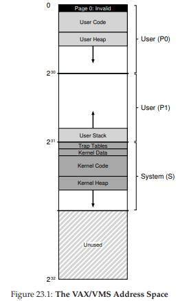

# 23 The VAX/VMS Virtual Memory System
仮想メモリの調査を終了する前に、VAX/VMSオペレーティング・システム[LL82]にある、きれいに整った仮想メモリ・マネージャの1つを詳しく見てみましょう。ここでは、以前の章でもたらされた概念のいくつかが完全なメモリマネージャにどのように集まっているかを示すためのシステムについて説明します。

## 23.1 Background
VAX-11ミニコンピュータのアーキテクチャは、Digital Equipment Corporation(DEC)によって1970年代後半に導入されました。DECは、ミニコンピュータの時代にコンピュータ業界で大規模な市場を持った企業でした。残念なことに一連の悪い決定とPCの出現はゆっくりと崩壊につながりました[C03]。このアーキテクチャは、VAX-11/780やそれほど強力ではないVAX-11/750など、いくつかの実装で実現されました。

このシステムのOSはVAX/VMS(または単純なVMS)として知られていましたが、主なアーキテクトはDave Cutlerでした。後でMicrosoftのWindows NT [C93]を開発しようと努力しました。非常に安価なVAXenを含む広範囲のマシンで、同じアーキテクチャファミリの非常にハイエンドでパワフルなマシンです。したがって、OSには、この巨大なシステム全体で機能し、うまく機能する仕組みとポリシーが必要でした。

>> THE CRUX: HOW TO AVOID THE CURSE OF GENERALITY
>> オペレーティングシステムはしばしば「一般性の呪い」として知られている問題を抱えています。これらは幅広い種類のアプリケーションやシステムの一般的なサポートが行われています。この呪いの基本的な結果は、OSがいずれかのインストールを非常にうまくサポートしない可能性があるということです。VMSの場合、VAX-11アーキテクチャーはさまざまな実装で実現されていたため、呪いは非常にリアルでした。したがって、幅広いシステムで効果的に動作するようにOSを構築するにはどうすればよいですか？

追加の問題として、VMSはアーキテクチャの固有の欠陥のいくつかを隠すために使用されるソフトウェア革新の優れた例です。OSは効率的な抽象化と錯覚を構築するためにハードウェアに依存していることがよくありますが、ハードウェア設計者はすべてのことを正しく行うことができません。VAXハードウェアにはいくつかの例があり、これらのハードウェアの欠陥にもかかわらず、VMSオペレーティングシステムが効果的で実用的なシステムを構築するために何をしているのかがわかります。

## 23.2 Memory Management Hardware
VAX-11は、1プロセス当たり32ビットの仮想アドレス空間を512バイトのページに分割して提供しました。したがって、仮想アドレスは23ビットのVPNと9ビットのオフセットで構成されています。さらに、VPNの上位2ビットを使用して、ページがどのセグメントに存在するかを区別しました。したがって、システムは以前に見たようにページングとセグメンテーションのハイブリッドでした。アドレス空間の下半分は「プロセス空間」と呼ばれ、各プロセスに固有のものでした。プロセス空間の前半(P0として知られている)では、ユーザープログラムが見つかっただけでなく、下向きに成長するヒープも検出されます。プロセス空間(P1)の後半では、上向きに成長するスタックを見つけます。アドレススペースの上半分はシステムスペース(S)として知られていますが、半分しか使用されていません。保護されたOSコードとデータはここにあり、OSはこのようにしてプロセス間で共有されます。

VMSデザイナの主な関心事の1つは、VAXハードウェア(512バイト)のページのサイズが非常に小さいことでした。歴史的な理由から選択されたこのサイズは、単純な線形ページテーブルを過度に大きくするという基本的な問題があります。したがって、VMSデザイナの最初の目標の1つは、VMSがページテーブルを使用してメモリを圧迫しないようにすることでした。

システムは、2つの方法でメモリ上の圧迫するページテーブルの場所を減らしました。まず、ユーザー・アドレス空間を2つに分割することにより、VAX-11はプロセスごとにこれらのリージョン(P0とP1)のそれぞれにページ・テーブルを提供します。従って、スタックとヒープとの間のアドレス空間の未使用部分にはページテーブルスペースは必要ありません。baseとboundsレジスタは期待どおりに使用されます。ベースレジスタはそのセグメントのページテーブルのアドレスを保持し、境界はそのサイズ(すなわちページテーブルエントリの数)を保持します。

第2に、OSは、カーネル仮想メモリにユーザページテーブル(P0とP1のために1プロセスあたり2つ)を配置することにより、さらにメモリ圧迫を減らします。このように、ページテーブルを割り振ったり、成長させたりすると、カーネルは、セグメントS内に、それ自身の仮想メモリから空間を割り当てます。メモリが厳しい状況になると、カーネルはこれらのページテーブルのページをディスクにスワップして、他の用途のために使用します。

ページテーブルをカーネル仮想メモリに置くと、アドレス変換がさらに複雑になります。たとえば、P0またはP1の仮想アドレスを変換するには、まずハードウェアがページテーブル(そのプロセスのP0またはP1ページテーブル)でそのページのページテーブルエントリを検索する必要があります。ただし、ハードウェアはまずシステムページテーブル(物理メモリに存在する)を参照する必要があります。その変換が完了すると、ハードウェアはページテーブルのページのアドレスを学習し、最後に望んだメモリアクセスのアドレスを知ることができます。幸いにも、これはVAXのハードウェア管理のTLBによって高速化されています。このTLBは通常、この厄介な検索を回避します(うまくいけばの話ですが…)

## 23.3 A Real Address Space
VMSを研究するうえでの真面目なところは、実際のアドレス空間がどのように構築されているかを見ることができます(図23.1)。ここまでは、ユーザコード、ユーザデータ、ユーザヒープだけの単純なアドレス空間を想定していましたが、実アドレス空間は明らかに複雑です。



>> ASIDE: WHY NULL POINTER ACCESSES CAUSE SEG FAULTS  
>> NULLポインタ逆参照で何が起こるかを正確に理解する必要があります。プロセスは、次のようにすることによって仮想アドレス0を生成します。
```
int *p = NULL; // set p = 0
*p = 10; // try to store value 10 to virtual address 0
```  
>> ハードウェアは、TLB内のVPN(ここでも0)をルックアップしようとし、TLBミスを起こします。ページテーブルが参照され、VPN 0のエントリが無効とマークされていることがわかります。したがって、私たちは無効なアクセス権だったため、OSに制御を移し、プロセスを終了させる可能性があります(UNIXシステムでは、プロセスにそのようなフォールトに反応するシグナルが送信されますが、キャッチされないとプロセスは強制終了されます)

例えば、コードセグメントはページ0から始まりません。代わりに、NULLポインタアクセスを検出するためのサポートを提供するために、このページはアクセス不能とマークされます。したがって、アドレス空間を設計する際の懸案事項の1つはデバッグのサポートであり、アクセスできないゼロページはここで何らかの形で提供されます。

おそらくもっと重要なことに、カーネル仮想アドレス空間(すなわち、そのデータ構造およびコード)は各ユーザアドレス空間の一部です。コンテキストスイッチでは、OSは、すぐに実行されるプロセスの適切なページテーブルを指すようにP0およびP1レジスタを変更します。しかし、Sのベースレジスタと境界レジスタは変更されず、その結果、「同じ」カーネル構造が各ユーザアドレス空間にマッピングされます。

カーネルは、いくつかの理由から各アドレス空間にマップされます。このような構成により、カーネルの作業が容易になります。例えば、OSにポインタを渡すと(例えば、`write()`システムコールで)、そのポインタからのデータをそれ自身の構造にコピーすることは容易です。OSは、アクセスしているデータがどこから来るのか心配することなく、自然に書かれコンパイルされます。これとは対照的に、カーネルが完全に物理メモリに置かれていた場合、ページテーブルのページをディスクにスワップするなどの作業は非常に難しくなります。カーネルに独自のアドレス空間が与えられていれば、ユーザーアプリケーションとカーネル間でデータを移動することは、かなり複雑になってしまいます。この構造(現在広く使われている)では、カーネルは、保護されているものの、アプリケーションのライブラリのように見えます。

このアドレス空間に関する最後の1つのポイントは、保護に関するものです。明らかに、OSはユーザアプリケーションがOSのデータやコードを読み書きすることを望みません。従って、ハードウェアは、これを可能にするためにページに対して異なる保護レベルをサポートしなければいけません。VAXは、ページテーブルの保護ビットに、特定のページにアクセスするためにCPUが必要とする特権レベルを指定することによってそうしました。したがって、システムデータおよびコードは、ユーザデータおよびコードよりも高い保護レベルに設定されます。そのような情報にユーザーコードからアクセスしようとすると、OSにトラップが生成され、問題のプロセスが終了する可能性があります。

## 23.4 Page Replacement
VAXのページテーブルエントリ(PTE)には、有効ビット、保護フィールド(4ビット)、変更(またはダーティ)ビット、OS使用のために予約されたフィールド(5ビット)、および最後に物理メモリにページの場所を格納するための物理フレーム番号(PFN)があります。しかし、参照ビットがありません。したがって、VMS置換アルゴリズムは、どのページがアクティブであるかを決定するためのハードウェアサポートなしで行う必要があります。

開発者はまた、メモリを多くのメモリを使用するプログラムがあり、他のプログラムを実行するのを困難にする場合について懸念していました。これまで見てきたポリシーのほとんどは、このような騒ぎに敏感です。たとえば、LRUはプロセス間でメモリを公平に共有しないグローバルポリシーです。

### Segmented FIFO
この2つの問題に対処するために、開発者はセグメント化されたFIFO置換ポリシー[RL81]を考え出しました。アイデアは単純です。各プロセスには、resident set size(RSS)と呼ばれる、メモリに保存できる最大ページ数があります。これらの各ページはFIFOリストに保持されます。プロセスがそのRSSを超えると、「先入れ先出し(first-in)」ページが追い出されます。FIFOはハードウェアからのサポートを必要とせず、実装が容易です。

当然のことながら、純粋なFIFOは、以前のように、特にうまく機能しません。FIFOのパフォーマンスを向上させるために、VMSはメモリから削除される前にページが配置される2つのセカンドチャンスリストを考えました。それはグローバルクリーンページフリーリストとダーティページリストです。プロセスPがそのRSSを超えると、ページはプロセスごとのFIFOから削除されます。クリーン(変更されていない)の場合はクリーンページリストの最後に配置されます。汚れている(変更されている)場合は、ダーティページリストの最後に配置されます。

別のプロセスQに空きページが必要な場合は、グローバルクリーンリストから最初の空きページが削除されます。ただし、元のプロセスPがページフォルトが発生した場合、元のプロセスPが再利用される前に、Pはフリー(またはダーティ)リストからそのページを再要求し、コストのかかるディスクアクセスを回避します。これらのセカンドチャンスリストが大きいほど、セグメント化されたFIFOアルゴリズムはLRU [RL81]に近づきます。

### Page Clustering
VMSで使用される別の最適化は、VMSの小さなページサイズを克服するのにも役立ちます。具体的には、このような小さいページでは、スワップ時のディスクI/Oは、ディスクが大規模な転送をもっているものでよりうまくいくので、非常に非効率的である可能性があります。VMSは、I/Oのスワッピングをより効率的にするために、いくつかの最適化を追加しますが、最も重要なのはクラスタリングです。クラスタリングでは、VMSは大規模なダーティー・リストから大量のバッチ・ページをグループ化し、それらを一気にディスクに書き込むことで、クリーンになります。スワップスペース内のどこにでもページを配置できるため、OSグループのページを作成したり、書き込み回数を減らしたりすることができ、パフォーマンスが向上するため、現代のシステムではクラスタリングが使用されています。

>> ASIDE: EMULATING REFERENCE BITS  
>> 分かっているように、システムでどのページが使用されているかという概念を得るために、ハードウェア参照ビットは必要ありません。実際、1980年代初めに、BabaogluとJoyは、VAXの保護ビットを使用して参照ビットをエミュレートすることができることを示しました[BJ81]。基本的な考え方として、システムでどのページが積極的に使用されているかを理解したい場合は、ページテーブルのすべてのページをアクセス不可能とマークします(しかし、プロセスによって実際にアクセス可能なページ、おそらくページテーブルエントリの「予約されたOSフィールド」部分にあるかもしれません)。  
プロセスがページにアクセスすると、OSにトラップが生成されます。OSはページが実際にアクセス可能であるかどうかをチェックし、そうであればページを通常の保護(例えば、読み取り専用または読み書き)に戻します。その置換時に、OSはどのページがアクセス不能とマークされているかを確認することができます。  
そのため、どのページが最近使用されていないのかを知ることができます。参照ビットのこの「エミュレーション」の鍵は、オーバーヘッドを削減しながら、ページ使用の良いアイデアを得ることです。OSは、アクセス不可能なページをマーキングするにはあまりにも攻撃的であるため、やってはいけません。また、オーバーヘッドが高すぎます。OSはまた、そのようなマーキングではあまりにも受動的であってはなりません。そうでないと、すべてのページが参照されます。また、OSは、どのページを退去させるべきかについては、まったく考えていません。

## 23.5 Other Neat VM Tricks
VMSには、デマンドゼロ(demand zeroing)とコピーオン・ライトの2つの標準的なトリックがありました。ここで、これらの遅延最適化について説明します。

VMS(およびほとんどの現代システム)における怠惰の1つの形態は、ページの要求のゼロ化(デマンドゼロ)です。これをよりよく理解するために、アドレス空間にヒープ内のページを追加する例を考えてみましょう。単純な実装では、OSはヒープにページを追加する要求に応答し、物理メモリ内のページを見つけてゼロにします(セキュリティが必要な場合は、他のプロセスが発生したときのページの内容を確認できます)それをあなたのアドレス空間にマッピングします(つまり、物理ページを望むようにページテーブルを設定する)。しかし、特にページがプロセスによって使用されない場合は、単純な実装にはコストがかかる可能性があります。

デマンドゼロは、アドレス空間にページが追加されてもOSはほとんど機能しません。ページ・テーブルには、そのページにアクセスできないとマークするエントリが挿入されます。プロセスがページを読み書きすると、OSへのトラップが発生します。トラップを処理するとき、OSは(実際にはページテーブルエントリの「OSのために予約された」部分に記されたビットを通して)これが実際にはデマンドゼロのページであることに気づきます。この時点で、OSは、物理ページを見つけ出し、ゼロにし、プロセスのアドレス空間にマッピングするために必要な作業を行います。プロセスがページにアクセスしない場合、この作業はすべて回避されます。

>> TIP: BE LAZY
>> 遅延であることは、オペレーティングシステムに利点をもたらします。遅延は後で作業を延期することができます。これは、いくつかの理由でOS内で有益です。まず、作業を中止すると、現在の操作の待ち時間が短縮され、応答性が向上します。たとえば、オペレーティングシステムでは、ファイルへの書き込みがすぐに成功したことを報告し、バックグラウンドで後でディスクに書き込むことがよくあります。第二に、さらに重要なことに、遅延は時にはその作業をやる必要性をなくします。例えば、ファイルが削除されるまで書き込みを遅延させると、書き込みを一切行う必要がなくなります。

VMSで見いだされたもうひとつのクールな最適化(やはり、現代のあらゆるOSで)は、コピーオンライト(略してCOW)です。アイデアとしてはTENEXオペレーティングシステム[BB+72]というものがあります。そのアイデアは簡単です。OSがコピーする代わりに、あるアドレス空間から別のアドレス空間にページをコピーする必要があるとき、それをターゲットアドレスにマップすることができます。このとき両方のアドレス空間で読み取り専用にマークします。両方のアドレス空間がページだけを読み込んだ場合、OSは実際にデータを移動することなく高速コピーを実現します。ただし、アドレススペースの1つが実際にページに書き込もうとすると、OSにトラップされます。OSはそのページがCOWページであることに気づき、新しいページを割り当て、データで埋めて、この新しいページをフォールトを起こしたプロセスのアドレス空間にマッピングします。その後、プロセスは続行され、そのプロセス専用のコピーが作成されます。

COWは多くの理由で有用です。確かにどんな種類の共有ライブラリも、多くのプロセスのアドレス空間にコピーオンライトでマッピングすることができ、貴重なメモリスペースを節約できます。UNIXシステムでは、COWは`fork()`と`exec()`の正確さのためにさらに重要です。呼び出すことができるように、`fork()`は呼び出し元のアドレス空間の正確なコピーを作成します。大きなアドレス空間では、そのようなコピーを作成するのが遅く、データ集約的です。さらに悪いことに、ほとんどのアドレス空間は`exec()`の後続の呼び出しによって直ちに上書きされ、呼び出し元プロセスのアドレス空間とすぐに実行されるプログラムのアドレス空間が上書きされます。代わりに、コピーオンライトの`fork()`を実行することにより、OSは不必要なコピーをほとんど回避し、したがってパフォーマンスを向上させながら正しいデータを保持します。

## 23.6 Summary
仮想メモリシステム全体のトップからボトムのレビューを見たことがあります。基本的な仕組みやポリシーの大部分をすでによく理解したので、細部のほとんどは簡単に理解できるはずです。詳細はLevy and Lipman [LL82]の優れた(そして短い)論文に掲載されています。これらの章の背後にある原資料がどのようなものかを見るための素晴らしい方法です。  
可能であれば、Linuxやその他の最新のシステムについて読むことで、最先端技術についてさらに学ぶ必要があります。そこにはいくつかの合理的な書籍[BC05]を含む多くのソース資料があります。VAX/VMS上の古い文書に見られる古典的なアイデアが、現代のオペレーティングシステムの構築方法にどのように影響しているのか、あなたを驚かせるでしょう。

# 参考文献

[BB+72] “TENEX, A Paged Time Sharing System for the PDP-10”  
Daniel G. Bobrow, Jerry D. Burchfiel, Daniel L. Murphy, Raymond S. Tomlinson  
Communications of the ACM, Volume 15, March 1972  
An early time-sharing OS where a number of good ideas came from. Copy-on-write was just one of those; inspiration for many other aspects of modern systems, including process management, virtual memory, and file systems are found herein.

[BJ81] “Converting a Swap-Based System to do Paging in an Architecture Lacking Page-Reference Bits”  
Ozalp Babaoglu and William N. Joy  
SOSP ’81, Pacific Grove, California, December 1981  
A clever idea paper on how to exploit existing protection machinery within a machine in order to emulate reference bits. The idea came from the group at Berkeley working on their own version of UNIX, known as the Berkeley Systems Distribution, or BSD. The group was heavily influential in the development of UNIX, in virtual memory, file systems, and networking.

[BC05] “Understanding the Linux Kernel (Third Edition)”  
Daniel P. Bovet and Marco Cesati  
O’Reilly Media, November 2005  
One of the many books you can find on Linux. They go out of date quickly, but many of the basics remain and are worth reading about.

[C03] “The Innovator’s Dilemma”  
Clayton M. Christenson  
Harper Paperbacks, January 2003  
A fantastic book about the disk-drive industry and how new innovations disrupt existing ones. A good read for business majors and computer scientists alike. Provides insight on how large and successful companies completely fail.

[C93] “Inside Windows NT”  
Helen Custer and David Solomon  
Microsoft Press, 1993  
The book about Windows NT that explains the system top to bottom, in more detail than you might like. But seriously, a pretty good book.

[LL82] “Virtual Memory Management in the VAX/VMS Operating System”  
Henry M. Levy, Peter H. Lipman  
IEEE Computer, Volume 15, Number 3 (March 1982) Read the original source of most of this material;  
it is a concise and easy read. Particularly important if you wish to go to graduate school, where all you do is read papers, work, read some more papers, work more, eventually write a paper, and then work some more. But it is fun!

[RL81] “Segmented FIFO Page Replacement”  
Rollins Turner and Henry Levy  
SIGMETRICS ’81, Las Vegas, Nevada, September 1981  
A short paper that shows for some workloads, segmented FIFO can approach the performance of LRU

[prev](../22/22.md)|[next](../26/26.md)
