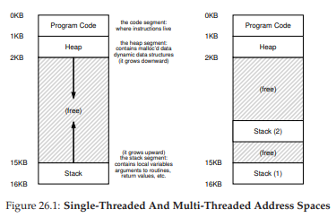
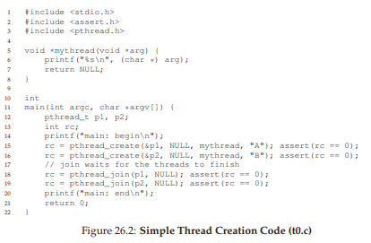
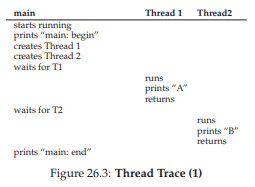
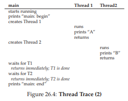
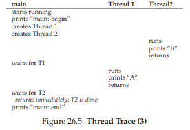
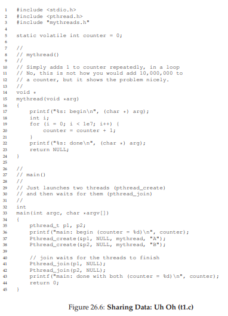
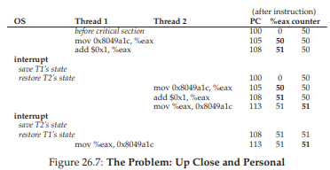

# 26 Concurrency: An Introduction
ここまでは、OSが実行する基本的な抽象概念の開発を見てきました。単一の物理CPUを複数の仮想CPUに変換する方法を見てきました。これにより、複数のプログラムが同時に実行されているように見えます。また、プロセスごとに大きな仮想プライベート仮想メモリを作成する方法を見てきました。このアドレス空間の抽象化によって、OSが実際に物理メモリ(および場合によってはディスク)上のアドレス空間を秘密に多重化しているときに、各プログラムが独自のメモリを持つかのように動作することができます。

ここでは、スレッドの1つの実行プロセスに対する新しい抽象概念を紹介します。プログラム内の単一の実行ポイント(すなわち、命令がフェッチされて実行される1つのPC(プログラムカウンタ))の古典的なビューの代わりに、マルチスレッドプログラムは複数の実行ポイントを持っています(つまり、複数のPC、それはフェッチされ実行されている)おそらく、これを考えるもう一つの方法は、各スレッドが1つの違いを除いて、別々のプロセスに非常に似ていることです。つまり、同じアドレス空間を共有し、同じデータにアクセスできます。

したがって、単一のスレッドの状態は、プロセスの状態と非常に似ています。それは、プログラムが命令をフェッチする場所を追跡するプログラムカウンタ(PC)を持っています。各スレッドには、計算に使用する専用のレジスタセットがあります。したがって、1つのプロセッサ上で実行されている2つのスレッドがある場合、1つを実行する(T1)からもう一方のスレッドを実行する(T2)に切り替えるときは、コンテキスト切り替えが行われなければなりません。スレッド間のコンテキスト切り替えは、プロセス間のコンテキスト切り替えと非常によく似ています。これは、T1のレジスタ状態を保存し、T2を実行する前にT2のレジスタ状態を復元する必要があるためです。プロセスでは、状態をプロセス制御ブロック(PCB)に保存しました。現在、プロセスの各スレッドの状態を格納するために、1つ以上のスレッド制御ブロック(TCB)が必要になります。ただし、プロセスと比較してスレッド間で実行するコンテキスト切り替えには大きな違いが1つあります。アドレス空間は同じままです(つまり、使用しているページテーブルを切り替える必要はありません)

スレッドとプロセスのもう1つの大きな違いは、スタックに関するものです。従来のプロセス(単一スレッドプロセスと呼ぶこともできる)のアドレス空間の単純なモデルでは、通常はアドレス空間の一番下に単一のスタックがあります(図26.1、左)

しかし、マルチスレッドプロセスでは、各スレッドは独立して実行され、もちろんどのような作業をしていてもさまざまなルーチンを呼び出すことができます。アドレス空間には1つのスタックの代わりにスレッドごとに1つのスタックが存在します。たとえば、2つのスレッドを持つマルチスレッドプロセスがあるとします。結果のアドレス空間は異なって見えます(図26.1、右)。



この図では、プロセスのアドレス空間全体に2つのスタックが広がっていることがわかります。したがって、スレッドに割り当てられた変数、パラメータ、戻り値、およびスタック上に置かれた他のものは、thread local storageと呼ばれることもあるスタックに格納されます。

これがどのように私たちの美しいアドレス空間のレイアウトを崩すのか気づくかもしれません。以前は、スタックとヒープが独立して成長する可能性があり、アドレス空間の空き領域を使い果たしたときにのみ問題が発生しました。ここでは、もはやこのような素晴らしい状況はありません。幸運なことに、スタックは一般に非常に大きくする必要はありません(例外は再帰を頻繁に使用するプログラムです)

## 26.1 Why Use Threads?
スレッドの詳細とマルチスレッドプログラムの作成に伴う問題のいくつかに入る前に、もっと簡単な質問にまず答えてみましょう。なぜスレッドを使うべきなのでしょうか？

スレッドを使用する主な理由は少なくとも2つあります。最初のものは単純です。それは並列性です。たとえば、2つの大きな配列を一緒に追加するか、配列内の各要素の値をある量だけインクリメントするなど、非常に大きな配列で操作を実行するプログラムを作成しているとします。単一のプロセッサで実行している場合、タスクは簡単です。それぞれの操作を実行するだけです。ただし、複数のプロセッサを搭載したシステム上でプログラムを実行している場合は、各プロセッサを使用して作業の一部を実行することで、このプロセスを大幅に高速化する可能性があります。標準のシングルスレッドプログラムを複数のCPUでこの種の作業を行うプログラムに変換する作業は並列化と呼ばれ、この作業を行うCPUごとのスレッドを使用するのは、現代のハードウェアでプログラムをより高速に実行できる自然で一般的な方法です。

2つ目の理由は、I/Oが遅いことによる、ブロッキングされているプログラムの進行を避けるためです。さまざまなタイプのI/Oを実行するプログラムを記述しているとします。メッセージの送信または受信の待機、明示的なディスクI/Oの完了、またはページ・フォールトの完了(暗黙的)です。待機する代わりに、プログラムを使用してCPUを使用して計算を実行します、さらにI/O要求を発行するなど、何か他の処理を実行することもできます。スレッドを使用するのは自然な方法です。プログラム内の1つのスレッドが待機している(つまり、I/Oを待ってブロックされている)場合、CPUスケジューラは実行準備が整っていて有用なことをする他のスレッドに切り替えることができます。スレッディングは、プログラム間のプロセスのマルチプログラミングのように、単一のプログラム内の他のアクティビティとのI/Oのオーバーラップを可能にします。その結果、多くの現代のサーバベースのアプリケーション(ウェブサーバ、データベース管理システムなど)は、その実装においてスレッドを利用します。

もちろん、上記のいずれの場合でも、スレッドの代わりに複数のプロセスを使用できます。しかし、スレッドはアドレス空間を共有するため、データの共有が容易になり、したがって、これらのタイプのプログラムを構築する際には自然な選択です。プロセスは、メモリ内のデータ構造をほとんど共有する必要のない、論理的に分離したタスクのためのより健全な選択です。

## 26.2 An Example: Thread Creation
詳細をいくつか取り上げましょう。私たちは2つのスレッドを作成するプログラムを実行したいとします。それぞれのスレッドは独立した作業を行います。この場合、「A」または「B」を印刷します。コードは図26.2(278ページ)に示されています。メインプログラムは2つのスレッドを作成し、それぞれは異なる引数(文字列AまたはB)を使用しても、関数`mythread()`を実行します。スレッドが作成されると、すぐに実行を開始することがあります(スケジューラーの気まぐれに応じて)。あるいは、「実行可能」状態であるが、まだ実行状態ではなく、実行されていないと置いてみましょう。もちろん、マルチプロセッサ上では、スレッドは同時に実行することもできますが、この可能性についてはまだ心配しないでください。



2つのスレッド(T1とT2と呼ぶ)を作成した後、メインスレッドは`pthread_join()`を呼び出し、特定のスレッドが完了するのを待ちます。このように2回実行すると、T1とT2が確実に実行され、完了してからメインスレッドが再び実行できるようになります。終了すると、「main：end」と表示され、終了します。全体的に、この実行中に3つのスレッド、すなわちメインスレッド、T1、およびT2が使用されました。

この小さなプログラムの実行順序を調べてみましょう。実行ダイアグラム(図26.3)では、時間が下方向に増加し、各列は異なるスレッド(メインスレッド、スレッド1、またはスレッド2)が実行されていることを示します。



ただし、この順序は唯一の可能な順序ではないことに注意してください。実際には、一連の命令があれば、スケジューラが特定のポイントで実行するスレッドに応じてかなりの数があります。たとえば、スレッドが作成されるとすぐにスレッドが実行され、図26.4に示す実行につながります。



スレッド1が先に作成されたとしても、スケジューラがスレッド2を最初に実行することに決めた場合、「A」の前に「B」が印刷されていることもあります。最初に作成されたスレッドが最初に実行されると仮定する理由はありません。図26.5にこの最終実行順序を示します。スレッド2はスレッド1より前にスレッドを処理します。



あなたが見ることができるように、スレッドの作成について考える方法の1つは、関数呼び出しのようなものです。しかし、関数を最初に実行してから呼び出し元に戻る代わりに、呼び出されているルーチンの新しい実行スレッドが作成され、呼び出し元から独立して実行されます(おそらく作成から戻る前に)次に実行されるのはOSスケジューラによって決定され、スケジューラはいくつかの実用的なアルゴリズムを実装する可能性がありますが、特定の瞬間に何が実行されるのかを知ることは困難です。

この例からも分かるように、スレッドを使用すると複雑な作業になります。いつ実行するのかはすでに分かりません！コンピュータは、並行性なしでは理解するのに十分なほど難しい。残念ながら、同時実行性では、単に悪化します。ずっと悪いです。

##26.3 Why It Gets Worse: Shared Data
上に示した単純なスレッドの例は、スケジューラーがそれらを実行する方法に応じて、スレッドがどのように作成され、どのように異なる順序で実行されるかを示すのに役立ちました。しかし、共有データにアクセスするときにスレッドがどのようにやりとりするかは、あなたには分かりません。2つのスレッドがグローバル共有変数を更新したいという単純な例を想像してみましょう。調査するコードは、図26.6(280ページ)にあります。



コードについてのいくつかの注意があります。まず、スティーブンスが[SR05]を提案しているように、スレッドの作成と結合ルーチンをラップして失敗時に終了するだけです。このようなシンプルなプログラムでは、少なくともエラーが発生したことに気づきたいですが、それについては非常に賢明なことはしません(exitなど)。したがって、`pthread_create()`は単に`pthread_create()`を呼び出し、戻りコードが0であることを確認します。そうでない場合、`pthread_create()`は単にメッセージを出力して終了します。

第2に、ワーカースレッドに2つの別々の関数本体を使用する代わりに、単一のコードを使用してスレッドに引数(この場合は文字列)を渡すだけで、各スレッドがメッセージの前に別の文字を表示できるようになります。

最後に、最も重要なのは、各作業者が何をしようとしているのかを見てみましょう。共有変数カウンタに数値を追加し、ループで1000万回(1e7)を実行します。従って、望む最終結果は、20,000,000です。

プログラムのコンパイルと実行を行い、プログラムの動作を確認します。時には、すべてが期待通りに働くこともあります。  
```
prompt> gcc -o main main.c -Wall -pthread
prompt> ./main
main: begin (counter = 0)
A: begin
B: begin
A: done
B: done
main: done with both (counter = 20000000)
```  
残念ながら、このコードを実行すると、単一のプロセッサであっても、必ずしも望ましい結果が得られるとは限りません。  
```
prompt> ./main
main: begin (counter = 0)
A: begin
B: begin
A: done
B: done
main: done with both (counter = 19345221)
```  
結局のところ、コンピュータは決定論的な結果を生み出すとは思われませんか？  
```
prompt> ./main
main: begin (counter = 0)
A: begin
B: begin
A: done
B: done
main: done with both (counter = 19221041)
```  
それぞれが正しく実行されるだけでなく、別の結果が得られます。大きな疑問が残っています。なぜこれが起こりますか？

>> TIP: KNOW AND USE YOUR TOOLS  
>> コンピュータシステムの作成、デバッグ、および理解に役立つ新しいツールを常に学習する必要があります。ここでは、ディスアセンブラと呼ばれる素敵なツールを使用します。実行ファイルに対して逆アセンブラを実行すると、どのアセンブリ命令がプログラムを構成しているかが表示されます。たとえば、カウンタを更新するための低レベルのコードを理解したい場合(この例のように)、objdump(Linux)を実行してアセンブリコードを表示します。
```
prompt> objdump -d main
```  
>> そうすることで、(特に-gフラグを付けてコンパイルした場合に)きれいに表示され、プログラム内のシンボル情報を含む、プログラム内のすべての命令の長いリストが生成されます。objdumpプログラムは、使い方を学ぶべき多くのツールの1つに過ぎません。gdbのようなデバッガ、valgrindやpurifyのようなメモリプロファイラ、もちろんコンパイラ自体はもっと学ぶために時間を費やすべきものです。ツールを使用している方が優れているほど、優れたシステムを構築できます。

## 26.4 The Heart Of The Problem: Uncontrolled Scheduling
なぜこのようなことが起こるかを理解するためには、コンパイラがカウンタの更新のために生成するコードシーケンスを理解する必要があります。この場合、カウンタに数値(1)を追加するだけです。したがって、そうするためのコードシーケンスは、(x86では)このように見えるかもしれません。
```
mov 0x8049a1c, %eax
add $0x1, %eax
mov %eax, 0x8049a1c
```  
この例では、変数カウンタがアドレス0x8049a1cにあると仮定しています。この3命令シーケンスでは、最初にx86 mov命令が使用され、アドレスのメモリ値を取得してレジスタeaxに格納します。次に、addが実行され、eaxレジスタの内容に1(0x1)を加え、最後にeaxの内容が同じアドレスのメモリに戻されます。

私たちの2つのスレッド(スレッド1)のうちの1つがこのコード領域に入り、カウンタを1つ増やすことを想像してみましょう。それは、カウンタの値を読み込みます(最初は50としましょう)。その値はレジスタeaxにロードされます。したがって、スレッド1の場合はeax = 50となり、レジスタに1が加算されます。従ってeax = 51になります。そして今、何か不幸なことが起こります。ここでタイマー割り込みがオフになります。したがって、OSは現在実行中のスレッド(そのPC、eaxを含むレジスタなど)の状態をスレッドのTCBに保存します。

スレッド2が実行されるように選択され、同じコードが入力されます。また、最初の命令を実行してカウンタの値を取得し、それをeaxに入れます(実行時にはスレッドごとに専用のレジスタがあり、レジスタはそれらを保存および復元するコンテキストスイッチコードによって仮想化されます)。この時点でcounterの値はまだ50であるため、スレッド2はeax = 50です。スレッド2が次の2つの命令を実行し、eaxを1つ増やして(つまりeax = 51)、eaxの内容をカウンタ(アドレス0x8049a1c)に保存すると仮定しましょう。したがって、グローバル変数カウンタは今や値51を持っています。

最後に、別のコンテキスト切り替えが発生し、スレッド1が実行を再開します。それがmovを実行して追加したことを思い出して、最終的なmov命令を実行しようとしています。eax = 51でした。したがって、最終mov命令が実行され、その値がメモリに保存されます。カウンタは再び51に設定されます。

簡単に言えば、インクリメントカウンタのコードは2回実行されていますが、50で開始されたカウンタは51にしかなりません。このプログラムの「正しい」バージョンでは、変数カウンタは52と等しくなるはずです。

問題をよりよく理解するための詳細な実行トレースを見てみましょう。この例では、上記のコードが次のシーケンスのようにメモリ上のアドレス100にロードされているものと仮定します(RISC風の命令セットに使用されていたものの、x86には可変長命令があります。このmovの命令は5バイトのメモリ、およびaddは3バイトのみ)
```
100 mov 0x8049a1c, %eax
105 add $0x1, %eax
108 mov %eax, 0x8049a1c
```  
これらの前提で、図26.7に何が起こるかを示します。カウンタが値50で始まると仮定し、この例をトレースして、何が起こっているかを理解してください。



ここで示したことは競合条件と呼ばれ、結果はコードのタイミング実行に依存します。いくつかの不運(実行中のタイミングの悪い時点で発生するコンテキストスイッチ)により、間違った結果が得られます。実際、私たちは毎回異なる結果を得るかもしれません。したがって、私たちはコンピュータから慣れ親しんだ素敵な決定論的な計算の代わりに、この結果を不確定と呼びます。ここでは、出力がどのようになるか分からず、実行中に実際に異なる可能性があります。

このコードを実行する複数のスレッドが競合状態になる可能性があるため、このコードをクリティカルセクションと呼びます。クリティカルセクションは、共有変数(より一般的には共有リソース)にアクセスするコードであり、複数のスレッドで同時に実行してはいけません。

このコードで本当に欲しいのは、私たちが相互排除と呼ぶものです。このプロパティーは、あるスレッドがクリティカルセクション内で実行している場合、他のスレッドがクリティカルセクション内で実行していないことを保証します。

ところで、これらの用語のほとんどは、この分野のパイオニアであったEdsger Dijkstraによって造られたもので、実際にこの作業や他の作業のためにTuring Awardを受賞しました。問題の驚くほど明確な説明については、1968年の「一連のプロセスの協力」[D68]の論文を参照してください。本書のこのセクションでは、Dijkstraについて詳しく聞いていきます。

## 26.5 The Wish For Atomicity
この問題を解決する1つの方法は、単一のステップで、必要な処理を正確に行い、不意に中断する可能性をなくした、より強力な命令を持つことです。たとえば、このようなスーパーインストラクションがあればどうでしょうか？
```
memory-add 0x8049a1c, $0x1
```  
この命令がメモリ位置に値を追加し、ハードウェアが原子的に実行することを保証すると仮定します。命令が実行されると、必要に応じて更新が実行されます。途中で命令を中断することはできません。これは、ハードウェアから受け取った保証のためです。割り込みが発生した場合、命令がまったく実行されていないか、完了まで実行されています。中間の状態は存在しません。

原子的には、この文脈では、「単位として」を意味し、時には「すべてかどうか」とみなします。私たちが望むものは、3つの命令シーケンスを原子的に実行することです。
```
mov 0x8049a1c, %eax
add $0x1, %eax
mov %eax, 0x8049a1c
```  
もしこれを行う一つの指示があれば、私たちはその指示を出すだけで済みます。しかし、一般的なケースでは、そのような指示はありません。私たちが並行してBツリーを構築していて、それを更新したいと思ったとします。ハードウェアが「Bツリーのアトミック更新」命令をサポートすることを本当に望んでいますか？おそらく、少なくとも純粋な命令セットではないでしょう。

したがって、代わりに、ハードウェアにいくつかの有用な命令を頼んで、同期プリミティブと呼ばれる一般的なセットを構築することができます。これらのハードウェア同期プリミティブを使用することで、オペレーティングシステムの助けを得て、クリティカルセクションに同期して制御された方法でアクセスするマルチスレッドコードを構築することができます。同時実行の困難な性質にもかかわらず、正確に正しい結果を生成します。同時実行、かなり素晴らしいですよね？

>> TIP: USE ATOMIC OPERATIONS
>>原子操作は、コンピュータ・アーキテクチャーからコンカレント・コード(ここで学んでいるもの)、ファイル・システム(すぐに研究する予定です)、データベース管理システム、さらには分散システム[L + 93]といったシステムに使われている強力な技術です。  
一連のアクションをアトミックにするという背後にあるアイデアは、「すべてかどうか」というフレーズで単純に表現されます。グループ化するすべてのアクションが発生したか、いずれも発生していない状態で、中間の状態が表示されていないかのように表示されます。時には、多くのアクションを1つのアトミックアクションにグループ化することをトランザクションと呼びます。これはデータベースとトランザクション処理の世界で非常に詳細に開発されたアイデアです[GR92]。  
並行処理のテーマでは、短いシーケンスの命令を実行のアトミックブロックに変換するために同期プリミティブを使用しますが、アトミック性のアイデアはそれよりもはるかに大きくなります。たとえば、ファイルシステムでは、ディスク障害時に正しく動作するために不可欠なディスク上の状態をアトミックに移行するために、ジャーナリングやコピーオンライトなどの技術を使用します。それが意味をなさないのであれば、心配しないでください。この後の章で学んでいきます。

これは本のこのセクションで研究する問題です。それは素晴らしい、難しい問題であり、あなたの心が傷つくはずです(少し)。それがなければ、あなたは理解できません！あなたの頭が痛むまで働き続けてください。あなたの頭が正しい方向に向かっていることを知っています。その時点で休憩をとります。私たちはあなたの頭があまりにも傷ついて欲しくない。

>> THE CRUX:HOW TO PROVIDE SUPPORT FOR SYNCHRONIZATION
>> 有用な同期プリミティブを構築するために、ハードウェアから何をサポートする必要がありますか？OSから何をサポートする必要がありますか？これらのプリミティブを正確かつ効率的に構築するにはどうすればよいですか？プログラムはどのようにして目的の結果を得ることができますか？

## 26.6 One More Problem: Waiting For Another
この章では、共有変数にアクセスするスレッドとクリティカルセクションのアトミック性をサポートする必要があるスレッド間で、1つのタイプの対話しか発生しないように、並行性の問題を設定しています。それが判明すると、別の一般的なやりとりが起こります。あるスレッドは、別のスレッドが続行する前に何らかのアクションを完了するのを待たなければなりません。この相互作用は、たとえば、プロセスがディスクI/Oを実行しスリープ状態になったときに発生します。I/Oが完了すると、プロセスを継続して実行できるように、プロセスをその眠りから呼び出す必要があります。

したがって、今後の章では、アトミック性をサポートするための同期プリミティブのサポートを構築する方法だけでなく、マルチスレッドプログラムでよく見られるこの種のスリープ/スリープ状態の相互作用をサポートするメカニズムについても検討します。これが今や意味がわからないのであれば、それは大丈夫です！その章を何回も読み返すことです。そうでなければ、うまくいきません。

## 26.7 Summary: Why in OS Class?
ラップアップする前に、あなたが持っているかもしれない1つの質問です。なぜ私たちはこれをOSクラスで勉強していますか？「歴史」は1語の答えです。OSは最初の並行プログラムであり、多くの技術がOS内で使用するために作成されました。その後、マルチスレッドプロセスでは、アプリケーションプログラマもそのようなことを考慮する必要がありました。

たとえば、2つのプロセスが実行されている場合を考えてみましょう。ファイルに書き込むために`write()`を呼び出し、両方ともファイルにデータを追加する(つまり、データをファイルの最後に追加して長さを増やす)とします。これを行うには、両方とも新しいブロックを割り当て、このブロックが存在するファイルのiノードに記録し、新しい大きなサイズを反映するようにファイルのサイズを変更する必要があります。(そのほかのことについては本の第3部で詳しく説明します)割り込みはいつでも発生する可能性があるので、これらの共有構造を更新するコード(例えば、割り当て用のビットマップまたはファイルのinode)はクリティカルセクションです。したがって、OS設計者は、割り込みの導入の当初から、OSが内部構造をどのように更新するかについて心配する必要がありました。タイミングの悪い割り込みが上記のすべての問題を引き起こします。当然のことながら、ページテーブル、プロセスリスト、ファイルシステム構造、およびほぼすべてのカーネルデータ構造には、適切な同期プリミティブを使用して、正しく動作するように慎重にアクセスする必要があります。

>> ASIDE: KEY CONCURRENCY TERMS CRITICAL SECTION, RACE CONDITION, INDETERMINATE, MUTUAL EXCLUSION  
>> これらの4つの用語は、並行コードの中核をなすものであり、明示的に呼び出す際には価値があると考えていました。 詳細については、Dijkstraの初期の作品[D65、D68]を参照してください。  
1.クリティカルセクションは、共有リソース(通常は変数またはデータ構造)にアクセスするコードです。  
2.競合状態は、実行の複数のスレッドがほぼ同じ時間にクリティカルセクションに入る場合に発生します。両方とも共用データ構造を更新しようとし、驚くべき(そしておそらく望ましくない)結果につながります。  
3.不確定プログラムは、1つまたは複数の競合条件で構成されます。実行時に実行されるスレッドの種類によって、プログラムの出力は実行ごとに異なります。その結果は決定論的ではなく、通常コンピュータシステムから期待されるものです。  
4.これらの問題を回避するために、スレッドは何らかの相互排他プリミティブを使用する必要があります。これにより、1つのスレッドだけがクリティカルセクションに入り、レースを回避し、確定的なプログラム出力を得ることが保証されます。  

##参考文献

[D65] “Solution of a problem in concurrent programming control”  
E. W. Dijkstra  
Communications of the ACM, 8(9):569, September 1965  
Pointed to as the first paper of Dijkstra’s where he outlines the mutual exclusion problem and a solution. The solution, however, is not widely used; advanced hardware and OS support is needed, as we will see in the coming chapters.

[D68] “Cooperating sequential processes”  
Edsger W. Dijkstra, 1968  
Available: http://www.cs.utexas.edu/users/EWD/ewd01xx/EWD123.PDF  
Dijkstra has an amazing number of his old papers, notes, and thoughts recorded (for posterity) on this website at the last place he worked, the University of Texas. Much of his foundational work, however, was done years earlier while he was at the Technische Hochshule of Eindhoven (THE), including this famous paper on “cooperating sequential processes”, which basically outlines all of the thinking that has to go into writing multi-threaded programs. Dijkstra discovered much of this while working on an operating system named after his school: the “THE” operating system (said “T”, “H”, “E”, and not like the word “the”).

[GR92] “Transaction Processing: Concepts and Techniques”  
Jim Gray and Andreas Reuter  
Morgan Kaufmann, September 1992  
This book is the bible of transaction processing, written by one of the legends of the field, Jim Gray. It is, for this reason, also considered Jim Gray’s “brain dump”, in which he wrote down everything he knows about how database management systems work. Sadly, Gray passed away tragically a few years back, and many of us lost a friend and great mentor, including the co-authors of said book, who were lucky enough to interact with Gray during their graduate school years.

[L+93] “Atomic Transactions”  
Nancy Lynch, Michael Merritt, William Weihl, Alan Fekete  
Morgan Kaufmann, August 1993  
A nice text on some of the theory and practice of atomic transactions for distributed systems. Perhaps a bit formal for some, but lots of good material is found herein.

[SR05] “Advanced Programming in the UNIX Environment”  
W. Richard Stevens and Stephen A. Rago  
Addison-Wesley, 2005  
As we’ve said many times, buy this book, and read it, in little chunks, preferably before going to bed. This way, you will actually fall asleep more quickly; more importantly, you learn a little more about how to become a serious UNIX programmer.

[prev](../23/23.md)|[next](../27/27.md)
