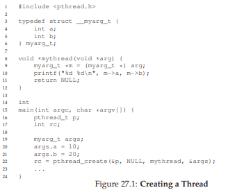
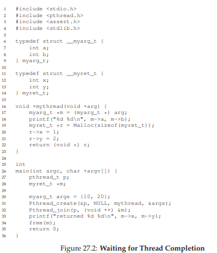
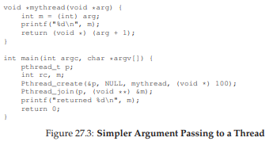
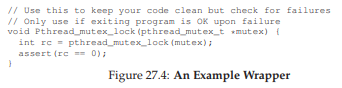

# 27 Interlude: Thread API
この章では、スレッドAPIの主要部分について簡単に説明します。各部分については、APIの使い方を示すので、以降の章ではさらに詳しく説明します。詳細は、様々な書籍やオンライン情報源[B89、B97、B+96、K+96]で見つけることができます。以降の章では、ロックや条件変数の概念をよりゆっくりと紹介しています。これらには多くの例があります。したがって、この章は参考文献のように使用してください。

>> CRUX: HOW TO CREATE AND CONTROL THREADS  
>> スレッドの作成と制御のためにOSが提示すべきインタフェースは何ですか？これらのインターフェイスは、使いやすさとユーティリティ性を実現するためにどのように設計されるべきですか？
## 27.1 Thread Creation
マルチスレッドプログラムを作成するには、最初に新しいスレッドを作成する必要があります。したがって、ある種のスレッド作成インターフェイスが存在する必要があります。POSIXでは、簡単です。
```c
#include <pthread.h>
int
pthread_create( pthread_t * thread,
                const pthread_attr_t * attr,
                void * (*start_routine)(void*),
                void * arg);
```
この宣言は少し複雑に見えるかもしれませんが(特にCで関数ポインタを使用していない場合)、実際にはそれほど悪くはありません。スレッド、attr、開始ルーチン、argの4つの引数があります。最初のスレッドは、pthread型の構造体へのポインタです。この構造体を使ってこのスレッドとやりとりするので、初期化するために`pthread_create()`に渡す必要があります。

2番目の引数attrは、このスレッドが持つ可能性のある属性を指定するために使用されます。いくつかの例には、スタックサイズの設定や、おそらくスレッドのスケジューリング優先順位に関する情報が含まれます。属性は、`pthread_attr_init()`;を個別に呼び出して初期化されます。詳細については、マニュアルページを参照してください。しかし、ほとんどの場合、デフォルトは正常に動作します。この場合、単にNULLという値を渡します。

3番目の引数は最も複雑ですが、実際には尋ねています。このスレッドはどの関数で実行されるべきですか？Cでは、これを関数ポインタと呼びます。これは、関数名(開始ルーチン)がvoid *型の1つの引数を渡していることを示しています(開始ルーチンの後にかっこで示されています)void *型の値を返します(つまり、voidポインタ)このルーチンがvoidポインタの代わりに整数の引数を必要とする場合、宣言は次のようになります。
```c
int pthread_create(..., // first two args are the same
                    void * (*start_routine)(int),
                    int arg);
```  
代わりに、ルーチンがvoidポインタを引数として取りますが、整数を返した場合は、次のようになります。
```c
int pthread_create(..., // first two args are the same
int (*start_routine)(void *),
void * arg);
```  
最後に、第4引数argは、スレッドが実行を開始する関数に渡す引数とまったく同じです。あなたは質問するかもしれません。なぜこれらのvoidポインタが必要ですか？さて、答えは非常に簡単です。関数の開始ルーチンの引数としてvoidポインターを使用すると、任意の型の引数を渡すことができます。それを戻り値として持つと、スレッドはあらゆるタイプの結果を返すことができます。

図27.1の例を見てみましょう。ここでは、自分自身を定義する単一の型(myarg_t)にパッケージ化された2つの引数を渡すスレッドを作成します。作成されたスレッドは、その引数を予期した型に単にキャストするだけで、必要に応じて引数を展開することができます。



それがそこにあります！スレッドを作成すると、プログラム内に現在存在するすべてのスレッドと同じアドレス空間内で実行される独自の呼び出しスタックを持つ別の実行中のエンティティが実際に存在します。こうして楽しいことが始まります！

## 27.2 Thread Completion
上記の例は、スレッドを作成する方法を示しています。しかし、スレッドが完了するのを待つ場合はどうなりますか？あなたは完了を待つために特別なことをする必要があります。特に、ルーチン`pthread_join()`を呼び出す必要があります。
```c
int pthread_join(pthread_t thread, void **value_ptr);
```
このルーチンには2つの引数があります。最初の型はpthread型のもので、どのスレッドを待つかを指定するために使われます。この変数は、スレッド作成ルーチンによって初期化されます(`pthread_create()`への引数としてポインタを渡すとき)。あなたがそれを保持しているなら、それを使ってそのスレッドが終了するのを待つことができます。

2番目の引数は、返される戻り値へのポインタです。ルーチンは何も返すことができないので、voidへのポインタを返すように定義されています。`pthread_join()`ルーチンは渡された引数の値を変更するため、値そのものだけでなく、その値へのポインタを渡す必要があります。

別の例を見てみましょう(図27.2)コードでは、単一のスレッドが再び作成され、myarg構造体を介して2つの引数が渡されます。値を返すには、myret_t型が使用されます。スレッドの実行が終了すると、`pthread_join()`ルーチン1の内部で待機していたメインスレッドが戻り、スレッドから返された値、つまりmyret_tの値にアクセスできます。



この例についていくつか注意してください。まず、この苦しいパッキングとアンパックのすべてを行う必要はありません。たとえば、引数を持たないスレッドを作成するだけであれば、スレッドを作成するときに引数としてNULLを渡すことができます。同様に、戻り値を気にしなければ、`pthread_join()`にNULLを渡すことができます。次に、単一の値(intなど)を渡すだけの場合、引数としてパッケージ化する必要はありません。図27.3に例を示します。この場合、構造体の中に引数と戻り値をパッケージ化する必要がないので、少しシンプルです。



第3に、値がスレッドから返される方法に非常に注意する必要があることに注意してください。特に、スレッドの呼び出しスタックに割り当てられたものを参照するポインタを返すことはありません。そうすれば、どうなると思いますか？危険なコードの例を図27.3の例から変更しました。
```c
1 void *mythread(void *arg) {
2 myarg_t *m = (myarg_t *) arg;
3 printf("%d %d\n", m->a, m->b);
4 myret_t r; // ALLOCATED ON STACK: BAD!
5 r.x = 1;
6 r.y = 2;
7 return (void *) &r;
8 }
```  
この場合、変数rはmythreadのスタックに割り当てられます。しかし、それが返ってくると、値は自動的に割り当てが解除されます(そのため、スタックは使いやすくなります)ので、現在割り当てられていない変数にポインタを戻すと、あらゆる種類の悪い結果につながります。確かに、あなたが返すと思った値をプリントアウトすると、おそらく(必ずしもそうではありませんが)驚くことでしょう。それを試してみてください！

最後に、`pthread_create()`を使用してスレッドを作成し、それに続いて`pthread_join()`をすぐに呼び出すと、スレッドを作成するのは非常に奇妙な方法です。実際、この正確なタスクを達成するためのより簡単な方法があります。プロシージャコールと呼ばれます。明らかに、私たちは通常、1つ以上のスレッドを作成し、それが完了するのを待っています。そうでなければ、スレッドをまったく使用する目的はあまりありません。

マルチスレッドのすべてのコードが結合ルーチンを使用するわけではないことに注意してください。たとえば、マルチスレッドWebサーバーでは、多数のワーカースレッドが作成され、メインスレッドを使用して要求を受け入れ、それらをワーカーに無期限に渡すことがあります。このように長寿命のプログラムは必要がないかもしれません。しかし、特定のタスクを(並列に)実行するスレッドを作成する並列プログラムは、joinを使用して、そのようなすべての作業が終了して次の計算ステージに移る前に完了するようにします。

## 27.3 Locks
スレッドの作成と結合以外にも、おそらくPOSIXスレッドライブラリによって提供される次の最も有用な関数群は、ロックを介してクリティカルセクションに相互排除を提供するものです。この目的のために使用する最も基本的なルーチンのペアは、次のものによって提供されます。
```c
int pthread_mutex_lock(pthread_mutex_t *mutex);
int pthread_mutex_unlock(pthread_mutex_t *mutex);
```  
ルーチンは理解しやすく使いやすいものでなければなりません。クリティカルセクションであるコード領域があり、正しい操作を保証するために保護する必要がある場合、ロックは非常に便利です。
```c
pthread_mutex_t lock;
pthread_mutex_lock(&lock);
x = x + 1; // or whatever your critical section is
pthread_mutex_unlock(&lock);
```  
コードの目的は次のとおりです。`pthread_mutex_lock()`が呼び出されたときに他のスレッドがロックを保持しない場合、スレッドはロックを取得してクリティカルセクションに入ります。別のスレッドが実際にロックを保持している場合、ロックを取得しようとするスレッドは、ロックを取得するまで(ロックを保持しているスレッドがロック解除呼び出しによって解除したことを意味します)もちろん、多くのスレッドは、ロック取得関数内で所定の時間待機している可能性があります。ただし、ロックを取得したスレッドのみがunlockを呼び出す必要があります。

残念ながら、このコードは2つの重要な問題があります。最初の問題は、適切な初期化の欠如です。すべてのロックは、適切な値を持っていることを保証するために、適切に初期化されていなければなりません。

POSIXスレッドでは、ロックを初期化する2つの方法があります。これを行う1つの方法は、PTHREAD_MUTEX_INITIALIZERを次のように使用することです。
```c
pthread_mutex_t lock = PTHREAD_MUTEX_INITIALIZER;
```  
これを行うと、ロックがデフォルト値に設定され、ロックが使用可能になります。二つ目の方法は、これを実行する動的な方法(実行時)は、次のように`pthread_mutex_init()`を呼び出すことです。
```c
int rc = pthread_mutex_init(&lock, NULL);
assert(rc == 0); // always check success!
```  
このルーチンの最初の引数はロック自体のアドレスですが、2番目の引数はオプションの属性のセットです。単にNULLを渡すと、デフォルトが使用されます。いずれの方法でも動作しますが、通常は動的(後者)の方法を使用します。`pthread_mutex_destroy()`への対応する呼び出しは、ロックが完了したときにも行われることに注意してください。すべての詳細については、マニュアルページを参照してください。

上記のコードの2番目の問題は、ロックとロック解除を呼び出すときにエラーコードをチェックできないことです。UNIXシステムで呼び出すほとんどすべてのライブラリルーチンと同様に、これらのルーチンも失敗する可能性があります。コードでエラーコードが正しくチェックされないと、エラーが発生します。この場合、複数のスレッドがクリティカルセクションに入る可能性があります。最小限には、ルーチンが成功したことを主張するラッパーを使用します(たとえば、図27.4のように)。何かがうまくいかないときに、洗練されたプログラムの場合は、失敗をチェックして、ロックまたはロック解除が成功しないときに適切な何かを行うべきです。



ロックとアンロックルーチンは、pthreadsライブラリ内のロックと対話する唯一のルーチンではありません。特に興味のあるルーチンが2つあります。
```c
int pthread_mutex_trylock(pthread_mutex_t *mutex);
int pthread_mutex_timedlock(pthread_mutex_t *mutex,
                            struct timespec *abs_timeout);
```  
これら2つの呼び出しは、ロック取得に使用されます。ロックがすでに保持されている場合、trylockは失敗を返します。一方、timelockは、指定した時間までのロックの試行を試みます。したがって、タイムアウトが0のtimelockは、trylockと同じになってしまいます。これらのバージョンはどちらも一般的に避けなければなりません。しかし、将来の章では(例えば、デッドロックを調べるときなど)、ロック獲得ルーチンに突っ込まれることを避けること(おそらく無期限に)を避けることが有用な場合があります。

## 27.4 Condition Variables
スレッドライブラリのもう1つの主要なコンポーネントであり、確かにPOSIXスレッドの場合は、条件変数が存在します。条件変数は、あるスレッドが別のスレッドが続行する前に何かを実行するのを待っている場合に、何らかの種類のシグナルがスレッド間で行われなければならない場合に便利です。このように対話したいプログラムでは、2つの主要ルーチンが使用されます。
```c
int pthread_cond_wait(pthread_cond_t *cond, pthread_mutex_t *mutex);
int pthread_cond_signal(pthread_cond_t *cond);
```  
条件変数を使用するには、この条件に関連付けられたロックがさらに必要です。上記のいずれかのルーチンを呼び出すときは、このロックを保持する必要があります。

最初のルーチンである`pthread_cond_wait()`は、呼び出し元のスレッドをスリープ状態にして、通常はスリープ中のスレッドが気にするプログラムの何かが変更されたときに、他のスレッドがそれを通知するのを待ちます。典型的な使用法は次のようになります。
```c
pthread_mutex_t lock = PTHREAD_MUTEX_INITIALIZER;
pthread_cond_t cond = PTHREAD_COND_INITIALIZER;
Pthread_mutex_lock(&lock);
while (ready == 0)
    Pthread_cond_wait(&cond, &lock);
Pthread_mutex_unlock(&lock);
```  
このコードでは、関連するロックおよび条件の初期化後、スレッドは、変数readyがまだゼロ以外の値に設定されているかどうかを確認します。そうでなければ、スレッドは他のスレッドが起動するまでスリープするために単にwaitルーチンを呼び出します。他のスレッドで実行されるスレッドを起動するコードは次のようになります。
```c
Pthread_mutex_lock(&lock);
ready = 1;
Pthread_cond_signal(&cond);
Pthread_mutex_unlock(&lock);
```
このコードシーケンスについていくつか注意してください。まず、シグナリング(グローバル変数の準備を変更する場合と同様)時には、常にロックを保持するようにします。これにより、誤ってコードに競合状態が導入されることはありません。

第2に、待機コールが第2パラメータとしてロックを取ることに気付くかもしれないが、信号コールは条件を取るだけです。この違いの理由は、呼び出し元のスレッドをスリープ状態にすることに加えて、待機呼び出しが、呼び出し元をスリープ状態にするときにロックを解放するためです。もしそうでなければ、他のスレッドがロックを取得して目覚めるように通知する方法はありますか？しかし、ウォッチした後に戻る前に、`pthread_cond_wait()`はロックを再取得します。したがって、待機中のスレッドが待機シーケンスの開始時に獲得されたロックと最後のロック解除の間で実行されている間、それはロックを保持します。

待機中のスレッドは、単純なif文ではなく、whileループで条件を再チェックします。この章では、将来の章で条件変数を学習するときにこの問題について詳しく説明しますが、一般的にwhileループを使うのは簡単で安全な方法です。条件を再チェックしますが(おそらく少しのオーバーヘッドを追加します)、待っているスレッドを擬似的に起動させるいくつかのpthread実装があります。このような場合、再チェックを行わずに、待機中のスレッドは、条件が変更されていないにもかかわらず変更されたとみなし続けます。したがって、絶対的な事実ではなく、何かが変化したかもしれないというヒントとして目を覚ますことは、より安全です。

条件変数と関連するロックの代わりに、単純なフラグを使用して2つのスレッド間で信号を送ることが魅力的であることに注意してください。たとえば、待機コードでは、上記の待機コードを次のように書き換えることができます。
```c
while (ready == 0)
; // spin
```  
関連するシグナリングコードは次のようになります。
```c
ready = 1;
```  
次のような理由からこれをしないでください。まず、多くの場合、パフォーマンスが低下します(CPUサイクルを浪費するだけの長時間の回転)。第二に、エラーが起こりやすい。最近の研究で[X+10]と表示されているように、フラグを使って(上記のように)スレッド間の同期をとると間違いを犯すのは驚くほど簡単です。その調査では、これらのアドホックな同期の使用の約半分がバグでした！たとえ、そうしなくてもできると思うときでさえ、条件変数を使用してください。

条件変数が混乱して聞こえる場合は、あまり心配する必要はありません(まだ)ので、後の章で詳しく説明します。それまでは、それらが存在することを知り、どのように、なぜそれらが使用されているかを知ることで十分です。

## 27.5 Compiling and Running
この章のすべてのコード例は、起動して実行するのが比較的簡単です。それらをコンパイルするには、コードにヘッダpthread.hを含める必要があります。リンクの行では、-pthreadフラグを追加して、pthreadsライブラリーと明示的にリンクする必要があります。たとえば、単純なマルチスレッドプログラムをコンパイルするには、次の操作が必要です。
```
prompt> gcc -o main main.c -Wall -pthread
```
main.cにpthreadsヘッダーが含まれている限り、並行プログラムを正常にコンパイルしました。ただし、この方法でいつものように、コンパイルがうまくいくかどうかは、まったく別の問題です。

## 27.6 Summary
スレッドの作成、ロックによる相互排他の構築、条件変数によるシグナル伝達と待機を含む、pthreadライブラリの基礎を紹介しました。あなたは、忍耐と大切なケアを除いて、堅牢で効率的なマルチスレッドコードを書くのに他に多くのものを必要としません！

この章では、マルチスレッドコードを記述するときに役立つヒントをまとめています(詳細は次のページを参照してください)興味深いAPIの他の側面があります。より多くの情報が必要な場合は、Linuxシステムでman -k pthreadと入力して、インタフェース全体を構成する100以上のAPIを確認してください。ただし、ここで説明する基本的な機能は、洗練された(うまくいけば、正しい、パフォーマンスの高い)マルチスレッドプログラムを構築できるようにする必要があります。スレッドを持つ難しい部分はAPIではなく、並行プログラムをどのように構築するかの難しい論理です。詳細は以下をお読みください。

>> ASIDE: THREAD API GUIDELINES  
>> POSIXスレッドライブラリ(または実際には任意のスレッドライブラリ)を使用してマルチスレッドプログラムを構築する際には、覚えておくべき重要なことはいくつかあります。  
• 単純にする。何よりも、スレッド間のロックやシグナルのコードはできるだけシンプルでなければなりません。トリッキーなスレッドのやり取りはバグにつながります。  
•スレッドのやりとりを最小限に抑えます。スレッドが相互作用する方法の数を最小限に保つようにしてください。それぞれの相互作用は、慎重に考察し、試練された真のアプローチで構築されるべきです(その多くは、今後の章で学ぶ)。  
•ロックと条件変数を初期化する。そうしないと、時にはうまく動作しないことがあり、時には非常に奇妙な方法で失敗することがあります。  
•リターンコードを確認します。もちろん、どのようなCやUNIXプログラミングでも、それぞれのリターンコードをチェックする必要があります。ここでもそうです。そうでなければ​​行動が分かりにくくなり、(a)悲鳴を上げる、(b)髪の毛を抜く、(c)両方をする可能性が高くなります。  
•スレッドに引数を渡したり、スレッドから値を返す方法には注意してください。特に、スタックに割り当てられた変数への参照を渡すときは、おそらく何か間違っているでしょう。  
•各スレッドには独自のスタックがあります。上記の点に関連して、各スレッドには独自のスタックがあることに注意してください。したがって、あるスレッドが実行している関数の中にローカルに割り当てられた変数がある場合、それはそのスレッドにとって本質的にプライベートです。他のスレッドはそれに(簡単に)アクセスできません。スレッド間でデータを共有するには、値がヒープにあるか、またはグローバルにアクセス可能なロケールでなければなりません。  
•常にスレッド間で信号を送るには、条件変数を使用します。それはしばしば単純なフラグを使用することを魅力的ですが、しないでください。  
•マニュアルページを使用してください。Linuxでは、特に、pthreadのmanページは非常に有益であり、ここで紹介したニュアンスの多くについて、さらに詳細に議論します。注意深く読んでください！  

## 参考文献
[B89] “An Introduction to Programming with Threads”  
Andrew D. Birrell  
DEC Technical Report,January, 1989  
Available: https://birrell.org/andrew/papers/035-Threads.pdf  
A classic but older introduction to threaded programming. Still a worthwhile read, and freely available.  

[B97] “Programming with POSIX Threads”  
David R. Butenhof  
Addison-Wesley, May 1997  
Another one of these books on threads.  

[B+96] “PThreads Programming:A POSIX Standard for Better Multiprocessing”  
Dick Buttlar, Jacqueline Farrell, Bradford Nichols  
O’Reilly, September 1996  
A reasonable book from the excellent, practical publishing house O’Reilly. Our bookshelves certainly contain a great deal of books from this company, including some excellent offerings on Perl, Python, and Javascript (particularly Crockford’s “Javascript: The Good Parts”.)

[K+96] “Programming With Threads”  
Steve Kleiman, Devang Shah, Bart Smaalders  
Prentice Hall, January 1996  
Probably one of the better books in this space. Get it at your local library. Or steal it from your mother. More seriously, just ask your mother for it – she’ll let you borrow it, don’t worry.  

[X+10] “Ad Hoc Synchronization Considered Harmful”  
Weiwei Xiong, Soyeon Park, Jiaqi Zhang, Yuanyuan Zhou, Zhiqiang Ma  
OSDI 2010, Vancouver, Canada  
This paper shows how seemingly simple synchronization code can lead to a surprising number of bugs. Use condition variables and do the signaling correctly!  
