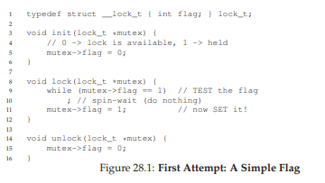
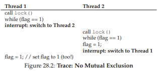
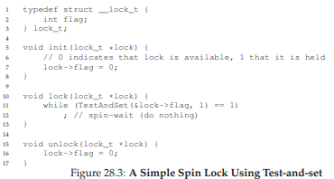
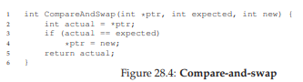
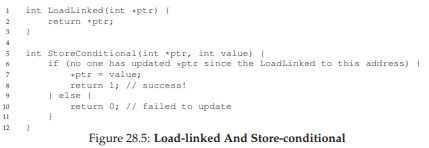
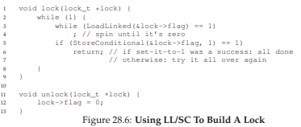
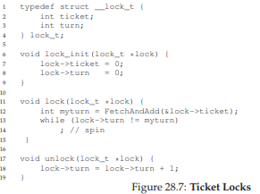
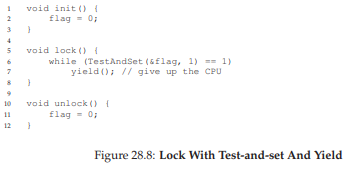
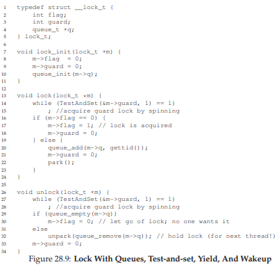
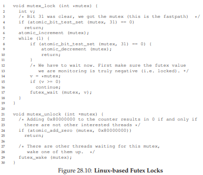

# 28 Locks
並行処理の導入から同時プログラミングの基本的な問題の1つがわかりました。一連の命令を原子性で実行したいのですが、単一プロセッサ(または複数のプロセッサで同時に実行される複数のスレッド)に割り込みがあるため、私たちはできませんでした。この章では、ロックと呼ばれるものを導入して、この問題を直接攻撃しています。プログラマは、ソースコードにロックを付けてクリティカルセクションの周りに置くことで、そのようなクリティカルセクションが単一のアトミック命令であるかのように実行するようにします。

## 28.1 Locks: The Basic Idea
例として、クリティカルセクションが共有変数の標準的な更新であるこのように見えると仮定します。
```c
balance = balance + 1;
```
もちろん、リンクリストに要素を追加するなど、他の重要なセクションも可能ですが、ここではこの簡単な例を続けます。ロックを使用するには、次のようにクリティカルセクションの周りにいくつかのコードを追加します。
```c
1 lock_t mutex; // some globally-allocated lock ’mutex’
2 ...
3 lock(&mutex);
4 balance = balance + 1;
5 unlock(&mutex);
```  
ロックは単なる変数であるため、ロックを使用するには、何らかのロック変数(上記のmutexなど)を宣言する必要があります。このロック変数(または単に「ロック」と略記)は、任意の瞬間にロックの状態を保持します。これは使用可能(またはロック解除またはフリー)なので、スレッドがロックを保持していないか、または取得(またはロックまたは保持)されていないため、ちょうど1つのスレッドがロックを保持しており、ロックを保持しているスレッドや、ロック獲得を注文するためのキューなど、他の情報もデータ型に格納できますが、そのような情報はロックのユーザーからは隠されています。

`lock()`と`unlock()`ルーチンの中身は単純です。ルーチン`lock()`を呼び出すと、ロックを取得しようとします。他のスレッドがロックを保持していない(すなわち解放している)場合、スレッドはロックを取得してクリティカルセクションに入ります。このスレッドはロックの所有者と呼ばれることがあります。別のスレッドが、同じロック変数(この例ではmutex)の`lock()`を呼び出すと、ロックが別のスレッドによって保持されている間は戻りません。このようにして、ロックを保持している最初のスレッドがそこにある間に、他のスレッドがクリティカルセクションに入ることが防止されます。

ロックの所有者が`unlock()`を呼び出すと、ロックは再び使用可能(空き)になります。他のスレッドがロックを待っていない場合(すなわち、他のスレッドが`lock()`を呼び出していない場合)、ロックの状態は単にフリーに変更されます。待機スレッド(`lock()`にスタック)がある場合、そのうちの1つは、ロック状態のこの変更を通知(または通知)し、ロックを取得し、クリティカルセクションに入ります。

ロックは、プログラマーにスケジューリングするための制御を最小限に抑えます。一般に、スレッドはプログラマによって作成されたエンティティとして認識されますが、様々な方法でOSによってスケジュールされます。ロックはその制御の一部をプログラマーに返します。コードの一部にロックをかけることで、プログラマーはそのコード内で単一のスレッドしかアクティブにならないことを保証することができます。したがって、ロックは、伝統的なOSスケジューリングであるカオスをより制御されたアクティビティーに変換するのに役立ちます。

## 28.2 Pthread Locks
ロックのためにPOSIXライブラリが使用する名前は、スレッド間の相互排他を提供するために使用されるmutexです。つまり、あるスレッドがクリティカルセクションにある場合、他のスレッドはセクションを完了するまで入力を排除します。したがって、次のPOSIXスレッドコードを参照すると、上記と同じことが行われていることを理解する必要があります(ロックとロック解除時にエラーをチェックするラッパーも使用します)。
```c
1 pthread_mutex_t lock = PTHREAD_MUTEX_INITIALIZER;
2
3 Pthread_mutex_lock(&lock); // wrapper for pthread_mutex_`lock()`
4 balance = balance + 1;
5 Pthread_mutex_unlock(&lock);
```  
また、異なる変数を保護するために異なるロックを使用している可能性があるため、POSIXバージョンでは変数をロックおよびロック解除することに注意してください。これにより、並行性が向上します。クリティカルセクションにアクセスするたびに使用される1つの大きなロック(粗いロック戦略)の代わりに、異なるデータとデータ構造を異なるロックで保護することが多くなります。したがって、一度に多くのスレッドをロックされたコードにすることができます。

## 28.3 Building A Lock
ここまでで、プログラマの視点から、ロックがどのように機能するかを理解しておく必要があります。しかし、どのようにロックを構築する必要がありますか？どのハードウェアサポートが必要ですか？どのOSがサポートしていますか？この章の残りの部分で取り上げるのは、この一連の質問です。

>> THE CRUX: HOW TO BUILD A LOCK  
>> どのようにして効率的なロックを構築できますか？効率的なロックは低コストで相互排除を提供し、また以下で議論するいくつかの他の特性を達成するかもしれない。どのハードウェアサポートが必要ですか？どのOSがサポートしていますか？

動くロックを構築するためには、私たちの昔の友人、ハードウェア、私たちの良い仲間、OSから何らかの助けが必要です。長年にわたり、さまざまなコンピュータアーキテクチャの命令セットに、いくつかの異なるハードウェアプリミティブが追加されました。私たちはこれらの命令がどのように実装されているのかを研究するつもりはないですが(結局のところ、コンピュータ・アーキテクチャ・クラスの話題である)、それらを使用してロックのような相互排他プリミティブを構築する方法を研究します。また、OSがどのように関係してロックを完成させ、洗練されたロックライブラリを構築できるようにするかについても検討します。

## 28.4 Evaluating Locks
ロックを構築する前に、まず目標が何であるかを理解し、特定のロック実装の有効性を評価する方法を尋ねる必要があります。ロックが機能するかどうかを評価するには、まず基本的な基準を確立する必要があります。最初は、ロックが基本的な作業を行うかどうかです。これは相互排除を提供することです。基本的には、ロックが機能し、複数のスレッドがクリティカルセクションに入るのを防ぎますか？

第二は公平です。ロックを獲得しようとしている各スレッドは、一度解放されるとすぐに獲得することができますか？これを見るもう1つの方法は、より極端なケースを調べることです。ロックを競合するスレッドは、その間に飢えてしまい、二度と取得できないでしょうか？

最終的な基準はパフォーマンスです。具体的には、ロックを使用して追加される時間オーバーヘッドです。ここで考慮する価値のあるいくつかの異なるケースがあります。1つは競合がない場合です。単一のスレッドが実行され、ロックを取得して解放するとき、そのようなオーバーヘッドは何ですか？もう1つは、複数のスレッドが1つのCPU上のロックに対して競合している場合です。この場合、パフォーマンスの問題はありますか？最後に、複数のCPUが関わっているときにロックがどのように動作し、それぞれがロックを競合しますか？これらのさまざまなシナリオを比較することで、以下で説明するように、さまざまなロック手法を使用することによるパフォーマンスの影響をよりよく理解できます。

## 28.5 Controlling Interrupts
相互排除を提供するために使用された最も初期の解決策の1つは、クリティカルセクションの割り込みを無効にすることでした。この解決策は、シングルプロセッサシステム向けに開発されました。コードは次のようになります。
```c
1 void lock() {
2 DisableInterrupts();
3 }
4 void unlock() {
5 EnableInterrupts();
6 }
```
このようなシングルプロセッサシステムで実行していると仮定します。クリティカルセクションに入る前に、ある種の特別なハードウェア命令を使用して割り込みをオフにすることで、クリティカルセクション内のコードが中断されないようにし、アトミックであるかのように実行します。終了すると、(ハードウェア命令を介して)割り込みを再度有効にして、プログラムを通常どおり実行します。

このアプローチの主な点は、単純さです。あなたは確かに、なぜこれが動作するかを理解するためにあなたの頭を悩ます必要はありません。中断することなく、スレッドは、実行するコードが実行され、他のスレッドがそのスレッドに干渉しないことを確実にすることができます。

残念ながら、欠点は多くあります。第1に、このアプローチでは、呼び出しスレッドが特権操作(割り込みのオンとオフを切り替える)を実行できるようにする必要があるため、この機能が悪用されていないことを信頼する必要があります。ご存知のように、任意のプログラムを信頼する必要がある場合は、おそらく問題に陥っている可能性があります。ここで、問題は数多くの形で現れます。欲張りなプログラムは、実行開始時に`lock()`を呼び出してプロセッサを独占することができます。悪質なプログラムや悪意のあるプログラムが`lock()`を呼び出して無限ループに陥る可能性があります。この後者の場合、OSはシステムの制御を元に戻すことはありません。解決する唯一の手段はシステムを再起動する方法です。汎用の同期ソリューションとして割り込みを無効にするには、アプリケーションをあまりにも多くの信頼を必要とします。

第2に、このアプローチはマルチプロセッサでは機能しません。複数のスレッドが異なるCPU上で実行されており、それぞれが同じクリティカルセクションを入力しようとすると、割り込みが無効かどうかは関係ありません。スレッドは他のプロセッサ上で実行できるため、クリティカルセクションに入る可能性があります。マルチプロセッサが普及している現在、我々の一般的な解決策はこれよりも優れていなければなりません。

第3に、割り込みを長時間オフにすると、割り込みが失われ、重大なシステムの問題が発生する可能性があります。たとえば、ディスクデバイスが読み取り要求を完了したという事実をCPUが逃したとします。OSは、この読み込みを待っているプロセスを復帰させる方法をどのように知っていますか？

最後に、おそらく最も重要はほぼないですが、このアプローチは非効率的である可能性があります。通常の命令実行と比較して、割り込みをマスクまたはアンマスクするコードは、最新のCPUによってゆっくり実行される傾向があります。これらの理由から、割り込みを無効にすることは、相互排除プリミティブとして限定されたコンテキストでのみ使用されます。たとえば、オペレーティングシステム自体が、自身のデータ構造にアクセスするとき、または少なくとも混乱した割り込み処理状況が発生しないようにするために、原子性を保証するために割り込みマスクを使用する場合があります。この使用法は理にかなっています。なぜなら、信頼問題がOS内部で消滅するためです。OSは、常に特権操作を実行することを常に信頼しています。

## 28.6 A Failed Attempt: Just Using Loads/Stores
割り込みベースの技術を超えて移動するためには、CPUハードウェアと適切なロックを構築するために提供される命令に依存する必要があります。最初に単一のフラグ変数を使用して単純なロックを構築しようとしましょう。この失敗した試みでは、ロックを構築するために必要ないくつかの基本的なアイデアが表示されます。なぜなら、単一の変数を使用し、通常のロードおよびストアを介してアクセスするだけでは不十分である理由が分かります。

この最初の試み(図28.1)では、アイデアは非常に単純です。単純な変数(フラグ)を使用して、あるスレッドがロックを所有しているかどうかを示します。クリティカルセクションに入る最初のスレッドは、フラグが1(この場合はそうではない)かどうかをテストする`lock()`を呼び出し、スレッドが現在ロックを保持していることを示すフラグを1に設定します。クリティカルセクションが終了すると、スレッドは`unlock()`を呼び出し、フラグをクリアして、ロックがもはや保持されていないことを示します。



最初のスレッドがクリティカルセクションにある間に別のスレッドが`lock()`を呼び出すと、そのスレッドが`unlock()`を呼び出してフラグをクリアするwhileループでスピン待機します。その最初のスレッドがそうすると、待機中のスレッドはwhileループから抜け出し、フラグを1に設定してクリティカルセクションに進みます。

残念ながら、コードには2つの問題があります。1つは正当性、もう1つはパフォーマンスです。正当性の問題は、一度コンカレント・プログラミングを考えるのに慣れれば、簡単に理解できます。図28.2のコードインタリーブを想像してみてください。開始するにはflag = 0とします。このインタリーブからわかるように、タイムリーな(もしくは、タイムリーではなくても)割り込みでは、両方のスレッドがフラグを1に設定し、両方のスレッドがクリティカルセクションに入ることができるケースを簡単に生成できます。この振る舞いは、専門家が「悪い」と呼ぶものであり、相互排除を提供するという最も基本的な要件を明らかに満たしていません。

パフォーマンス問題は、後で詳しく説明しますが、スレッドが既に保持されているロックを取得するために待機する方法です。つまり、フラグの値を無期限にチェックするという方法です。スピン待機は、別のスレッドがロックを解放するのを待って時間を浪費します。ウェイターとして待っているスレッドは実行できません(少なくともコンテキスト切り替えが発生するまで)、ユニプロセッサー上での廃棄は非常に高いです！したがって、より洗練されたソリューションを開発する際には、このような無駄を回避する方法も考慮する必要があります。



## 28.7 Building Working Spin Locks with Test-And-Set
割り込みを無効にすることは複数のプロセッサでは機能しないため、ロードとストアを使用する簡単な方法(前述)が機能しないため、システム設計者はハードウェアによるロックのサポートを開始しました。1960年代初期のBurroughs B5000 [M82]のような最も初期のマルチプロセッサシステムでは、このようなサポートがありました。今日では、単一のCPUシステムであっても、すべてのシステムがこのタイプのサポートを提供しています。理解するための最も簡単なハードウェアサポートは、アトミック交換とも呼ばれるテストアンドセット命令として知られています。以下のCコードスニペットを使って、テスト・アンド・セット命令の動作を定義します。
```c
1 int TestAndSet(int *old_ptr, int new) {
2 int old = *old_ptr; // fetch old value at old_ptr
3 *old_ptr = new; // store ’new’ into old_ptr
4 return old; // return the old value
5 }
```
テスト・アンド・セット命令が行うことは、次のとおりです。ptrが指す古い値を返し、同時にその値を新しい値に更新します。ここで重要な点は、この一連の操作が原子的に実行されることです。"テストと設定"と呼ばれる理由は、古い値(返される値)を"テスト"しながら同時にメモリ位置を新しい値に"設定"できるようにすることです。実際には、図28.3で検討しているように、このわずかに強力な説明は単純なスピンロックを構築するのに十分です。

>> ASIDE: DEKKER’S AND PETERSON’S ALGORITHMS  
>> 1960年代、ダイクストラは彼の友人に同時性問題を提起し、そのうちの1人、Theodorus Jozef Dekkerという数学者が解決策を思いついた[D68]。特別なハードウェア命令とOSサポートを使用するここで説明するソリューションとは異なり、Dekkerのアルゴリズムはロードとストアだけを使用します(ハードウェアが初期のハードウェアでは不可分であったとみなします)。デッカーのアプローチは後にPeterson [P81]によって洗練されました。再び、ロードとストアだけが使用され、2つのスレッドがクリティカルセクションに同時に入らないようにすることが考えられます。ここにPetersonのアルゴリズム(2つのスレッド用)があります。コードを理解できるかどうかを確認してください。フラグとターン変数は何のために使われますか？
```c
int flag[2];
int turn;

void init() {
    flag[0] = flag[1] = 0; // 1->thread wants to grab lock
    turn = 0; // whose turn? (thread 0 or 1?)
}
void lock() {
    flag[self] = 1; // self: thread ID of caller
    turn = 1 - self; // make it other thread’s turn
    while ((flag[1-self] == 1) && (turn == 1 - self))
        ; // spin-wait
}
void unlock() {
    flag[self] = 0; // simply undo your intent
}
```
>> なんらかの理由で、特別なハードウェアサポートなしで動作するロックを開発することは、しばらくの間盛り上がり、理論型に多くの問題を取り組んでいます。もちろん、この作業ラインは、ハードウェアサポートを少しでも簡単に実現できると気づいたときには無用になりました(実際、サポートはマルチプロセッシングの初期から行われていました)。さらに、上記のようなアルゴリズムは、(緩和されたメモリ一貫性モデルのため)現代的なハードウェアでは機能しないため、あまり有用ではありません。つまり、より多くの研究は歴史のゴミ箱に...



なぜこのロックが動作するのかを理解してみましょう。最初にスレッドが`lock()`を呼び出し、現在他のスレッドがロックを保持していない場合を想像してください。したがって、フラグは0になります。スレッドがTestAndSet(flag,1)を呼び出すと、ルーチンはflagの古い値を返します。これは0です。したがって、flagの値をテストしている呼び出し元のスレッドは、whileループでスピンを捕らえることはなく、ロックを取得します。スレッドはアトミックに値を1に設定し、ロックが現在保持されていることを示します。スレッドがクリティカルセクションで終了すると、`unlock()`を呼び出してフラグをゼロに戻します。

1つのスレッドが既にロックを保持している(すなわち、フラグが1である)ときに、想像できる第2の場合が生じます。この場合、このスレッドは`lock()`を呼び出し、TestAndSet(flag、1)も呼び出します。今度は、`TestAndSet()`はフラグを1に戻し(ロックが保持されているため)、再び1に設定します。ロックが別のスレッドによって保持されている限り、`TestAndSet()`は1を繰り返し返します。したがって、このスレッドは、ロックが最後に解放されるまで回転して回転します。フラグが最後に他のスレッドによって0に設定されると、このスレッドは再び`TestAndSet()`を呼び出します。これは、値を1に原子的に設定している間に0を返し、ロックを取得しクリティカルセクションに入ります。

(以前のロック値の)テストと新しい値のセットの両方を1つのアトミック操作にすることで、1つのスレッドだけがロックを取得するようにします。それで、相互排除の基本原則を構築する方法です！

このタイプのロックを通常スピンロックといいます。構築する最も単純なタイプのロックであり、ロックが利用可能になるまでCPUサイクルを使用して単純に回転します。単一のプロセッサ上で正しく動作するためには、プリエンプティブスケジューラ(すなわち、時々異なるスレッドを実行するために、タイマを介してスレッドを中断するスケジューラ)が必要である。プリエンプションなしでは、スピンロックは単一のCPUではあまり意味がありません。CPU上のスレッドが決してそれを放棄しないためです。

## 28.8 Evaluating Spin Locks
基本的なスピンロックが与えられているので、これまで説明した軸に沿ってどれだけ効果的かを評価することができます。 ロックの最も重要な側面は正しさです。それは相互排除を提供しますか？ ここでの答えは「はい」です。スピンロックでは、一度に1つのスレッドだけがクリティカルセクションに入ることができます。 したがって、我々は正しいロックを持っています。

>> TIP: THINK ABOUT CONCURRENCY AS MALICIOUS SCHEDULER  
>> この例から、同時実行を理解するために必要なアプローチを理解することができます。何をしようとすべきなのかは、あなたが悪意のある人物になってみることです。同期プリミティブをビルドする際の微妙な試行錯誤を避けるために、スレッドを最も不適切なタイミングで中断します。あなたはスケジューラなのですか？割り込みの正確なシーケンスは不可能かもしれませんが、それは可能であり、特定のアプローチが機能しないことを実証する必要があります。それは悪意を持って考えるのに役立ちます！(少なくとも、時々)

次の軸は公平です。待機スレッドへのスピンロックはどれくらい公正ですか？待っているスレッドがクリティカルセクションに入ることを保証できますか？残念ながら、ここの答えは悪いニュースです。スピンロックは公正を保証しません。実際、糸の回転は競合の下で永遠に回転することがあります。単純なスピンロック(これまで説明したように)は公平ではなく、飢餓につながる可能性があります。

最終的な軸はパフォーマンスです。スピンロックを使用するコストはいくらですか？これをより慎重に分析するには、いくつかの異なるケースについて考えることをおすすめします。最初は、単一のプロセッサ上でロックを競合するスレッドを想像してください。2番目の方法では、スレッドが多くのCPUに分散されていることを考慮してください。

スピンロックの場合、シングルCPUの場合、パフォーマンスのオーバーヘッドは非常に苦しいことがあります。ロックを保持しているスレッドがクリティカルセクション内で先取りされている場合を想像してください。その後、スケジューラは、他のすべてのスレッド(N-1個の他のスレッドがあると想像してください)を実行し、それぞれがロックを取得しようとします。この場合、それらのスレッドはそれぞれ、CPUを諦める前にタイムスライスの期間スピンし、CPUサイクルが浪費されます。

ただし、複数のCPUでは、スピンロックは正常に機能します(スレッド数がCPU数にほぼ等しい場合)。思考は次のようになります。スレッドAをCPU 1に、スレッドBをCPU 2上に想像してください。どちらもロックを競合しています。スレッドA(CPU1)がロックを取得し、スレッドBがそれを試みると、Bは(CPU2上で)スピンします。しかし、おそらくクリティカルセクションが短く、すぐにロックが利用可能になり、スレッドBによって取得されます。他のプロセッサで保持されているロックを待つためにスピンすることは、この場合には多くのサイクルを無駄にしないので効果的です。

## 28.9 Compare-And-Swap
いくつかのシステムが提供するもう1つのハードウェアプリミティブは、compare-and-swap命令(たとえばSPARC上で呼び出される命令)、またはcompare-and-exchange(x86上で呼び出される)と呼ばれます。この単一命令のC擬似コードは、図28.4にあります。基本的な考え方は、ptrで指定されたアドレスの値が期待どおりであるかどうかをテストするための比較とスワップです。その場合は、ptrが指し示すメモリ位置を新しい値で更新します。そうでない場合は、何もしないでください。どちらの場合でも、実際の値をそのメモリ位置に戻すことで、compare-and-swapを呼び出すコードが成功したかどうかを知ることができます。compare-and-swap命令を使用すると、テストセットの場合と非常によく似た方法でロックを構築できます。たとえば、上記の`lock()`ルーチンを次のものに置き換えることができます。



```c
1 void lock(lock_t *lock) {
2   while (CompareAndSwap(&lock->flag, 0, 1) == 1)
3       ; // spin
4 }
```
コードの残りの部分は上記のテストセットの例と同じです。このコードは全く同じように動作します。フラグが0であるかどうかを単純にチェックし、そうであれば、アトミックに1に入れ替えてロックを取得します。ロックが保持されている間にロックを取得しようとするスレッドは、ロックが最後に解放されるまで回転を停止します。compare-and-swapのC呼び出し可能なx86版を実際に作成する方法を知りたい場合は、このコードシーケンスが便利です([S05]から)
```c
1 char CompareAndSwap(int *ptr, int old, int new) {
2   unsigned char ret;
3
4   // Note that sete sets a ’byte’ not the word
5   __asm__ __volatile__ (
6       " lock\n"
7       " cmpxchgl %2,%1\n"
8       " sete %0\n"
9       : "=q" (ret), "=m" (*ptr)
10      : "r" (new), "m" (*ptr), "a" (old)
11      : "memory");
12  return ret;
13 }
```
最後に、感知したように、比較とスワップはテストとセットより強力な命令です。ロックフリー同期[H91]などのトピックを簡単に掘り下げて、今後このパワーを活用していく予定です。しかし、単純なスピンロックを作成するだけでは、その動作は上記で分析したスピンロックと同じです。

## 28.10 Load-Linked and Store-Conditional
プラットフォームによっては、クリティカルセクションを作成するのに役立つ一対の命令が用意されています。例えば、MIPSアーキテクチャ[H93]では、ロードリンク命令とストア条件命令は、ロックや他の並行構造を構築するために並行して使用できます。これらの命令のC擬似コードは図28.5のとおりです。Alpha、PowerPC、およびARMは同様の命令[W09]を提供しています。



ロードリンクは、一般的なロード命令のように動作し、メモリから値を取り出してレジスタに配置します。キーの違いはstore-conditionalにあります。store-conditionalは、アドレスへの介在するストアが発生していない場合にのみ成功します(ロードされたアドレスに格納された値を更新します)成功の場合、storeconditionalは1を返し、ptrの値をvalueに更新します。失敗した場合、ptrの値は更新されず、0が返されます。  
あなた自身の挑戦として、ロードリンクとストア条件付きを使用してロックを構築する方法を考えてみてください。次に、終了したら、以下のコードを見て、簡単な解決策を提供してください。解決策は図28.6のとおりです。



`lock()`コードは唯一興味深い部分です。最初に、スレッドは、フラグが0に設定されるのを待って回転します(したがって、ロックが保持されていないことを示します)。一旦そのスレッドがstore-conditionalを介してロックを取得しようとすると、成功した場合、スレッドはフラグの値を原子的に1に変更し、クリティカルセクションに進むことができます。ストア条件の失敗がどのように発生する可能性があるかに注意してください。1つのスレッドは`lock()`を呼び出し、load-linkedを実行し、ロックが保持されていない場合は0を返します。tore-conditionalを試みる前に、それは中断され、別のスレッドがロックコードを入力し、ロードリンクされた命令を実行し、0も取得し続けます。この時点で、2つのスレッドがそれぞれロードリンクされて実行され、それぞれがストア条件を試行しようとしています。これらの命令の重要な特徴は、フラグを1に更新してロックを獲得するのに、これらのスレッドの1つだけが成功することです。store-conditionalを試みる第2のスレッドは失敗し(他のスレッドがload-linkedとstoreconditionalの間でフラグの値を更新したため)、再度ロックを取得しようとする必要があります。

>> TIP: LESS CODE IS BETTER CODE (LAUER’S LAW)  
>> プログラマーは、何かをするために書いたコードの量を自慢する傾向があります。そうすることは根本的に壊れている。自慢するべきは、むしろ、与えられた仕事を達成するために書いたコードの量です。簡潔で簡潔なコードが常に優先されます。理解しやすくなり、バグも少なくなります。Hugh Lauer氏は、パイロットオペレーティングシステムの構築について議論するとき、「同じ人が2倍の時間があれば、コードの半分でシステムを生み出すことができます」[L81]このLauerの法則を覚えておく価値があります。次回は、割り当てを完了するために書いたコードの量がどれほどであるか自慢しています。もう一度考え直してください。できるだけ明確かつ簡潔にコードを書き直してください。

数年前の授業では、学部生のDavid Capelが短絡ブール条件を楽しむあなたのために、上記のより簡潔な形式を提案しました。なぜそれが同等であるかを知ることができるかどうかを見てください。それは確かに短いです！
```c
1 void lock(lock_t *lock) {
2   while (LoadLinked(&lock->flag)||!StoreConditional(&lock->flag, 1))
3       ; // spin
4 }
```

## 28.11 Fetch-And-Add
1つの最終的なハードウェアプリミティブはフェッチアンドアド命令です。この命令は、アトミックに値をインクリメントし、特定のアドレスに古い値を戻します。fetch-and-add命令のC疑似コードは次のようになります。
```c
1 int FetchAndAdd(int *ptr) {
2   int old = *ptr;
3   *ptr = old + 1;
4   return old;
5 }
```
この例では、Mellor-CrummeyとScott [MS91]が紹介したように、fetch-and-addを使用してより面白いチケットロックを構築します。ロックとアンロックのコードは図28.7のようになります。このソリューションでは、単一の値の代わりにチケットとターン変数を組み合わせて使用してロックを構築します。基本的な操作は非常に簡単です。スレッドがロックを取得したい場合は、最初にアトミックフェッチとアペンドをチケットの値で行います。その値はこのスレッドの「ターン」(myturn)とみなされます。次に、グローバルに共有されているlock->turnを使用して、そのスレッドの順番を判断します。特定のスレッドで(myturn == turn)のときは、そのスレッドがクリティカルセクションに入るのです。アンロックは、次の待機スレッド(存在する場合)がクリティカルセクションに入ることができるように、ターンをインクリメントするだけで達成されます。



このソリューションとの重要な違いは、これまでの試みとは異なり、すべてのスレッドの進捗状況を保証します。スレッドにチケットの値が割り当てられると、そのスレッドの前にあるスレッドがクリティカルセクションを通過してロックを解除されると、将来のある時点でスケジュールされます。以前の試みでは、そのような保証は存在しませんでした。他のスレッドがロックを取得して解放しても、テストセットで回転するスレッドは永遠に回転する可能性があります。

## 28.12 Too Much Spinning: What Now?
私たちのシンプルなハードウェアベースのロックはシンプルで(数行のコードしかありません)、どんなシステムやコードの2つの優れた特性でも動作します(あなたが望むなら、いくつかのコードを書いても証明できます)。しかし、場合によっては、これらのソリューションは非常に非効率的である可能性があります。1つのプロセッサで2つのスレッドを実行しているとします。今度は、1つのスレッド(スレッド0)がクリティカルセクションにあり、したがってロックが保持され、残念なことに中断されることを想像してください。2番目のスレッド(スレッド1)はロックを取得しようとしましたが、保持されています。したがって、それは回転を開始します。スピンします。その後、もう少し回転します。最後に、タイマー割込みがオフになり、スレッド0が再び実行されてロックが解除され、最後に(スレッドが次に実行されるとき)、スレッド1はそれほど回転する必要はなく、ロックを取得できるようになります。このように、スレッドがこのような状況で回転したときはいつでも、変更を行わない値をチェックするだけで時間切れ全体を無駄にします。問題は、ロックを競合するN個のスレッドで悪化します。N - 1タイムスライスは同様の方法で無駄になり、単なるスレッドが回転を止めてロックを解除するのを待っています。

>> THE CRUX: HOW TO AVOID SPINNING  
>> CPUの時間を無駄にしないロックを開発するにはどうしたらいいですか？

ハードウェアのサポートだけでは問題を解決することはできません。私たちもOSのサポートが必要です！それがどのように機能するかを今考えてみましょう。

## 28.13 A Simple Approach: Just Yield, Baby
ハードウェアのサポートは私たちをかなり遠くにしてくれました。つまり、作業ロック、ロック取得の公平性(チケットロックの場合のように)が得られるようになりました。しかし、我々はまだ問題があります。クリティカルセクションでコンテキストスイッチが発生し、スレッドが無限に回転し始め、中断された(ロックを保持している)スレッドが再び実行されるのを待っていますか？

私たちの最初の試みは、シンプルでフレンドリーなアプローチです。スピンするときに、代わりにCPUを別のスレッドであきらめてください。あるいは、アル・デイヴィスが言うように、“just yield, baby!” [D91]。図28.8にそのアプローチを示します。



このアプローチでは、CPUをあきらめて別のスレッドを実行させたいときにスレッドが呼び出すことができるオペレーティングシステムのプリミティブ`yield()`を想定しています。スレッドは3つの状態(実行中、準備中、ブロック中)のいずれかになります。yieldは、呼び出し元を実行状態から準備完了状態に移動させるシステムコールであり、したがって別のスレッドを実行するように促します。したがって、諦めたプロセスは本質的にそれ自体をスケジュールから外します。

1つのCPU上に2つのスレッドを持つ例を考えてみましょう。この場合、yield base アプローチは非常にうまく機能します。スレッドが`lock()`を呼び出して保持されているロックを見つけた場合、それは単にCPUを諦めるため、もう一方のスレッドで実行してクリティカルセクションを終了します。この単純なケースでは、利回りアプローチがうまく機能します。

ここで、ロックを繰り返し競合するスレッド(たとえば100)が多数ある場合を考えてみましょう。この場合、一方のスレッドがロックを取得して解放する前に先取りされた場合、他方の99スレッドはそれぞれ`lock()`を呼び出し、保持されているロックを見つけてCPUをy諦めます。いくつかの種類のラウンドロビンスケジューラーを仮定すると、ロックを保持しているスレッドが再び実行される前に99のそれぞれがこの実行とyieldをします。回転方法(99回のスライスが回転するのを無駄にする)よりは優れていますが、この方法はまだコストがかかります。コンテクストスイッチのコストが相当に高くなる可能性があり、そのために無駄が多くなります。

さらに悪いことに、我々は飢餓問題に全く取り組んでいません。他のスレッドが繰り返しクリティカルセクションに入り、クリティカルセクションを終了する間、スレッドは無限のyieldループで捕まえられることがあります。この問題に直接対処するアプローチが必要であることは明らかです。

## 28.14 Using Queues: Sleeping Instead Of Spinning
私たちの以前のアプローチの本当の問題は、あまりにも多くのチャンスを残すことです。スケジューラは、次に実行するスレッドを決定します。スケジューラが悪い選択をした場合、ロックを待つ(最初のアプローチ)か、すぐにCPUを降らなければならないスレッドが実行されます(2番目のアプローチ)。いずれにしても、無駄になる可能性があり、飢餓を防ぐことはできません。

したがって、現在の保有者がロックを解放した後にスレッドが次にロックを獲得するような制御を明示的に行う必要があります。これを行うには、もう少しOSサポートと、ロックを獲得するのを待っているスレッドを追跡するキューが必要です。

わかりやすくするために、私たちは、呼び出し元のスレッドをスリープ状態にするための`park()`と、threadIDで指定された特定のスレッドを起動させるためのunpark(threadID)の2つの呼び出しに関して、Solarisによって提供されるサポートを使用します。これらの2つのルーチンは、保持されたロックを獲得しようとすると呼び出し元をスリープ状態にし、ロックが解放されたときにスリープ状態に入るロックを構築するために並行して使用できます。このようなプリミティブの1つの可能な使用を理解するために、図28.9のコードを見てみましょう。

この例では、いくつか面白いことをしています。まず、以前のテストと設定のアイデアをロックを待っているスレッドの明示的なキューと組み合わせて、より効率的なロックを作成します。次に、キューを使用して、次にロックを取得するユーザーを制御し、飢餓を回避します。



基本的には、ロックが使用しているフラグやキューの操作を中心としたスピンロックとして、ガードがどのように使用されているかを知ることができます(図28.9)。したがって、このアプローチはスピン待機を完全に回避しません。ロックを取得または解放している間にスレッドが中断され、他のスレッドがこのスレッドを再び実行するために回転待ちする原因となります。しかし、スピニングに費やされる時間は非常に限られており(ユーザー定義のクリティカルセクションではなく、ロックおよびアンロックコード内のほんの数個の命令)、このアプローチは妥当である可能性があります。

第2に、`lock()`では、スレッドがロックを取得できない(既に保持されている)ときに、自分自身をキューに追加することに注意して(`gettid()`関数を呼び出して現在のスレッドのスレッドIDを取得します)、ガードを0に設定してCPUを諦めさせます。ここで読者のための質問です。ガードロックのリリースが`park()`の後に来た場合、どうなりますか？ヒントは「何か悪い」です。

別のスレッドが起動したときにフラグが0に戻らないという興味深い事実に気付くかもしれません。どうしてこうなるのでしょうか？さて、それはエラーではなく、むしろ必然です！スレッドが起動すると、あたかも`park()`から戻るかのようになります。ただし、コードのその時点でガードを保持していないため、flagを1に設定することさえできません。したがって、ロックをスレッドから直接渡して、次のスレッドにロックを解放します。flagは0の間に設定されません。

最後に、`park()`の呼び出しの直前に、ソリューション内で認識される競合状態に気付くかもしれません。タイミングが間違っていると、ロックは保持されなくなるまでスリープしなければならないとして、スレッドは`park()`しようとしています。その時点で他のスレッド(例えば、ロックを保持しているスレッド)に切り替えると、問題が発生する可能性があります。たとえば、そのスレッドがロックを解除した場合、最初のスレッドによる次の`park()`は、永遠に(潜在的に)スリープ状態になり、時にはウェイクアップ/待機レースと呼ばれる問題が発生します。

>> ASIDE: MORE REASON TO AVOID SPINNING: PRIORITY INVERSION  
>> スピンロックを避ける良い理由の1つはパフォーマンスです。メインテキストで説明したように、スレッドがロックを保持している間中断された場合、スピンロックを使用する他のスレッドは、ロックが利用可能になるのを待つだけの大量のCPU時間を費やします。しかし、いくつかのシステムでスピンロックを避ける別の興味深い理由があることが判明しました。気をつけなければならない問題は、優先度の逆転として知られています。残念なことに、地球[M15]と火星[R97]上で発生する銀河系の間違いです！  
あるシステムに2つのスレッドがあるとします。スレッド2(T2)のスケジューリング優先度は高く、スレッド1(T1)の優先度は低くなります。この例では、実際に両方が実行可能である場合、CPUスケジューラが常にT2を実行すると仮定します。T1は、T2がそうすることができないときにのみ実行されます(例えば、T2がI/Oでブロックされるとき)  
ここで問題です。何らかの理由でT2がブロックされたとします。そのため、T1が走って、スピンロックをつかんでクリティカルセクションに入ります。T2はブロックされなくなり(おそらくI/Oが完了したため)、CPUスケジューラは直ちにスケジューリングします(T1のスケジューリング)。T2は今ではロックを取得しようとします(T1がロックを保持できないため)、回転し続けます。ロックはスピンロックであるため、T2は永遠に回転し、システムはハングアップします。スピンロックの使用を避けるだけで、残念ながら、反転の問題を避けることはできません。3つのスレッドT1、T2、T3を考えてみましょう。T3は最高優先度、T1は最低です。今、T1がロックを取得したと想像してください。T3が起動し、T1よりも優先順位が高いため、すぐに実行されます(T1を先取りします)。T3はT1が保持しているロックを取得しようとしますが、T1はまだそのロックを保持しているため、スタックで待機します。T2が実行を開始すると、T1より優先度が高くなり、T2が実行されます。T2より優先度の高いT3は、T1が待機中のところにスタックされています。強烈なT3は走れず、T2がCPUをコントロールしているのは悲しいことですか？高い優先順位を持つことは、これまでのようなものではありません。  
優先順位の逆転の問題には、さまざまな方法で対応できます。スピンロックによって問題が発生する特定のケースでは、スピンロックの使用を避けることができます(詳細は後述)。より一般的には、優先度の低いスレッドを待っている優先度の高いスレッドは、優先度の高い継承として知られている逆転を実行して克服できるように、下位スレッドの優先度を一時的に引き上げることができます。最後の解決策は最も簡単です。すべてのスレッドが同じ優先順位を持っていることを確認してください。

Solarisでは、`setpark()`という3番目のシステムコールを追加することでこの問題を解決しています。このルーチンを呼び出すことによって、スレッドはパークしようとしていることを示すことができます。その後、パークが実際に呼び出される前に中断され、別のスレッドがパーク解除を呼び出すと、後続のパークはスリープする代わりにすぐに戻ります。`lock()`内のコード変更は非常に小さいです。
```c
1 queue_add(m->q, gettid());
2 setpark(); // new code
3 m->guard = 0;
```  
別の解決方法では、ガードをカーネルに渡すことができます。その場合、カーネルはロックをアトミックに解放し、実行中のスレッドをデキューするための予防措置を講じることができます。

## 28.15 Different OS, Different Support
これまで、スレッドライブラリでより効率的なロックを構築するために、OSが提供できるサポートの1つを見てきました。 他のOSも同様のサポートを提供しています。 詳細は異なります。

たとえば、Linuxでは、Solarisインタフェースに似ていますが、より多くのカーネル内の機能を提供するフューテックスが提供されています。具体的には、各フューテックスには、フューテックス内カーネルキューと同様に、特定の物理メモリロケーションが関連付けられています。発信者はフューテックスコール(後述)を使用して、必要に応じてsleepとwakeを行うことができます。

具体的には、2つの呼が利用可能です。futex wait(address、expected)の呼び出しは、addressの値がexpectedと等しいと仮定して、呼び出しスレッドをスリープ状態にします。同じでない場合、呼び出しはただちに戻ります。ルーチンfutex wake(アドレス)への呼び出しは、キューで待機しているスレッドを起動します。Linux mutexでのこれらの呼び出しの使用法を図28.10に示します。



nptlライブラリ(gnu libcライブラリの一部)[L09]のlowlevellock.hにあるこのコードスニペットは、いくつかの理由で興味深いものです。まず、ロックが保持されているかどうか(整数の上位ビット)とロックのウェイタ数(その他のすべてのビット)を追跡するために、単一の整数を使用します。したがって、ロックが負の場合、ロックは保持されています(上位ビットが設定され、そのビットが整数の符号を決定するため)。

次に、コードスニペットは、一般的なケース、特にロックの競合がない場合に最適化する方法を示しています。ロックを取得して解放するスレッドが1つしかないため、ほとんど作業が行われません(アトミックビットのテストとロックを設定し、ロックを解除するためのアトミックな追加を行う)

この"実世界"ロックの残りの部分をパズルを当てはめて、その動作を理解できるかどうかを確認してください。それをやって、少なくとも誰かが何かこの本について聞いてきたときに答えれるようなLinuxのlockマスターになりましょう。

## 28.16 Two-Phase Locks
最終的な注記：Linuxのアプローチは、古いアプローチを好んで使っており、少なくとも数年にわたってオン・オフされ、1960年代初めにダム・ロックズ(Dahm Locks)[M82]までさかのぼる古いアプローチである2フェーズロックをもっています。2フェーズロックは、特にロックが解放されようとしている場合に、回転が便利であることを認識しています。したがって、最初のフェーズでは、ロックはロックを獲得できることを期待してしばらくの間、回転します。

ただし、最初のスピンフェーズでロックが取得されない場合は、呼び出し元がスリープ状態になる2番目のフェーズに入り、後でロックが解放されたときにのみ起動します。上のLinuxロックはそのようなロックの一種ですが、一回だけ回転します。futexサポートを使用してスリープする前に、これを一般化すると固定された時間ループ内で回転する可能性があります。

2フェーズロックは、2つの良いアイデアを組み合わせることで、より良いアイデアを生むハイブリッドアプローチのもう一つの例です。もちろん、それはハードウェア環境、スレッド数、その他の仕事量の詳細など、多くのことに強く依存します。いつものように、すべての可能なユースケースに適した単一の汎用ロックを作成することは非常に困難です。

## 28.17 Summary
上記のアプローチは、最近のロックの構築方法を示しています。いくつかのハードウェアサポート(より強力な命令の形式)とオペレーティングシステムのサポート(例えば、Solarisの`park()`やun`park()`プリミティブ、futex Linuxの場合)もちろん、詳細は異なります。そのようなロックを実行する正確なコードは、通常、高度に調整されています。詳細を表示したい場合は、SolarisまたはLinuxのコードベースを調べてください。これらは魅力的な読書です[L09、S09]。現代のマルチプロセッサ[D+13]のロック戦略の比較のためのDavidらの優れた作業も参照してください。

## 参考文献

[D91] “Just Win, Baby: Al Davis and His Raiders”  
Glenn Dickey, Harcourt 1991  
There even exists a book about Al Davis and his famous “just win” quote. Or, we suppose, the book is more about Al Davis and the Raiders, and maybe not just the quote. Read the book to find out? But just to be clear: we are not recommending this book, we just needed a citation for the quote.

[D+13] “Everything You Always Wanted to Know about Synchronization  
but Were Afraid to Ask”  
Tudor David, Rachid Guerraoui, Vasileios Trigonakis  
SOSP ’13, Nemacolin Woodlands Resort, Pennsylvania, November 2013
An excellent recent paper comparing many different ways to build locks using hardware primitives. A great read to see how many ideas over the years work on modern hardware.

[D68] “Cooperating sequential processes”  
Edsger W. Dijkstra, 1968  
Available: http://www.cs.utexas.edu/users/EWD/ewd01xx/EWD123.PDF  
One of the early seminal papers in the area. Discusses how Dijkstra posed the original concurrency problem, and Dekker’s solution.

[H93] “MIPS R4000 Microprocessor User’s Manual”  
Joe Heinrich, Prentice-Hall, June 1993  
Available: http://cag.csail.mit.edu/raw/documents/R4400 Uman book Ed2.pdf  

[H91] “Wait-free Synchronization”  
Maurice Herlihy  
ACM Transactions on Programming Languages and Systems (TOPLAS)  
Volume 13, Issue 1, January 1991  
A landmark paper introducing a different approach to building concurrent data structures. However, because of the complexity involved, many of these ideas have been slow to gain acceptance in deployed systems.

[L81] “Observations on the Development of an Operating System”  
Hugh Lauer  
SOSP ’81, Pacific Grove, California, December 1981  
A must-read retrospective about the development of the Pilot OS, an early PC operating system. Fun and full of insights.

[L09] “glibc 2.9 (include Linux pthreads implementation)”  
Available: http://ftp.gnu.org/gnu/glibc/  
In particular, take a look at the nptl subdirectory where you will find most of the pthread support in Linux today.

[M82] “The Architecture of the Burroughs B5000  
20 Years Later and Still Ahead of the Times?”  
Alastair J.W. Mayer, 1982  
www.ajwm.net/amayer/papers/B5000.html  
From the paper: “One particularly useful instruction is the RDLK (read-lock). It is an indivisible operation which reads from and writes into a memory location.” RDLK is thus an early test-and-set primitive, if not the earliest. Some credit here goes to an engineer named Dave Dahm, who apparently invented a number of these things for the Burroughs systems, including a form of spin locks (called “Buzz Locks”) as well as a two-phase lock eponymously called “Dahm Locks.”

[M15] “OSSpinLock Is Unsafe”  
John McCall  
Available: mjtsai.com/blog/2015/12/16/osspinlock-is-unsafe  
A short post about why calling OSSpinLock on a Mac is unsafe when using threads of different priorities – you might end up spinning forever! So be careful, Mac fanatics, even your mighty system sometimes is less than perfect...

[MS91] “Algorithms for Scalable Synchronization on Shared-Memory Multiprocessors”  
John M. Mellor-Crummey and M. L. Scott  
ACM TOCS, Volume 9, Issue 1, February 1991  
An excellent and thorough survey on different locking algorithms. However, no operating systems support is used, just fancy hardware instructions.

[P81] “Myths About the Mutual Exclusion Problem”  
G.L. Peterson  
Information Processing Letters, 12(3), pages 115–116, 1981  
Peterson’s algorithm introduced here.  

[R97] “What Really Happened on Mars?”  
Glenn E. Reeves  
Available: research.microsoft.com/en-us/um/people/mbj/Mars Pathfinder/Authoritative Account.html  
A detailed description of priority inversion on the Mars Pathfinder robot. This low-level concurrent code matters a lot, especially in space!

[S05] “Guide to porting from Solaris to Linux on x86”  
Ajay Sood, April 29, 2005  
Available: http://www.ibm.com/developerworks/linux/library/l-solar/

[S09] “OpenSolaris Thread Library”  
Available: http://src.opensolaris.org/source/xref/onnv/onnv-gate/  
usr/src/lib/libc/port/threads/synch.c  
This is also pretty interesting to look at, though who knows what will happen to it now that Oracle owns Sun. Thanks to Mike Swift for the pointer to the code.

[W09] “Load-Link, Store-Conditional”  
Wikipedia entry on said topic, as of October 22, 2009  
http://en.wikipedia.org/wiki/Load-Link/Store-Conditional  
Can you believe we referenced wikipedia? Pretty lazy, no? But, we found the information there first, and it felt wrong not to cite it. Further, they even listed the instructions for the different architectures: ldl l/stl c and ldq l/stq c (Alpha), lwarx/stwcx (PowerPC), ll/sc (MIPS), and ldrex/strex (ARM version 6 and above). Actually wikipedia is pretty amazing, so don’t be so harsh, OK?

[WG00] “The SPARC Architecture Manual: Version 9”  
David L. Weaver and Tom Germond, September 2000  
SPARC International, San Jose, California  
Available: http://www.sparc.org/standards/SPARCV9.pdf  
Also see: http://developers.sun.com/solaris/articles/atomic sparc/ for some more details on Sparc atomic operations.

[prev](../27/27.md)|[next](../29/29.md)
