# 29 Lock-based Concurrent Data Structures
ロックの説明を終わる前に、いくつかの一般的なデータ構造でロックを使用する方法をまず説明します。データ構造体にロックを追加してスレッドで使用できるようにすると、構造体のスレッドが安全になります。もちろん、そのようなロックがどのように追加されるかは、データ構造の正確さとパフォーマンスの両方を決定します。

>> CRUX: HOW TO ADD LOCKS TO DATA STRUCTURES  
>> 特定のデータ構造が与えられたら、それを正しく動作させるために、どのようにロックを追加するべきですか？さらに、データ構造が高性能をもたらすようにロックを追加すると、多くのスレッドが同時に構造にアクセスできるようになります。

もちろん、すべてのデータ構造や並行処理を追加するためのすべてのメソッドをカバーすることは難しいでしょう。何年もの間研究されてきたトピックであり、数千もの研究論文が出版されています。したがって、私たちは、必要とされる思考のタイプを十分に紹介し、あなた自身のさらなる調査のために、いくつかの良い資料源を参照することを望みます。私たちはMoirとShavitの調査が大きな情報源であることを発見しました[MS04]。

## 29.1 Concurrent Counters
最も単純なデータ構造の1つはカウンタです。これは一般的に使用され、簡単なインタフェースを持つ構造です。図29.1に単純な非同期カウンタを定義します。

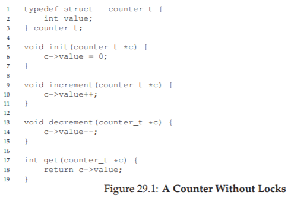

### Simple But Not Scalable
ご覧のように、非同期カウンタは簡単なデータ構造であり、実装するには少量のコードしか必要としません。私たちは次の課題を抱えています。このコードを安全にするにはどうしたらいいですか？図29.2に、その方法を示します。

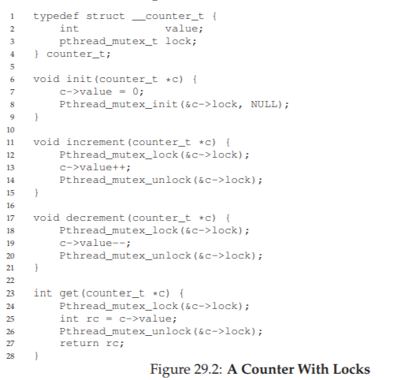

この並行カウンタは単純で、正しく動作します。実際、単純で最も基本的な並行データ構造に共通する設計パターンに従います。データ構造を操作するルーチンを呼び出すときに取得され、呼び出しから戻ったときに解放される単一のロックを単純に追加します。この方法では、モニターを使用して構築されたデータ構造[BH73]に似ています。ここでは、ロックを取得し、オブジェクトメソッドから呼び出して戻すときに自動的に解放されます。

この時点で、作業中の同時データ構造があります。問題はパフォーマンスです。データ構造が遅すぎる場合は、単なるロックを追加する以上のことが必要です。そのような最適化は、必要に応じて、この章の残りの部分のトピックです。データ構造が遅すぎない場合は、それ以上何もしないでよいことに注意してください。シンプルなものがうまくいけば何か面白くする必要はありません。

単純なアプローチのパフォーマンスコストを理解するために、各スレッドが単一の共有カウンタを一定回数更新するベンチマークを実行します。スレッドの数を変更します。図29.3は、1〜4つのスレッドをアクティブにしたときの合計時間を示しています。各スレッドはカウンタを100万回更新します。この実験は、Intel 2.7GHz i5 CPU 4台を搭載したiMac上で実行されました。より多くのCPUがアクティブになると、単位時間あたりの総作業量が増えることを期待します。

図の一番上の行（正確に表示されている）から、同期カウンタのパフォーマンスが不十分であることがわかります。1回のスレッドではわずかな時間（約0.03秒）で100万回のカウンタ更新を完了できますが、2つのスレッドでそれぞれ100万回更新すると5秒以上かかることになります。スレッド数が増えれば悪化します。

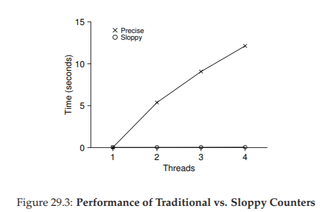

理想的には、複数のプロセッサで一つのスレッドを一つのプロセッサで完了するのが理想的です。この目的を達成することを完璧なスケーリングといいます。より多くの作業が行われても、それは並行して行われるため、タスクを完了するのにかかる時間は増加しません。

### Scalable Counting
驚いたことに、研究者は、よりスケーラブルなカウンターを何年も構築する方法を研究しました[MS04]。オペレーティングシステムパフォーマンス分析の最近の作業では[B+10]が示されているため、スケーラブルカウンタが重要であるという事実はさらに驚くべきことです。スケーラブルなカウントをせずに、Linux上で実行される仕事量の中には、マルチコアマシンでのスケーラビリティの問題が深刻です。この問題を攻撃するために多くのテクニックが開発されていますが、ここでは特定のアプローチを説明します。最近の研究[B+10]で紹介されたこのアイデアは、お粗末なカウンターとして知られています。

粗雑なカウンタは、多数のローカル物理カウンタ（CPUコアごとに1つ）と単一のグローバルカウンタを一つの論理カウンタとして動作します。具体的には、4つのCPUを持つマシンでは、4つのローカルカウンタと1つのグローバルカウンタがあります。これらのカウンタに加えて、それぞれにロックがあります。（ローカルカウンタごとに1つ、グローバルカウンタに1つ）

粗末なカウントの基本的な考え方は次のとおりです。特定のコアで実行されているスレッドがカウンタをインクリメントしたい場合は、ローカルカウンタをインクリメントします。このローカルカウンタへのアクセスは、対応するローカルロックを介して同期されます。各CPUには独自のローカルカウンタがあるため、CPU間のスレッドは競合することなくローカルカウンタを更新できるため、カウンタの更新はスケーラブルです。

しかし、グローバルカウンタを最新の状態に保つために（スレッドがその値を読みたい場合）、ローカル値はグローバルロックを取得し、ローカルカウンタの値でインクリメントすることによって、グローバルカウンタに定期的に転送されます。ローカルカウンタはゼロにリセットされます。

どのくらいの頻度でこのローカルからグローバルへの転送が発生するかは、閾値（ここではSと呼ぶ）によって決まります。Sが小さいほど、カウンタは上記のスケーラブルではないカウンタのように動作します。Sが大きければ大きいほど、カウンターのスケーラビリティーは向上しますが、実際のカウントからグローバル値は遠く離れたものになる可能性があります。正確な値を得るためにすべてのローカル・ロックとグローバル・ロックを（デッドロックを回避するために指定された順序で）取得できますが、それはスケーラブルではありません。

これを明確にするために、例を見てみましょう（図29.4）。この例では、しきい値Sは5に設定され、ローカルカウンタL1〜L4を更新する4つのCPUのそれぞれにスレッドがあります。トレースにはグローバルカウンタ値（G）も表示され、時間が下がります。各時間ステップで、ローカルカウンタをインクリメントすることができる。ローカル値が閾値Sに達すると、ローカル値がグローバルカウンタに転送され、ローカルカウンタがリセットされます。

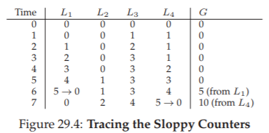

図29.3の下段には、閾値Sが1024の粗末なカウンタのパフォーマンスが示されています。4つのプロセッサで400万回のカウンタを更新するのにかかる時間は、1つのプロセッサで100万回更新するのにかかる時間よりもほとんど変わりません。

図29.6に、閾値Sの重要性を示します。4つのスレッドがそれぞれ4つのCPUで100万回カウンタをインクリメントします。Sが低い場合、パフォーマンスは低下します（ただし、グローバルカウントは常に正確です）。Sが高い場合、パフォーマンスは優れていますが、グローバルカウントが遅れます（CPUの数にSを掛けたものが最大でも）。この精度/性能のトレードオフは、厄介なカウンタが可能にするものです。

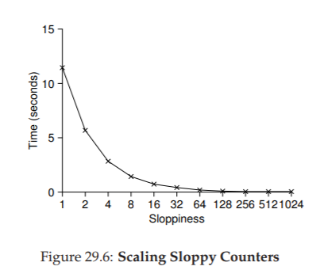

このようなちょっとしたカウンターの大まかなバージョンが図29.5にあります。それを読んで、あるいはより良い方法で、それがどのように機能するかをよりよく理解するために、いくつかの実験をしてみてください。

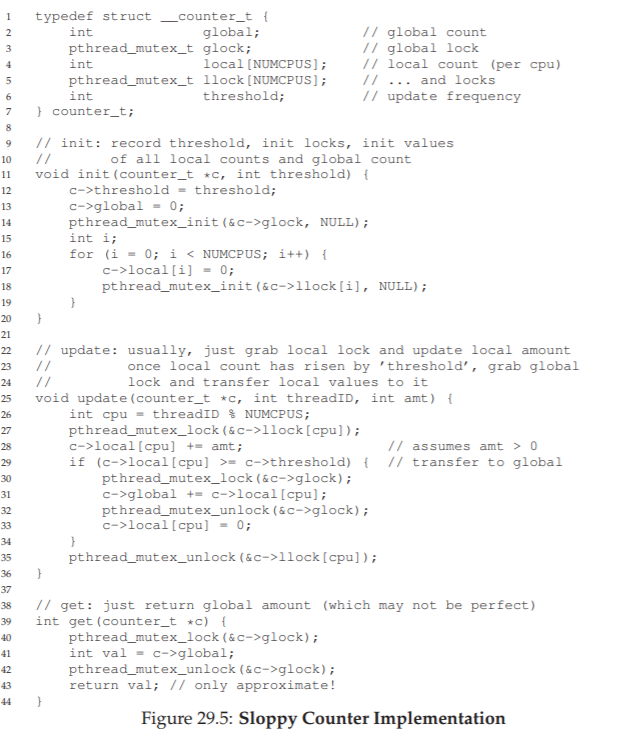

## 29.2 Concurrent Linked Lists
次に、より複雑な構造、linked listを調べます。基本的なアプローチからもう一度始めましょう。簡単にするために、このようなリストには明白なルーチンをいくつか省略し、同時に挿入することに重点を置いていきます。私たちは読者にルックアップや削除などについて考えるようにします。図29.7に、この初歩的なデータ構造のコードを示します。

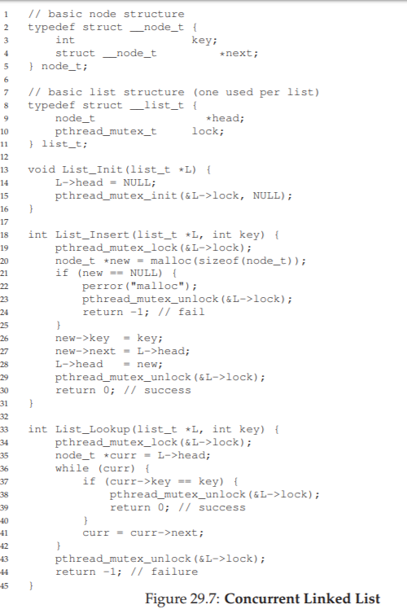

コードでわかるように、コードは入力時に挿入ルーチン内のロックを取得し、終了時に解放します。malloc（）が失敗する（まれなケース）場合、小さなトリッキーな問題が発生します。この場合、コードは挿入を失敗する前にロックを解除する必要があります。

この種の例外的な制御フローは、かなりエラーを起こしやすいことが示されています。最近のLinuxカーネルパッチの調査では、稀にしか使われていないコードパスでは、バグの巨大な部分（ほぼ40％）が検出されていることが分かりました（実際に、この観察は私たち自身の研究の一部を喚起しました。Linuxファイルシステムであり、より堅牢なシステムとなる[S+11]）

私たちは挿入とルックアップルーチンが同時挿入のもとで正しいままであるように書き直すことはできますが、失敗パスでもロックを解除する呼び出しを追加する必要がある場合は避ける必要があるのでしょうか？

この場合の答えは「はい」です。具体的には、ロックと解放が挿入コード内の実際のクリティカルセクションのみを囲み、参照コードで共通の終了パスが使用されるように、コードを少し並べ替えることができます。

前者は実際にはルックアップの一部がロックされる必要がないため動作します。malloc（）自体がスレッドセーフであると仮定すると、各スレッドは競合状態や他の並行性のバグを心配することなくスレッドに呼び出すことができます。共有リストを更新するときだけ、ロックを保持する必要があります。これらの変更の詳細については、図29.8を参照してください。

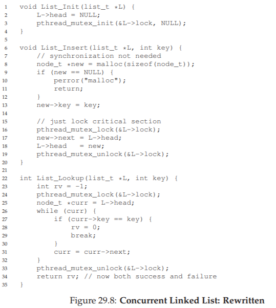

ルックアップルーチンは、メインの検索ループから単一のリターンパスにジャンプする単純なコード変換です。再度コードをロックすると、コード内のロック取得/解放ポイントの数が減り、誤ってバグ（コードを返す前にロックを解除することを忘れるなど）がコードに挿入される可能性が低くなります。

### Scaling Linked Lists
私たちは再び基本的な並行リンクリストを持っていますが、もう一度、それは特にうまく調整できない状況にあります。リスト内でより多くの並行処理を可能にするために研究者が検討した手法の1つは、ハンドオーバーハンドロック（a.k.a.lock coupling）[MS04]です。

アイデアはかなり簡単です。リスト全体を単一のロックにする代わりに、リストのノードごとにロックを追加します。リストをトラバースすると、コードは最初に次のノードのロックを取得し、現在のノードのロックを解除します（これがhand-over-handの名前を意味します）

概念的には、ハンドオーバーハンドリンクリストは素晴らしいです。これはリスト操作で高度な並行性を実現します。しかし、実際には、リストトラバーサルの各ノードのロックを取得して解放するオーバーヘッドが法外なので、単純なシングルロックアプローチよりも速くそのような構造を作るのは難しいです。

非常に大きなリストと多数のスレッドがあっても、複数の進行中のトラバーサルを許可することによって可能になる同時実行性は、単純に単一のロックを取得し、操作を実行し、解放するよりも速くなる可能性は低いです。多分、ある種のハイブリッド（あなたが非常に多くのノードごとの新しいロックを取得する場所）は調査する価値があります。

>> TIP: MORE CONCURRENCY ISN’T NECESSARILY FASTER  
>> 設計するスキームがオーバーヘッドを増やす場合（例えば、ロックを一度ではなく頻繁に取得して解放するなど）、それがより同時であるという事実は重要ではないかもしれません。シンプルなスキームは、特にコストのかかるルーチンをめったに使用しないとうまくいく傾向があります。より多くのロックと複雑さを追加することはあなたの没落につながります。すべてのことには、両方の選択肢（単純だが同時性は低く、複雑性は高いがそれ以上のもの）を構築し、それがどのように行われるかを実際に比べる1つの方法があります。結局のところ、あなたはパフォーマンスを欺くことはできません。あなたの考えはより速いか、そうではないかです。

>> TIP: BE WARY OF LOCKS AND CONTROL FLOW  
>> 並行コードおよび他の場所で有用な一般的な設計のヒントは、関数の戻り、終了、または関数の実行を停止させる他の類似のエラー条件につながる制御フローの変化に注意することです。エラーが発生したときにロックを獲得したり、メモリを割り当てたり、他の同様のステートフルな操作を行うことで多くの関数が始まるので、コードはエラーの起こりやすい状態に戻る前にすべての状態を元に戻す必要があります。したがって、このパターンを最小限にするためにコードを構造化することが最善です。

## 29.3 Concurrent Queues
今のところ分かっているように、同時ロック・データ構造を作る標準的な方法があります。大きなロックを追加することです。キューの場合は、それを把握できると仮定して、そのアプローチをスキップします。

代わりに、MichaelとScott [MS98]によって設計されたわずかに並行したキューを見てみましょう。このキューに使用されるデータ構造とコードは、次のページの図29.9にあります。

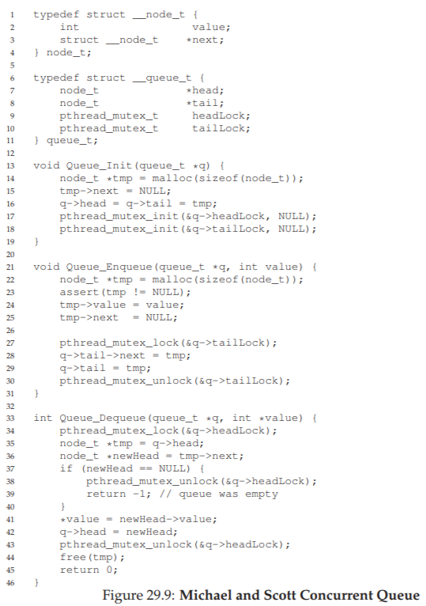

このコードを注意深く調べると、キューの先頭と末尾の2つのロックがあることに気付くでしょう。これらの2つのロックの目的は、エンキュー操作とデキュー操作の同時実行を可能にすることです。一般的なケースでは、エンキュールーチンはテールロックにのみアクセスし、ヘッドロックのみをデキューします。

MichaelとScottが使うトリックの1つは、（キューの初期化コードで割り当てられた）ダミーノードを追加することです。このダミーは、頭と尾の動作の分離を可能にします。コードを研究するか、それを入力して実行し、それを測定し、それがどのように深く働くかを理解してください。

キューはマルチスレッドアプリケーションで一般的に使用されます。しかし、ここで（ロックだけで）使用されるキューのタイプは、しばしばそのようなプログラムのニーズを完全に満たすものではありません。キューが空であるか過度に満たされている場合にスレッドが待機できるように、より完全に開発されたバウンド・キューは、条件変数に関する次の章で集中的に学んでいきます。それを見てください。

## 29.4 Concurrent Hash Table
シンプルで広く適用可能な並行データ構造であるハッシュテーブルを使用して、議論を終了します。サイズを変更しない単純なハッシュテーブルに焦点を当てます。私たちが読者のための練習として残すリサイズを扱うためにはもう少し作業が必要です（申し訳ありません）。

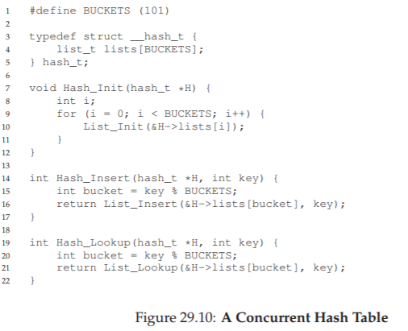

この並行ハッシュテーブルは簡単で、先に開発した並行リストを使用して作成され、非常にうまく機能します。その優れたパフォーマンスの理由は、構造全体に対して単一のロックを持つ代わりに、ハッシュ・バケットごとのロックを使用するためです（それぞれがリストで表されます）。これにより、多くの同時操作が可能になります。

図29.11には、同時更新中のハッシュテーブルのパフォーマンス（同一のiMacで4つのCPUを使用して、4つのスレッドそれぞれから10,000〜50,000の同時更新が行われています）を示しています。また、比較のために、linked list（単一のロックを持つ）のパフォーマンスを示します。

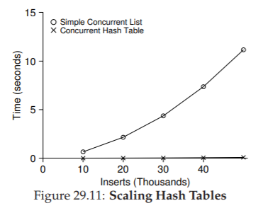

グラフからわかるように、このシンプルな同時ハッシュテーブルは非常にスケーラブルです。対照的に、linked listはそうではありません。

>> TIP: AVOID PREMATURE OPTIMIZATION (KNUTH’S LAW)  
>> 並行データ構造を構築する場合は、最も基本的なアプローチから始めます。これは、同期アクセスを提供するために単一の大きなロックを追加することです。そうすることで、適切なロックを構築することができます。パフォーマンス上の問題を抱えていることが判明した場合は、それを改良して、必要に応じて高速化するだけです。Knuthが有名に述べたように、「時期尚早最適化はすべての悪の根源です。  
多くのオペレーティングシステムでは、最初にSun OSやLinuxなどのマルチプロセッサに移行するときに、単一のロックを利用していました。後者の場合、このロックには大きなカーネルロック（BKL）という名前があります。長年にわたり、この単純なアプローチは良いものでしたが、マルチCPUシステムが標準となったときに、カーネル内の単一のアクティブなスレッドを一度に許可するだけでは、パフォーマンスのボトルネックになりました。したがって、最終的には、改善された並行性の最適化をこれらのシステムに追加することになりました。Linuxでは、より単純なアプローチが採用されました。一つのロックを多くのものに置き換えます。  
Sunの中ではより根本的な決断が下されました。Solarisと呼ばれるまったく新しいオペレーティングシステムを構築します。このオペレーティングシステムは、より基本的に同時実行性を組み込んでいます。これらの魅力的なシステムの詳細については、LinuxおよびSolarisカーネルの本を読んでください。[BC05、MM00]

## 29.5 Summary
カウンターからリストとキューへの並行データ構造のサンプリングを導入し、最後にユビキタスであり、よく使用されるハッシュテーブルに導入しました。私たちは、その途中でいくつかの重要な教訓を学びました。制御フローの変更に伴うロックの獲得と解放に注意すること。並行性を高めることが必ずしもパフォーマンスを向上させるとは限りません。そのパフォーマンスの問題は、それらが存在する場合にのみ修正する必要があります。この最後の点は、時期尚早な最適化を避けるパフォーマンスに配慮した開発者の中心です。最適化することでアプリケーションの全体的なパフォーマンスが改善されない場合には意味がありません。

もちろん、私たちは高性能構造の表面をみました。詳細については、Moir and Shavitの優れた調査と、他の情報源へのリンク[MS04]を参照してください。特に、他の構造（Bツリーなど）に興味があるかもしれません。これはデータベースクラスが最善の策です。伝統的なロックをまったく使用しないテクニックに興味があるかもしれません。このようなノンブロッキングのデータ構造は、一般的な並行性のバグに関する章で味わうことができるものですが、率直に言えば、この謙虚な本よりも多くの研究を必要とする知識の全領域です。あなたが興味を持っていることは、いつものようにあなた自身でさらに調べてください。

## 参考文献
[B+10] “An Analysis of Linux Scalability to Many Cores”  
Silas Boyd-Wickizer, Austin T. Clements, Yandong Mao, Aleksey Pesterev, M. Frans Kaashoek, Robert Morris, Nickolai Zeldovich  
OSDI ’10, Vancouver, Canada, October 2010  
A great study of how Linux performs on multicore machines, as well as some simple solutions.  

[BH73] “Operating System Principles”  
Per Brinch Hansen, Prentice-Hall, 1973  
Available: http://portal.acm.org/citation.cfm?id=540365  
One of the first books on operating systems; certainly ahead of its time. Introduced monitors as a concurrency primitive.

[BC05] “Understanding the Linux Kernel (Third Edition)”  
Daniel P. Bovet and Marco Cesati  
O’Reilly Media, November 2005  
The classic book on the Linux kernel. You should read it.  

[L+13] “A Study of Linux File System Evolution”  
Lanyue Lu, Andrea C. Arpaci-Dusseau, Remzi H. Arpaci-Dusseau, Shan Lu  
FAST ’13, San Jose, CA, February 2013  
Our paper that studies every patch to Linux file systems over nearly a decade. Lots of fun findings in there; read it to see! The work was painful to do though; the poor graduate student, Lanyue Lu, had to look through every single patch by hand in order to understand what they did.

[MS98] “Nonblocking Algorithms and Preemption-safe Locking on Multiprogrammed Sharedmemory Multiprocessors”  
M. Michael and M. Scott  
Journal of Parallel and Distributed Computing, Vol. 51, No. 1, 1998  
Professor Scott and his students have been at the forefront of concurrent algorithms and data structures for many years; check out his web page, numerous papers, or books to find out more.

[MS04] “Concurrent Data Structures”  
Mark Moir and Nir Shavit  
In Handbook of Data Structures and Applications  
(Editors D. Metha and S.Sahni)  
Chapman and Hall/CRC Press, 2004  
Available: www.cs.tau.ac.il/˜shanir/concurrent-data-structures.pdf  
A short but relatively comprehensive reference on concurrent data structures. Though it is missing some of the latest works in the area (due to its age), it remains an incredibly useful reference.

[MM00] “Solaris Internals: Core Kernel Architecture”  
Jim Mauro and Richard McDougall  
Prentice Hall, October 2000  
The Solaris book. You should also read this, if you want to learn in great detail about something other than Linux.

[S+11] “Making the Common Case the Only Case with Anticipatory Memory Allocation”  
Swaminathan Sundararaman, Yupu Zhang, Sriram Subramanian, Andrea C. Arpaci-Dusseau, Remzi H. Arpaci-Dusseau  
FAST ’11, San Jose, CA, February 2011  
Our work on removing possibly-failing calls to malloc from kernel code paths. The idea is to allocate all potentially needed memory before doing any of the work, thus avoiding failure deep down in the storage stack.
