# 30 Condition Variables
これまでのところ、ロックの概念を開発し、ハードウェアとOSの適切な組み合わせで適切に構築する方法を見てきました。残念ながら、ロックは、並行プログラムを構築するために必要な唯一の方法ではありません。

特に、スレッドは、実行を続行する前に条件が真であるかどうかをチェックしたい場合があります。たとえば、親スレッドは、子スレッドが完了する前に完了しているかどうかを確認したい場合があります(これはよく`join()`と呼ばれます)。どのようにそのような待って実装する必要がありますか？図30.1を見てみましょう。

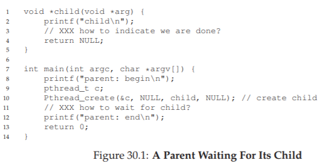

ここで見たいのは、次の出力です。
```
parent: begin
child
parent: end
```  
図30.2に示すように、共有変数を使用してみることもできます。このソリューションは一般的には機能しますが、親が回転してCPU時間を無駄にするため、非常に非効率的です。ここで私たちが望むのは、私たちが待っている状態(例えば、子供が実行されている)が成立するまで、親を寝かせる何らかの方法です。

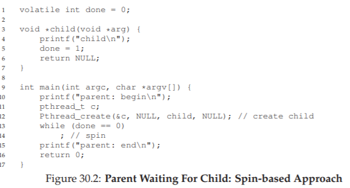

>> THE CRUX: HOW TO WAIT FOR A CONDITION  
>> マルチスレッドプログラムでは、スレッドが先に進む前に、ある条件が真となるのを待つことがしばしば役に立ちます。条件が真になるまで回転するという単純なアプローチは、非常に効率が悪く、CPUサイクルを浪費し、場合によっては正しくない可能性があります。したがって、スレッドはどのように条件を待つべきですか？

## 30.1 Definition and Routines
条件が真となるのを待つために、スレッドは条件変数として知られているものを利用することができます。条件変数は、ある実行状態(すなわち、ある条件)が(条件を待つことによって)望ましくないときに、スレッドが自分自身を置くことができる明示的なキューです。その状態を変更すると、他のスレッドは、それらのwait中のスレッドのうちの1つ(またはそれ以上)をウェイクさせることができ、したがってそれらを継続して実行することができます(条件を通知することによって)。ダイクストラの「プライベートセマフォー」[D68]の使用に基づいています。類似のアイデアは後でホアレ(Hoare)によってモニター上での作業で「条件変数(condition variable)」と命名されました[H74]。

そのような条件変数を宣言するには、次のような文を書きます。pthread cond t c;これは条件変数としてcを宣言します(注：適切な初期化も必要です)条件変数には、`wait()`と`signal()`という2つの操作が関連付けられています。`wait()`呼び出しはスレッドがスリープ状態にしたいときに実行されます。`signal()`コールは、スレッドがプログラム内で何かを変更したときに実行され、この状態でwaitしているスリープ中のスレッドをスリープ解除するために必要です。具体的には、POSIX呼び出しは次のようになります。
```c
pthread_cond_wait(pthread_cond_t *c, pthread_mutex_t *m);
pthread_cond_signal(pthread_cond_t *c);
```  
わかりやすくするために、これらを`wait()`と`signal()`と呼ぶことがよくあります。`wait()`呼び出しについて気付くかもしれないことの1つは、mutexもパラメータとして渡されることです。`wait()`が呼び出されたときにこのmutexがロックされているとみなします。`wait()`の役割は、ロックを解放し、呼び出しスレッドをスリープ状態(アトミック)にすることです。スレッドが起動したとき(他のスレッドがそれを通知した後)、呼び出し元に戻る前にロックを再取得する必要があります。この複雑さは、スレッドがスリープ状態になるときに特定の競合状態が発生しないようにするということに由来します。これをよりよく理解するために、結合問題(図30.3)の解を見てみましょう。

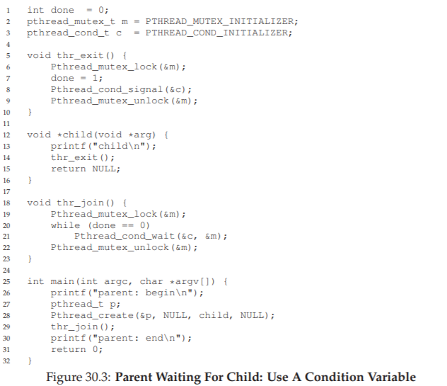

考慮すべき2つのケースがあります。最初は、親スレッドは子スレッドを作成しますが、自分自身を実行し続けます(単一のプロセッサしか持っていないと仮定しています)。すぐに`thr_join()`を呼び出して子スレッドが完了するのを待ちます。この場合、ロックを取得し、子が完了しているかどうかをチェックし、子が完了していないかどうかを確認し、`wait()`を呼び出すことでロックを解除します。子プロセスは最終的に実行され、メッセージ"child"を出力し、`thr_exit()`を呼び出して親スレッドを起動します。このコードはロックを取得し、状態変数を設定し、親に信号を送り、それを目覚めさせるだけです。最後に、親プロセスが実行され(ロックが保持された状態で`wait()`から戻る)ロックが解除され、最後のメッセージ"parent：end"が出力されます。

2番目のケースでは、子は作成直後に実行され、1に設定されたセットはスリープしているスレッドをスリープ解除するためのsignalを呼び出します(ただし、何もないので返されます)。親が実行され、`thr_join()`が呼び出され、doneが1であるとみなされるため、waitせずに戻ります。

最後の注意点：条件を待つかどうかを決定する際には、親がif文の代わりにwhileループを使用することがわかります。これはプログラムのロジックごとに厳密には必要ではないようですが、以下に示すように、常に良いアイデアです。

`exit()`と`thr_join()`の各コードの重要性を理解するために、いくつかの代替実装を試してみましょう。まず、状態変数が必要かどうか疑問に思うかもしれません。コードが下の例のように見える場合はどうなりますか？これは効果がありますか？

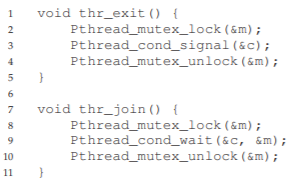

残念ながら、このアプローチではうまくいきません。子がすぐに実行され、すぐに`exit()`を呼び出した場合を想像してください。この場合、子供はsignalをだしますが、この状態では眠っているスレッドはありません。親が実行されると、単にwaitを呼び出してスタックします。スレッドはそれを起こすことはありません。この例から、状態変数の重要性を理解する必要があります。スレッドが知りたい値を記録します。sleep、wake、そしてすべてをロックすることは、その周りに構築されます。

ここに別の貧弱な実装があります。この例では、signalとwaitのためにロックを保持する必要がないと想定しています。どのような問題がここで起こるでしょうか？それについて考えてみましょう！

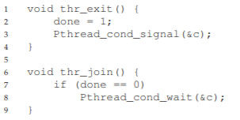

ここでの問題は微妙な競争条件です。具体的には、親が`thr_join()`を呼び出してdoneの値をチェックすると、それが0であることがわかり、スリープ状態になります。しかし、それが寝るのを待つ直前に、親は中断され、子供は走ります。子はステート変数doneを1に変更してシグナルを送りますが、スレッドは待機していないため、スレッドは起動しません。親が再び動くとき、永遠に眠ります。

>> TIP: ALWAYS HOLD THE LOCK WHILE SIGNALING  
>> すべてのケースで厳密には必要ではありませんが、条件変数を使用するときにsignalを送信している間は、ロックを保持するのが最も簡単で最善の方法です。上記の例では、ロックを正しい状態に保つ必要がある場合を示しています。しかし、そうでない可能性が高い他のケースがいくつかありますが、避けるべきことが多くあります。したがって、簡単にするために、信号を呼び出すときにロックを保持してください。

このヒントの逆、つまりwaitを呼び出すときにロックを保持するのは、ヒントだけでなく、waitのセマンティクスによって義務づけられています。常にwait(a)はロックを保持しているとみなし、(b)呼び出し元をスリープ状態にするときにロックを解除し、(c)復帰する直前にロックを再獲得することを特徴とする。したがって、このtipの一般化は正しいです。signalまたはwaitを呼び出すときにロックを保持すると、常に良い形になります。

うまくいけば、この単純な結合の例から、条件変数を適切に使用する基本的な要件の一部を見ることができます。あなたが理解していることを確かめるために、より複雑な例、つまりプロデューサ/コンシューマまたは有限バッファ問題(有限なバッファの問題)を調べます。

## 30.2 The Producer/Consumer (Bounded Buffer) Problem
この章で直面する次の同期の問題は、プロデューサ/コンシューマの問題、またはダイクストラ[D72]によって最初に提起された有限のあるバッファの問題(有界バッファ)として知られています。実際、ダイクストラと彼の同僚に一般化されたセマフォ(ロック変数または条件変数のいずれかとして使用することができる)を発明するのは、まさにプロデューサ/コンシューマの問題でした[D01]。セマフォについて後で詳しく説明します。

1つ以上のプロデューサスレッドと1つ以上のコンシューマスレッドを想像してください。プロデューサはデータ項目を生成し、バッファに格納します。コンシューマはバッファからアイテムを取り出し、何らかの方法でそれらを消費します。この配置は、多くの実際のシステムで発生します。例えば、マルチスレッド・ウェブ・サーバでは、プロデューサは、HTTP要求を作業キュー(すなわち、有限バッファ)に入れます。コンシューマスレッドはこのキューから要求を取り出して処理します。

有界バッファは、あるプログラムの出力を別のプログラムにパイプするときにも使用されます(例：grep foo file.txt | wc -l)この例では、2つのプロセスを同時に実行します。grepは、file.txtの文字列をfooという文字列で標準出力とみなして書き込みます。UNIXシェルは、パイプシステムコールによって作成されたUNIXパイプと呼ばれるものに出力をリダイレクトします。このパイプのもう一方の端はプロセスwcの標準入力に接続されています。これは単純に入力ストリームの行数を数え、その結果を出力します。したがって、grepプロセスはプロデューサです。wcプロセスはコンシューマです。それらの間にはカーネル内の有界バッファがあります。この例では、幸せなユーザーだけです。

有界バッファは共有リソースであるため、競合状態が発生しないように、同期アクセスを要求する必要があります。この問題をよりよく理解するには、実際のコードを調べてみましょう。最初に必要なのは、共有バッファで、プロデューサがデータを入れ、コンシューマがデータを取り込みます。単純に単一の整数を使用してみましょう(代わりに、このスロットにデータ構造体へのポインタを置くことを想像してください)そして、2つの内部ルーチンが値を共有バッファに入れ、バッファから値を取得します。詳細は図30.4を参照してください。

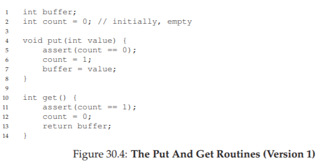

かなりシンプルでしょう？`put()`ルーチンは、バッファが空であるとみなし(アサーションでこれをチェックする)、共有バッファに値を格納し、countを1に設定してバッファをフルにします。`get()`ルーチンは反対にバッファを空にして値を返します(つまり、カウントを0に設定します)この共有バッファには1つのエントリしかないことを心配しないでください。後で、複数のエントリを保持できるキューに一般化します。

バッファにアクセスしてデータを入れたり、そこからデータを取り出したりするために、いつバッファにアクセスするのが良いかを知るルーチンを書く必要があります。これは、カウントがゼロのとき(すなわち、バッファが空のとき)のみデータをバッファに入れ、カウントが1のとき(すなわち、バッファがいっぱいのとき)にのみデータをバッファから取得するという条件が明らかでなければならない。そうでなければ、プロデューサがデータをフルバッファに入れるか、コンシューマが空のデータからデータを取得するような同期コードを書くといった、何か間違ったことが起こります(このコードではアサーションが発生します)。

この作業は、2種類のスレッドによって行われます。1つはプロデューサスレッドと呼ばれ、もう1つはコンシューマスレッドと呼ばれます。図30.5は、共有バッファループ回数に整数を代入するプロデューサのコードと、共有バッファから引き出されたデータ項目を出力するたびにその共有バッファからデータを取得する(永久に)コンシューマを示しています。

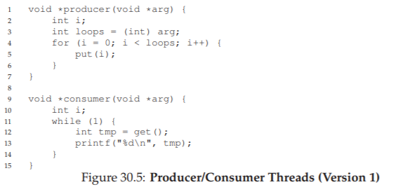

### A Broken Solution
今私たちが単一のプロデューサと単一のコンシューマを持っていると想像してください。明らかに`put()`と`get()`ルーチンは、`put()`がバッファを更新し、`get()`がそこから読み込むので、それらの中にクリティカルセクションを持っています。しかし、コードの周りにロックをかけることはできません。解決策としてもっと別の仕組みが必要です。驚くことではないが、何らかの条件変数があります。この(壊れた)最初の試行(図30.6)では、単一の条件変数condと関連するロックミューテックスがあります。

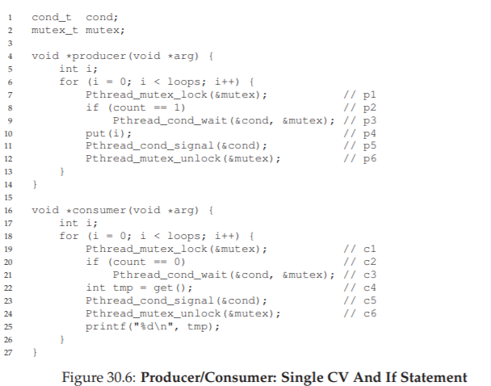

プロデューサーとコンシューマの間のシグナルロジックを調べてみましょう。プロデューサはバッファを埋めることを望むとき、それが空であるのを待ちます(p1-p3)コンシューマはまったく同じロジックを持っていますが、満腹度(c1〜c3)の異なる状態を待ちます。単一のプロデューサと単一のコンシューマだけでは、図30.6のコードが機能します。しかしながら、これらのスレッド(例えば、2つのコンシューマ)のうちの2つ以上を有する場合、解決策は2つの重大な問題があります。それらは一体何でしょうか？

...(考えるためにここで休憩)...

最初の問題を理解しましょう。待つ前にifステートメントと関係があります。2人のコンシューマ(Tc1とTc2)と1人のプロデューサー(Tp)が存在すると仮定します。まず、コンシューマ(Tc1)が走ります。ロック(c1)を取得し、使用準備ができているバッファがあるかどうかを確認し(c2)、存在しないことを確認し、ロックを解除する(c3)のを待ちます。

その後、プロデューサー(Tp)が実行されます。ロック(p1)を取得し、すべてのバッファが満杯(p2)であるかどうかを調べ、そうでないと判断した場合は、先に進みバッファ(p4)を埋めます。次に、プロデューサは、バッファが満たされたことを通知します(p5)。クリティカルな部分は、最初のコンシューマ(Tc1)が条件変数をスリープ状態からレディキューに移動します。Tc1は今実行することができます(ただし、まだ実行されていません)。プロデューサは、バッファが一杯になったことが実現するまで続きます。バッファがいっぱいになると、その時点でスリープします(p6、p1-p3)。

問題が発生した場所は次のとおりです。別のコンシューマ(Tc2)がバッファ内に存在する1つの既存の値(c1、c2、c4、c5、c6、バッファがいっぱいなのでc3の待機をスキップ)今度はTc1が動作すると仮定します。待機から戻ってくる直前に、ロックを再取得してからリターンします。それから、`get()`(c4)を呼び出しますが、消費するバッファはありません！アサーションがトリガされ、コードは必要に応じて機能しませんでした。見てわかるように、Tc2が消費してきたため、Tc1が消費しようとすることを何らかの形で妨げていたはずです。図30.7は、各スレッドが実行するアクションと、そのスケジューラの状態(Ready、Running、Sleeping)を経時的に示しています。

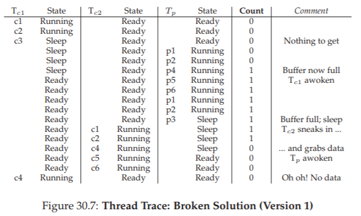

簡単な理由で問題が発生します。プロデューサがTc1を覚ました後、Tc1が実行される前に、バインドされたバッファの状態が変更されました(Tc2のおかげで)。スレッドへのシグナリングは、それらを目覚めさせるだけです。したがって、状態
(この場合、バッファに値が設定されている)が変更されましたが、起きたスレッドが実行されても状態は希望どおりに保たれるという保証はありません。このような方法で条件変数を構築した最初の研究の後に、信号が意味することのこの解釈は、しばしばメサの意味論と呼ばれます(LR80)。Hoareセマンティクスと呼ばれるコントラストは構築するのが難しいですが、目覚めたスレッドが目覚めた直後に実行されるという強力な保証を提供します[H74]。実際に構築されたすべてのシステムは、メサのセマンティクスを採用しています。

### Better, But Still Broken: While, Not If
幸いにも、この修正は簡単です(図30.8)：ifをwhileに変更してください。なぜこれが働くか考えてみてください。今度はコンシューマTc1が起動し、(ロックを保持して)共有変数(c2)の状態を直ちに再チェックします。その時点でバッファが空の場合、コンシューマは単にスリープ状態に戻ります(c3)。当然ながら、プロデューサ(p2)もifからwhileに変更されます。

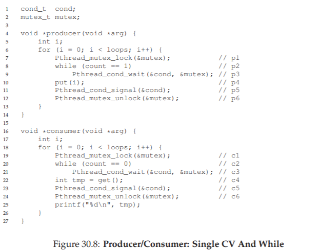

メサのセマンティクスのおかげで、条件変数で覚えておく簡単なルールは、常にwhileループを使用することです。場合によっては、条件を再確認する必要はありませんが、いつでも行うことができます。(そうすることが確実です)しかし、このコードにはまだバグがあり、上記の2つの問題の2番目のものです。わかりますか？条件変数が1つしかないという事実と関係があります。先読みをする前に、問題が何であるかを把握してみてください。

...(もう一度、自分で考えてください。また、少し目を閉じて考えてみてください)...

あなたがそれを正しく理解したことを確認しましょう。この問題は、2つのコンシューマが最初に起動し(Tc1とTc2)、両方ともスリープ状態になる(c3)場合に発生します。次に、プロデューサが実行され、バッファに値が格納され、コンシューマの1つを起動させます(Tc1など)。次に、プロデューサはループバック(途中でロックの解除と再取得)を行い、バッファにさらにデータを入れようとします。バッファがいっぱいであるため、代わりにプロデューサは条件を待機します(したがってスリープします)。これで、1つのコンシューマは実行準備が整っており(Tc1)、2つのスレッドが1つの条件(Tc2とTp)でスリープしています。私たちは問題を起こそうとしています。物事はエキサイティングになっています！

次に、コンシューマTc1は、`wait()`(c3)から復帰してウェイクし、条件(c2)を再確認し、バッファが満杯であることを見つけると、値(c4)を消費します。このコンシューマは、クリティカル条件前で待機中の唯一のスレッドを起こし、条件(c5)にシグナルを出します。しかし、どのスレッドが目を覚ますべきですか？

コンシューマはバッファを空にしたので、明らかにプロデューサーを目覚めさせるべきです。しかし、それがコンシューマTc2を目覚めさせた場合(確かに待ち行列がどのように管理されるかによっては可能です)、問題があります。具体的には、コンシューマTc2は起こしてバッファを空にし(c2)、スリープ状態に戻ります(c3)。バッファに入れる値を持つプロデューサTpはスリープ状態になります。他のコンシューマスレッドTc1もスリープ状態に戻ります。3つのスレッドはすべてスリープ状態になっています。この悲しいステップについては、図30.9を参照してください。シグナリングは明らかに必要ですが、より直接的でなければなりません。コンシューマは、他のコンシューマやプロデューサだけを目覚めさせてはならず、またその逆もあってはいけません。

### The Single Buffer Producer/Consumer Solution
システムの状態が変化したときにどのタイプのスレッドが起きるべきかを適切に伝えるために、1つではなく2つの条件変数を使用します。 結果のコードを図30.10に示します。

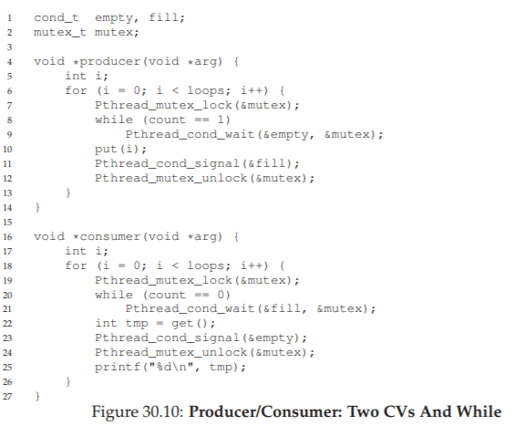

上のコードでは、プロデューサスレッドは空の状態で待機し、シグナルがいっぱいになります。逆に、コンシューマスレッドはいっぱいになるのを待ってシグナルを空にします。こうすることで、上記の第2の問題は、コンシューマが誤ってコンシューマを目覚めさせることはなく、プロデューサーは誤ってプロデューサーを目覚めさせることはありません。

### The Correct Producer/Consumer Solution
私たちは現在、完全に一般的なものではありませんが、実際のプロデューサ/コンシューマのソリューションを持っています。最後に行う変更は、より並行性と効率性を実現することです。具体的には、バッファースロットを追加して、スリープする前に複数の値を生成し、同様にスリープする前に複数の値を消費することができます。単一のプロデューサとコンシューマだけでは、このアプローチはコンテクストスイッチを減らすので効率的です。複数のプロデューサまたはコンシューマ(またはその両方)を使用すると、同時の生成または消費が可能になり、並行性が向上します。幸いにも、それは現在のソリューションの小さな変更です。

この正しい解決策の最初の変更は、バッファ構造自体とそれに対応する`put()`および`get()`(図30.11)内にあります。また、sleepの有無を判断するために、プロデューサとコンシューマが確認する条件を少し変更します。図30.12は、正しい待機およびシグナリングロジックを示しています。プロデューサは、すべてのバッファが現在いっぱいになるとスリープします(p2)。同様に、コンシューマは、すべてのバッファが現在空である場合にのみスリープする(c2)。それで、私たちはプロデューサ/コンシューマの問題を解決します。

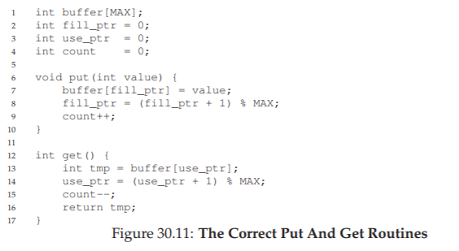

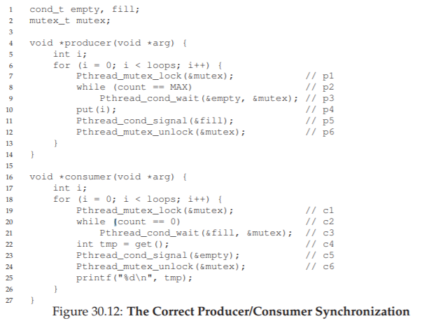

>> TIP: USE WHILE (NOT IF) FOR CONDITIONS  
>> マルチスレッドプログラムで条件をチェックするときは、whileループを使用することは常に正しいです。 if文を使用するのは、シグナリングのセマンティクスに依存します。したがって、常にwhileを使用すると、コードが期待通りに動作します。  
>>条件付きチェックのwhileループを使用すると、疑似wakeupsが発生するケースも処理されます。いくつかのスレッドパッケージでは、実装の詳細により、ただ1つのsignalが発生したにもかかわらず、2つのスレッドが起動する可能性があります[L11]。疑似wakeupsは、スレッドが待機している状態を再確認するもう1つの理由です。

## 30.3 Covering Conditions
次に、条件変数の使用方法のもう1つの例を見てみましょう。このコードの研究は、先に説明したMesaセマンティクスを最初に実装した同じグループのPilot [LR80]のLampsonとRedellの論文(彼らが使用した言語はMesaなので、その名前)から引き出されています。彼らが遭遇した問題は、シンプルな例(この場合は単純なマルチスレッドメモリ割り当てライブラリ)で最もよく分かります。図30.13に問題を示すコードスニペットを示します。

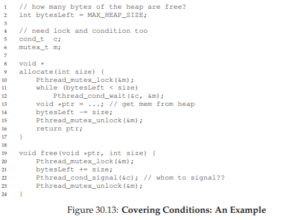

コードで見てきたように、スレッドがメモリ割り当てコードを呼び出すと、より多くのメモリが解放されるのを待たなければならないかもしれません。逆に、スレッドがメモリを解放すると、より多くのメモリが解放されたことを通知します。しかし、上のコードでは問題があります。待機中のスレッド(複数のスレッドが存在する可能性があります)を起動する必要がありますか？

以下のシナリオを考えてみましょう。0バイトの空きがあると仮定します。スレッドTaはallocate(100)を呼び出し、スレッドTbはallocate(10)を呼び出してメモリを少なくするよう要求します。こうしてTaとTbの両方がこの状態を待って眠りにつきます。これらの要求のいずれかを満たすのに十分な空きバイトがありません。

その時点で、第3のスレッドTcがfree(50)を呼び出すと仮定します。残念ながら、待機中のスレッドをスリープ解除するためのシグナルを呼び出すと、解放されるのを10バイトだけ待っている正しい待機中のスレッドTbをスリープ解除できないことがあります。十分な記憶がまだ空いていないので、Taは待っておくべきである。したがって、図のコードは動作しません。他のスレッドを起動するスレッドは、起動するスレッド(またはスレッド)を認識しません。

LampsonとRedellによって提案された解決方法は簡単です。上のコードの`pthread_cond_signal()`呼び出しを、`pthread_cond_broadcast()`の呼び出しで置き換えてください。そうすることで、目覚めすべきスレッドがあることを保証します。もちろん、(まだ)目を覚ますべきではない他の多くの待機スレッドを不必要に起動させる可能性があるので、欠点はパフォーマンスに悪影響を与える可能性があります。これらのスレッドは単に起床し、条件を再確認してすぐにスリープ状態に戻ります。

LampsonとRedellは、スレッドが目を覚ます必要があるすべてのケース(控えめに)をカバーするため、このような条件をカバー条件と呼びます。これまで述べてきたように、コストはあまりにも多くのスレッドが起きる可能性があります。鋭い読者は、このアプローチを早期に使用することができたことに気づいているかもしれません(ただ一つの条件変数でプロデューサ/コンシューマの問題を参照してください)。しかし、その場合、より良い解決策が利用でき、それを使用しました。一般に、あなたのプログラムがあなたのシグナルをブロードキャストに変更したときにのみ動作することがわかった場合(ただし、必ずしもそうする必要はないです)、おそらくバグがあれば修正しましょう。しかし、上記のメモリアロケータのような場合、ブロードキャストは利用可能な最も簡単な解決策かもしれません。

## 30.4 Summary
ロック以外の重要な同期プリミティブ、条件変数の導入を見てきました。いくつかのプログラム状態が望ましくないときにスレッドをスリープさせることにより、CVsは、有名な(そして依然として重要な)プロデューサ/コンシューマの問題やカバー条件を含むいくつかの重要な同期問題をきれいに解決することができます。「彼はビッグブラザーを愛しました」[O49]など、より劇的な結論文がここに来るでしょう。

## 参考文献
[D68] “Cooperating sequential processes”  
Edsger W. Dijkstra, 1968  
Available: http://www.cs.utexas.edu/users/EWD/ewd01xx/EWD123.PDF  
Another classic from Dijkstra; reading his early works on concurrency will teach you much of what you need to know.

[D72] “Information Streams Sharing a Finite Buffer”  
E.W. Dijkstra  
Information Processing Letters 1: 179180, 1972  
Available: http://www.cs.utexas.edu/users/EWD/ewd03xx/EWD329.PDF  
The famous paper that introduced the producer/consumer problem.

[D01] “My recollections of operating system design”  
E.W. Dijkstra  
April, 2001  
Available: http://www.cs.utexas.edu/users/EWD/ewd13xx/EWD1303.PDF  
A fascinating read for those of you interested in how the pioneers of our field came up with some very basic and fundamental concepts, including ideas like “interrupts” and even “a stack”!

[H74] “Monitors: An Operating System Structuring Concept”  
C.A.R. Hoare  
Communications of the ACM, 17:10, pages 549–557, October 1974  
Hoare did a fair amount of theoretical work in concurrency. However, he is still probably most known for his work on Quicksort, the coolest sorting algorithm in the world, at least according to these authors.

[L11] “Pthread cond signal Man Page”  
Available: http://linux.die.net/man/3/pthread cond signal  
March, 2011  
The Linux man page shows a nice simple example of why a thread might get a spurious wakeup, due to race conditions within the signal/wakeup code.

[LR80] “Experience with Processes and Monitors in Mesa”  
B.W. Lampson, D.R. Redell  
Communications of the ACM. 23:2, pages 105-117, February 1980  
A terrific paper about how to actually implement signaling and condition variables in a real system, leading to the term “Mesa” semantics for what it means to be woken up; the older semantics, developed by Tony Hoare [H74], then became known as “Hoare” semantics, which is hard to say out loud in class with a straight face.

[O49] “1984”  
George Orwell, 1949, Secker and Warburg  
A little heavy-handed, but of course a must read. That said, we kind of gave away the ending by quoting the last sentence. Sorry! And if the government is reading this, let us just say that we think that the government is “double plus good”. Hear that, our pals at the NSA?
