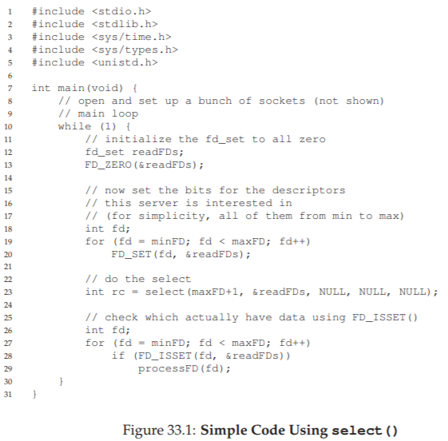
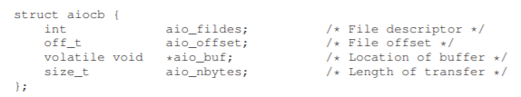
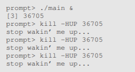

# 33 Event-based Concurrency (Advanced)
これまでは、並列アプリケーションを構築する唯一の方法がスレッドを使用する方法であるかのように、並行性について書いてきました。人生の多くの事のように、これは完全に真実ではありません。具体的には、GUIベースのアプリケーション[O96]といくつかのタイプのインターネットサーバー[PDZ99]の両方で、異なるスタイルの並行プログラミングがよく使用されます。イベントベースの並行処理と呼ばれるこのスタイルは、node.js [N13]などのサーバー側のフレームワークを含む現代的なシステムでは一般的になっていますが、その根本は以下で説明するC/UNIXシステムにあります。

イベントベースの並行処理が解決する問題は2倍です。1つ目は、マルチスレッドアプリケーションでの同時実行性を正しく管理することが難しいことです。私たちが議論したように、ロックの不足、デッドロック、および他の厄介な問題が発生する可能性があります。2つ目は、マルチスレッドアプリケーションでは、開発者は特定の瞬間にスケジュールされているものをほとんど、またはまったく制御できないことです。むしろプログラマはスレッドを作成し、基盤となるOSが利用可能なCPUを介して合理的な方法でそれらをスケジュールすることを期待しています。すべての仕事量ですべてのケースでうまく動作する汎用スケジューラを構築することが難しい場合、OSは最適でない方法で作業をスケジュールすることがあります。

>> THE CRUX: HOW TO BUILD CONCURRENT SERVERS WITHOUT THREADS  
>> スレッドを使用せずに並行サーバーを構築することで、並行性の制御を維持するだけでなく、マルチスレッド・アプリケーションに悩まされている問題のいくつかを回避できますか？

## 33.1 The Basic Idea: An Event Loop
前述のように、基本的なアプローチは、イベントベースの並行処理と呼ばれます。このアプローチは非常に簡単です。何か(つまり、「イベント」)が発生するのを待つだけです。その場合、それはどのタイプのイベントであるかをチェックし、必要な少量の作業(I/O要求の発行、または将来の処理のための他のイベントのスケジューリングなど)を行います。それで終了です！

詳細に入る前に、最初に正規のイベントベースのサーバーの外観を調べてみましょう。そのようなアプリケーションは、イベントループとして知られる簡単な構成に基づいています。イベントループの擬似コードは次のようになります。
```c
while (1) {
    events = getEvents();
    for (e in events)
        processEvent(e);
}
```
それは本当に簡単です。メインループは(上記のコードで`getEvents()`を呼び出すことによって)何かを待ってから、返されたイベントごとに一度に1つずつ処理します。各イベントを処理するコードをイベントハンドラと呼びます。重要なことに、ハンドラがイベントを処理するとき、それはシステム内で行われる唯一のアクティビティです。したがって、次に処理するイベントを決定することは、スケジューリングと同じです。スケジューリングに対するこの明示的な制御は、イベントベースのアプローチの基本的な利点の1つです。

しかし、この議論から、より大きな疑問が浮かび上がってきます。イベントベースのサーバーは、特にネットワークやディスクI/Oに関してどのようなイベントが起こっているかを正確に判断しますか？具体的には、イベント・サーバーは、メッセージが到着したかどうかをどのように伝えることができますか？

## 33.2 An Important API: `select()` (or `poll()`)
その基本的なイベントループを念頭に置いて、次にイベントを受け取る方法の問題に取り組まなければなりません。ほとんどのシステムでは、`select()`または`poll()`システムコールのいずれかを使用して基本APIを使用できます。これらのインターフェイスがプログラムに行うことができることは簡単です。着信するI/Oがあるかどうかを確認します。たとえば、ネットワークアプリケーション(Webサーバーなど)が、サービスを提供するために、ネットワークパケットが到着したかどうかを確認したいと考えているとします。

これらのシステムコールは、あなたがそうすることを可能にします。たとえば`select()`を実行します。マニュアルページ(Mac版)では、このようにAPIについて説明しています。
```c
int select(int nfds,
fd_set *restrict readfds,
fd_set *restrict writefds,
fd_set *restrict errorfds,
struct timeval *restrict timeout);
```
マニュアルページの実際の記述：`select()`は、readfds、writefds、およびerrorfdsに渡されたアドレスを持つI/Oディスクリプタセットを調べて、ディスクリプタの一部が読み込み準備ができているか、書き込み準備ができているか、状態はそれぞれ保留中かです。最初のnfdsディスクリプタは、各組においてチェックされ、すなわち、ディスクリプタ集合内の0からnfds-1までのディスクリプタが検査されます。戻り時に、`select()`は、指定されたディスクリプタセットを、要求された操作の準備ができているディスクリプタで構成されるサブセットに置き換えます。`select()`は、すべてのセットの準備完了ディスクリプタの合計数を返します。

>> ASIDE: BLOCKING VS. NON-BLOCKING INTERFACES  
>> ブロッキング(または同期)インターフェイスは、呼び出し元に戻る前にすべての作業を行います。ノンブロッキング(または非同期)インターフェイスはいくつかの作業を開始しますが、直ちに戻るため、実行する必要がある作業はすべてバックグラウンドで完了します。  
コールをブロックする際の通常の原因は、ある種のI/Oです。たとえば、完了するためにコールをディスクから読み取らなければならない場合、コールはブロックされ、返されるディスクに送信されたI/O要求を待機します。  
ノンブロッキングインターフェースは、どのようなスタイルのプログラミング(スレッドなど)でも使用できますが、ブロックがすべての進捗を停止させるコールとして、イベントベースのアプローチでは不可欠です。  

`select()`に関する2つの点があります。まず、ディスクリプタの読み込みと書き込みの可否をチェックできることに注意してください。前者は、新しいパケットが到着し、処理が必要であるとサーバに判断させるが、後者は、応答がOKであるとき(すなわち、送信キューが満杯でないとき)にサービスに知らせます。

次に、タイムアウト引数です。ここでの一般的な使用法の1つは、タイムアウトをNULLに設定することです。これにより、`select()`が何らかの記述子が準備できるまで無期限にブロックされます。ただし、より堅牢なサーバーは通常、何らかの種類のタイムアウトを指定します。1つの一般的な手法は、タイムアウトをゼロに設定し、`select()`への呼び出しを使用してすぐに戻ることです。

`poll()`システムコールはかなり似ています。詳細については、マニュアルページ、またはStevens and Rago [SR05]を参照してください。いずれにしても、これらの基本的なプリミティブは、ノンブロッキングイベントループを構築する方法を提供します。単に、着信パケットをチェックし、メッセージを含むソケットから読み込み、必要に応じて応答します。

## 33.3 Using `select()`
これをより具体的にするために、`select()`を使ってどのネットワークディスクリプタにメッセージが入ってくるかを調べる方法を調べてみましょう。図33.1に簡単な例を示します。



このコードは、実際にはかなり理解しやすいです。初期化の後、サーバーは無限ループに入ります。ループ内では、まず`FD_ZERO()`マクロを使用してファイル記述子のセットをクリアした後、`FD_SET()`を使用して、minFDからmaxFDまでのすべてのファイル記述子をセットに含めます。この記述子の集合は、例えば、サーバが注目しているすべてのネットワークソケットを表すことができます。最後に、サーバーは`select()`を呼び出して、どの接続がデータを利用できるかを調べます。その後、ループ内で`FD_ISSET()`を使用することによって、イベント・サーバーは、どのデータ記述子がデータを準備していて、入ってくるデータを処理するかを見ることができます。

もちろん、実際のサーバーはこれよりも複雑であり、メッセージの送信、ディスクI/Oの発行、およびその他の多くの詳細でロジックを使用する必要があります。詳細については、API情報についてはStevens and Rago [SR05]、またはPai et。 alまたはWelsh et al。イベントベースのサーバー[PDZ99、WCB01]の一般的な流れの概要については、これらをご覧ください。

## 33.4 Why Simpler? No Locks Needed
単一のCPUとイベントベースのアプリケーションでは、並行プログラムで見つかった問題はもう存在しません。具体的には、一度に1つのイベントしか処理されないため、ロックを取得または解放する必要はありません。イベントベースのサーバは、明らかにシングルスレッドであるため、別のスレッドによって中断することはできません。したがって、スレッド化されたプログラムに共通する並行性のバグは、基本的なイベントベースのアプローチでは現れません。

>> TIP: DON’T BLOCK IN EVENT-BASED SERVERS  
>> イベントベースのサーバーを使用すると、タスクのスケジューリングをきめ細かく制御できます。ただし、このような制御を維持するために、呼び出し元の実行をブロックする呼び出しはどんなときでも作成できません。このデザインのヒントに従わないと、イベントベースのサーバーがブロックされ、クライアントが欲求不満になり、この本を読んだかどうかについて深刻な疑問が生じます。

## 33.5 A Problem: Blocking System Calls
これまでのところ、イベントベースのプログラミングは素晴らしく聞こえるでしょうか？単純なループをプログラムし、発生したイベントを処理します。ロックについて考える必要はありません！しかし、問題があります。イベントがブロックする可能性のあるシステムコールを発行する必要がある場合はどうなりますか？

例えば、要求がクライアントからサーバに来て、ディスクからファイルを読み込み、その内容を要求元のクライアントに返す(単純なHTTP要求と同じように)と想像してください。そのような要求を処理するために、最終的にファイルを開くために`open()`システムコールを発行し、続いてファイルを読むために一連の`read()`を呼び出す必要があります。ファイルがメモリに読み込まれると、サーバーはおそらく結果をクライアントに送信し始めます。

`open()`と`read()`の両方の呼び出しでストレージシステムにI/O要求が発行されます(必要なメタデータやデータがすでにメモリにない場合)。スレッドベースのサーバーでは、これは問題ではありません。I/O要求を発行しているスレッドが中断している間(I/Oが完了するのを待っている間)、他のスレッドが実行できるため、サーバーは処理を進めることができます。実際、このようなI/Oと他の計算の自然なオーバーラップは、スレッドベースのプログラミングを非常に自然かつ簡単にするものです。

しかし、イベントベースのアプローチでは、実行する他のスレッドはありません。メインイベントループだけです。そして、これは、イベントハンドラがブロックする呼び出しを発行した場合、サーバー全体がその処理を行うことを意味します。呼び出しが完了するまでブロックします。イベントループがブロックされると、システムはアイドル状態になり、リソースを浪費する可能性があります。したがって、イベントベースのシステムでは、ブロッキングコールは許可されていないため、ルールに従わなければなりません。

## 33.6 A Solution: Asynchronous I/O
この制限を克服するために、多くの最新のオペレーティングシステムでは、一般に非同期I/Oと呼ばれるディスクシステムにI/O要求を発行する新しい方法が導入されています。これらのインタフェースを使用すると、I/Oが完了する前にアプリケーションがI/O要求を発行し、直ちに呼び出し元に制御を戻すことができます。追加のインターフェースにより、アプリケーションは様々なI/Oが完了したかどうかを判断することができます。

たとえば、Macで提供されているインターフェース(他のシステムにも同様のAPIがあります)を調べてみましょう。APIは、共通の用語で基本構造、構造体aiocbまたはAIO制御ブロックを中心に展開されています。構造の簡略化されたバージョンは以下のようになります(詳細は、マニュアルページを参照してください)。




非同期読み取りをファイルに発行するには、アプリケーションは最初にこの構造体に関連する情報を書き込む必要があります。読み込むファイルのファイル記述子(aio_fildes)、ファイル内のオフセット(aio_offset)、およびファイルの長さの要求(aio_nbytes)、最後に、読み取り結果をコピーする対象のメモリ位置(aio_buf)を指定します。

この構造体が埋め込まれた後、アプリケーションは非同期呼び出しを発行してファイルを読み取る必要があります。Macでは、このAPIは単に非同期読み取りAPIです。
```c
int aio_read(struct aiocb *aiocbp);
```
このコールはI/Oを発行しようとします。成功した場合はすぐに戻り、アプリケーション(つまり、イベントベースのサーバー)はその作業を続行できます。  
しかし、解決しなければならないパズルの最後の部分が1つあります。I/Oが完了し、バッファ(aio_bufが指す)が要求されたデータをその中に持つようになったら、どうすればわかりますか？1つの最後のAPIが必要です。Macでは、`aio_error()`と呼ばれます(やや混乱します)。APIは次のようになります。
```c
int aio_error(const struct aiocb *aiocbp);
```
このシステムコールは、aiocbpによって参照された要求が完了したかどうかをチェックします。存在する場合、ルーチンは成功を返します(ゼロで示されます)。そうでなければ、EINPROGRESSが返されます。したがって、すべての未処理の非同期I/Oに対して、アプリケーションは`aio_error()`の呼び出しを介してシステムを定期的にポーリングして、前記I/Oがまだ完了しているかどうかを判断できます。あなたが気付いたことの1つは、I/Oが完了したかどうかを確認することは痛いということです。特定の時点で数十回または数百回のI/Oが発行された場合、各プログラムを繰り返しチェックするか、最初に少し待つか、または...？

この問題を解決するために、一部のシステムでは割り込みに基づく手法が提供されています。この方法では、非同期I/Oが完了したときにUNIX信号を使用してアプリケーションに通知するので、システムに繰り返し尋ねる必要がなくなります。このポーリングと割り込みの問題は、I/Oデバイスの章で見られるように(または既に見ているように)デバイスでも見られます。

>> ASIDE: UNIX SIGNALS  
>> 近代的なUNIXのすべての変種には、シグナルと呼ばれる巨大で魅力的なインフラが存在します。シグナルは最も単純な方法で、プロセスと通信する手段を提供します。具体的には、信号をアプリケーションに配信することができます。そうすることにより、シグナルハンドラ、すなわち、その信号を処理するためのアプリケーション内のいくつかのコードを実行するために、アプリケーションが何をしているのかを停止させます。終了すると、プロセスは以前の動作を再開します。  
各信号には、HUP(ハングアップ)、INT(割り込み)、SEGV(セグメンテーション違反)などの名前があります。詳細については、マニュアルページを参照してください。興味深いことに、時にはシグナルを行うのはカーネル自体です。例えば、あなたのプログラムがセグメンテーション違反に遭遇すると、OSはそれにSIGSEGVを送ります(シグナル名の前にSIGが付いていることが一般的です)。あなたのプログラムがそのシグナルを捕捉するように設定されていれば、この誤ったプログラムの振る舞い(デバッグに役立つ可能性がある)に応答して実際にコードを実行することができます。シグナルを処理するように構成されていないプロセスにシグナルが送信されると、いくつかのデフォルト動作が成立します。SEGVの場合、プロセスは強制終了されます。無限ループに入るシンプルなプログラムですが、最初にSIGHUPを捕捉するシグナルハンドラを設定しています：  
  
killコマンドラインツールでシグナルを送ることができます(これは奇妙で攻撃的な名前です)。そうすることで、プログラム中のmain whileループが中断され、ハンドラコード`handle()`が実行されます。  
  
シグナルについて学ぶにはさらに多くのことがありますので、単一のページではなく、1つの章で十分ではありません。いつものように、StevensとRagoという素晴らしい出典があります[SR05]。興味があればもっと読んでください。

非同期I/Oのないシステムでは、純粋なイベントベースのアプローチは実装できません。しかし、賢明な研究者は、その場所でかなりうまく機能する方法を導いてきました。例えば、Pai et al。[PDZ99]は、ネットワークパケットを処理するためにイベントが使用され、未処理のI/Oを管理するためにスレッドプールが使用されるハイブリッドアプローチを説明しています。詳細は論文を参照してください。

## 33.7 Another Problem: State Management
イベントベースのアプローチのもう1つの問題は、そのようなコードは、一般に従来のスレッドベースのコードよりも書くのがより複雑であるということです。理由は次のとおりです。イベントハンドラが非同期I/Oを発行すると、I/Oが最後に完了したときに使用する次のイベントハンドラのプログラム状態をパッケージ化する必要があります。スレッドベースの場合は。プログラムが必要とする状態がスレッドのスタック上にあるので、この追加の作業は必要ありません。Adya et al。これは、この作業マニュアルのスタック管理と呼ばれ、イベントベースのプログラミング[A+02]の基本です。

この点をより具体的にするために、スレッドベースのサーバがファイルディスクリプタ(fd)から読み込み、完了したらファイルから読み込んだデータをネットワークソケットディスクリプタ(sd)に書き込むという単純な例を見てみましょう。エラーチェックを無視したコードは次のようになります。
```c
int rc = read(fd, buffer, size);
rc = write(sd, buffer, size);
```
ご覧のように、マルチスレッドプログラムでは、この種類の作業を行うのは簡単です。最終的に`read()`が返ってくると、コードはその情報がスレッドのスタック(変数sd内)にあるため、書き込むソケットをすぐに知ることができます。  
イベントベースのシステムでは、それほど簡単ではありません。同じタスクを実行するには、先に説明したAIO呼び出しを使用して、まず非同期に読み取りを発行します。次に、`aio_error()`呼び出しを使用して読み取りの完了を定期的に確認するとします。その呼び出しによって読み取りが完了したことが通知されると、イベントベースのサーバーはどのように処理すべきかを知っていますか？

この解決策は、Adya et alに詳細が書かれています。[A + 02]は、継続[FHK84]と呼ばれる古いプログラミング言語の構造を使用することです。複雑に思えますが、アイデアは単純です。基本的に、このイベントの処理を終了するために必要な情報をいくつかのデータ構造に記録します。イベントが発生したとき(すなわち、ディスクI/Oが完了したとき)に、必要な情報を調べてイベントを処理します。この特定の場合、解決策は、ソケットディスクリプタ(sd)を、ファイルディスクリプタ(fd)によってインデックス付けされた何らかの種類のデータ構造(例えば、ハッシュテーブル)に記録することです。ディスクI/Oが完了すると、イベントハンドラはファイルディスクリプタを使用して継続を検索し、ソケットディスクリプタの値を呼び出し側に返します。この時点で(最後に)、サーバーはデータをソケットに書き込むために最後の作業を行うことができます。

## 33.8 What Is Still Difficult With Events
私たちが言及すべきイベントベースのアプローチには他にもいくつかの困難があります。たとえば、システムが単一のCPUから複数のCPUに移行したとき、イベントベースのアプローチの単純さのいくつかは消えました。具体的には、複数のCPUを使用するには、イベント・サーバーが複数のイベント・ハンドラーを並行して実行する必要があります。そうするときには、通常の同期問題(例えば、クリティカルセクション)が発生し、通常の解決法(例えば、ロック)が採用されなければならない。したがって、現代のマルチコアシステムでは、ロックなしの簡単なイベント処理はもはや不可能です。

イベントベースのアプローチのもう1つの問題は、ページングなどの特定の種類のシステムアクティビティとうまく統合できないことです。たとえば、イベント・ハンドラ・ページに障害が発生すると、そのイベント・ハンドラ・ページはブロックされ、ページ・フォルトが完了するまでサーバーは処理を進めません。サーバーが明示的なブロッキングを回避するように構成されていても、ページフォールトによるこの種類の暗黙のブロッキングは回避しにくいため、一般的な場合に大きなパフォーマンス上の問題が発生する可能性があります。

第3の問題は、さまざまなルーチンの正確なセマンティクスが変更されるため、イベントベースのコードを時間外管理するのが難しいことです[A + 02]。たとえば、ルーチンが非ブロッキングからブロッキングに変更された場合、そのルーチンを呼び出すイベントハンドラも、2つの部分に分けることによって、その新しい性質に適応するように変更する必要があります。ブロッキングはイベントベースのサーバーにとって非常に悲惨であるため、プログラマーは、各イベントが使用するAPIのセマンティクスにおけるそのような変更を常に把握している必要があります。

最後に、ほとんどのプラットフォームで非同期ディスクI/Oが可能になりましたが、そこに到達するまでには長い時間がかかりましたが、シンプルで均一な方法で非同期ネットワークI/Oと決して統合することは決してありません。たとえば、`select()`インタフェースを使用してすべての未処理I/Oを管理するのは簡単ですが、通常はネットワーキング用の`select()`とディスクI/OのAIO呼び出しの組み合わせが必要です。

## 33.9 Summary
私たちは、イベントに基づいて異なるスタイルの同時実行性について骨組みを紹介しました。イベントベースのサーバは、アプリケーション自体へのスケジューリングを制御するが、現代のシステム(例えば、ページング)の他の側面との統合の複雑さおよび困難性をいくらかのコストを払うことで実行しています。これらの課題のために、単一のアプローチが最良のものとして浮上したわけではありません。したがって、スレッドとイベントの両方は、今後数年間、同じ同時実行性問題に対する2つの異なるアプローチとして存続する可能性があります。いくつかの研究論文(例：[A + 02、PDZ99、vB + 03、WCB01])を読んだり、イベントベースのコードを書いて詳細を調べることができます。

## 参考文献
[A+02] “Cooperative Task Management Without Manual Stack Management”  
Atul Adya, Jon Howell, Marvin Theimer, William J. Bolosky, John R. Douceur  
USENIX ATC ’02, Monterey, CA, June 2002  
This gem of a paper is the first to clearly articulate some of the difficulties of event-based concurrency, and suggests some simple solutions, as well explores the even crazier idea of combining the two types of concurrency management into a single application!  

[FHK84] “Programming With Continuations”  
Daniel P. Friedman, Christopher T. Haynes, Eugene E. Kohlbecker  
In Program Transformation and Programming Environments, Springer Verlag, 1984  
The classic reference to this old idea from the world of programming languages. Now increasingly popular in some modern languages.

[N13] “Node.js Documentation”  
By the folks who build node.js  
Available: http://nodejs.org/api/  
One of the many cool new frameworks that help you readily build web services and applications. Every modern systems hacker should be proficient in frameworks such as this one (and likely, more than one). Spend the time and do some development in one of these worlds and become an expert.

[O96] “Why Threads Are A Bad Idea (for most purposes)”  
John Ousterhout  
Invited Talk at USENIX ’96, San Diego, CA, January 1996  
A great talk about how threads aren’t a great match for GUI-based applications (but the ideas are more general). Ousterhout formed many of these opinions while he was developing Tcl/Tk, a cool scripting language and toolkit that made it 100x easier to develop GUI-based applications than the state of the art at the time. While the Tk GUI toolkit lives on (in Python for example), Tcl seems to be slowly dying (unfortunately).

[PDZ99] “Flash: An Efficient and Portable Web Server”  
Vivek S. Pai, Peter Druschel, Willy Zwaenepoel  
USENIX ’99, Monterey, CA, June 1999  
A pioneering paper on how to structure web servers in the then-burgeoning Internet era. Read it to understand the basics as well as to see the authors’ ideas on how to build hybrids when support for asynchronous I/O is lacking.

[SR05] “Advanced Programming in the UNIX Environment”  
W. Richard Stevens and Stephen A. Rago  
Addison-Wesley, 2005  
Once again, we refer to the classic must-have-on-your-bookshelf book of UNIX systems programming. If there is some detail you need to know, it is in here.

[vB+03] “Capriccio: Scalable Threads for Internet Services”  
Rob von Behren, Jeremy Condit, Feng Zhou, George C. Necula, Eric Brewer  
SOSP ’03, Lake George, New York, October 2003  
A paper about how to make threads work at extreme scale; a counter to all the event-based work ongoing at the time.

[WCB01] “SEDA: An Architecture for Well-Conditioned, Scalable Internet Services”  
Matt Welsh, David Culler, and Eric Brewer  
SOSP ’01, Banff, Canada, October 2001  
A nice twist on event-based serving that combines threads, queues, and event-based hanlding into one streamlined whole. Some of these ideas have found their way into the infrastructures of companies such as Google, Amazon, and elsewhere.