# 39 Interlude: Files and Directories
ここまでは、CPUの仮想化であるプロセスと、メモリの仮想化であるアドレス空間の2つの主要なオペレーティングシステムの抽象化の発展を見てきました。この2つの抽象化によって、プログラムは、あたかも自分の世界であるかのように動くことができます。あたかもそれ自身のプロセッサ(または複数のプロセッサ)、自らのメモリを持っているかのように動くことができます。このような錯覚は、システムのプログラミングをはるかに容易にし、今日ではデスクトップやサーバだけでなく、携帯電話などのプログラマブルなプラットフォーム上でますます普及しています。

このセクションでは、仮想化パズルに重要な要素である永続ストレージを追加します。古典的なハードディスクドライブまたはより現代的なソリッドステートストレージデバイスなどの永続ストレージデバイスは、情報を永続的に(または少なくとも長期間)保存します。停電が発生したときに内容が失われるメモリとは異なり、永続記憶装置はそのようなデータをそのまま維持します。したがって、OSはそのようなデバイスに特別な注意を払わなければなりません。これは、ユーザーが実際に気にかけているデータを保存する場所です。

>> CRUX: HOW TO MANAGE A PERSISTENT DEVICE  
>> OSは永続的なデバイスをどのように管理すべきですか？APIとは何ですか？実装の重要な側面は何ですか？

したがって、今後のいくつかの章では、パフォーマンスと信頼性を向上させる方法に焦点を当て、永続データを管理するための重要なテクニックについて検討します。ただし、APIの概要、つまりUNIXファイルシステムと対話するときに表示されると予想されるインターフェイスについて説明します。

## 39.1 Files and Directories
ストレージの仮想化では、2つの主要な抽象概念が時間とともに発展しています。最初はファイルです。ファイルは単なる線形バイト配列です。各バイトは読み書きできます。各ファイルには、ある種の低レベルの名前が付いています。通常、いくつかの種類があります。ユーザーはこの名前を認識していないことがよくあります(次のとおりです)。歴史的な理由から、ファイルの低レベルの名前はよくそのinode番号と呼ばれます。私たちは将来の章でinodeについてもっと学びます。今のところ、各ファイルに関連付けられているiノード番号があると仮定します。

ほとんどのシステムでは、OSはファイルの構造(例えば、画像であるか、テキストファイルであるか、Cソースコードであるか)をほとんど知りません。むしろ、ファイルシステムの責任は、そのようなデータをディスクに永続的に保存し、データを再度要求するときに、最初にそこに置いたものを確実に取得することです。そうすることはそれほど単純ではありません！

2番目の抽象化はディレクトリの抽象化です。ファイルのようなディレクトリも低レベルの名前(つまり、iノード番号)を持っていますが、その内容は非常に特殊です(ユーザが読める名前、低レベルの名前)のリストを含んでいます。たとえば、低レベルの名前「10」を持つファイルがあり、ユーザーが判読可能な「foo」という名前で参照されているとします。"foo"が存在するディレクトリは、ユーザが読める名前を低レベルの名前にマッピングするエントリ("foo"、"10")を持ちます。ディレクトリ内の各エントリは、ファイルまたは他のディレクトリを参照します。ディレクトリを他のディレクトリに配置することにより、ユーザは任意のディレクトリツリー(またはディレクトリ階層)を構築することができ、その下にすべてのファイルおよびディレクトリが格納されます。

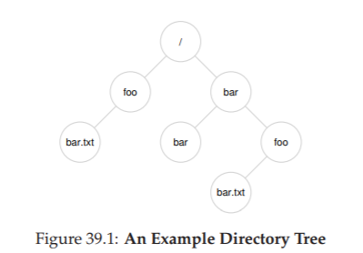

ディレクトリ階層はルートディレクトリ(UNIXベースのシステムではルートディレクトリは単に/と呼ばれます)から始まり、目的のファイルまたはディレクトリが指定されるまで、ある種のセパレータを使用して後続のサブディレクトリの名前を付けます。たとえば、ユーザーがルートディレクトリ/にディレクトリfooを作成し、ディレクトリfooにbar.txtというファイルを作成した場合、絶対パス名でファイルを参照できます。この場合は/foo/bar.txtです。より複雑なディレクトリツリーについては、図39.1を参照してください。この例の有効なディレクトリは/、/foo、/bar、/bar/bar、/bar/fooです、有効なファイルは/foo/bar.txtおよび/bar/foo/bar.txtです。ディレクトリとファイルは、ファイルシステムツリー内の異なる場所にある限り、同じ名前を持つことができます(たとえば、図のbar.txtという2つのファイル/foo/bar.txtと/bar/foo/bar.txtがあります)

>> TIP: THINK CAREFULLY ABOUT NAMING  
>> 命名は、コンピュータシステムの重要な側面である[SK09]。UNIXシステムでは、あなたが考えることができる事実上すべてがファイルシステムによって命名されます。ファイル、デバイス、パイプ、さらにはプロセス[K84]だけでなく、普通の古いファイルシステムのように見えます。名前の統一性により、システムの概念モデルが簡単になり、シンプルでモジュラーなシステムになります。したがって、システムまたはインターフェースを作成するときは、使用している名前について注意深く考えてください。

また、この例のファイル名には、barとtxtの2つの部分があり、ピリオドで区切られています。最初の部分は任意の名前ですが、ファイル名の2番目の部分は通常、Cコード(例：.c)であるか、画像(例：.jpg)であるか、音楽ファイル(例：.mp3)であるかなど、ファイルの種類を示すために使用されます。しかし、通常これは規約に過ぎません。通常、main.cという名前のファイルに含まれているデータは確かにCのソースコードであるという強制はありません。

したがって、ファイルシステムが提供するすばらしいことの1つがわかります。関心のあるすべてのファイルの名前を付ける便利な方法です。名前は、すべてのリソースにアクセスするための最初のステップで名前を付けることができるため、システムでは重要です。UNIXシステムでは、このように、ファイルシステムは、ディスク、USBスティック、CD-ROM、その他多くのデバイス上のファイルにアクセスする統一された方法を提供します。事実、多くのその他のものは、単一のディレクトリツリーの配下にあります。

## 39.2 The File System Interface
次に、ファイルシステムのインタフェースについて詳しく説明します。まず、ファイルの作成、アクセス、削除の基本について説明します。これは簡単だと思うかもしれませんが、途中で`unlink()`と呼ばれるファイルを削除するために使用される不思議な呼び出しを発見します。うまくいけば、この章の最後では、この謎はあなたにとって、神秘的なものではなくなるでしょう！

## 39.3 Creating Files
まず、ファイルの作成という最も基本的な操作から始めます。これは、openシステムコールで実現できます。`open()`を呼び出してO_CREATフラグを渡すことにより、プログラムは新しいファイルを作成することができます。現在の作業ディレクトリに"foo"というファイルを作成するコードの例をいくつか示します。
```c
int fd = open("foo", O_CREAT|O_WRONLY|O_TRUNC, S_IRUSR|S_IWUSR);
```
ルーチン`open()`はいくつかの異なるフラグをとります。この例では、2番目のパラメータは存在しない場合はファイル(O_CREAT)を作成し、ファイルは書き込むことのみ(O_WRONLY)ができるようにします。ファイルがすでに存在する場合は、0バイトのサイズに切り捨てて、既存のコンテンツ(O_TRUNC)を削除します。3番目のパラメータは、パーミッションを指定します。この場合、所有者がファイルを読み書き可能にします。

>> ASIDE: THE `CREAT()` SYSTEM CALL
ファイルを作成する古い方法は、次のように`creat()`を呼び出すことです。  
```c
int fd = creat("foo"); // option: パーミッションを設定するための第2フラグを追加する
```
>> `creat()`は`open()`として次のフラグで考えることができます：O_CREAT | O_WRONLY | O_TRUNCです。`open()`はファイルを作成することができるので、`creat()`の使用法は少し賛成できません(実際には`open()`へのライブラリ呼び出しとして実装することができます)。しかし、それはUNIXの知識の特別な場所を保持しています。具体的には、ケン・トンプソンがUNIXを再設計していた場合、彼が何をどうやってやるのかと質問されたとき、彼は「私はeをスペルとして作るだろう」と答えました。

`open()`の重要な点の1つは、ファイルディスクリプタです。ファイルディスクリプタは、単なる整数で、プロセスごとのプライベートなもので、ファイルにアクセスするためにUNIXシステムで使用されます。したがって、ファイルが開かれると、そのファイル記述子を使用して、そのファイルを読み書きする権限を持っているとみなします。

このようにして、ファイルディスクリプタは機能[L84]、つまり、特定の操作を実行する権限を与える不透明なハンドルです。ファイルディスクリプタを考えるもう一つの方法は、ファイル型オブジェクトへのポインタです。そのようなオブジェクトがあれば、`read()`や`write()`のようにファイルにアクセスするための他の"メソッド"を呼び出すことができます。以下に、ファイル記述子がどのように使用されるかを見ていきます。

## 39.4 Reading and Writing Files
一度私たちがいくつかのファイルを持っていれば、私たちはそれらを読み書きしたいかもしれません。既存のファイルを読むことから始めましょう。コマンドラインで入力していた場合は、プログラムcatを使用して、ファイルの内容を画面にダンプすることができます。
```
prompt> echo hello > foo
prompt> cat foo
hello
prompt>
```
このコードスニペットでは、プログラムechoの出力をファイルfooにリダイレクトします。ファイルfooには単語"hello"が含まれています。次に、catを使用してファイルの内容を表示します。しかし、catプログラムはどのようにしてファイルfooにアクセスしますか？

これを見つけるために、私たちは非常に便利なツールを使用して、プログラムによるシステムコールをトレースします。Linuxでは、このツールはstraceと呼ばれます。他のシステムにも同様のツールがあります(Macの場合はdtruss、古いUNIXの場合はtrussを参照)。straceは、プログラムの実行中にシステムコールが発生したときにそれをトレースし、画面にトレースをダンプして表示します。

>> TIP: USE STRACE (AND SIMILAR TOOLS)  
>> straceツールは、どんなプログラムであるかを確認する素晴らしい方法を提供します。これを実行することで、プログラムが作るシステムコールをトレースしたり、引数や戻りコードを調べたり、一般的に何が起きているかを知ることができます。  
また、このツールにはかなり役に立ついくつかの議論があります。例えば、-fはフォークされた子もトレースします。-tは各呼び出し時の時刻を報告します。-eはtrace = open、close、read、writeのシステムコールの呼び出しをトレースし、他のすべてを無視します。その他にもより多くの強力なフラグがあります。マニュアルページを読んで、このすばらしいツールを活用する方法を見つけてください。

straceを使用してcatが何をしているかを把握する例を示します(読みやすくするためにいくつかの呼び出しを削除しました)。  
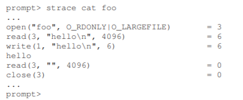  
catが最初に行うことは、読み込み用のファイルを開くことです。私たちはこれについて注意すべき事柄をいくつか挙げておきます。最初に、ファイルはO_RDONLYフラグで示されているように、読み込み専用(書き込みではない)に開かれています。第2に、64ビットオフセットを使用します(O_LARGEFILE)。`open()`の呼び出しが成功し、値3を持つファイルディスクリプタを返します。

最初に`open()`を呼び出すと、期待どおり0またはおそらく1ではなく3が返されます。各実行中のプロセスには、すでに3つのファイルが開いています。標準入力(プロセスが入力を受け取るために読み取ることができる)、標準出力(プロセスを情報を画面にダンプするために書き込むことができます)、標準エラー(そのプロセスはエラーメッセージを書き込むことができます)があります。これらは、それぞれファイル記述子0,1,2で表されます。したがって、最初に別のファイルを開くと(上記のcatのように)、ファイル記述子3になります。

openが成功すると、catは`read()`システムコールを使用してファイルからいくつかのバイトを繰り返し読み込みます。`read()`の最初の引数はファイルディスクリプタで、ファイルシステムにどのファイルを読み込ませるかを指示します。プロセスはもちろん、一度に複数のファイルを開くことができ、したがって、ディスクリプタは、オペレーティングシステムが特定の読み取りがどのファイルを参照するかを知ることを可能にします。2番目の引数は、`read()`の結果が格納されるバッファを指します。上記のシステムコールトレースでは、straceはこの箇所の読み込み結果を表示します("hello")。3番目の引数はバッファのサイズで、この場合は4 KBです。`read()`の呼び出しも正常に戻ります。ここでは、読み込んだバイト数(今回の場合は6バイト、単語"hello"の文字は5、行末マーカーは1で合わせて6)を返します。

この時点で、straceのもう1つの興味深い結果が得られます。これは、`write()`システムコールをファイルディスクリプタ1で1回呼び出すことです。前述のように、この記述子は標準出力として知られています。プログラムのcatが意味するように画面に"hello"という単語が表示されます。しかし、それは直接`write()`を呼び出すでしょうか？おそらくはそうでしょう(高度に最適化されている場合)しかし、もしそうでなければ、どのようにcatが出力するのかというと、ライブラリルーチン`printf()`を呼び出します。`printf()`は、渡されたすべての書式設定の詳細を調べ、最終的に標準出力で書込みを呼び出して結果を画面に出力します。

次に、catプログラムはファイルからさらに多くを読み込もうとしますが、ファイルに残っているバイトがないので、`read()`は0を返し、プログラムはファイル全体を読み取ったことを知ります。したがって、プログラムは`close()`を呼び出して、ファイル"foo"が完了したことを示し、対応するファイルディスクリプタを渡します。ファイルはこのようにして閉じられ、読み込みが完了します。ファイルの書き込みは、同様の手順で行います。まず、書き込みのためにファイルが開かれた後、大きなファイルに対して`write()`システムコールが呼び出され、その後`close()`が呼び出されます。straceを使用して、あなた自身が書いたプログラムのようなファイルへの書き込みをトレースするか、ddユーティリティでトレースします(例：dd if = foo of = bar)。

## 39.5 Reading And Writing, But Not Sequentially
ここまでは、ファイルの読み書き方法について説明しましたが、アクセスはすべて順番に行われています。つまり、最初から最後までファイルを読み込んだり、最初から最後までファイルを書き出したりしています。

ただし、ファイル内の特定のオフセットを読み書きできることが便利な場合もあります。たとえば、テキスト文書上に索引を作成し、それを使用して特定の単語を検索すると、文書内のランダムな一部のオフセットから読み込まれることがあります。これを行うには、`lseek()`システムコールを使用します。ここに関数プロトタイプがあります：  
```c
off_t lseek(int fildes, off_t offset, int whence);
```
最初の引数は使い慣れたものです(ファイルディスクリプタ)。2番目の引数はオフセットで、ファイルオフセットをファイル内の特定の場所に配置します。歴史的な理由からwhenceと呼ばれる第3引数は、シークの実行方法を正確に決定します。マニュアルページから：  
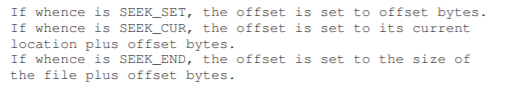  
この説明からわかるように、プロセスが開く各ファイルについて、OSは「現在の」オフセットを追跡します。このオフセットは、次の読み取りまたは書き込みがファイル内の読み取りまたは書き込みの開始位置を決定します。したがって、オープンファイルの抽象化の一部は、現在のオフセットを持つことであり、現在のオフセットは2つの方法のいずれかで更新されます。第1は、Nバイトの読み出しまたは書き込みが行われるときであり、Nが現在のオフセットに加算されます。したがって、各読み取りまたは書き込みは、暗黙的にオフセットを更新します。2番目はlseekで明示的に指定されており、上で指定したオフセットを変更します。

>> ASIDE: CALLING `LSEEK()` DOES NOT PERFORM A DISK SEEK  
>> 名前のわからないシステムコール`lseek()`は、多くの学生がディスクを理解しようとしているのを混乱させ、その上にあるファイルシステムの仕組みを混乱させます。2つを混同しないでください！`lseek()`コールは、OSメモリ内の変数を変更するだけで、特定のプロセスについて、次回の読み込みまたは書き込みが開始されるオフセットを追跡します。ディスクシークは、ディスクに発行された読取りまたは書込みが最後の読取りまたは書込みと同じトラックにないときに発生し、したがってヘッドの移動が必要になります。これをさらに混乱させることは、`lseek()`を呼び出してファイルのランダムな部分を読み書きすること、そしてそれらのランダムな部分を読み書きすることが実際にはより多くのディスクシークをもたらすことです。したがって、`lseek()`を呼び出すと、今後の読み取りまたは書き込みで確実にシーク(オフセットの変更)はしますが、どんなディスクI/Oも`lseek()`で発生することはありません。

この呼び出し`lseek()`は、ディスクアームを動かすディスクのシーク操作とは何の関係もないことに注意してください。`lseek()`の呼び出しは、単にカーネル内の変数の値を変更します。I/Oが実行されるとき、ディスクヘッドがどこにあるかに応じて、ディスクは要求を実行するための実際のシークを実行してもよいし、しなくてもよいです。

## 39.6 Writing Immediately with `fsync()`
ほとんどの場合、プログラムが`write()`を呼び出すと、それはファイルシステムに伝えているだけです。このデータを将来のある時点で永続ストレージに書き込んでください。パフォーマンス上の理由から、ファイルシステムはこのような書き込みをしばらく(例えば5秒または30秒)メモリにバッファします。後の時点で、書き込みは実際に記憶装置に発行されます。呼び出し元のアプリケーションの観点からは、書き込みはすばやく完了するようであり(たとえば、`write()`呼び出し後でディスクへの書き込みの前にマシンがクラッシュするなど)、データが失われることがあります。

しかし、一部のアプリケーションでは、この最終的な保証以上のものが必要です。たとえば、データベース管理システム(DBMS)では、正しい回復プロトコルを開発するには、時々ディスクへの書き込みを強制する能力が必要です。

これらのタイプのアプリケーションをサポートするために、ほとんどのファイルシステムはいくつかの追加の制御APIを提供します。UNIXの世界では、アプリケーションに提供されるインタフェースはfsync(int fd)として知られています。特定のファイルディスクリプタのプロセスが`fsync()`を呼び出すと、ファイルシステムは、指定されたファイルディスクリプタによって参照されるファイルに対して、ディスクにすべてのダーティな(つまりまだ書き込まれていない)データを強制します。これらの書き込みがすべて完了すると、`fsync()`ルーチンが戻ります。

`fsync()`の使い方の簡単な例を次に示します。コードはファイルfooを開き、そのファイルに単一のチャンクを書き込んだ後、`fsync()`を呼び出して書き込みがディスクに強制的に強制されるようにします。`fsync()`が返されると、アプリケーションはデータが永続化されていることを知り(もし、`fsync()`が正しく実装されていれば)、安全に動かすことができます。
```c
int fd = open("foo", O_CREAT|O_WRONLY|O_TRUNC, S_IRUSR|S_IWUSR);
assert(fd > -1);
int rc = write(fd, buffer, size);
assert(rc == size);
rc = fsync(fd);
assert(rc == 0);
```
興味深いことに、このシーケンスでは、あなたが期待できるすべてを保証するものではありません。場合によっては、ファイルfooを含むディレクトリを`fsync()`する必要があります。この手順を追加すると、ファイル自体がディスク上にあるだけでなく、新しく作成された場合でも、そのファイルが永続的にディレクトリの一部になります。驚くことではないが、この種の詳細は見落とされがちで、多くのアプリケーションレベルのバグが発生します[P + 13、P + 14]。

## 39.7 Renaming Files
いったんファイルがあると、ファイルに別の名前を付けることができると便利なことがあります。コマンドラインで入力するときは、これはmvコマンドで行います。この例では、ファイルfooの名前がbarに変更されています。  
```
prompt> mv foo bar
```
straceを使用すると、mvはシステムコールrename(char * old、char * new)を使用します。これは、ファイルの元の名前(old)と新しい名前(new)の2つの引数を正確にとります。`rename()`呼び出しが提供する興味深い保証の1つは、システムクラッシュに関してアトミックな呼び出しとして(通常)実装されていることです。名前の変更中にシステムがクラッシュした場合、ファイルは古い名前または新しい名前のいずれかに名前が付けられるといった、奇妙な中間状態は発生しません。

したがって、`rename()`は、ファイル状態へのアトミックな更新を必要とする特定の種類のアプリケーションをサポートするために重要です。ここで少し具体的に話します。ファイルエディタ(emacsなど)を使用していて、ファイルの途中に行を挿入したとします。この例のファイル名はfoo.txtです。新しいファイルが元の内容と行が挿入されていることを保証するために、エディタがファイルを更新する方法は次のとおりです(単純化のためにエラーチェックを無視します)。  
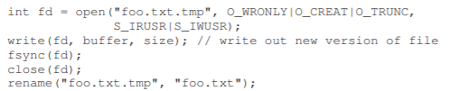  
この例では、エディタは単純です。新しい名前のファイルを一時的な名前(foo.txt.tmp)で書き出し、`fsync()`でディスクに強制的に書き出し、アプリケーションが新しいファイルを特定したら、メタデータと内容がディスク上にある場合は、一時ファイルの名前を元のファイルの名前に変更します。この最後のステップでは、ファイルの古いバージョンを同時に削除しながら、新しいファイルをアトミックにスワップし、アトミックなファイルの更新を実現します。

## 39.8 Getting Information About Files
ファイルアクセス以外にも、ファイルシステムは、格納している各ファイルについてかなりの量の情報を保持することが期待されます。一般に、ファイルメタデータに関するこのようなデータを呼び出します。特定のファイルのメタデータを確認するには、`stat()`または`fstat()`システムコールを使用します。これらの呼び出しは、ファイルにパス名(またはファイルディスクリプタ)をとり、ここに示すようなstat構造体を埋めます：  
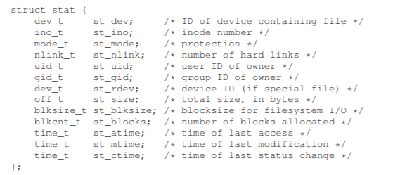  
ファイルのサイズ(バイト数)、低レベルの名前(つまり、inode番号)、所有権情報、ファイルへのアクセスまたは変更に関する情報など、各ファイルについて多くの情報が保持されていることがわかります。この情報を表示するには、コマンドラインツールstatを使用します。  
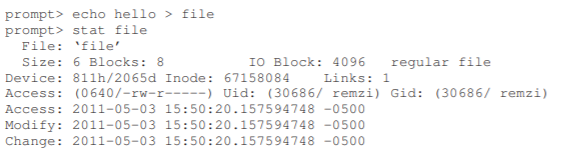  
実際には、各ファイルシステムは通常、この種の情報をinodeという構造体に保持しています。私たちがファイルシステムの実装について話すとき、inodeについてもっと学びます。今のところ、inodeはファイルシステムによって保持されている永続的なデータ構造であり、その中に上記のような情報があると考えてください。

## 39.9 Removing Files
この時点で、ファイルを作成、アクセスして、それらを順次アクセスするかどうかを知っています。しかし、どのようにファイルを削除しますか？UNIXを使ったことがあるなら、あなたはおそらく知っていると思うでしょう：プログラムrmを実行するだけです。しかし、rmがファイルを削除するために使用するシステムコールは何ですか？straceでもう一度調べてみましょう。ここでは、厄介なファイル"foo"を削除します。  
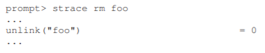  
トレースされた出力から無関係なクラフトを削除し、不思議な名前のシステムコール`unlink()`を1回だけ呼び出します。ご覧のように、`unlink()`は削除されるファイルの名前だけを受け取り、成功するとゼロを返します。しかし、これは大きなパズルにつながります。なぜこのシステムコールが「リンク解除」と呼ばれていますか？単に「削除する」または「削除する」だけではありません。このパズルへの答えを理解するためには、単にファイルだけでなくディレクトリも理解する必要があります。

## 39.10 Making Directories
ファイル以外のディレクトリ関連のシステムコールを使用すると、ディレクトリの作成、読み取り、および削除を行うことができます。ディレクトリに直接書き込むことはできません。ディレクトリの形式はファイルシステムのメタデータと見なされるため、たとえばファイル、ディレクトリ、またはその他のオブジェクト型を作成するなどして間接的にディレクトリを更新することはできます。このようにして、ファイルシステムはディレクトリの内容が常に期待どおりであることを確認します。

ディレクトリを作成するには、単一のシステムコール`mkdir()`を使用できます。mkdirプログラムを実行してfooという単純なディレクトリを作成するとどうなるかを見てみましょう。  
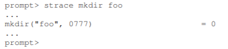  

>> TIP: BE WARY OF POWERFUL COMMANDS  
>> プログラムrmは、強力なコマンドの素晴らしい例を私たちに提供し、時にはあまりにも多くのパワーが悪いことになることがあります。 たとえば、たくさんのファイルを一度に削除するには、次のように入力します。  
```
prompt> rm *
```
>> ここで、*は現在のディレクトリ内のすべてのファイルと一致します。しかし、時にはディレクトリも、実際にはすべての内容を削除したいこともあります。これを行うには、rmに再帰的に各ディレクトリへの降下を指示し、その内容も削除します。  
```
prompt> rm -rf *
```
>> この小さな文字列で問題が発生するのは、ファイルシステムのルートディレクトリから偶発的にコマンドを発行し、そこからすべてのファイルとディレクトリを削除する場合です。したがって、強力なコマンドの両刃の剣を覚えておいてください。少数のキーストロークで多くの作業を行うことができますが、すばやく簡単に大きな被害を受けることができます。

このようなディレクトリが作成されると、最低限の内容しか持たないものの、"空"とみなされます。具体的には、空のディレクトリには、自身を参照するエントリとその親を参照するエントリの2つのエントリがあります。前者は「.」(ドット)ディレクトリと呼ばれ、後者は「..」(ドットドット)と呼ばれます。これらのディレクトリは、プログラムlsにフラグ(-a)を渡すことで確認できます。  
  

## 39.11 Reading Directories
ディレクトリを作成したので、それを読むこともできます。確かに、それはまさにlsプログラムのことです。lsのような独自の小さなツールを書いて、それがどのように行われるかを見てみましょう。

あたかもファイルであるかのようにディレクトリを開くのではなく、代わりに新しい呼び出しを使用します。以下は、ディレクトリの内容を出力するプログラム例です。このプログラムは、`opendir()`、`readdir()`、および`closedir()`の3つの呼び出しを使用してジョブを完了させます。どのように簡単にインターフェースを作っているのかというと、単純なループを使用して一度に1つのディレクトリエントリを読み込み、ディレクトリ内の各ファイルの名前とiノード番号を出力します。  
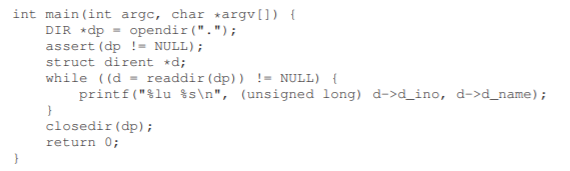  
以下の宣言は、struct direntデータ構造内の各ディレクトリエントリ内で利用可能な情報を示しています。  
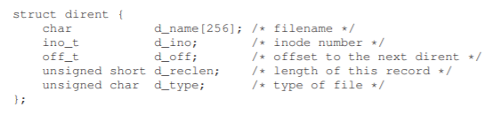  
ディレクトリは情報が軽いので(基本的に、名前をinode番号にマッピングするだけで、他の詳細もいくつかあります)、プログラムは各ファイルの`stat()`を呼び出して、それぞれの長さやその他の詳細情報を取得したいでしょう。確かに、これはあなたが-lフラグを渡したときのこととまったく同じです。そのフラグの有無にかかわらず、自身でstraceを試してみてください。

## 39.12 Deleting Directories
最後に、`rmdir()`(同じ名前のプログラムrmdirが使用する)を呼び出して、ディレクトリを削除することができます。ただし、ファイルの削除とは異なり、ディレクトリを削除する方が危険です。単一のコマンドで大量のデータを削除する可能性があるためです。したがって、`rmdir()`は、削除される前にディレクトリが空である(すなわち、"."と".."エントリのみを有する)という要件を持っています。空でないディレクトリを削除しようとすると、`rmdir()`の呼び出しは失敗します。

## 39.13 Hard Links
ここでは、ファイルシステムのツリーにエントリを作る新しい方法を理解することによって、`link()`と呼ばれるシステムコールを通して、ファイルを削除することがなぜ`unlink()`によって行われるのかという謎に戻ってきました。`link()`システムコールは古いパス名と新しいパス名の2つの引数をとります。新しいファイル名を古いファイル名に「リンク」すると、同じファイルを参照する別の方法が基本的に作成されます。この例のように、コマンドラインプログラムlnを使用してこれを行います。  
```
prompt> echo hello > file
prompt> cat file
hello
prompt> ln file file2
prompt> cat file2
hello
```
ここでは、"hello"という単語を含むファイルを作成し、そのファイル(file)を呼び出しました。その後、lnプログラムを使用してそのファイルへのハードリンクを作成します。その後、fileを開くか、file2を開くかのどちらかでファイルを調べることができます。リンクが動作する方法は、リンクを作成するディレクトリに別の名前を作成し、元のファイルの同じiノード番号(つまり、低レベルの名前)を参照するだけです。ファイルはどのようにもコピーされません。むしろ、同じファイルを参照する2つの人の名前(fileとfile2)だけを持つようになりました。ディレクトリ自体にも、各ファイルのinode番号を表示することでこれを見ることができます：
```
prompt> ls -i file file2
67158084 file
67158084 file2
prompt>
```
lsに-iフラグを渡すことで、各ファイルのiノード番号(ファイル名と同様に)を出力します。そして、あなたはリンクが実際に何をしているかを知ることができます：同じ正確なinode番号(この例では67158084)への新しい参照を作成するだけです。

これで、`unlink()`が`unlink()`と呼ばれている理由が分かり始めました。ファイルを作成すると、実際には2つのことが行われます。最初に、サイズ、ブロックがディスク上にある場所など、ファイルに関するすべての関連情報を実質的に追跡する構造体(iノード)を作成しています。次に、人が読める名前をそのファイルにリンクし、そのリンクをディレクトリに入れます。

ファイルへのハードリンクを作成した後、元のファイル名(ファイル)と新しく作成されたファイル名(ファイル2)に違いはありません。実際には、これらのファイルは、ファイルに関する基となるメタデータへのリンクにすぎず、inode番号67158084にあります。

したがって、ファイルシステムからファイルを削除するには、`unlink()`を呼び出します。上記の例では、fileという名前のファイルを削除しても問題なくファイルにアクセスできます。
```
prompt> rm file
removed ‘file’
prompt> cat file2
hello
```
これは、ファイルシステムがファイルのリンクを解除すると、iノード番号内の参照カウントをチェックするためです。この参照カウント(リンクカウントとも呼ばれる)によって、ファイルシステムは、この特定のiノードにリンクされているファイル名の数を追跡できます。`unlink()`が呼び出されると、人間が読める名前(削除されるファイル)と指定されたinode番号との間の"リンク"が削除され、参照カウントが減少します。参照カウントが0になった場合にのみ、ファイルシステムはiノードおよび関連するデータブロックも解放し、ファイルを本当に「削除」します。

もちろん`stat()`を使ってファイルの参照カウントを見ることができます。ファイルへのハードリンクを作成して削除するときの状態を見てみましょう。この例では、同じファイルへのリンクを3つ作成してから削除します。リンク数を見てください！  
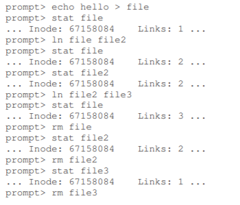  

## 39.14 Symbolic Links
本当に便利なもう1つのタイプのリンクがあります。これは、シンボリックリンクまたは時にはソフトリンクと呼ばれています。ハードリンクはいくらか限定されています。つまり、ディレクトリツリーにサイクルを作成する恐れがあるため、ディレクトリには作成できません。inode番号はファイルシステム全体ではなく、特定のファイルシステム内で一意であるため、他のディスクパーティション内のファイルにハードリンクすることはできません。したがって、シンボリックリンクと呼ばれる新しいタイプのリンクが作成されました。

このようなリンクを作成するには、同じプログラムlnを使用できますが、-sフラグを使用します。 次に例を示します。  
```
prompt> echo hello > file
prompt> ln -s file file2
prompt> cat file2
hello
```
ご覧のように、ソフトリンクの作成はほとんど同じように見え、元のファイルはファイル名ファイルとシンボリックリンク名file2でアクセスできるようになりました。

しかし、この表面の類似性を超えて、シンボリックリンクは実際にはハードリンクとはかなり異なっています。最初の違いは、シンボリックリンクは実際は別の種類のファイルそのものです。私たちはすでに正規のファイルとディレクトリについて話しました。シンボリックリンクは、ファイルシステムが知っている第3のタイプです。シンボリックリンクの統計はすべてを示します：
```
prompt> stat file
... regular file ...
prompt> stat file2
... symbolic link ...
```
lsを実行すると、この事実も明らかになります。lsの出力の長い形式の最初の文字を注意深く見ると、一番左の列の最初の文字は - 通常のファイル、ディレクトリの場合はd、ソフトリンクの場合はlです。シンボリックリンクのサイズ(この場合は4バイト)と、リンクが指しているもの(fileという名前のファイル)を見ることもできます。  
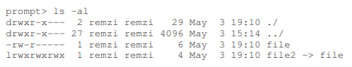  
file2が4バイトである理由は、シンボリックリンクが形成される方法がリンク先ファイルのパス名をリンクファイルのデータとして保持するためです。fileというファイルにリンクしているので、リンクファイルfile2は小さい(4バイト)です。より長いパス名にリンクすると、リンクファイルが大きくなります：  
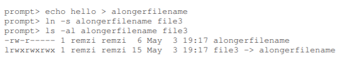  
最後に、シンボリックリンクが作成される方法のために、彼らはぶら下がった参照(dangling reference)として知られているものの可能性を残します：  
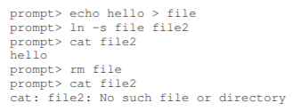  
この例のように、ハードリンクとはまったく違うので、元のファイルfileを削除するとリンクはもはや存在しないパス名を指し示します。

## 39.15 Making and Mounting a File System
これで、ファイル、ディレクトリ、特定の種類の特殊な種類のリンクにアクセスするための基本的なインターフェイスを見てきました。しかし、多くの基となるファイルシステムから完全なディレクトリツリーを組み立てる方法について、議論すべきトピックがもう1つあります。この作業は、最初にファイルシステムを作成し、マウントして内容にアクセスできるようにすることで実現します。

ファイルシステムを作るために、ほとんどのファイルシステムは、通常このタスクを実行するmkfs(make fsと発音)と呼ばれるツールを提供します。アイデアは以下の通りです：ツールに入力としてデバイス(例えば、/dev/sda1などのディスクパーティション)とファイルシステムタイプ(ext3など)を与え、空のファイルシステムを書き始めるだけです。ルートディレクトリとして、そのディスクパーティションにコピーします。mkfsによると、ファイルシステムがあります！

しかし、いったんこのようなファイルシステムが作成されると、それは一様なファイルシステムツリー内でアクセス可能にする必要があります。この作業は、マウントプログラム(実際の作業を行うための、基となるシステムコール`mount()`を呼び出す)によって実現されます。マウントとは、既存のディレクトリをターゲットマウントポイントとして使用し、その時点で新しいファイルシステムをディレクトリツリーに貼り付けることです。

ここの例は役に立つかもしれません。デバイスパーティション/dev/sda1に格納されているext3ファイルシステムがアンマウントされているとします。ルートディレクトリにはaとbという2つのサブディレクトリがあり、それぞれにfooという単一のファイルが格納されています。このファイルシステムをマウントポイント/home/usersにマウントしたいとしましょう。次のように入力します。  
```
prompt> mount -t ext3 /dev/sda1 /home/users
```
成功した場合、マウントによってこの新しいファイルシステムが利用可能になります。ただし、新しいファイルシステムへのアクセス方法に注意してください。ルートディレクトリの内容を見るには、lsを次のように使用します。  
```
prompt> ls /home/users/
a b
```
ご覧のとおり、パス名/home/users/は、新しくマウントされたディレクトリのルートを参照します。同様に、パス名が/home/users/aと/home/users/bのディレクトリaとbにアクセスできます。最後に、fooという名前のファイルに/home/users/a/fooと/home/users/b/fooからアクセスできます。そして、マウントの美しさとして、複数のファイルシステムを持つ代わりに、マウントはすべてのファイルシステムを1つのツリーに統合し、命名を統一して便利にします。

あなたのシステムに何がマウントされているのか、どのポイントにマウントされているのかを確認するには、mountプログラムを実行するだけです。次のようなものが表示されます：  
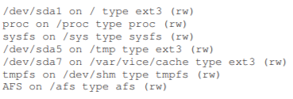  
この狂った組み合わせは、ext3(標準のディスクベースのファイルシステム)、procファイルシステム(現在のプロセスに関する情報にアクセスするためのファイルシステム)、tmpfs(一時ファイル用のファイルシステム)、AFS(分散ファイルシステム)はすべて、この1つのマシンのファイルシステムツリーにまとめられています。

## 39.16 Summary
UNIXシステム(実際にはどのシステムでも)のファイルシステムインタフェースは、一見して非常に初歩的ですが、それを習得したいかどうかを理解することはたくさんあります。もちろん、単純にそれを使用するよりも、何も良いことはありません(やることはたくさんあります)。だからしてください！もちろん、もっと読んでください。いつものように、スティーブンス[SR05]が始まる場所です。

私たちは基本的なインターフェースを見学して、うまくいかに動作するかを少しは理解していました。さらに興味深いのは、APIのニーズを満たすファイルシステムを実装する方法です。これについては、次に詳しく解説します。

# 参考文献
[K84] “Processes as Files”  
Tom J. Killian  
USENIX, June 1984  
The paper that introduced the /proc file system, where each process can be treated as a file within a pseudo file system. A clever idea that you can still see in modern UNIX systems.

[L84] “Capability-Based Computer Systems”  
Henry M. Levy  
Digital Press, 1984  
Available: http://homes.cs.washington.edu/˜levy/capabook  
An excellent overview of early capability-based systems.

[P+13] “Towards Efficient, Portable Application-Level Consistency”  
Thanumalayan S. Pillai, Vijay Chidambaram, Joo-Young Hwang, Andrea C. Arpaci-Dusseau, and Remzi H. Arpaci-Dusseau
HotDep ’13, November 2013  
Our own work that shows how readily applications can make mistakes in committing data to disk; in particular, assumptions about the file system creep into applications and thus make the applications work correctly only if they are running on a specific file system.

[P+14] “All File Systems Are Not Created Equal:  
On the Complexity of Crafting Crash-Consistent Applications” Thanumalayan S. Pillai, Vijay Chidambaram, Ramnatthan Alagappan, Samer Al-Kiswany, Andrea C. Arpaci-Dusseau, and Remzi H. Arpaci-Dusseau  
OSDI ’14, Broomfield, Colorado  
The full conference paper on this topic – with many more details and interesting tidbits than the first workshop paper above.  

[SK09] “Principles of Computer System Design”  
Jerome H. Saltzer and M. Frans Kaashoek  
Morgan-Kaufmann, 2009  
This tour de force of systems is a must-read for anybody interested in the field. It’s how they teach systems at MIT. Read it once, and then read it a few more times to let it all soak in.

[SR05] “Advanced Programming in the UNIX Environment”  
W. Richard Stevens and Stephen A. Rago  
Addison-Wesley, 2005  
We have probably referenced this book a few hundred thousand times. It is that useful to you, if you care to become an awesome systems programmer.
