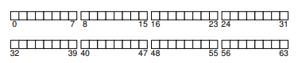
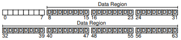
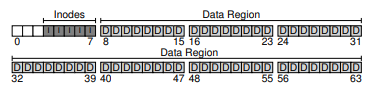
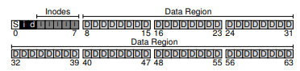
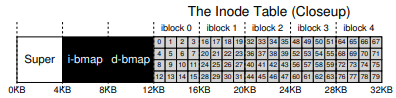
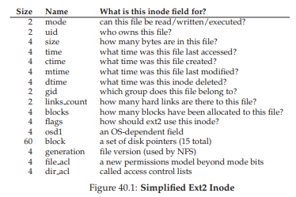
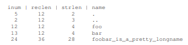
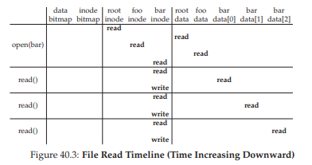
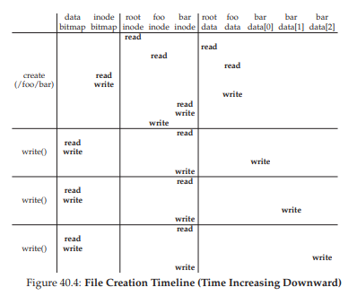

# 40 File System Implementation
この章では、vsfs（Very Simple File System）と呼ばれる単純なファイルシステムの実装を紹介します。このファイルシステムは、一般的なUNIXファイルシステムの簡略化されたバージョンであるため、今日の多くのファイルシステムで見られる基本的なオンディスク構造、アクセス方法、およびさまざまなポリシーを紹介しています。

ファイルシステムは純粋なソフトウェアです。CPUやメモリの仮想化の開発とは異なり、ファイルシステムの一部の機能を向上させるハードウェア機能を追加することはありません（ただし、ファイルシステムがうまく機能するようにデバイスの特性に注意する必要があります）。ファイルシステムの構築には大きな柔軟性があるため、AFS（Andrew File System）[H + 88]からZFS（SunのZettabyte File System）[B07]に至るまで、さまざまなファイルシステムが構築されています。これらのファイルシステムはすべて、さまざまなデータ構造を持ち、同輩よりも良くて悪いものもあります。したがって、ファイルシステムについて学ぶ方法は、事例研究です。まず、この章では、簡単なファイルシステム（vsfs）と、実際のファイルシステムについての一連の調査を行い、どう違うのかを演習のなかで理解していきましょう。

>> THE CRUX: HOW TO IMPLEMENT A SIMPLE FILE SYSTEM  
>> 単純なファイルシステムを構築するにはどうすればよいですか？ディスクにはどのような構造が必要ですか？彼らは何を追跡する必要がありますか？彼らはどのようにアクセスされますか？

## 40.1 The Way To Think
ファイルシステムについて考えるには、通常、2つの異なる側面について考えることをお勧めします。これらの側面の両方を理解すれば、ファイルシステムが基本的にどのように動作するかを理解していると思います。

1つめはファイルシステムのデータ構造です。言い換えれば、ファイルシステムがデータとメタデータを整理するためにどのような種類のオンディスク構造が利用されていますか？SGIのXFSのようなより洗練されたファイルシステムは、より複雑なツリーベースの構造（S + 96）を使用するのに対し、最初のファイルシステム（以下のvsfsを含む）はブロック配列やその他のオブジェクトのような単純な構造を採用しています。

>> ASIDE: MENTAL MODELS OF FILE SYSTEMS  
前に説明したように、メンタルモデルは、システムについて学ぶときに実際に開発しようとしているものです。ファイルシステムでは、質問の中に答えがあることがあります。例えば、ファイルシステムのデータとメタデータを格納するディスク上の構造はどうなりますか？プロセスがファイルを開くとどうなりますか？どのオンディスク構造が読み書き中にアクセスされるのですか？などです。メンタルモデルの作成と改善によって、ファイルシステムのソースコードの詳細を理解しようとする代わりに、何が起きているのかを抽象的に理解することができます。（もちろん、ソースコードを理解することも大事です）

ファイルシステムの第2の側面は、そのアクセス方法です。open（）、read（）、write（）などのプロセスによって呼び出された呼び出しをその構造にどのようにマップしますか？特定のシステムコールの実行中に読み取られる構造はどれですか？どれに書きこまれますか？これらのステップはどれくらい効率的に実行されますか？

ファイルシステムのデータ構造とアクセス方法を理解している場合、システムの考え方の重要な部分である、それが本当にどのように機能するかについての良いメンタルモデルを開発しました。私たちの最初の実装を掘り下げながら、メンタルモデルの開発に取り掛かりましょう。

## 40.2 Overall Organization
現在、ディスク上のvsfsファイルシステムのデータ構造の全体的な構成を開発しています。まず、ディスクをブロックに分割する必要があります。単純なファイルシステムはブロックサイズを1つしか使用しません、そして今からそれを行います。一般的に使用される4 KBのサイズを選択しましょう。

そのため、ファイルシステムを構築するディスクパーティションについては、サイズが4KBの一連のブロックが簡単です。ブロックは、サイズNの4KBブロックのパーティション内で、0からN-1までアドレス指定されます。実際には64ブロックの非常に小さなディスクがあるとします。  
  
ファイルシステムを構築するためにこれらのブロックに格納する必要があるものについて考えてみましょう。もちろん、最初に気になるのはユーザーデータです。実際には、どのファイルシステムのほとんどの領域もユーザーデータです（そして、そうでなければなりません）。ユーザーデータ用に使用するディスクの領域をデータ領域と呼びましょう。また、簡単にするために、ディスク上の固定された部分、たとえばディスク上の64個のブロックのうちの後ろの56個を予約します。  
  
最後の章で学んだように、ファイルシステムは各ファイルに関する情報を追跡する必要があります。この情報は、メタデータの重要な部分であり、ファイル、ファイルのサイズ、所有者とアクセス権、アクセスと変更時刻、およびその他の同様の種類の情報を含むデータブロック（データ領域内）のようなものを追跡します。この情報を格納するために、ファイルシステムは通常、inodeと呼ばれる構造を持っています（以下のinodeについてさらに詳しく説明します）。

iノードに対応するためには、ディスク上にもスペースを確保する必要があります。ディスクのこの部分をiノード表と呼びましょう。これは単にディスク上のiノードの配列を保持しています。このように、ディスク上のイメージは、図のようになります。ここでは、私たちの64個のブロックのうちの5個をiノードに使用していると仮定しています（Iで示されています）。  
  
inodeは通常128または256バイトのように大きくないことに注意してください。inode当たり256バイトと仮定すると、4KBのブロックは16個のinodeを保持でき、上記のファイルシステムは80個の合計inodeを含んでいます。この私たちの小さな64ブロックのパーティションに構築されたシンプルなファイルシステムでは、この数字はファイルシステムに保存できるファイルの最大数を表します。ただし、より大きなディスク上に構築された同じファイルシステムでは、より大きなinodeテーブルを割り当てるだけで、より多くのファイルに対応できるということに注意してください。

これまでの私たちのファイルシステムは、データブロック（D）とinode（I）を持っていますが、まだいくつか欠けています。あなたが推測したように、依然として必要な1つの主要なコンポーネントは、inodeやデータブロックが空いているか割り当てられているかを追跡する方法です。したがって、このような割り当て構造は、どのファイルシステムにおいても必須の要素です。

もちろん、多くの割り当て追跡方法が可能です。たとえば、最初の空きブロックを指す空きリストを使用して、次の空きブロックを指し示すことができます。代わりに、データ領域（データビットマップ）とiノードテーブル（iノードビットマップ）用のビットマップという単純で一般的な構造を選択します。ビットマップは、単純な構造です。各ビットは、対応するオブジェクト/ブロックが空き（0）か使用中（1）かを示すために使用されます。そして、私たちの新しいディスク上のレイアウトには、inodeビットマップ（i）とデータビットマップ（d）があります。  
  
これらのビットマップには4 KBのブロック全体を使用するのはちょっと残念ですが、 そのようなビットマップは32Kオブジェクトが割り当てられているかどうかを追跡できますが、80個のinodeと56個のデータブロックしか持っていません。 しかし、単純化のためにこれらのビットマップのそれぞれに4 KBのブロック全体を使用しています。

慎重な読者（まだ起きている読者）は、非常に単純なファイルシステムのオンディスク構造の設計に1ブロック残っていることに気づいているかもしれません。私たちはスーパーブロックのためにこれを予約しています、下図のSで示されています。スーパーブロックには、この特定のファイルシステムに関する情報が含まれます。たとえば、ファイルシステム内にいくつのiノードとデータブロックがあるか（この場合はそれぞれ80と56）、iノードテーブルが開始する場所（ブロック3）などがあります。おそらく、ファイルシステムの種類（この場合はvsfs）を特定するための何らかのマジックナンバーも含まれています。  
  
したがって、ファイルシステムをマウントするとき、オペレーティングシステムはまずスーパブロックを読み取り、さまざまなパラメータを初期化し、ボリュームをファイルシステムツリーにアタッチします。ボリューム内のファイルにアクセスすると、システムは必要なオンディスク構造を探す場所を正確に認識します。

## 40.3 File Organization: The Inode
ファイルシステムの最も重要なオンディスク構造の1つは、iノードです。事実上すべてのファイルシステムは、これと同様の構造を持っています。名前inodeは、索引ノードの略語であり、UNIX[RT74]やこれまでのシステムで使用されていた歴史的な名前で、簡単なシステムかもしれません。これらのノードはもともと配列に配列されていたために使用され、配列は特定のinodeにアクセスする際に索引付けされます。

>> ASIDE: DATA STRUCTURE — THE INODE  
>> inodeは、長さ、パーミッション、および構成ブロックの位置など、特定のファイルのメタデータを保持する構造を記述するために、多くのファイルシステムで使用される汎用名です。その名前は、少なくともUNIXまで（そしておそらく、以前のシステムではないにしてもMulticsに戻ります）戻ります。inode番号がディスク上のinodeの配列にインデックスを付けてその番号のiノードを見つけるために使用されるので、インデックスノードの略です。ここからわかるように、inodeの設計はファイルシステム設計の重要な部分の1つです。現代のシステムのほとんどは、追跡しているすべてのファイルに対してこのような構造を持っていますが、呼び方は違います（dnode、fnodeなどの別のものを呼び出すことがあります。）

各iノードは暗黙のうちにファイルの低レベルの名前と呼ばれる番号（inumber）で暗黙的に参照されます。vsfs（およびその他の単純なファイルシステム）では、inumber(i番号)が与えられているので、対応するinodeがディスク上のどこにあるかを直接計算することができます。例えば、上記のようなvsfsのinodeテーブルを取ると、20 KBのサイズ（5つの4 KBブロック）が得られ、80個のiノードから構成されます（各iノードが256バイトであると仮定します）。さらにinode領域が12KBから始まると仮定する（すなわち、スーパーブロックが0KBから始まり、inodeビットマップがアドレス4KBにあり、データビットマップが8KBであり、したがってinodeテーブルが直後に来ると仮定する）。したがって、vsfsでは、ファイルシステムパーティションの先頭に、次のようなレイアウトがあります。  
  
inode番号32を読み込むには、ファイルシステムは最初にinode領域（32・sizeof（inode）または8192）へのオフセットを計算し、それをディスク上のinodeテーブルの開始アドレス（inodeStartAddr = 12KB）に追加し、したがって、望んだinodeブロックの正しいバイトアドレス20KBに達します。ディスクはbyte addressable（バイト・アドレス可能）ではなく、多数のaddressable(アドレス可能)なセクタ、通常は512バイトで構成されていることを思い出してください。したがって、inode32を含むinodeのブロックをフェッチするために、ファイルシステムは、望んだinodeブロックをフェッチするために、セクタ(20×1024) / 512すなわち40への読み出しを発行します。より一般的には、iノードブロックのセクタアドレスiaddrは、以下のように計算することができます。  
```c
blk = (inumber * sizeof(inode_t)) / blockSize;
sector = ((blk * blockSize) + inodeStartAddr) / sectorSize;
```
それぞれのinodeの中には、ファイルの種類（通常ファイル、ディレクトリなど）、ファイルのサイズ、割り当てられたブロック数、保護情報（ファイルの所有者、アクセス権）、ファイルが作成、変更、または最後にアクセスされた時を含むいくつかの時間情報、およびそのデータブロックがディスク上のどこに存在するかに関する情報（例えば、何らかのポインタ）といったファイルに関するすべての必要な情報を含んでいます。このようなファイルに関するすべての情報をメタデータといいます。実際、純粋なユーザーデータではないファイルシステム内の情報は、よくそのように呼ばれます。ext2 [P09]のiノードの例を図40.1に示します。

  

inodeの設計における最も重要な決定の1つは、データブロックがどこにあるかをどのように参照するかです。1つの簡単なアプローチは、iノード内に1つ以上の直接ポインタ（ディスクアドレス）を持つことです。各ポインタは、ファイルに属する1つのディスクブロックを参照します。そのようなアプローチは限定されています。たとえば、実際に大きなファイル（ブロックのサイズに直接ポインタの数を掛けたものよりも大きい）を作成する場合は、不運です。

### The Multi-Level Index
より大きいファイルをサポートするために、ファイルシステム設計者はinode内に異なる構造を導入しなければなりませんでした。1つの一般的な考え方は、間接ポインタと呼ばれる特別なポインタを持つことです。ユーザーデータを含むブロックを指すのではなく、より多くのポインターを含むブロックを指し、各ポインターはユーザーデータを指します。したがって、iノードは、いくつかの固定数の直接ポインタ（例えば、12個）を修正して、および単一の間接ポインタを持つようにします。ファイルが十分に大きくなると、（ディスクのデータブロック領域から）間接ブロックが割り当てられ、間接ポインタのためのinodeのスロットは、それを指すように設定されます。 4KBのブロックと4バイトのディスクアドレスを想定すると、さらに1024個のポインタが追加されます。ファイルは（12 + 1024）・4Kまたは4144KBになります。

>> TIP: CONSIDER EXTENT-BASED APPROACHES  
別のアプローチは、ポインタの代わりにエクステントを使うことです。エクステントは単にディスクポインタと長さ（ブロック単位）です。したがって、ファイルの各ブロックにポインタを必要とする代わりに、ファイルのディスク上の場所を指定するポインタと長さが必要です。ファイルを割り当てるときにディスク上の空き領域が連続しているのを見つけにくい場合があるため、一つ（ブロック単位）のエクステントが制限されています。したがって、エクステントベースのファイルシステムでは、二つ以上（ブロック単位）のエクステントが許可されることが多く、ファイルの割り当て中にファイルシステムに自由度が増します。  
2つのアプローチを比較すると、ポインタベースのアプローチが最も柔軟ですが、ファイルごとに大量のメタデータを使用します（特に大きなファイルの場合）。エクステントベースのアプローチは柔軟性は低くなりますが、コンパクトです。特に、ディスク上に十分な空き領域があり、ファイルを連続して配置できる（実際にはどのようなファイル割り当て方針の目標でもあります）場合にうまく機能します。

驚くべきことではありませんが、このようなアプローチでは、さらに大きなファイルをサポートしたいことがあります。これを行うには、別のポインタinodeを追加してください：二重間接ポインタです。このポインタは、間接ブロックへのポインタを含むブロックを指し、各ブロックはデータブロックへのポインタを含みます。したがって、間接的な二重ブロックは、1024×1024または100万個の4KBブロックを追加してファイルを拡張する可能性、つまり4GBを超えるファイルの追加をサポートすることができるでしょう。あなたはさらに大きいファイルを追加することを望むかもしれません。そして、これがどこに向かうのかを知っています：トリプル間接ポインタです。

全体として、このimbalanced tree(不均衡なツリー)は、ファイルブロックを指すためのマルチレベルインデックスアプローチと呼ばれています。例えば、12個の直接ポインタ、1個の間接ブロック、2個の間接ブロックの三つが合わさった例を調べてみましょう。4KBのブロックサイズと4バイトのポインタを仮定すると、この構造は4GBをちょうど上回るファイル（すなわち、（12 + 1024 + 1024 ^ 2）×4KB）を収容することができます。トリプル間接ブロックを追加することで、どれだけのファイルを扱うことができるのか分かりますか？（ヒント：かなり大きい）

多くのファイルシステムでは、Linux ext2 [P09]やext3、NetAppのWAFLなどの一般的に使用されているファイルシステムや元のUNIXファイルシステムなど、マルチレベルのインデックスを使用しています。SGI XFSやLinux ext4などの他のファイルシステムでは、単純なポインタの代わりにエクステントを使用します。エクステントベースのスキームがどのように機能するかの詳細については、前のセクションを参照してください（仮想メモリの議論のセグメントに似ています）。

あなたは疑問に思うかもしれません：なぜこのようなimbalanced tree(不均衡なツリー)を使用しますか？どうして別のアプローチはありませんか？ さて、多くの研究者が、ファイルシステムとその使用方法、そして何十年にもわたって一定の「真実」を見つける研究してきました。そのような発見の1つは、ほとんどのファイルが小さいことです。この不均衡なデザインはそのような現実を反映しています。ほとんどのファイルが実際に小さい場合、この場合に最適化することは理にかなっています。したがって、少数の直接ポインタ（12が典型的な数）では、inodeは直接的に48KBのデータを指し示すことができ、大きなファイルに対しては1つ（またはそれ以上）の間接ブロックが必要です。最近の研究Agrawal et.al [A + 07]については、図40.2にその結果をまとめています。

>> ASIDE: LINKED-BASED APPROACHES  
inodeを設計するもう一つの簡単な方法は、linked listを使うことです。したがって、inode内では、複数のポインタを持つ代わりに、ファイルの最初のブロックを指すポインタが必要です。大きなファイルを処理するには、そのデータブロックの末尾に別のポインタを追加するなどして、大きなファイルをサポートすることができます。  
あなたが推測したように、リンクされたファイルの割り当ては、一部の仕事量ではうまく機能しません。たとえば、ファイルの最後のブロックを読み込むことや、ランダムアクセスを行うことなどについて考えてみてください。したがって、リンクされた割り当てをより良くするために、一部のシステムでは、データブロック自体に次のポインタを格納するのではなく、リンク情報のメモリ内テーブルを保持します。このテーブルは、データブロックDのアドレスによって索引付けされます。エントリの内容は、単にDの次のポインタ、すなわちDに続くファイル内の次のブロックのアドレスです。NULLもそこに入ります。このNULLは、ファイルの終わり、または特定のブロックがフリーであることを示します。そのような次のポインタのテーブルを持つことにより、リンクされた割り当てスキームは、最初に（メモリ内の）テーブルをスキャンして目的のブロックを見つけて、それを直接（ディスク上に）アクセスすることによって、ランダムなファイルアクセスを効果的に行うことができます。  
そのようなテーブルはよい方法に思えるでしょうか？我々が説明したことは、ファイルアロケーションテーブル、すなわちFATファイルシステムと呼ばれるものの基本的な構造です。これは、NTFS [C94]より前のこの古典的な古いWindowsファイルシステムは、単純なリンクベースの割り当て方式に基づいています。標準的なUNIXファイルシステムとの相違点もあります。例えば、iノード自体はなく、ファイルに関するメタデータを格納し、前記ファイルの最初のブロックを直接参照するディレクトリエントリであり、ハードリンクの作成を不可能にします。これらの詳細については、Brouwer [B02]を参照してください。

もちろん、inode設計の空間では、他にも多くの可能性があります。結局のところ、inodeは単なるデータ構造であり、関連する情報を格納し、それを効果的に参照できるデータ構造であれば十分です。ファイルシステムソフトウェアは容易く変更されるので、仕事量やテクノロジが変化した場合、さまざまな設計を検討してください。

  

## 40.4 Directory Organization
vsfs（多くのファイルシステムのように）では、ディレクトリは単純な構成です。ディレクトリは基本的に（エントリ名、iノード番号）のペアのリストを含んでいます。特定のディレクトリ内のファイルまたはディレクトリごとに、そのディレクトリのデータブロックに文字列と数字があります。各文字列には、長さもあります（可変サイズの名前を仮定）。

たとえば、ディレクトリdir（iノード番号5）に3つのファイル（foo、bar、およびfoobar_is_a_pretty_longname）があり、それぞれinode番号12,13,24であるとします。dirのディスク上のデータは次のようになります。  
  
この例では、各エントリには、inode番号、レコード長（名前の合計バイト数、残り余白の合計バイト数）、文字列の長さ（実際の名前の長さ）、および最後にエントリの名前があります。各ディレクトリに2つの余分なエントリがあることに注意してください。"."(ドット)と".."(ドットドット)です。ドットディレクトリは現在のディレクトリ（この例ではdir）ですが、ドットドットは親ディレクトリ（この場合はルート）です。

ファイルを削除すると（例えばunlink（）を呼び出す）、ディレクトリの途中に空きスペースが残る可能性があります。そのため、（ゼロなどの予約済みのiノード番号などで）同様にマークする方法が必要です。このような削除は、レコードの長さが使用される理由の1つです。より大きなエントリや余分なスペースがあった場合、新しいエントリは古いエントリを再利用し、使用する可能性があります。

正確にディレクトリがどこに格納されているのか疑問に思うかもしれません。よくファイルシステムはディレクトリを特別なタイプのファイルとして扱います。したがって、ディレクトリにはinodeテーブルのどこかにinodeがあります（inodeのtypeフィールドは"regular file"ではなく"directory"とマークされています）。ディレクトリには、inodeが指すデータブロック（およびおそらく間接ブロック）があります。これらのデータブロックは、シンプルなファイルシステムのデータブロック領域に存在します。したがって、ディスク上の構造は変わりません。

また、ディレクトリエントリのこの単純な線形リストは、そのような情報を格納する唯一の方法ではないことに再度注意する必要があります。前述のように、任意のデータ構造が可能です。たとえば、XFS [S + 96]はディレクトリをBツリー形式で保存し、全体をスキャンする必要がある単純なリストを持つシステムよりも高速にファイルを作成する操作します（ただし、ファイル名を作成する前にファイル名が使用されていないことを保証する必要があります）。

## 40.5 Free Space Management
ファイルシステムは、inodeとデータブロックが空いているかどうかを追跡する必要があります。もし見つからなかったとき、新しいファイルやディレクトリに割り当てるような領域を見つける必要があります。したがって、空き領域の管理はすべてのファイルシステムにとって重要です。vsfsには、このタスクのための2つの単純なビットマップがあります。

>> ASIDE: FREE SPACE MANAGEMENT  
>> 空き領域を管理する多くの方法があります。ビットマップは単なる1つの方法です。一部の初期のファイルシステムでは、スーパーブロック内の単一のポインタが最初の空きブロックを保持していました。その空きブロックの中で次の空きブロックのポインタを持ち、システムの空きブロックを介してリストが形成されていました。ブロックが必要になったときに、ヘッドブロックが使用され、それに応じてリストが更新されていました。  
最新のファイルシステムは、より洗練されたデータ構造を使用します。たとえば、SGIのXFS [S + 96]は、ディスクのどのチャンクが空いているかをコンパクトに表現するために、何らかの形のBツリーを使用します。どのようなデータ構造でも、異なるタイムスペースのトレードオフが可能です。

たとえば、ファイルを作成する場合、そのファイルにiノードを割り当てる必要があります。したがって、ファイルシステムは、空いているinodeのビットマップを検索し、それをファイルに割り当てます。ファイルシステムはinodeを使用中で（1で）マークし、最終的にディスク上のビットマップを正しい情報で更新する必要があります。同様の一連のアクティビティが、データブロックが割り当てられるときに行われます。

新しいファイルにデータブロックを割り当てるときには、他のいくつかの考慮事項が有効になります。たとえば、ext2やext3などのLinuxファイルシステムの中には、新しいファイルが作成され、データブロックが必要なときに解放される一連のブロック（たとえば8）があります。そのような一連の空きブロックを見つけて新しく作成したファイルに割り当てることで、ファイルシステムはファイルの一部がディスク上で連続していることを保証し、パフォーマンスを向上させます。したがって、このような事前割り当てポリシーは、データブロックのためのスペースを割り当てる際に一般的に使用されるヒューリスティックです。

## 40.6 Access Paths: Reading and Writing
ファイルとディレクトリがディスクにどのように格納されているかを知ったので、ファイルの読み書きの動作中に操作の流れに沿うことができます。したがって、このアクセスパスで何が起こるかを理解することは、ファイルシステムの仕組みを理解する上での第2の鍵です。注意を払いましょう！

以下の例では、ファイルシステムがマウントされており、スーパーブロックがすでにメモリに入っていると仮定します。他のすべてのもの（つまり、inode、ディレクトリ）はまだディスク上にあります。

### Reading A File From Disk
この簡単な例では、まずファイル（例：/foo/bar）を開いて読み込み、それを閉じたいとします。この単純な例では、ファイルのサイズがちょうど4KB（つまり1ブロック）であると仮定します。

open("/foo/bar", O_RDONLY)呼び出しを発行するとき、ファイルシステムは最初にbarファイルのinodeを見つけ、ファイルに関する基本情報（アクセス許可情報、ファイルサイズなど）を取得する必要があります。そのためには、ファイルシステムはinodeを見つけることができなければなりませんが、今のところ完全なパス名しか存在しません。ファイルシステムはパス名を探し(トラバーサル)、目的のiノードを特定する必要があります。

  

すべてのトラバーサルは、/と呼ばれるルートディレクトリのファイルシステムのルートから始まります。したがって、FSがディスクから読み込む最初のことは、ルートディレクトリのiノードです。しかし、このinodeはどこですか？iノードを見つけるには、そのi number(i番号)を知っていなければなりません。通常、ファイルまたはディレクトリのi number(i番号)は親ディレクトリにあります。ルートには親がありません（定義によって）。したがって、ルートのinode番号は「よく知られている」必要があります。FSは、ファイルシステムがマウントされているときに、その内容を知る必要があります。ほとんどのUNIXファイルシステムでは、ルートのiノード番号は2です。したがって、プロセスを開始するために、FSはiノード番号2（最初のiノードブロック）を含むブロックを読み取ります。

inodeが読み込まれると、FSは内部を調べて、ルートディレクトリの内容を含むデータブロックへのポインタを見つけ出すことができます。したがって、FSはこれらのディスク上のポインタを使用してディレクトリを読み込みます。この場合、fooのエントリを探します。1つまたは複数のディレクトリデータブロックを読み込むことによって、fooのエントリが見つかります。一度検出されると、FSは、次に必要となるfooのiノード番号（44と言う）も検出します。

次のステップは、目的のinodeが見つかるまでパス名を再帰的に走査することです。この例では、FSはfooのiノードを含むブロックとそのディレクトリデータを読み取り、最終的にbarのiノード番号を検出します。open（）の最後のステップは、barのinodeをメモリに読み込むことです。FSは最終的なパーミッションチェックを行い、このプロセスのファイルディスクリプタをプロセス単位のオープンファイルテーブルに割り当て、それをユーザに返します。

オープンすると、プログラムはread（）システムコールを発行してファイルから読み込むことができます。最初の読み込み（lseek（）が呼び出されていなければオフセット0）は、ファイルの最初のブロックを読み込み、inodeを参照してそのようなブロックの位置を探します。新しい最後のアクセス時間でiノードを更新することもできます。この読み込みは、このファイル記述子のメモリ内オープンファイルテーブルをさらに更新し、次の読み込みが第2のファイルブロックなどを読み込むようにファイルオフセットを更新します。

>> ASIDE: READS DON’T ACCESS ALLOCATION STRUCTURES  
>> 私たちは、多くの学生がビットマップなどの割り当て構造によって混乱するのを見てきました。特に、ファイルを読み込んで、新しいブロックを割り当てないとき、ビットマップに引き続き参照されていると多くの人は考えていました。しかし、それは本当ではありません。ビットマップなどの割り当て構造は、割り当てが必要な場合にのみアクセスされます。inode、ディレクトリ、および間接ブロックには、読み取り要求を完了するために必要なすべての情報が含まれています。つまり、inodeが既にそれ（割り当てられているブロック）を指しているときに、ブロックが割り当てられていることを確認する必要はありません。

ある時点でファイルが閉じられます。ここでやるべき仕事ははるかに少ない。明らかに、ファイルディスクリプタの割り当てを解除する必要がありますが、今のところそれはFSが本当に必要とするものです。ディスクI/Oは行われません。

このプロセス全体を図40.3に示します（時間が長くなる）。この図では、openによってファイルのinodeを最終的に見つけるために多数の読み込みが行われます。その後、各ブロックを読み込むには、まずファイルシステムがinodeを参照してからブロックを読み込み、次にinodeの最終アクセス時のフィールドを書き込みで更新する必要があります。時間をかけて、何が起こっているのか理解しましょう。

また、オープンによって生成されるI/Oの量は、パス名の長さに比例することにも注意してください。パス内の追加ディレクトリごとに、そのinodeとそのデータを読み込む必要があります。これを悪化させると大きなディレクトリが存在することになります。ここでは、ディレクトリの内容を取得するために1つのブロックだけを読み取る必要がありますが、大きなディレクトリでは、目的のエントリを見つけるために多くのデータブロックを読み取る必要があります。つまり、ファイルを読むときにかなり悪くなることがあります。あなたが見つけたいと思うように、ファイルを書き出す（そして特に新しいものを作る）ことはさらに悪いことです。

### Writing to Disk
ファイルへの書き込みも同様のプロセスです。まず、ファイルを開く必要があります（上記のように）。次に、アプリケーションは新しいコンテンツでファイルを更新するためにwrite（）呼び出しを発行できます。最後に、ファイルが閉じられます。

読み込みとは異なり、ファイルへの書き込みはブロックを割り当てることもできます（たとえば、ブロックが上書きされている場合を除きます）。新しいファイルを書き出すとき、各書き込みはディスクにデータを書き込むだけでなく、どのブロックをファイルに割り当てるかを最初に決定し、それに応じてディスクの他の構造（例えば、データビットマップおよびiノード）を更新する必要がある。したがって、ファイルへの各書き込みは、論理的に5つのI/Oを生成します.1つはデータビットマップを読み込み（新しく割り当てられたブロックを使用するように更新する）、1つはビットマップを書き込み（新しい状態をディスクに反映させる）、2つ以上のブロック読み込んだ後にinode（新しいブロックの場所で更新されます）に書き込み、最後に実際のブロック自体を書き込む1つのブロックです。

書き込みトラフィックの量は、ファイル作成などの単純で一般的な操作を考慮するとさらに悪化します。ファイルを作成するには、ファイルシステムはiノードを割り当てるだけでなく、新しいファイルを含むディレクトリ内に領域を割り当てる必要があります。inodeビットマップへの読み込み（空きinodeを見つける）、inodeビットマップへの書き込み（割り当て済みとしてマークする）、新しいinode自体への書き込み（それの初期化）、ディレクトリのデータに1つ（ファイルの高いレベルの名前をそのiノード番号にリンクするため）、ディレクトリのinodeを読み書きして更新をします。新しいエントリを収容するためにディレクトリを拡張する必要がある場合、追加のI/O（すなわち、データビットマップおよび新しいディレクトリブロック）も必要になります。これら全てはただファイルを作成するだけのためです。

ファイル/foo/barが作成され、3つのブロックが書き込まれる特定の例を見てみましょう。図40.4は、open()（ファイルを作成する）と3回の4KB書き込みがそれぞれの間に何が起こるかを示しています。



この図では、ディスクへの読み込みと書き込みがグループ化され、その中でシステムコールが発生したときに発生します。発生する可能性のある大雑把な順序は、図の上から下に向かっています。ファイルを作成するにはどれくらいの作業が必要ですか？この場合は10 I/Oです、パス名を探して最終的にファイルを作成します。また、各割り当て書き込みには5つのI/Oが必要であることがわかります。つまり、iノードを読み込んで更新するペアと、データビットマップを読み込んで更新するペアと、最後にデータ自体の書き込みです。どのようにしてファイルシステムはこれを妥当な効率で達成できますか？

>> THE CRUX: HOW TO REDUCE FILE SYSTEM I/O COSTS  
>> ファイルのオープン、読み取り、書き込みなどの操作が最も単純な場合でも、ディスク上に散在する膨大なI/O操作が発生します。非常に多くのI/Oを実行するための高いコストを削減するために、ファイルシステムは何をすることができますか？

## 40.7 Caching and Buffering
上記の例に示すように、ファイルの読み取りと書き込みは高価になり、（遅い）ディスクに対して多くのI/Oが発生します。明らかに大きなパフォーマンス上の問題を改善するために、ほとんどのファイルシステムは、システムメモリ（DRAM）を積極的に使用して重要なブロックをキャッシュします。

キャッシュを使用しない上記の例を想像してみましょう。キャッシュを使用しないと、すべてのファイルを開くには、ディレクトリ階層内の各レベル（少なくとも1つはそのディレクトリのinodeを読み込み、データを読み込むには少なくとも2回）が必要です。長いパス名（たとえば、1/2/3/ ... /100/file.txt）では、ファイルシステムは文字通りファイルを開くために何百もの読み込みを実行します。

初期のファイルシステムでは、一般的なブロックを保持するために固定サイズのキャッシュが導入されました。仮想メモリの議論のように、LRUやさまざまなバリアントなどの戦略によって、どのブロックをキャッシュに保持するかが決定されます。この固定サイズのキャッシュは通常、起動時にメモリの約10％になるように割り当てられます。

しかし、このメモリの静的なpartitioningは無駄です。ファイルシステムが特定の時点で10％のメモリを必要としない場合はどうなりますか？上述した固定サイズのアプローチでは、ファイルキャッシュ内の未使用ページを他の用途のために再利用することができず、したがって無駄になる。これとは対照的に、現代のシステムでは、動的partitioning手法が採用されています。具体的には、最新のオペレーティングシステムの多くは、仮想メモリページとファイルシステムページを統合ページキャッシュ[S00]に統合しています。このようにして、与えられた時間に多くのメモリを必要とするものに応じて、仮想メモリとファイルシステムの間でより柔軟にメモリを割り当てることができます。

今度は、キャッシュを使ったファイルオープンの例を想像してみましょう。最初のオープンでは、ディレクトリのinodeとデータを読み込むために大量のI/Oトラフィックが生成されることがありますが、同じファイル（または同じディレクトリ内のファイル）の後続のファイルが大部分キャッシュに書き込まれるため、I/Oは必要ありません。

キャッシュへの書き込みに対する影響についても考慮してみましょう。読み取りI/Oは十分に大きなキャッシュで回避することができますが、書き込みトラフィックは永続的になるためにディスクに移動する必要があります。したがって、キャッシュは、読み取りのために行うフィルタでは、書き込みトラフィックのフィルタとして機能しません。つまり、別のものが必要です。それは書き込みバッファリング（ときどき呼び出されるように）です。これには、多くのパフォーマンス上の利点があります。まず、書き込みを遅らせることによって、ファイルシステムはいくつかの更新のより小さなI/Oセットをバッチすることができます。たとえば、もし、1つのファイルが作成され、別のファイルが作成されるとすぐに更新されたときに、iノードのビットマップが更新された場合、ファイルシステムは最初の更新後に書き込みを遅らせることによってI/Oを保存します。第2に、多数の書き込みをメモリにバッファリングすることによって、システムは後続のI/Oをスケジューリングし、パフォーマンスを向上させることができます。

最後に、いくつかの書き込みはそれらを遅らせることで完全に避けられます。たとえば、アプリケーションがファイルを作成してから削除すると、ファイルの作成をディスクに反映させるために書き込みを遅らせると、完全にそれら（書き込み）を回避します。この場合、怠惰（ディスクへの書き込みブロックすること）は徳です。

>> TIP: UNDERSTAND STATIC VS. DYNAMIC PARTITIONING  
>> 異なるクライアント/ユーザー間でリソースを分割する場合は、静的パーティショニングまたは動的パーティショニングを使用できます。静的アプローチでは、単にリソースを固定された割合に1回だけ分割します。たとえば、メモリの利用者が2人いる場合、あるユーザーに固定量のメモリを割り当て、もう一人のユーザーには残りを割り当てます。ダイナミックなアプローチは柔軟性があり、時間の経過とともにリソースの量が異なる。たとえば、1人のユーザーが一定期間ディスク帯域幅のパーセンテージを高くすることがありますが、その後、システムが切り替わり、別のユーザーに使用可能なディスク帯域幅のより大きな部分を与えることを決定するかもしれません。  
それぞれのアプローチには利点があります。静的パーティショニングにより、各ユーザーはリソースの一部を受け取ることができ、通常は予測可能なパフォーマンスが向上し、実装がより簡単になります。動的パーティショニングは、（リソースを必要とするユーザーにアイドル状態のリソースを消費させることで）より優れた使用率を達成できますが、実装がより複雑になる可能性があり、アイドル状態のリソースが他のユーザーによって消費された後、必要な時に再び使うのに時間がかかります。よくあることですが、最良の方法はありません。むしろ、当面の問題について考える必要があり、どちらのアプローチが最も適切かを判断する必要があります。

上記の理由から、現代のファイルシステムの大部分は、5秒から30秒の間のどこかでメモリに書き込みをバッファリングします。これは、もう一つのトレードオフを表します。アップデートがディスクに伝播される前にシステムがクラッシュした場合、そのアップデートは失われます。ただし、書き込みを長時間メモリに保存することで、バッチ処理、スケジューリング、さらには書き込みの回避によってもパフォーマンスを向上させることができます。

一部のアプリケーション（データベースなど）では、このトレードオフが楽しめません。したがって、書き込みバッファリングによる予期せぬデータ損失を避けるため、fsync（）を呼び出すか、キャッシュを回避するダイレクトI/Oインタフェースを使用するか、またはrawディスクインタフェースを使用してファイルシステム全体を回避します。ほとんどのアプリケーションはファイルシステムのトレードオフがありますが、デフォルトで満足させることができない場合は、システムが望むように動作するのに十分なコントロールがあります。

>> TIP: UNDERSTAND THE DURABILITY/PERFORMANCE TRADE-OFF  
>> ストレージシステムは、多くの場合、ユーザーに耐久性とパフォーマンスのトレードオフをもたらします。ユーザが直ちに耐久性があるように書かれたデータを望む場合、システムは新しく書き込まれたデータをディスクにコミットする必要があり、したがって書き込みは遅いです（しかし安全である）。しかし、ユーザーが小さなデータの損失を許容することができれば、システムはしばらくの間、書き込みをメモリにバッファリングし、後でディスクに書き込むことができます（バックグラウンドで）。そうすることで、書き込みが素早く完了したように見えるため、パフォーマンスが向上します。ただし、クラッシュが発生した場合、まだディスクにコミットされていない書き込みは失われ、その結果、トレードオフが発生します。このトレードオフを適切に行う方法を理解するには、ストレージシステムを使用するアプリケーションが必要とするものを理解することが最善です。たとえば、Webブラウザでダウンロードした最後の数枚のイメージを失うことは許容されるかもしれませんが、銀行口座に資金を追加しているデータベーストランザクションの一部が失うことは許容できないかもしれません。あなたが金持ちでない限りそうでしょう。

## 40.8 Summary
私たちはファイルシステムを構築するのに必要な基本的な機械を見てきました。各ファイル（メタデータ）についての情報が必要です。通常、inodeという構造体に格納されます。ディレクトリは、名前→inode番号のマッピングを格納する特定の種類のファイルです。そして、他の構造も必要です。たとえば、ファイルシステムでは、ビットマップなどの構造を使用して、どのinodeまたはデータブロックが空いているか、割り当てられているかを追跡することがよくあります。

ファイルシステム設計の素晴らしい点は、その自由性です。次の章で調べるファイルシステムは、この自由性を利用してファイルシステムの一部の側面を最適化します。私たちが未知のまま残した多くのポリシーの決定も明らかにあります。たとえば、新しいファイルが作成されると、そのファイルをディスク上のどこに配置する必要がありますか？この方針と今後の方針については、今後の章の対象となります。

## 参考文献
[A+07] Nitin Agrawal, William J. Bolosky, John R. Douceur, Jacob R. Lorch  
A Five-Year Study of File-System Metadata  
FAST ’07, pages 31–45, February 2007, San Jose, CA  
An excellent recent analysis of how file systems are actually used. Use the bibliography within to follow the trail of file-system analysis papers back to the early 1980s.

[B07] “ZFS: The Last Word in File Systems”  
Jeff Bonwick and Bill Moore  
Available: http://www.ostep.org/Citations/zfs last.pdf  
One of the most recent important file systems, full of features and awesomeness. We should have a chapter on it, and perhaps soon will.

[B02] “The FAT File System”  
Andries Brouwer  
September, 2002  
Available: http://www.win.tue.nl/˜aeb/linux/fs/fat/fat.html  
A nice clean description of FAT. The file system kind, not the bacon kind. Though you have to admit, bacon fat probably tastes better.

[C94] “Inside the Windows NT File System”  
Helen Custer  
Microsoft Press, 1994  
A short book about NTFS; there are probably ones with more technical details elsewhere.

[H+88] “Scale and Performance in a Distributed File System”  
John H. Howard, Michael L. Kazar, Sherri G. Menees, David A. Nichols, M. Satyanarayanan, Robert N. Sidebotham, Michael J. West.  
ACM Transactions on Computing Systems (ACM TOCS), page 51-81, Volume 6, Number 1, February 1988 A classic distributed file system; we’ll be learning more about it later, don’t worry.

[P09] “The Second Extended File System: Internal Layout”  
Dave Poirier, 2009  
Available: http://www.nongnu.org/ext2-doc/ext2.html  
Some details on ext2, a very simple Linux file system based on FFS, the Berkeley Fast File System. We’ll be reading about it in the next chapter.

[RT74] “The UNIX Time-Sharing System”  
M. Ritchie and K. Thompson  
CACM, Volume 17:7, pages 365-375, 1974  
The original paper about UNIX. Read it to see the underpinnings of much of modern operating systems.

[S00] “UBC: An Efficient Unified I/O and Memory Caching Subsystem for NetBSD”  
Chuck Silvers  
FREENIX, 2000  
A nice paper about NetBSD’s integration of file-system buffer caching and the virtual-memory page cache. Many other systems do the same type of thing.

[S+96] “Scalability in the XFS File System”  
Adan Sweeney, Doug Doucette, Wei Hu, Curtis Anderson,  
Mike Nishimoto, Geoff Peck  
USENIX ’96, January 1996, San Diego, CA  
The first attempt to make scalability of operations, including things like having millions of files in a directory, a central focus. A great example of pushing an idea to the extreme. The key idea behind this file system: everything is a tree. We should have a chapter on this file system too.