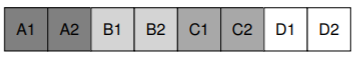
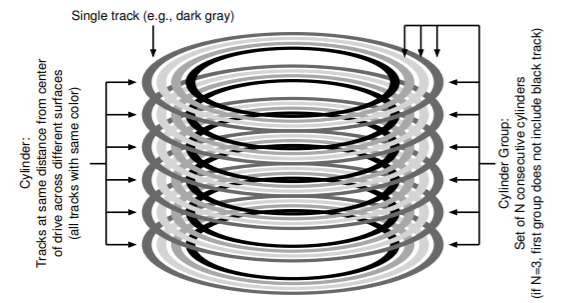
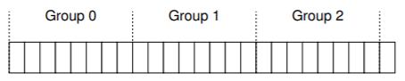
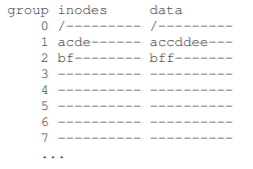
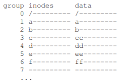
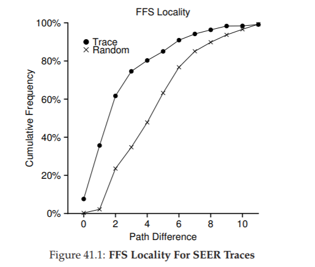
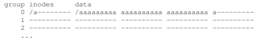
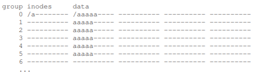
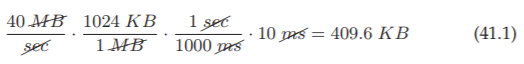
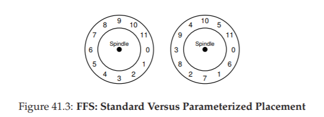

# 41 Locality and The Fast File System
UNIXオペレーティングシステムが初めて導入されたとき、UNIXウィザードのKen Thompson氏が最初のファイルシステムを作成しました。"古いUNIXファイルシステム"と呼ぶことにしましょう。それは本当に簡単でした。基本的に、そのデータ構造はディスク上で次のようになりました。  
  
スーパーブロック(S)には、ボリュームの大きさ、inodeの数、ブロックの空きリストの先頭へのポインタなど、ファイルシステム全体に関する情報が含まれていました。ディスクのiノード領域には、ファイルシステムのすべてのiノードが含まれていました。最後に、ディスクの大部分がデータブロックに取り込まれました。

古いファイルシステムについての良いことは、単純であり、ファイルシステムが提供しようとしていた基本的な抽象化、すなわちファイルとディレクトリ階層をサポートしていることでした。この使いやすいシステムは、過去の不器用なレコードベースのストレージシステムからの真の前進でした。ディレクトリ階層は、以前のシステムで提供されていたよりシンプルな1レベル階層以上の真の進歩でした。

## 41.1 The Problem: Poor Performance
問題：パフォーマンスはひどいものです。Berkeley [MJLF84]のKirk McKusickとその同僚たちが測定したように、パフォーマンスは悪くなり、ファイルシステムが全体のディスク帯域幅のわずか2％というところまで悪化しました。

主な問題は、古いUNIXファイルシステムがランダムアクセスメモリのようにディスクを処理していたことです。データを保持する媒体がディスクであることに関係なく、データは場所全体に広がっていたため、現実的で高価な位置決めコストが発生していました。例えば、あるファイルのデータブロックは、しばしばinodeから非常に遠く離れているため、最初にinodeを読み込み、次にファイルのデータブロックを読み込むときには高価なシークを引き起こします(かなり一般的な操作です)。

さらに悪いことに、空き領域が慎重に管理されていないため、ファイルシステムはかなり断片化してしまいます。 フリーリストは、ディスク全体に散らばっているブロックを指し、ファイルが割り当てられると、次の空きブロックを取るだけです。 その結果、論理的に連続したファイルには、ディスク全体を行き来してアクセスすることができ、パフォーマンスが大幅に低下しました。

たとえば、次のデータブロック領域を想定します。この領域には、サイズが2ブロックのそれぞれに4つのファイル(A、B、C、D)が含まれています。  
  
BとDが削除された場合、結果のレイアウトは次のようになります。  
  
見て分かるように、空き領域は4つの連続チャンクではなく、1つのブロックの2つのチャンクごとにそれぞれ分割されています。たとえば、サイズが4ブロックのファイルEを割り当てたいとします。  
  
何が起こるかを見ることができます.Eはディスク全体に広がってしまい、その結果、Eにアクセスすると、ディスクからピーク(シーケンシャル)なパフォーマンスが得られません。むしろ、まずE1とE2を読んでから、シークしてからE3とE4を読み込みます。この断片化の問題は、古いUNIXファイルシステムでは常に発生し、パフォーマンスが低下します。副題：この問題は、ディスクデフラグツールが役立つものです。オンデイスクデータを再編成してファイルを連続して配置し、連続した1つまたは複数の領域に空き領域を作ったり、データを移動したり、iノードなどを書き換えたりして変更を反映させます。

もう1つの問題：元のブロックサイズが小さすぎます(512バイト)。従って、ディスクからデータを転送することは、本質的に非効率的でした。小さなブロックは内部断片化(ブロック内の無駄)を最小限に抑えたため良好でしたが、各ブロックに到達するためにはオーバーヘッドが必要な場合があったため、転送には問題がありました。したがって、問題：

>> THE CRUX: HOW TO ORGANIZE ON-DISK DATA TO IMPROVE PERFORMANCE  
パフォーマンスを向上させるためにファイルシステムのデータ構造をどのように整理できますか？ これらのデータ構造に加えて、どのようなタイプの割り当てポリシーが必要ですか？ ファイルシステムを「ディスク対応」にするにはどうすればよいですか？

## 41.2 FFS: Disk Awareness Is The Solution
Berkeleyのあるグループは、より高速でより高速なファイルシステムを構築することを決めました。そのファイルシステムは、巧みにFast File System(FFS)と呼ばれていました。この考え方は、ファイルシステムの構造と割り当てポリシーを「ディスクを意識した」ものにすることでパフォーマンスを向上させることでした。FFSはファイルシステム研究の新しい時代を迎えました。(`open()`、`read()`、`write()`、`close()`、および、その他の同じAPIであるファイルシステムコールを含む)同じファイルシステムに維持しながら、内部実装を変更することによって、新しいファイルシステムの構築を今日まで続いています。事実上、最新のファイルシステムはすべて、パフォーマンス、信頼性、その他の理由から内部を変更しながら、既存のインターフェイスに準拠している(したがって、アプリケーションとの互換性を維持します)。

## 41.3 Organizing Structure: The Cylinder Group
最初のステップは、ディスク上の構造を変更することでした。FFSは、ディスクを複数のシリンダグループに分割します。1つのシリンダは、ドライブの中央から同じ距離にあるハードドライブの異なる面にある一連のトラックです。いわゆる幾何学的形状とは明らかに類似しているため、円筒と呼ばれています。FFSは、N個の連続したシリンダをグループに集約するので、ディスク全体はシリンダグループの集合として見ることができます。ここには、6つのプラッターを持つドライブの4つあるうちの最も外側のトラックから3つのシリンダーで構成されるシリンダー・グループを示す簡単な例があります。(今回の場合N=3であるため、黒色のトラックはシリンダーに含まれません)  
  
最新のドライブは、特定のシリンダが使用されているかどうかを本当に理解するためにファイルシステムに十分な情報をエクスポートしないことに注意してください。前述の[AD14a]のように、ディスクはブロックの論理アドレス空間をエクスポートし、ジオメトリの詳細をクライアントから隠します。したがって、現代のファイルシステム(Linux ext2、ext3、ext4など)ではなく、ドライブをブロックグループに編成します。各ブロックグループは、ディスクのアドレススペースのちょうど連続した部分です。下の図は、8つのブロックがすべて異なるブロックグループに編成されている例を示しています(実際のグループはもっと多くのブロックで構成されています)。  
  
シリンダーグループまたはブロックグループと呼ばれても、FFSがパフォーマンスを向上させるために使用する中心的なメカニズムです。重大なことに、同じグループ内に2つのファイルを配置することで、FFSは、次々にアクセスすることによって、ディスク全体で長くシークを発生させることはありません。

これらのグループを使用してファイルとディレクトリを格納するには、ファイルとディレクトリをグループに配置し、そこに必要なすべての情報を追跡する必要があります。そうするために、FFSには、inode、データブロック、およびそれらのそれぞれが割り当てられているか解放されているかを追跡するいくつかの構造体のスペースなど、ファイルシステムが各グループ内に持つと考えられるすべての構造が含まれています。ここでは、FFSが単一のシリンダグループ内に保持するものを示しています。  
  
ここで、この単一のシリンダグループのコンポーネントを詳細に調べてみましょう。FFSは、信頼性の理由からスーパーブロック(S)のコピーを各グループに保持します。スーパーブロックは、ファイルシステムをマウントするために必要です。複数のコピーを保持することで、1つのコピーが破損した場合でも、動作中のレプリカを使用してファイルシステムをマウントしてアクセスできます。

各グループ内で、FFSはグループのinodeとデータブロックが割り当てられているかどうかを追跡する必要があります。グループごとのinodeビットマップ(ib)とデータビットマップ(db)は、各グループのinodeとデータブロックに対してこの役割を果たします。ビットマップは、ファイルシステムの空き領域を管理する優れた方法です。古いファイルシステムの空きリストの断片化の問題を避けるために、大きな空き領域を見つけてファイルに割り当てるのが簡単だからです。

最後に、iノードとデータブロック領域は、以前の非常に単純なファイルシステム(VSFS)の領域とまったく同じです。通常、各シリンダグループのほとんどはデータブロックで構成されています。

>> ASIDE: FFS FILE CREATION
>> たとえば、ファイルの作成時に更新するデータ構造を考えてみましょう。この例では、ユーザーが新しいファイル/foo/bar.txtを作成し、ファイルが1ブロック(4KB)であると仮定します。このファイルは新しいもので、新しいinodeが必要です。したがって、inodeビットマップと新しく割り当てられたiノードの両方がディスクに書き込まれます。ファイルにはデータも含まれているため、割り当ても必要です。データビットマップとデータブロックはこうして(最終的に)ディスクに書き込まれます。したがって、現在のシリンダグループへの少なくとも4回の書き込みが行われます(これらの書き込みは、発生前に一時的にメモリにバッファリングされる可能性があります)。ただこれが全てではありません！特に、新しいファイルを作成するときには、そのファイルをファイルシステム階層に配置する必要があります。つまり、ディレクトリを更新する必要があります。具体的には、親ディレクトリfooを更新してbar.txtのエントリを追加する必要があります。この更新は、fooの既存のデータブロックに収まるか、または関連するデータビットマップとともに新しいブロックを割り当てる必要があります。ディレクトリの新しい長さを反映し、時間フィールドを更新するために(last modified timeなどの)fooのinodeも更新する必要があります。これらが、新しいファイルを作成するだけの全作業です！

## 41.4 Policies: How To Allocate Files and Directories
このグループ構造を導入したFFSは、パフォーマンスを向上させるために、ファイルとディレクトリおよび関連メタデータをディスクに配置する方法を決定する必要があります。基本的なマントラ(真言)はシンプルです。関連するものを一緒にしておくことです(そしてその結果として、関連性のないものを遠くに保ちます)。

したがって、マントラに従うためには、FFSは何が「関連する」ものであるかを決定し、それを同じブロックグループ内に置かなければいけません。反対に、関係のないアイテムは異なるブロックグループに配置する必要があります。この目的を達成するために、FFSはいくつかの簡単な配置ヒューリスティックを利用します。

最初はディレクトリの配置です。FFSは単純なアプローチを採用しています。割り当てられたディレクトリの数が少ない(グループ間でディレクトリのバランスを調整する)シリンダ数と、空きinode数が多いシリンダグループ(その後にたくさんのファイルを割り当てることができます)を見つけて、ディレクトリデータとiノードをグループに置きます。もちろん、他のヒューリスティックをここで使用することができます(例えば、空きデータブロックの数を考慮に入れて)。ファイルの場合、FFSは2つのことを行います。まず(一般的なケースでは)、ファイルのデータブロックをinodeと同じグループに割り当てて、(古いファイルシステムのように)inodeとデータの間の長いシークを防ぎます。

次に、同じディレクトリーにあるすべてのファイルを、それらが入っているディレクトリーのシリンダー・グループに入れます。つまり、ユーザーが、/a/b、/a/c、/a/d、/b/fの4つのファイルを作成すると、FFSは、最初の3つを互いに近く(同じグループ)に配置し、4つ目を遠くに(他のグループに)配置しようとします。このような割り当ての例を見てみましょう。この例では、各グループに10個のinodeと10個のデータブロック(非現実的に小さな番号)があり、3つのディレクトリ(ルートディレクトリ/、/a、/b)と4つのファイル(/a/c、/a/d、/a/e、/b/f)は、FFSポリシーごとに配置されます。通常のファイルはそれぞれ2ブロックのサイズであり、ディレクトリにはただ1ブロックのデータしかないものとします。この図では、各ファイルまたはディレクトリ( /はルートディレクトリ、/aはa、/b/fはfなど)に明瞭な記号を使用しています。  
  
FFSポリシーは2つのポジティブなことを行います。FFSポリシーは、各ファイルのデータブロックが各ファイルのiノードの近くにあり、同じディレクトリ内のファイルが互いに近くにあることです。(すなわち、/a/c、/a/d、/a/eはグループ1にすべてあり、ディレクトリ/bとそのファイル/b/fはグループ2で互いに近くにあります)これとは対照的に、グループ全体でiノードを広げ、グループのiノードテーブルがすぐにいっぱいにならないようにしようとするiノード割り当てポリシーを見てみましょう。したがって、最終的な割り当ては次のようになります。  
  
図からわかるように、このポリシーは実際にファイル(およびディレクトリ)データをそれぞれのiノードの近くに保ちますが、ディレクトリ内のファイルは任意にディスクの周りに広がっているため、名前ベースの場所は保持されません。ファイル/a/c、/a/d、/a/eへのアクセスは、FFSアプローチのように1つではなく3つのグループに分かれています。

FFSポリシーヒューリスティックは、ファイルシステムのトラフィックや、特に微妙なものについての広範な調査に基づいているわけではありません。むしろ、彼らは昔ながらの良い常識に基づいています(CSは結局何を意味するのでしょうか？)。ディレクトリ内のファイルは、多くの場合、一緒にアクセスされます。ファイルの束をコンパイルし、それらを単一の実行可能ファイルにリンクすることを想像してください。このような名前空間ベースのローカリティが存在するため、FFSはパフォーマンスを向上させ、関連ファイル間のシークが素敵で短いのです。

## 41.5 Measuring File Locality
これらのヒューリスティックが意味を成すかどうかをよりよく理解するために、ファイルシステムのアクセスの痕跡を分析し、実際に名前空間の局所性があるかどうかを見てみましょう。なんらかの理由で、このトピックについての良い研究は文献にないようです。

具体的には、SEERトレース[K94]を使用して、ディレクトリツリー内の「遠く離れた」ファイルアクセスが互いにどのように関連していたかを分析します。たとえば、ファイルfを開いた後、トレース内の次のファイルを開くと、ディレクトリツリー内のこれら2つのファイル間の距離はゼロになります(同じファイルであるため)。ディレクトリdir(すなわちdir/f)内のファイルfが開かれ、続いて同じディレクトリ(すなわちdir/g)内のファイルgが開いている場合、2つのファイルアクセス間の距離は1です。同じディレクトリですが、同じファイルではありません。私たちの距離メトリックは、言い換えれば、2つのファイルの共通の祖先を見つけるために移動するディレクトリツリーの距離を測定します。それらがツリーに近づくほど、メトリックは低くなります。

図41.1は、すべてのトレースの全体にわたってSEERクラスタ内のすべてのワークステーションでSEERトレースで観測された地域を示しています。このグラフは、x軸は差メトリックをプロットし、y軸はその差異のファイルオープン率の累積パーセントを示しています。具体的には、SEERトレース(グラフの「Trace」と表示)では、以前に開かれたファイルに対するファイルアクセスが約7％であり、ファイルアクセスの40％近くが同じファイルまたは同じディレクトリ内の1つに(つまり、0または1の差)を返します。したがって、FFSの局所性の仮定は(少なくともこれらの痕跡に対して)意味があります。

興味深いことに、25％程度のファイルへのアクセスは、2の距離を持つファイルに対するものでした。このタイプのローカリティは、ユーザーが複数のレベルの方法で関連ディレクトリのセットを構成し、それらの間で一貫してジャンプするときに発生します。たとえば、ユーザーがsrcディレクトリを持ち、オブジェクトファイル(.oファイル)をobjディレクトリに構築し、これらのディレクトリが両方ともメインのprojディレクトリのサブディレクトリである場合、共通のアクセスパターンはproj/src/fooになります.cに続いてproj/obj/foo.oが続きます。projは共通の祖先であるため、これら2つのアクセス間の距離は2です。FFSは、そのポリシー内でこのタイプのローカリティを取得しないため、そのようなアクセスの間にさらに悪影響が生じる可能性があります。

比較のため、グラフには「ランダム」トレースのローカリティも表示されます。ランダムトレースは、既存のSEERトレース内からランダムな順序でファイルを選択し、これらのランダムに順序付けられたアクセス間の距離メトリックを計算することによって生成されました。ご覧のように、予想どおり、ランダムトレースには名前空間の局所性が少なくなります。しかし、最終的にはすべてのファイルが共通の祖先(例えばroot)を共有し、一部局所性があるため、ランダムは(あくまで)比較する対象としては有用である。

## 41.6 The Large-File Exception
FFSでは、ファイルの配置に関する一般的なポリシーの1つの重要な例外があり、大きなファイルの場合に発生します。別の規則がなければ、大きなファイルは最初に配置されたブロックグループ(もしくは別の場所)を完全に埋めるでしょう。このようにブロックグループを充填することは、後続の「関連する」ファイルが、このブロックグループ内に配置されることを防ぐため、ファイルアクセスの局所性を損なう可能性があり、望ましくないです。

したがって、大きなファイルの場合、FFSは次の処理を行います。FFSは、いくつかのブロックが第1のブロックグループに割り当てられた後(例えば、12ブロックまたはiノード内で利用可能な直接ポインタの数)、ファイルの次の「大きな」チャンク(例えば、第1のブロック 間接ブロック)を別のブロックグループ(利用率が低いために選択されている可能性があります)に配置します。そのとき、ファイルの次のチャンクは、さらに別のブロックグループに配置されます。

この方針をよりよく理解するためにいくつかの図を見てみましょう。大きなファイルの例外がなければ、1つの大きなファイルはすべてのブロックをディスクの1つの部分に配置します。10個のinodeと1グループあたり40個のデータブロックで構成されたFFS内の30個のブロックを含むファイル(/a)の小さな例を調べます。ここでは、大きなファイルの例外を除いたFFSを示します。  
  
この図でわかるように、/aはグループ0のデータブロックのほとんどを占めていますが、他のグループは空のままです。現在ルートディレクトリ(/)に他のファイルが作成されている場合、そのグループのデータのための余裕はあまりありません。

大容量ファイルの例外(ここでは各チャンクに5つのブロックが設定されています)では、FFSはファイルをグループ全体に広げ、その結果1つのグループ内の利用率が高すぎません。  
  
巧みな読者(それはあなたです)は、気づいているかもしれません。シーケンシャルなファイルアクセスの比較的一般的なケース(ユーザーやアプリケーションが順番に0〜29のチャンクを読み込んだ場合など)では、ディスク全体にファイルのブロックを広げるとパフォーマンスが低下することに気付くでしょう。しかし、チャンクサイズを慎重に選択することで、この問題に対処できます。

具体的には、チャンクサイズが十分に大きい場合、ファイルシステムはディスクからデータを転送する時間のほとんどを費やし、ブロックのチャンク間を探すシークで(比較的)少し時間を費やします。支払ったオーバーヘッドごとにさらに多くの作業を行うことによってオーバーヘッドを削減するこのプロセスは、amortization(償却)と呼ばれ、コンピュータシステムでは一般的な手法です。

例を挙げておきましょう。ディスクの平均位置決め時間(すなわち、シークおよび回転)が10ミリ秒であると仮定します。更に、ディスクが40MB/sでデータを転送すると仮定します。半分のチャンクのシーク時間で半分のデータの転送時間を費やす(ピークディスク性能の50％を達成する)ことが目標だった場合は、10msの位置決めごとに10msのデータ転送に費やす必要があります。ですから、問題は次のようになります。転送で10ミリ秒を費やすにはチャンクがどれくらい大きくなければなりませんか？それは簡単です。ちょうど我々の古い友人、数学、特にディスクの章で言及された寸法分析を使用してください[AD14a]：  
  
基本的には、この方程式の意味は次のとおりです。データを40 MB/秒で転送する場合は、シークするたびに409.6KBだけ転送する必要があります。このとき、半分のシーク時間で半分のデータ転送を達成する必要があります。同様に、ピーク帯域幅の90％(約3.69MB)、またはピーク帯域幅(40.6MB！)の99％を達成するために必要なチャンクのサイズを計算できます。ご覧のように、ピークに近づきたいほど、これらのチャンクは大きくなります(これらの値のプロットについては、図41.2を参照してください)。

しかし、大規模なファイルをグループ全体に広げるために、FFSはこのタイプの計算を使用しませんでした。代わりに、iノード自体の構造に基づいて簡単なアプローチをとっていました。最初の12個の直接ブロックは、inodeと同じグループに配置されました。後続の各間接ブロックと、それが指し示すすべてのブロックが異なるグループに配置されました。ブロックサイズが4KBで、ディスクのアドレスが32ビットの場合、この方法では、ファイル(4MB)の1024ブロックが別々のグループに配置され、直接ポインタによって指し示されるファイルの最初の48KBが例外となります。

ディスクメーカーの傾向としては、ディスクメーカーが表面にビット数を増やしたら、転送速度がかなり速くなりますが、シークに関連するドライブの機械的な側面(ディスクアームの速度と回転速度)はゆっくりと向上します[P98]。時間が経つにつれて、機械的なコストは比較的高価になり、そのコストを償却するためには、シークの間にもっと多くのデータを転送する必要があります。

## 41.7 A Few Other Things About FFS
FFSはいくつかの革新も導入しました。特に、デザイナーは小さなファイルを扱うことを非常に心配していました。それが判明したので、多くのファイルは2KB程度の大きさであったが、4KBのブロックを使用することでデータを転送するのは効率は良かったのですが、ディスクスペースの効率は悪くなってしまいました。したがって、この内部的な断片化は、典型的なファイルシステムではディスクのおよそ半分が無駄になる可能性があります。

FFSの設計者がヒットした解決策は簡単で、問題を解決しました。彼らは、ファイルシステムがファイルに割り当てることができる512バイトの小さなブロックであるサブブロックを導入することに決めました。したがって、小さなファイル(サイズが1KB)を作成した場合、2つのサブブロックを占有し、4KBブロック全体を無駄にすることはありません。ファイルが大きくなり、4KBのデータを取得するまで、ファイルシステムは、512バイトのブロックを割り当て続けます。4KBのデータを取得した場合、FFSは4KBブロックを見つけて、そのサブブロックを4KBブロックにコピーし、将来の使用のためにサブブロックを解放します。

このプロセスは非効率的であり、ファイルシステムに多くの余分な作業(特に、コピーを実行するための余分なI/O)を必要とすることがあります。そして、あなたはもう一度やって来るだろう！したがって、FFSは、一般的に、libcライブラリを変更することでこの最悪な動作を回避しました。ライブラリは書き込みをバッファリングしてからファイルシステムの4KBのチャンクに発行するので、ほとんどの場合、サブブロックの特殊化は完全に回避されます。

FFSが導入したもう一つのすばらしい点は、パフォーマンスのために最適化されたディスクレイアウトでした。その時代(SCSIや他の最新のデバイスインタフェースの前の)、ディスクは全く洗練されておらず、ホストCPUは操作をより実践的に制御する必要がありました。図41.3の左側のように、ファイルがディスクの連続するセクタに置かれたときにFFSに問題が発生しました。

特に、この問題は順序読み出し時に発生しました。FFSは最初にブロック0への読み出しを発行します。読み出しが完了し、FFSがブロック1への読み出しを発行した時点では、それは遅すぎました。すなわち、ブロック1の読み出しの前にヘッドを通り過ぎるため、一度回転を待たなければいけません。

図41.3の右側に示すように、FFSはこの問題を別のレイアウトで解決しました。他のすべてのブロック(この例では)をスキップすることによって、FFSはディスクヘッドを通過する前に次のブロックを要求するのに十分な時間を確保します。実際、FFSは余分な回転を避けるためにレイアウト(設計)を行い、特定のディスクに対して、スキップする必要があるブロックの数を十分に把握するほどスマートでした。このテクニックは、FFSがディスクの特定のパフォーマンスパラメータを把握し、それらを使って厳密なずらしたレイアウトスキーム(設計計画)を決定するので、parameterization(パラメータ化)と呼ばれていました。

あなたは考えているかもしれません。この計画は結局大したことではありません。実際には、このタイプのレイアウトでピーク帯域幅の50％しか得られません。なぜなら、各ブロックを一度読み取るためには、各トラックを2回周回しなければならないからです。幸運なことに、現代のディスクはずっとスマートです。内部的にトラック全体を読み込んで内部のディスクキャッシュ(これはまさにトラックバッファと呼ばれます)にバッファリングします。その後、トラックへの次の読み込みで、ディスクはキャッシュから目的のデータを返します。したがって、ファイルシステムはこれらの信じられないほど低いレベルの詳細を心配する必要はありません。抽象化と高水準のインタフェースは、適切に設計されたときに良いことになります。

他のいくつかのユーザビリティ改善も加えられました。FFSは、長いファイル名を可能にする最初のファイルシステムの1つであったため、従来の固定サイズのアプローチ(例えば、8文字)ではなくファイルシステムでより表現力のある名前が可能になりました。さらに、シンボリックリンクと呼ばれる新しい概念が導入されました。前の章[AD14b]で説明したように、ハードリンクは、(ファイルシステム階層にループを導入する恐れがあるために)ディレクトリを指すことができず、同じボリューム内のファイルのみを指し示すことができます(inode番号はまだ意味があるはずです)。シンボリックリンクを使用すると、システム上の他のファイルやディレクトリの「エイリアス」を作成することができ、柔軟性が向上します。FFSは、ファイルの名前を変更するための原子的な`rename()`操作も導入しました。基本技術を超えた使いやすさの向上により、FFSはより強力なユーザーベースになる可能性が高くなりました。

>> TIP: MAKE THE SYSTEM USABLE  
>> おそらく、FFSの最も基本的な教訓は、ディスク対応レイアウトの概念的な概念を導入しただけでなく、単にシステムをより使いやすくした多くの機能を追加したということです。長いファイル名、シンボリックリンク、およびリネーム操作はすべてアトミックに機能し、システムのユーティリティを改善しました。この研究論文について書くのは難しい(「The Symbolic Link: Hard Link’s Long Lost Cousin」についての14ページを読んでみよう)が、そのような小さな機能はFFSをより有用にし、採用の機会を増やす可能性が高いです。システムを使いやすくすることは、深い技術革新よりも重要であることが多いです。

## 41.8 Summary
ファイル管理の問題は、オペレーティングシステム内で最も興味深い問題の1つであることが明らかになり、最も重要なハードディスクというデバイスに対処する方法が示されていたことから、FFSの導入はファイルシステムの歴史における大きな潮流でした。それ以来、何百もの新しいファイルシステムが開発されてきましたが、今日でも多くのファイルシステムがFFSからの手がかりを取ります(例えば、Linux ext2とext3は明らかにFFSの子孫です)。明らかなのはすべての現代のシステムはFFSの主な教訓から成り立っていることです。それは、「ディスクをディスクのように扱う」ということです。

## 参考文献
[AD14a] “Operating Systems: Three Easy Pieces”  
Chapter: Hard Disk Drives  
Remzi Arpaci-Dusseau and Andrea Arpaci-Dusseau  
There is no way you should be reading about FFS without having first understood hard drives in some detail. If you try to do so, please instead go directly to jail; do not pass go, and, critically, do not collect 200 much-needed simoleons.

[AD14b] “Operating Systems: Three Easy Pieces”  
Chapter: File System Implementation  
Remzi Arpaci-Dusseau and Andrea Arpaci-Dusseau  
As above, it makes little sense to read this chapter unless you have read (and understood) the chapter on file system implementation. Otherwise, we’ll be throwing around terms like “inode” and “indirect block” and you’ll be like “huh?” and that is no fun for either of us.

[K94] “The Design of the SEER Predictive Caching System”  
G. H. Kuenning  
MOBICOMM ’94, Santa Cruz, California, December 1994  
According to Kuenning, this is the best overview of the SEER project, which led to (among other things) the collection of these traces.

[MJLF84] “A Fast File System for UNIX”  
Marshall K. McKusick, William N. Joy, Sam J. Leffler, Robert S. Fabry  
ACM Transactions on Computing Systems, 2:3, pages 181-197.  
August, 1984. McKusick was recently honored with the IEEE Reynold B. Johnson award for his contributions to file systems, much of which was based on his work building FFS. In his acceptance speech, he discussed the original FFS software: only 1200 lines of code! Modern versions are a little more complex, e.g., the BSD FFS descendant now is in the 50-thousand lines-of-code range.

[P98] “Hardware Technology Trends and Database Opportunities”  
David A. Patterson  
Keynote Lecture at the ACM SIGMOD Conference (SIGMOD ’98)  
June, 1998  
A great and simple overview of disk technology trends and how they change over time.

[prev](../40/40.md)|[next](../42/42.md)
