# 43 Log-structured File Systems
90年代初頭、John Ousterhout教授と大学院生Mendel Rosenblumが率いるバークレー校のグループが、ログ構造ファイルシステム[RO91]と呼ばれる新しいファイルシステムを開発しました。そうする動機は、以下の観察に基づいていました。

- システムメモリが増えている
メモリが大きくなるにつれ、より多くのデータをメモリにキャッシュすることができます。より多くのデータがキャッシュされるにつれて、ディスクトラフィックはますますキャッシュからの読み取りが処理されるため、書き込みから構成されます。したがって、ファイルシステムのパフォーマンスは主にその書き込みパフォーマンスによって決まります。

- ランダムI/Oパフォーマンスとシーケンシャル(順次)I/Oパフォーマンスの間に大きなギャップがあります
ハードドライブの転送帯域幅は、長年にわたって大きく増加しています[P98]。より多くのビットがドライブの表面にパックされると、アクセスするときの帯域幅が増加します。しかし、シークおよび回転遅延のコストは緩やかに低下しています。安価で小型のモーターを高速で回転させたり、ディスクアームをより迅速に動かすことは困難です。したがって、シーケンシャルにディスクを使用できる場合は、シークとローテーションを引き起こすアプローチよりも大きなパフォーマンス上の利点があります。

- 既存のファイルシステムは、多くの一般的な仕事量でパフォーマンスが低下します。
たとえば、FFS [MJLF84]は、FFS [MJLF84]は、一つのサイズブロックの新しいファイルを作成するために多数の書き込みを実行します。新しいinodeに1つ、inodeのビットマップの更新のために1つ、ファイルが存在するディレクトリデータブロックのために1つ、ディレクトリiノードを更新するために1つ、一部の新しいファイルの新しいデータブロックのために1つ、割り当てられたデータブロックをマークするためのデータビットマップに1つがあります。したがって、FFSはこれらすべてのブロックを同じブロックグループ内に配置しますが、FFSは多くの短いシークとそれに続く回転遅延を招きます。そのため、パフォーマンスはピークシーケンシャル帯域幅をはるかに下回ります。

- ファイルシステムはRAID対応ではありません
たとえば、RAID-4とRAID-5の両方で、1つのブロックへの論理書き込みによって4つの物理I/Oが発生する小さな書き込み問題が発生します。既存のファイルシステムは、この最悪の場合のRAID書き込み動作を回避しようとしません。

>> TIP: DETAILS MATTER  
>> すべての興味深いシステムは、いくつかの一般的なアイデアと多くの詳細から構成されています。時には、あなたがこれらのシステムについて学んでいる時、あなたは自分自身に"おっ！、良いアイデア発見！後は詳細考えるだけだ」と思うでしょう。また、これを使って、物事の実際の仕組みを半分だけ学べばいいと思うでしょう。しかし、このようなことをしないでください！多くの場合、詳細は重要です。LFSで見るように、一般的な考え方は理解しやすいですが、実際には動作するシステムを構築するためには、すべての難しいケースを考える必要があります。

理想的なファイルシステムは、書き込みパフォーマンスに重点を置き、ディスクの帯域幅を使用します。また、データを書き出すだけでなく、ディスク上のメタデータ構造を頻繁に更新する一般的な仕事量でも、パフォーマンスが向上します。最後に、RAIDとシングルディスクでうまくいくものです。

導入されたRosenblumとOusterhoutの新しいタイプのファイルシステムは、Log structured File Systemの略でLFSと呼ばれていました。ディスクに書き込むとき、LFSは最初にすべての更新(メタデータを含む)をメモリセグメントにバッファリングします。セグメントがいっぱいになると、ディスクの未使用部分に1回の長いシーケンシャル転送でディスクに書き込まれます。LFSは既存のデータを上書きすることはありませんが、むしろ常にフリーな場所にセグメントを書き込みます。セグメントが大きいため、ディスク(またはRAID)が効率的に使用され、ファイルシステムのパフォーマンスがその限界に近づきます。

>> THE CRUX: HOW TO MAKE ALL WRITES SEQUENTIAL WRITES?  
ファイルシステムはどのようにしてすべての書き込みを順次書き込みに変換できますか？読み取りの場合、このタスクは不可能です。読み取るブロックはディスク上のどこにあってもかまいません。しかし、書き込みの場合、ファイルシステムには常に選択肢があります。これはまさに私たちが開発しようとしている選択肢です。

## 43.1 Writing To Disk Sequentially
したがって、私たちは最初の課題を抱えています。ファイルシステム状態へのすべての更新をディスクへの一連の順次書き込みに変換するにはどうすればよいですか？これをよりよく理解するために、簡単な例を使用してみましょう。データブロックDをファイルに書き込んでいるとします。データブロックをディスクに書き込むと、次のオンディスクレイアウトが発生し、DはディスクアドレスA0に書き込まれます。  
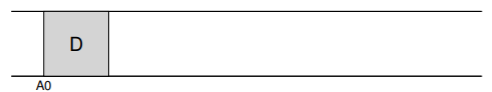  
ただし、ユーザーがデータブロックを書き込むときは、ディスクに書き込まれるデータだけではありません。更新が必要な他のメタデータもあります。この場合、ファイルのiノード(I)をディスクに書き込んで、データブロックDを指します。ディスクに書き込むと、データブロックとiノードは次のようになります(注意してほしいのは、iノードはデータブロックと同じくらいに大きく見えます。これ一般的ではないケースです。大部分のシステムでは、データブロックは4 KBのサイズですが、inodeはだいたい128バイトくらいで小さいです)。  
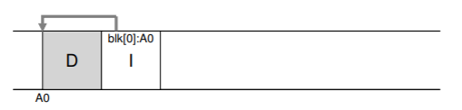  

## 43.2 Writing Sequentially And Effectively
残念ながら、ディスクへの順次書き込みは、効率的な書き込みを保証するのに十分ではありません。たとえば、時間TにAをアドレス指定する単一のブロックを書き込無ことを考えてみてください。そのとき、ちょっと待ってからアドレスA + 1(次のブロックアドレスが順番に)に書き込まれますが、その時刻はT + δです。最初の書き込みと2番目の書き込みの間に、残念ながら、ディスクが回転しています。2回目の書き込みを発行すると、コミットされる前に回転のためにほとんどの時間待機します(具体的には、回転に時間T_rotationがかかる場合、ディスクはT_rotation - δを待ってからディスク表面に2回目の書き込みをコミットできます)。したがって、順番にディスクに書き込むだけでは、ピークパフォーマンスを達成するには不十分であることがうかがえます。むしろ、良好な書き込みパフォーマンスを達成するためには、ドライブに多数の連続書き込み(または1回の大きな書き込み)を発行する必要があります。

この目的を達成するために、LFSは書き込みバッファリングと呼ばれる古くからの技術を使用しています(実際、この考え方はコンピューティングの歴史のなかでも早い時期に発明された可能性が高いです。その利点についてはSolworthとOrji [SO90]を参照してください。その潜在的な危険については、Mogul [M94]を参照してください。)ディスクに書き込む前に、LFSはメモリ内の更新を追跡します。十分な数の更新を受信すると、ディスクに一度に書き込むので、ディスクの効率的な使用が保証されます。

LFSが一度に書き込む更新の大部分は、セグメントの名前で参照されます。この用語はコンピュータシステムでは過度に使用されていますが、ここではLFSが書き込みをグループ化するために使用する大規模なチャンクを意味します。したがって、ディスクに書き込むとき、LFSはメモリ内セグメントの更新をバッファし、そのセグメントを一度にディスクに書き込みます。セグメントが十分大きければ、これらの書き込みは効率的になります。ここでは、LFSが2セットの更新を小さなセグメントにバッファリングする例を示します。実際のセグメントは大きくなります(数MB)。最初の更新は、ファイルjへの4回のブロック書き込みです。2番目のブロックはファイルkに追加される1つのブロックです。LFSは、7ブロックのセグメント全体を一度にディスクにコミットします。これらのブロックの結果として得られるディスク上のレイアウトは次のとおりです。  
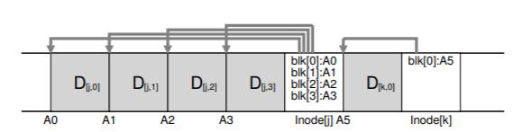  

## 43.3 How Much To Buffer?
ディスクに書き込む前にLFSが何回更新すべきでしょうかという質問を提起します。答えはもちろん、ディスクそのものです。具体的には転送速度と比較して位置決めのオーバーヘッドがどれほど高いかによって異なります。同様の分析については、FFSの章を参照してください。例えば、各書き込みの前に位置決め(すなわち、回転およびシークオーバーヘッド)がおよそT_position秒かかると仮定します。さらに、ディスク転送速度はR_peak MB/sであると仮定します。このようなディスクで実行するときにLFSが書き込む前にどれくらいバッファするべきですか？

これについて考える方法は、書き込むたびにオーバーヘッドである位置決めコストの固定費を支払うことです。したがって、その費用を償却するためには、どれくらい書く必要がありますか？書き込みが多いほど、(明らかに)良くなり、ピーク帯域幅を近づけることができます。具体的な答えを得るには、D MBを書き出すと仮定しましょう。このデータのチャンク(T_write)を書き出す時間は、位置決め時間T_positionプラス転送時間D(D / R_peak)、または  
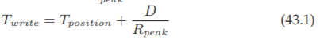  
したがって、書き込まれたデータの量を書き込む合計時間で割った有効な書き込み速度(R_effective)は次のようになります。  
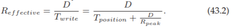  
私たちが興味を持っているのは、効率レート(R_effective)をピークレートに近づけることです。具体的には、効率レートをピークレートの何分のFにする必要があります(0 < F < 1、典型的なFは0.9、ピークレートの90％)数学的形式では、これは、R_effective = F × R_peakを望むことを意味します。この時点で、Dについて解くことができます  
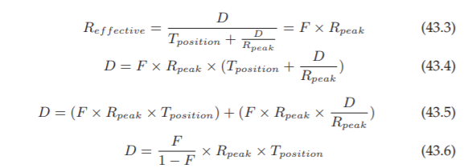  
例として、位置決め時間が10ミリ秒、ピーク転送速度が100 MB/sのディスクを例に挙げてみましょう。ピークの90％(F = 0.9)の実効帯域幅が必要であると仮定します。この場合、D = 0.9 / 0.1 × 100MB/s × 0.01秒= 9MBとなります。いくつかの異なる値を試して、ピーク帯域幅に近づくためにバッファリングする必要があるかどうかを確認してください。ピークの95％に達するにはどれだけの量が必要ですか？99％ではどうでしょうか？

## 43.4 Problem: Finding Inodes
LFSでのinodeの発見方法を理解するには、典型的なUNIXファイルシステムでinodeを見つける方法を簡単に見てみましょう。FFSや古いUNIXファイルシステムのような典型的なファイルシステムでは、inodeを見つけるのは簡単です。なぜなら、それらは配列で編成され、固定された場所にディスク上に配置されるからです。たとえば、古いUNIXファイルシステムでは、すべてのiノードがディスクの固定部分に保持されます。したがって、特定のinodeを見つけるために、inode番号と開始アドレスを指定すると、そのinode番号にinodeのサイズを掛け、その値をディスク上の配列の開始アドレスに加えるだけで、正確なディスクアドレスを計算することができます。inode番号を指定すると、配列ベースの索引付けは迅速かつ簡単です。

FFSはinodeテーブルをチャンクに分割し、各シリンダグループ内にiノードのグループを配置するため、FFSでiノード番号が指定されたiノードを見つけることはわずかに複雑です。したがって、inodeの各チャンクの大きさとそれぞれの開始アドレスを知る必要があります。その後、計算は同様で簡単です。

LFSでは、人生はより困難です。どうしてでしょうか？私たちはすべてのディスクにiノードを散らしてしまいました！さらに悪いことに、上書きすることはありません。したがって、最新バージョンのinode(私たちが望むもの)は動いています。

## 43.5 Solution Through Indirection: The Inode Map
この問題を解決するために、LFSの設計者は、iノードマップ(imap)と呼ばれるデータ構造を通じて、iノード番号とiノード間の間接レベルを導入しました。imapはinode番号を入力として受け取り、最新のバージョンのinodeのディスクアドレスを生成する構造体です。したがって、エントリごとに4バイト(ディスクポインタ)の単純な配列として実装されることが多いと想像できます。inodeがディスクに書き込まれるたびに、imapは新しい場所で更新されます。

残念ながら、imapは永続的(すなわち、ディスクに書き込まれる)に保たれる必要があります。そのようにすることで、LFSはクラッシュ中のiノードの位置を追跡することができ、必要に応じて動作します。したがって質問があります、ディスク上のどこにimapを置くべきですか？

それはもちろん、ディスクの固定された部分に生きることができます。残念なことに、頻繁に更新されると、ファイル構造の更新に続いてimapへの書き込みが必要になるため、パフォーマンスが低下します(つまり、それぞれの更新とimapの固定場所とのディスクシークが多くなります)。

代わりに、LFSはinodeマップのチャンクを、他のすべての新しい情報を書いている場所のすぐ隣に置きます。したがって、以下のように、データブロックをファイルkに追加するとき、LFSは実際には次のように、新しいデータブロック、そのiノード、iノードマップの一部をすべて一緒にディスクに書き込みます。  
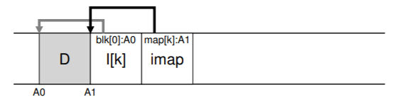  
この図では、imapと書かれているブロックに格納されているimap配列の部分は、inode kがディスクアドレスA1にあることをLFSに伝え、格納します。このiノードは、そのデータブロックDがアドレスA0にあることをLFSに指示します。

## 43.6 Completing The Solution: The Checkpoint Region
するどい読者であれば、ここで問題に気づいたかもしれません。どのようにしてinodeマップを見つけることができますか？それらはディスク全体に広がっていますか？最終的には魔法はありません。ファイルルックアップを開始するには、ファイルシステムにディスク上の固定された既知の場所が必要です。

LFSはこれのためにcheckpoint region(CR)と呼ばれる固定された場所をディスク上に持っています。checkpoint regionは、最新のinodeマップのポインタ(すなわち、そのアドレス)を含み、したがって、最初にCRを読み取ることによってinodeマップ部分を見つけることができます。checkpoint regionは定期的に更新されるだけなので(30秒ごとなど)、パフォーマンスに悪影響はありません。したがって、ディスク上のレイアウトの全体的な構造にはcheckpoint region(最新のinodeマップを示す)が含まれています。iノードマップ部分にはそれぞれiノードのアドレスが含まれています。inodeは典型的なUNIXファイルシステムと同じようにファイル(およびディレクトリ)を指しています。

次に、checkpoint regionの例を示します(ディスクの先頭、アドレス0にあります)。また、単一のimapチャンク、inode、データブロックがあります。実際のファイルシステムはもちろん大きなCR(実際には2つあります。後で学んでいきます)、多くのimapチャンク、さらにはもっと多くのinode、データブロックなどがあります。  
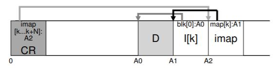  

## 43.7 Reading A File From Disk: A Recap
LFSがどのように動作するのかを理解するために、ディスクからファイルを読み込むために必要なことを見てみましょう。私達が始めるものをメモリに何も持っていないと仮定してください。最初に読み込まなければならないディスク上のデータ構造は、checkpoint regionです。checkpoint regionは、inodeマップ全体に対するポインタ(すなわち、ディスクアドレス)を含み、したがってLFSはinodeマップ全体を読み込み、メモリ内にキャッシュします。この時点以降、ファイルのiノード番号が与えられると、LFSは単にimapのinode numberからinode disk addressへのマッピングを検索し、最新のinodeのバージョンを読み込みます。この時点でファイルからブロックを読み込むには、直接ポインタ、間接ポインタ、二重間接ポインタを必要に応じてを使用して、LFSは典型的なUNIXファイルシステムとまったく同じように処理します。一般的なケースでは、LFSはディスクからファイルを読み込む際に、通常のファイルシステムと同じ数のI/Oを実行する必要があります。imap全体がキャッシュされるので、読み込み中にLFSが行う余計な作業は、imap内のinodeのアドレスを検索することです。

## 43.8 What About Directories?
ここまでは、inodeとデータブロックだけを考慮して、少し議論を単純化しました。しかし、ファイルシステム内のファイル(私たちの好きな偽のファイル名の1つである/home/remzi/fooなど)にアクセスするには、いくつかのディレクトリにもアクセスする必要があります。では、LFSはディレクトリデータをどのように格納していますか？

幸いにも、ディレクトリ構造は基本的に古典的なUNIXファイルシステムと同じです。ディレクトリは(名前、iノード番号)マッピングの集まりにすぎません。たとえば、ディスク上にファイルを作成する場合、LFSは新しいiノード、いくつかのデータ、ディレクトリデータ、このファイルを参照するiノードを書き込む必要があります。LFSはディスク上で順番に実行することを覚えておいてください(しばらくの間、更新をバッファリングした後)。したがって、ディレクトリにファイルfooを作成すると、ディスク上に次の新しい構造が生成されます。  
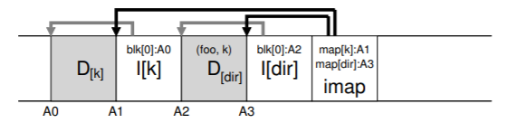  
iノードマップの部分には、ディレクトリファイルdirと新しく作成されたファイルfの両方の場所に関する情報が含まれています。したがって、ファイルfoo(iノード番号k)にアクセスする場合は、最初にinodeマップ(通常はメモリにキャッシュされている)を調べて、ディレクトリdir(A3)のiノードの場所を探します。次にディレクトリのinodeを読んで、ディレクトリのデータの場所(A2)を取得します。このデータブロックを読み取ると、(foo、k)の名前からiノード番号へのマッピングが得られます。その後、inode番号k(A1)の位置を見つけるためにinodeマップを再度参照し、最後にアドレスA0で目的のデータブロックを読み込みます。

再帰的更新問題[Z + 12]と呼ばれる、inodeマップが解決するもう1つの重大な問題がLFSにあります。この問題は、(LFSのような)決して更新されず、ディスク上の新しい場所に更新を移動するようなファイルシステムで発生します。

具体的には、iノードが更新されるたびに、ディスク上のその位置が変わります。私たちが注意していなかった場合、これはこのファイルを指すディレクトリへの更新を伴い、そのディレクトリの親ディレクトリの変更を強制していたでしょう。そしてそうなっていくと、ずっとファイルシステムツリーの上になるでしょう。

LFSは、この問題を賢明にinodeマップで回避します。inodeの場所が変更されても、変更はディレクトリ自体に反映されません。むしろ、imap構造体は更新されますが、ディレクトリは同じ名前から番号へのマッピングを保持します。したがって、間接参照によって、LFSは再帰的な更新の問題を回避します。

## 43.9 A New Problem: Garbage Collection
あなたはLFSに関する別の問題に気づいたかもしれません。ファイルの最新バージョン(そのinodeとデータを含む)をディスク上の新しい場所に繰り返し書き込みます。このプロセスは、効率的な書き込みを維持しながら、LFSが古いバージョンのファイル構造をディスク全体に分散させることを意味します。私たちは(むしろ無意識のうちに)これらの古いバージョンをゴミと呼んでいます。

たとえば、iノード番号kで参照される既存のファイルがある場合を考えてみましょう。このファイルは単一のデータブロックD0を指しています。このブロックを更新し、新しいinodeと新しいデータブロックの両方を生成します。その結果、LFSのディスク上のレイアウトは次のようになります(簡単にするためにimapやその他の構造体は省略しています。imapの新しいチャンクは新しいiノードを指すようにディスクに書き込む必要があります)。  
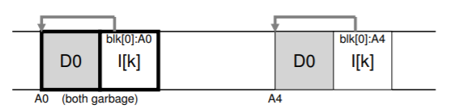  
この図では、iノードとデータブロックの両方に古いバージョン(左側のバージョン)と現在のバージョン(右側のバージョン)の2つのバージョンがあることがわかります。データブロックを(論理的に)更新する単純な行為によって、いくつかの新しい構造がLFSによって永続化されなければならず、したがって、前記ブロックの古いバージョンはディスク上に残されなければならない。もう1つの例として、元のファイルkにブロックを追加するとします。この場合、新しいバージョンのinodeが生成されますが、古いデータブロックはまだinodeによって指し示されます。したがって、それはまだ生きており、現在のファイルシステムの大部分です。  
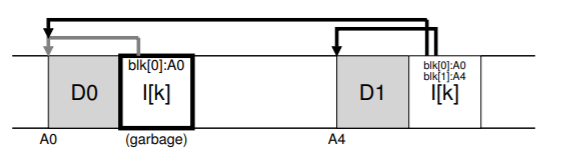  
では、古いバージョンのinodeやデータブロックなどではどうしたらいいですか？古いバージョンのファイルを保持して、古いファイルのバージョンを復元できるようにすることもできます(たとえば、誤ってファイルを上書きまたは削除した場合など)。そのようなファイルシステムは、ファイルの異なるバージョンを追跡するため、バージョン管理ファイルシステムとして知られています。

しかし、代わりにLFSは最新のライブバージョンのみを保持します。したがって(バックグラウンドで)、LFSは定期的にファイルデータ、inode、およびその他の構造の古いバージョンを見つけて、それらをクリーニングする必要があります。このようにして、次の書き込みに使用するために、ディスク上のブロックを再びフリーにする必要があります。クリーニングのプロセスはガベージコレクションの一種であり、プログラムのために未使用のメモリを自動的に解放するプログラミング言語で発生するテクニックです。

以前は、LFSのディスクへの大きな書き込みを可能にするメカニズムと同じくらい重要なセグメントについても説明しました。それが判明したとき、彼らはまた、効果的なクリーンに不可欠です。LFSクリーナーが、クリーニング中に単一のデータブロック、iノードなどを単に通過して解放した場合に起こることを想像してください。その結果、ディスク上の割り当てられたスペースの間にいくつかのフリーの穴が混在したファイルシステムが作成されました。LFSは連続して高性能なディスクに書き込むための大きな連続領域を見つけることができないため、書き込みパフォーマンスはかなり低下します。

その代わりに、LFSクリーナーはセグメント単位で動作します。したがって、後続の書き込みのために大きなスペースのチャンクをクリアします。基本的なクリーニングプロセスは次のように動作します。定期的に、LFSクリーナーは古い(部分的に使用されている)セグメントを読み込み、これらのセグメント内にどのブロックが存在するかを判断し、その中にライブブロックだけを含む新しいセグメントセットを書き出し、古いものを解放し、書き込みます。具体的には、クリーナーは既存のM個のセグメントを読み込み、その内容をN個の新しいセグメント(N < M)に圧縮し、N個のセグメントを新しい場所にディスクに書き込みます。その後、古いM個のセグメントは解放され、後続の書き込みのためにファイルシステムによって使用されることができます。

しかし、今私たちは2つの問題を残しています。1つはメカニズムです：LFSはどのセグメント内のどのブロックが生きているのか、どのブロックが死んでいるのかを教えてくれますか？2番目はポリシーです：どのくらいの頻度でクリーナーを実行する必要がありますか、どのセグメントをクリーニングする必要がありますか？

## 43.10 Determining Block Liveness
最初にそのメカニズムに取り組んでいます。オンディスクセグメントS内のデータブロックDが与えられると、LFSはDが生存しているかどうかを判定できなければならない。そうするために、LFSは、各ブロックを記述する各セグメントに少し余分な情報を追加します。具体的には、LFSは、各データブロックDについて、そのiノード番号(それが所属するファイル)およびそのオフセット(ファイルのどのブロックであるか)を含みます。この情報は、segment summary blockと呼ばれるセグメントの先頭の構造体に記録されます。

この情報があれば、ブロックが生存しているか死んでいるかを判断するのは簡単です。ディスク上のアドレスAにあるブロックDについては、segment summary blockを調べ、そのinode番号NとオフセットTを見つけます。次に、imapを調べて、Nがどこにあるかを調べ、ディスクからNを読み込みます(おそらく、優れていればメモリ上に存在しています)。最後に、オフセットTを使用して、iノード(または間接ブロック)を調べ、iノードがこのファイルのT番目のブロックがディスク上にあると考える場所を確認します。それがディスクアドレスAを正確に指す場合、LFSはブロックDがライブであると結論付けることができます。他の場所を指す場合、LFSはDが使用されていない(すなわち、死んでいる)と判断し、このバージョンがもはや必要ではないことを知ることができます。このプロセスの擬似コードの要約を以下に示します。  
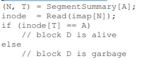  
次に、セグメントサマリブロック(SSとマークされている)が、アドレスA0のデータブロックが実際にオフセット0のファイルkの一部であることを記録するメカニズムを示す図です。kのimapをチェックすることによって、それが実際にその場所を指していることを確認してください。  
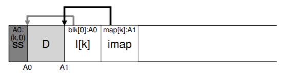  
LFSが生存率を決定するプロセスをより効率的にするために必要な、いくつかのショートカットがあります。たとえば、ファイルが切り捨てられたり削除されたりすると、LFSはそのバージョン番号を増やし、新しいバージョン番号をimapに記録します。また、オンディスクセグメントにバージョン番号を記録することで、LFSは、ディスク上のバージョン番号とimap内のバージョン番号を単純に比較することにより、上記のより長いチェックを短絡することができます。

## 43.11 A Policy Question: Which Blocks To Clean, And When?
上記のメカニズムに加えて、LFSには、クリーニングの時期とクリーニングの対象となるブロックの両方を決定する一連のポリシーが含まれている必要があります。クリーニングする時期を決めるのは簡単です。定期的、アイドル時間中、ディスクがいっぱいであるときです。

どのブロックを清掃すべきかを決定することはより困難であり、多くの研究論文の主題となっています。元のLFSの論文[RO91]では、著者はホットセグメントとコールドセグメントに分離しようとするアプローチを述べています。ホットセグメントは、内容が頻繁に上書きされるセグメントです。したがって、そのようなセグメントでは、より多くのブロックが(新しいセグメントで)上書きされ、使用のために解放されるように、それをクリーニングする前に長い時間待つことが最善の方針です。対照的に、コールドセグメントは、デッドブロックをいくつか持つことがありますが、残りの内容は比較的安定しています。したがって、著者らは、コールドセグメントをより早くクリーニングし、ホットセグメントを後でクリーニングし、正確にそれを行うものを開発すべきであると結論づけています。しかし、ほとんどのポリシーと同様に、このポリシーは完全ではありません。後のアプローチでは、よりうまくいく方法が示されています[MR + 97]。

## 43.12 Crash Recovery And The Log
1つの最終的な問題：LFSがディスクに書き込んでいるときにシステムがクラッシュするとどうなりますか？以前の章でジャーナリングについて思い出してきたように、更新中のクラッシュはファイルシステムにとっては厄介なものであり、LFSも考慮する必要があります。

通常の操作では、LFSはセグメントに書き込みを行い(バッファリング)、その後(セグメントがいっぱいになるか、またはある程度の時間が経過したときに)セグメントをディスクに書き込みます。LFSはこれらの書込みのログを作成します。すなわち、checkpoint regionはヘッドおよびテールセグメントを指し、各セグメントは書き込まれる次のセグメントを指します。LFSはcheckpoint regionも定期的に更新します。これらの操作(セグメントへの書き込み、CRへの書き込み)のいずれかでクラッシュが発生する可能性があります。LFSはこれらの構造への書き込み中のクラッシュをどのように処理しますか？

最初に2番目のケースを対処してみましょう。CR更新が原子的に確実に行われるように、LFSは実際にはディスクの両端に1つずつ2つのCRを保持し、交互に書き込みます。また、LFSは、iノードマップやその他の情報への最新のポインタでCRを更新するときに注意するプロトコルを実装します。具体的には、最初にヘッダー(タイムスタンプ付き)、次にCRの本文、最後に最後のブロック(タイムスタンプ付き)を書き出します。CRの更新中にシステムがクラッシュした場合、LFSは一貫性のないタイムスタンプのペアを見ることでこれを検出できます。LFSは常に一貫性のあるタイムスタンプを持つ最新のCRを使用することを選択し、CRの一貫した更新が達成されます。

最初のケースに対処しましょう。LFSは30秒ごとにCRを書き込むので、ファイルシステムの最後の整合性のあるスナップショットはかなり古いかもしれません。したがって、再起動時にLFSはcheckpoint region、それが指すimap部分、および後続のファイルとディレクトリを読み込むだけで簡単に回復できます。しかし、更新の最後の数秒は失われます。これを改善するために、LFSは、データベースコミュニティでロールフォワードと呼ばれる手法を使用して、これらのセグメントの多くを再構築しようとします。

基本的な考え方は、最後のcheckpoint regionから始まり、ログの終わりを見つけて(CRに含まれています)、それを使って次のセグメントを読み込み、そこに有効な更新があるかどうかを確認します。存在する場合、LFSはファイルシステムをそれに応じて更新し、最後のチェックポイント以降に書き込まれたデータとメタデータの多くを回復します。詳細については、Rosenblum賞を受賞した論文[R92]を参照してください。

## 43.13 Summary
LFSは、ディスクを更新する新しい方法を導入しています。LFSは、場所のファイルを上書きするのではなく、常にディスクの未使用部分に書き込み、後で古い空間をクリーニングによって再利用します。このアプローチは、データベースシステムではシャドウページング[L77]と呼ばれ、file system speakではコピーオンライトとも呼ばれ、それらを高効率で書き出すことが可能で、LFSはインメモリセグメントにすべての更新を集めて書き込むことができ、順次に一緒に出します。

>> TIP: TURN FLAWS INTO VIRTUES  
>> システムに根本的な欠陥がある場合はいつでも、それらの機能を調べ有用なものに変えることができるかどうかを確認してください。NetAppのWAFLは古いファイルの内容でこれを行います。古いバージョンを利用できるようにすることで、WAFLはかなり頻繁にするクリーンを心配する必要はなくなりました(最終的にはバックグラウンドで古いバージョンは削除されます)ので、クールな機能を提供し、すべて1つの素晴らしい考えでLFSクリーニングの問題の多くを対処します。システムにこれの他の例がありますか？間違いなく、あなたは自分で考える必要があります。なぜなら、この章は頭文字"O"で終わっているからです。…OVER

LFSが生成する一般的な大きな書き込みは、さまざまなデバイスでのパフォーマンスに優れています。ハードドライブでは、書き込みが大きくなるため、位置決め時間が最小限に抑えられます。RAID-4やRAID-5などのパリティベースのRAIDでは、書き込みの問題が完全に回避されます。最近の研究では、フラッシュベースのSSD [H + 17]の高性能化には大きなI/Oが必要であることが示されています。したがって、おそらく驚くべきことに、LFS形式のファイルシステムは、これらの新しい媒体であっても優れた選択肢となる可能性があります。

このアプローチの欠点は、ゴミを生成することです。データの古いコピーがディスク全体に散在し、後で使用するためにそのようなスペースを再利用したい場合は、古いセグメントを定期的にクリーニングする必要があります。クリーニングはLFSの多くの論争の焦点となり、クリーニングコスト(SS + 95)に対する懸念はおそらくLFSの当初のフィールドへの影響を制限していました。しかし、NetAppのWAFL [HLM94]、SunのZFS [B07]、Linuxのbtrfs [R + 13]、さらに現代のフラッシュベースのSSD [AD14]を含む最新の商用ファイルシステムでは、同様のコピーオンライトアプローチでディスクに書き込んでいます。LFSの知的遺産は、これらの現代的なファイルシステム上で生き続けています。特に、WAFLはそれらを機能に変えることでクリーニング問題を回避しました。スナップショットを使用して古いバージョンのファイルシステムを提供することにより、ユーザーは誤って現在のファイルを削除するたびに古いファイルにアクセスすることができます。

## 参考文献
[AD14] “Operating Systems: Three Easy Pieces”  
Chapter: Flash-based Solid State Drives  
Remzi Arpaci-Dusseau and Andrea Arpaci-Dusseau  
A bit gauche to refer you to another chapter in this very book, but who are we to judge?  

[B07] “ZFS: The Last Word in File Systems”  
Jeff Bonwick and Bill Moore  
Copy Available: http://www.ostep.org/Citations/zfs last.pdf  
Slides on ZFS; unfortunately, there is no great ZFS paper (yet). Maybe you will write one, so we can cite it here?

[H+17] “The Unwritten Contract of of Solid State Drives”  
Jun He, Sudarsun Kannan, Andrea C. Arpaci-Dusseau, Remzi H. Arpaci-Dusseau  
EuroSys ’17, April 2017  
In this paper, we study which unwritten rules one must follow in order to extract high performance from an SSD, both in the short term and over the long haul. Interestingly, both request scale (having large requests) and request locality still matter, even on solid-state storage. The more things change ...

[HLM94] “File System Design for an NFS File Server Appliance”  
Dave Hitz, James Lau, Michael Malcolm  
USENIX Spring ’94  
WAFL takes many ideas from LFS and RAID and puts it into a high-speed NFS appliance for the multi-billion dollar storage company NetApp.

[L77] “Physical Integrity in a Large Segmented Database”  
R. Lorie  
ACM Transactions on Databases, 1977, Volume 2:1, pages 91-104 The original idea of shadow paging is presented here.

[MJLF84] “A Fast File System for UNIX”  
Marshall K. McKusick, William N. Joy, Sam J. Leffler, Robert S. Fabry  
ACM TOCS, August, 1984, Volume 2, Number 3  
The original FFS paper; see the chapter on FFS for more details.

[MR+97] “Improving the Performance of Log-structured File Systems  
with Adaptive Methods”  
Jeanna Neefe Matthews, Drew Roselli, Adam M. Costello, Randolph Y. Wang, Thomas E. Anderson  
SOSP 1997, pages 238-251, October, Saint Malo, France  
A more recent paper detailing better policies for cleaning in LFS.  

[M94] “A Better Update Policy”  
Jeffrey C. Mogul  
USENIX ATC ’94, June 1994  
In this paper, Mogul finds that read workloads can be harmed by buffering writes for too long and then sending them to the disk in a big burst. Thus, he recommends sending writes more frequently and in smaller batches.

[P98] “Hardware Technology Trends and Database Opportunities”  
David A. Patterson  
ACM SIGMOD ’98 Keynote Address, Presented June 3, 1998, Seattle, Washington  
Available: http://www.cs.berkeley.edu/˜pattrsn/talks/keynote.html  
A great set of slides on technology trends in computer systems. Hopefully, Patterson will create another of these sometime soon.

[R+13] “BTRFS: The Linux B-Tree Filesystem”  
Ohad Rodeh, Josef Bacik, Chris Mason  
ACM Transactions on Storage, Volume 9 Issue 3, August 2013  
Finally, a good paper on BTRFS, a modern take on copy-on-write file systems.

[RO91] “Design and Implementation of the Log-structured File System”  
Mendel Rosenblum and John Ousterhout  
SOSP ’91, Pacific Grove, CA, October 1991  
The original SOSP paper about LFS, which has been cited by hundreds of other papers and inspired many real systems.

[R92] “Design and Implementation of the Log-structured File System”  
Mendel Rosenblum  
http://www.eecs.berkeley.edu/Pubs/TechRpts/1992/CSD-92-696.pdf  
The award-winning dissertation about LFS, with many of the details missing from the paper.

[SS+95] “File system logging versus clustering: a performance comparison”  
Margo Seltzer, Keith A. Smith, Hari Balakrishnan, Jacqueline Chang, Sara McMains, Venkata Padmanabhan  
USENIX 1995 Technical Conference, New Orleans, Louisiana, 1995  
A paper that showed the LFS performance sometimes has problems, particularly for workloads with many calls to fsync() (such as database workloads). The paper was controversial at the time.

[SO90] “Write-Only Disk Caches”  
Jon A. Solworth, Cyril U. Orji  
SIGMOD ’90, Atlantic City, New Jersey, May 1990  
An early study of write buffering and its benefits. However, buffering for too long can be harmful: see Mogul [M94] for details.

[Z+12] “De-indirection for Flash-based SSDs with Nameless Writes”  
Yiying Zhang, Leo Prasath Arulraj, Andrea C. Arpaci-Dusseau, Remzi H. Arpaci-Dusseau  
FAST ’13, San Jose, California, February 2013  
Our paper on a new way to build flash-based storage devices. Because FTLs (flash-translation layers) are usually built in a log-structured style, some of the same issues arise in flash-based devices that do in LFS. In this case, it is the recursive update problem, which LFS solves neatly with an imap. A similar structure exists in most SSDs.

[prev](../42/42.md)|[next](../44/44.md)
