# 44 Flash-based SSDs
何十年ものハードディスクドライブの支配から、永続的なストレージデバイスの新しい形態が最近、世界で重要な役割を果たしました。一般にソリッドステートストレージと呼ばれるこのようなデバイスには、ハードドライブのような機械的または可動的な部品はありません。むしろ、メモリとプロセッサによく似たトランジスタから簡単に構築されています。しかし、典型的なランダムアクセスメモリ(例えば、DRAM)とは異なり、このようなソリッドステートストレージデバイス(SSD)は、電力損失にもかかわらず情報を保持するので、データの永続的記憶に使用するための理想的な候補です。

私たちが注目する技術は、1980年代に舛岡富士雄さんが作ったフラッシュ(より具体的には、NANDベースのフラッシュ)[M + 14]と呼ばれています。Flashには、いくつかのユニークな特性があります。例えば、与えられているチャンク(フラッシュページ)に書き込むためには、より大きなチャンク(すなわち、フラッシュブロック)を消去しなければならず、これはかなり高価になる可能性があります。さらに、あまりにも頻繁にページに書き込むと、ページが消耗します。これらの2つの特性は、フラッシュベースのSSDの構築を興味深い課題になっています。

>> CRUX: HOW TO BUILD A FLASH-BASED SSD  
>> どのようにフラッシュベースのSSDを構築できますか？どのようにして高価な消去の性質を処理できますか？繰り返し上書きするとデバイスが消耗してしまうので、どのようにして長時間続くデバイスを構築できますか？技術進歩は止まるだろうか？または驚くことがなくなるでしょうか？

## 44.1 Storing a Single Bit
フラッシュ・チップは、1つのトランジスタに1つ以上のビットを格納するように設計されています。トランジスタ内にトラップされた電荷のレベルは2進値にマッピングされます。Single Level Cell(SLC)フラッシュでは、トランジスタ内に1ビットのみが記憶される(すなわち、1または0)。Multi Level Cell(MLC)フラッシュでは、2ビットが異なるレベルの電荷に符号化され、例えば、00,01,10,11は、低、若干低、若干高、高レベルで表される。セルあたり3ビットをエンコードするTriple Level Cell(TLC)フラッシュもあります。全体として、SLCチップはより高い性能を達成し、より高価です。

>> TIP: BE CAREFUL WITH TERMINOLOGY  
>> フラッシュが文脈の中で私たちが何度も(ブロック、ページ)何度も使用してきた言葉ですが、以前とは若干異なる方法で使用されていることにお気づきかもしれません。新しい用語は、あなたの人生をより困難にするために作成されたものではありませんが(しかし、そうしたことがあるかもしれませんが)、用語の決定が行われる中心的な権限がないために生じます。文脈に応じて、他の人によってはページというのがブロックであったり、その逆もあります。あなたの仕事はシンプルです。各文章内の適切な用語を知り、規律に精通した人々があなたが話していることを理解できるようにそれらを使用します。唯一の解決策はシンプルですが、時には痛みを伴うことです。あなたの記憶を使用してください。

もちろん、そのようなビットレベルのストレージがデバイス物理のレベルでどのように動作するかについては、多くの詳細があります。この本の範囲を超えて、あなた自身の[J10]でそれについてもっと読むことができます。

## 44.2 From Bits to Banks/Planes
彼らが古代ギリシャで言うように、単一のビット(またはいくつか)を格納することはストレージシステムを作成することではありません。したがって、フラッシュチップは、多数のセルからなるbanks(バンク達)から作られます。または多数のセルからであるplanes(プレーン達)から構成されます。

バンクは2つの異なるサイズの単位、すなわち、一般に128KBまたは256KBのサイズのブロック(消去ブロックとも呼ばれる)、サイズが数KB(例えば4KB)のページごとにアクセスされます。各バンク内には多数のブロックがあります。各ブロック内に多数のページがあります。フラッシュを考えるときは、この新しい用語を覚えておく必要があります。これは、ディスクやRAIDで参照するブロック、および仮想メモリで参照するページとは異なります。

図44.1に、ブロックとページを持つフラッシュ・プレーンの例を示します。この単純な例では、それぞれが4ページを含む3つのブロックがあります。ブロックとページを区別する理由は次のとおりです。この区別は、読み取りや書き込みなどのフラッシュ操作で重要なものであり、さらにデバイスの全体的なパフォーマンスにとっても重要です。あなたが学ぶ最も重要な(そして奇妙な)ことは、ブロック内のページに書き込むためには、最初にブロック全体を消去しなければならないということです。このトリッキーな詳細は、フラッシュベースのSSDを面白くて価値のある課題にすることと、この章の後半の主題になります。  
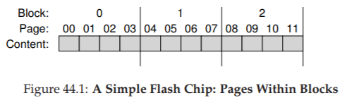  

## 44.3 Basic Flash Operations
このフラッシュ構成を考えると、フラッシュチップがサポートする3つの低レベル動作があります。読み取りコマンドは、フラッシュからページを読み取るために使用されます。消去とプログラムは並行して書き込みに使用されます。

- Read (1ページ)：  
フラッシュチップのクライアントは、読み出しコマンドと適切なページ番号をデバイスに指定するだけで、任意のページ(例えば、2KBまたは4KB)を読み取ることができます。この操作は通常、デバイス上の場所に関係なく、以前の要求の場所にかかわらず(ディスクとはまったく異なります)、10マイクロ秒程度以上と非常に高速です。どの場所にも一様に迅速にアクセスできることは、そのデバイスがランダムアクセスデバイスであることを意味します。

- Erase(ブロック)：  
フラッシュ内のページに書き込む前に、デバイスの性質上、ページ内にあるブロック全体を最初に消去する必要があります。重要なことに、ブロックの内容を消去します(各ビットを値1に設定します)。そのため、ブロック内の必要なデータが、消去を実行する前に他の場所(メモリまたは別のフラッシュブロック)にコピーされていることを確認する必要があります。消去コマンドは非常に高価で、数ミリ秒かかります。終了すると、ブロック全体がリセットされ、各ページがプログラム可能な状態になります。

- Program(1ページ)：  
一度ブロックが消去されると、プログラムコマンドを使用して、ページ内の1を0に変更するなど、望んだ内容をフラッシュに書き込むことができます。ページのプログラミングは、ブロックを消去するよりも安価ですが、ページを読むよりもコストがかかります。通常、最新のフラッシュチップでは約100マイクロ秒です。

フラッシュチップについて考える一つの方法は、各ページに関連する状態があることです。ページはINVALID状態で開始します。ページが存在するブロックを消去することによって、ページの状態(およびそのブロック内のすべてのページ)をERASEDに設定します。これはブロック内の各ページの内容をリセットしますが、それらを(重要な)プログラマブルにします。ページをプログラミングすると、その状態がVALIDに変わり、その内容が設定され、読み込めることを意味します。読み込みはこれらの状態に影響しません(ただし、プログラムされたページからのみ読み込めます)。ページがプログラムされると、その内容を変更する唯一の方法は、ページが存在するブロック全体を消去することです。次に、4ページブロック内のさまざまな消去およびプログラム操作の後の状態遷移の例を示します。  
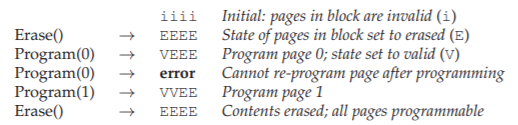  

### A Detailed Example
書き込みプロセス(すなわち、消去およびプログラミング)は非常に珍しいので、それが意味を成すことを確認するための詳細な例を見てみましょう。この例では、4ページのブロック内に次の4つの8ビットページがあるとします(非現実的に小さいサイズですが、この例では便利です)。各ページは以前にプログラムされているのでVALIDです。  
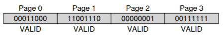  
今度は、新しい内容をページ0に書きたいとします。ページを書き込むには、最初にブロック全体を消去する必要があります。ブロックをこの状態にしておくと仮定しましょう  
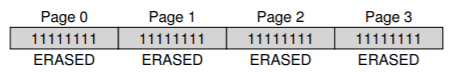  
例えば、コンテンツ00000011でページ0をプログラムし、古いページ0(内容00011000)を上書きするとします。そうした後、ブロックは次のようになります。  
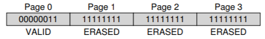  
ページ1,2,3の以前の内容はすべて消えてしまいました！したがって、ブロック内のページを上書きする前に、まず必要なデータを別の場所(メモリ、フラッシュ上のどこかなど)に移動する必要があります。消去の性質は、私たちがすぐに学ぶように、フラッシュベースのSSDをどのように設計するかで強く影響を与えます。

### Summary
要約すると、ページを読むのは簡単です。単にページを読むだけです。フラッシュチップはこれを非常にうまくやっています。パフォーマンス面では、機械的なシークおよびローテーションコストのために遅い現在のディスクドライブのランダムな読み取りパフォーマンスを大幅に上回る可能性があります。

ページを書くのは手間がかかります。ブロック全体が最初に消去されなければなりません(最初に必要なデータを別の場所に移動してください)そして望んだページをプログラムします。これは高価なだけでなく、このプログラム/消去サイクルを頻繁に繰り返すと、フラッシュチップには大きな信頼性の問題が生じる可能性があります。フラッシュを使用してストレージシステムを設計する場合、書き込みのパフォーマンスと信頼性が中心的な焦点です。近代のSSDがこれらの問題をどのように攻撃し、これらの制限にもかかわらず優れたパフォーマンスと信頼性を提供する方法について、すぐにわかります。

## 44.4 Flash Performance And Reliability
私たちは、生のフラッシュチップからストレージデバイスを構築することに興味があるので、基本的な性能特性を理解することは価値があります。図44.2は、一般的なプレス[V12]に見られるいくつかの数字の概略を示しています。ここでは、セルごとに1,2,3ビットの情報を格納するSLC、MLC、TLCフラッシュ全体での読み取り、プログラム、消去の基本動作レイテンシを示します。  
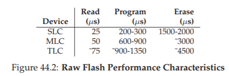  
表からわかるように、読み取りのレイテンシは非常に良いので、完了するのはわずか10マイクロ秒です。プログラムのレイテンシは、SLCの場合は200マイクロ秒と低く、より多くのビットを各セルにパックするほど高くなります。優れた書き込み性能を得るためには、複数のフラッシュ・チップを並行して使用する必要があります。最後に、消去はかなり高価で、典型的には数ミリ秒かかる。このコストを扱うことは、現代のフラッシュ記憶装置設計の中心です。

フラッシュチップの信頼性を考えてみましょう。(ドライブヘッドが記録面と実際に接触するような、厄介でかなり物理的なヘッドクラッシュを含む)様々な理由で故障する可能性がある機械的ディスクとは異なり、フラッシュチップは純粋なシリコンであり、その点で、少し信頼性の問題は心配です。主な関心事は摩耗です。フラッシュブロックが消去されてプログラムされると、少し余分な電荷がゆっくりと発生します。時間が経つにつれて、その余分な電荷が蓄積するにつれて、0と1とを区別するのがますます困難になります。不可能になる時点で、ブロックは使用不能になります。

ブロックの典型的な寿命は、現在よく知られていません。製造元は、MLCベースのブロックを10,000 P/E(プログラム/消去)サイクルの寿命として評価します。つまり、各ブロックを消去してから10,000回プログラムすると壊れます。SLCベースのチップは、1つのトランジスタにつき1ビットしか記憶しないため、より長い寿命、通常100,000 P/Eサイクルで定格されます。しかし、最近の研究では、生存期間が予想以上に長いことが示されています[BD10]。

フラッシュチップ内の1つの他の信頼性問題は、disturbance(妨害)として知られています。フラッシュ内の特定のページにアクセスすると、隣接するページのビットが反転する可能性があります。このようなビット反転は、ページがそれぞれ読み出されているかプログラムされているかに応じて、read disturbsまたはprogram disturbsとして知られています。

>> TIP: THE IMPORTANCE OF BACKWARDS COMPATIBILITY  
>> 下位互換性は、階層化されたシステムで常に懸念されます。2つのシステム間で安定したインタフェースを定義することにより、相互運用性を確保しながらインタフェースの両側で革新を実現できます。このアプローチは多くの領域で素晴らしい成功を収めてきました。オペレーティングシステムはアプリケーション用に比較的安定したAPIを持ち、ディスクはファイルシステムと同じブロックベースのインターフェースを提供し、IPネットワーキングスタックの各レイヤーは上記のレイヤーに固定された変更のないインターフェースを提供します。驚くことではないが、ある世代で定義されたインタフェースが次の世代では適切でない可能性があるため、そのような剛性には欠点があります。場合によっては、システム全体を完全に再設計することについて考えるのが有益な場合もあります。優れた例は、Sun ZFSファイルシステム[B07]にあります。ZFSの作成者は、ファイルシステムとRAIDの相互作用を再考することで、より効果的な統合全体を構想しました。

## 44.5 From Raw Flash to Flash-Based SSDs
フラッシュ・チップの基本的な理解を踏まえて、次のタスク、すなわち、フラッシュ・チップの基本セットを典型的なストレージ・デバイスのようなものに変える方法があります。標準記憶インターフェースは、単純なブロックベースのものであり、ブロックアドレスが与えられた場合、512バイト(またはそれ以上)のブロック(セクタ)が読み書き可能である。フラッシュベースのSSDのタスクは、標準のブロックインタフェースを内部の生のフラッシュチップが提供することです。内部的には、SSDはいくつかのフラッシュチップ(永続ストレージ用)で構成されています。SSDはある量の揮発性(すなわち、非永続的)メモリ(例えば、SRAM)も含みます。このようなメモリは、データのキャッシュ、バッファリングのためだけでなく、マッピングテーブルも役立ちます。最後に、SSDにはデバイスの操作を調整するための制御ロジックが含まれています。詳細は[A + 08]を参照してください。図44.3に簡略化したブロック図を示します。

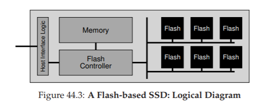  

この制御ロジックの本質的な機能の1つは、クライアントの読み取りと書き込みを満足させ、必要に応じて内部のフラッシュ操作に変換することです。Flash Translation Layer(FTL)は、この機能を正確に提供します。FTLは、論理ブロック(デバイス・インタフェースを構成する)上で読取りと書込み要求を取り出し、物理ブロックおよび物理ページ(実際のフラッシュ・デバイスを構成する)上の低レベル読取り、消去、プログラム・コマンドに変換します。FTLは、優れた性能と高い信頼性を提供するという目的でこの作業を達成する必要があります。

優れたパフォーマンスは、技術の組み合わせによって実現できます。1つの鍵は、複数のフラッシュ・チップを並列に使用することです。この技術についてはこれ以上検討するつもりはありませんが、現代のSSDはすべて、内部で複数のチップを使用してより高い性能を得ています。もう1つのパフォーマンス目標は、書き込みの増幅を減らすことです。これは、FTLでフラッシュ・チップに発行された合計書き込みトラフィック(バイト単位)を合計書き込みトラフィック(バイト単位)で割ったものが、クライアントによってSSDに送信されます。以下で説明するように、FTL構築に対する単純なアプローチは、高い書き込み増幅率と低い性能につながります。

いくつかの異なるアプローチを組み合わせることで高い信頼性が達成されます。上記で議論したように、1つの主な問題は摩耗です。1つのブロックがあまりにも頻繁に消去され、プログラムされると、使用できなくなります。結果として、FTLは、フラッシュのブロック間にできるだけ均等に書き込みを広げて、デバイスのすべてのブロックがほぼ同時に消耗するようにする必要があります。そうすることはwear levelingと呼ばれ、現代のFTLに不可欠な部分です。

もう一つの信頼性の懸念は、プログラム妨害である。このような妨害を最小限に抑えるために、FTLは、通常、消去されたブロック内のページを、低いページから高いページの順にプログラムします。このsequential programming(順序プログラミング)手法は妨害を最小限に抑え、広く利用されています。

## 44.6 FTL Organization: A Bad Approach
FTLの最も単純な構成は、direct mapped(ダイレクトマップ)と呼ばれるものです。このアプローチでは、論理ページNへの読み出しは、物理ページNの読み出しに直接マッピングされます。論理ページNへの書き込みは、より複雑です。FTLは、最初に、ページNが内包されているブロック全体を読み取らなければいけません。そのとき、そのブロックを消去する必要があります。最後に、FTLは古いページと新しいページをプログラムします。

おそらく推測できるように、ダイレクトマップFTLには、パフォーマンスと信頼性の両方の点で多くの問題があります。各書き込みではパフォーマンス上の問題が発生します。デバイスはブロック全体の読み取り(コスト高)、消去(非常に高価)、プログラム(コスト高)の順に処理する必要があります。最終的な結果は、(ブロック内のページ数に比例する)厳しいライト増幅と、その結果として、機械的なシークと回転遅延を伴う典型的なハードドライブよりも遅い、ひどい書き込み性能です。

さらに悪いのは、このアプローチの信頼性です。ファイルシステムのメタデータまたはユーザーファイルのデータが繰り返し上書きされると、同じブロックが消去、プログラムされ、何度も繰り返し書き換えられ、すぐに消耗してデータが失われる可能性があります。ダイレクト・マップ・アプローチでは、クライアント・仕事量の消耗を制御することができません。仕事量が論理ブロック全体に均等に書き込み負荷を分散しない場合、一般的なデータを含む物理ブロックがすぐに消耗します。信頼性とパフォーマンスの両方の理由から、ダイレクトマップFTLは悪い考えです。

## 44.7 A Log-Structured FTL
このような理由から、現在のFTLは、ログ構造であり、ストレージデバイス(上に示すように)とその上のファイルシステム(log structured file systemsの章を参照)の両方で有用なアイデアです。論理ブロックNへの書き込みの際に、デバイスは、書き込まれているブロック内の次の空き領域に書き込みを追加します。私たちはこれを書き込みロギングスタイル呼んでいます。ブロックNの後続の読み取りを可能にするために、デバイスはマッピングテーブルを保持しています(メモリ上に、そしてデバイス上の何らかの形で永続的に)。このテーブルには、システム内の各論理ブロックの物理アドレスが格納されます。

基本的なログベースのアプローチがどのように機能するかを理解するための例を見てみましょう。クライアントには、デバイスは一般的なディスクのように見え、512バイトのセクタ(またはセクタのグループ)に読み書きできます。簡単にするために、クライアントが4KBのチャンクを読み書きしているとします。SSDには、4 KBの4つのページにそれぞれ分割された16 KBサイズのブロックがいくつか含まれているとします。これらのパラメータは非現実的です(フラッシュブロックは通常より多くのページで構成されます)が、私たちの教訓の目的を十分に果たします。クライアントが次の一連の操作を発行するとします。  
- Write(100) with contents a1  
- Write(101) with contents a2  
- Write(2000) with contents b1  
- Write(2001) with contents b2  

これらの論理ブロックアドレス(例えば100)は、SSDのクライアント(例えば、ファイルシステム)が情報がどこに位置しているかを記憶するために使用されます。内部的には、デバイスは、これらのブロック書き込みを、生のハードウェアによってサポートされている消去およびプログラム動作に変換し、各論理ブロックアドレスに対して、SSDのどの物理ページがそのデータを記憶するかを何らかの形で記録しなければいけません。SSDのすべてのブロックが現在有効ではないと仮定し、ページをプログラムする前に消去する必要があります。ここでは、すべてのページがINVALID(i)とマークされたSSDの初期状態を示します。  
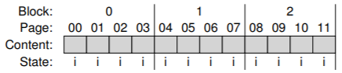  
第1の書き込みが(論理ブロック100への)SSDによって受信されると、FTLは、それを4つの物理ページ：0,1,2,3を含む物理ブロック0に書き込むことを決定します。ブロックは消去されていないので、まだそれに書き込むことはできません。デバイスは最初に消去コマンドをブロック0に発行する必要があります。削除すると、次の状態になります。  
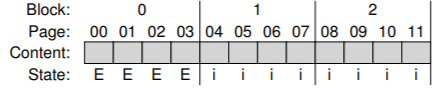  
これでブロック0はプログラム可能な状態になります。ほとんどのSSDは、順番にページに書き込みます(すなわち、低から高に)、プログラム妨害に関連する信頼性の問題を低減します。そのときSSDは、論理ブロック100の書き込みを物理ページ0に指示する。  
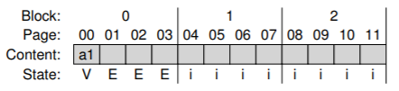  
しかし、クライアントが論理ブロック100を読み込みたい場合はどうなりますか？どのようにそれがどこにあるのか見つけることができますか？SSDは、論理ブロック100に発行された読取りを物理ページ0の読取りに変換しなければないけません。このような機能に対応するために、FTLは論理ブロック100を物理ページ0に書込むとき、この事実をメモリ内マッピングテーブルに記録します。このマッピングテーブルの状態を図でも追跡します  
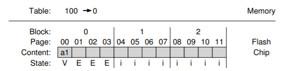  
これで、クライアントがSSDに書き込むときに何が起こるかを確認できます。SSDは書き込みの場所を見つけます。通常、次の空きページを選択するだけです。そのときブロックの中身であるそのページをプログラムし、マッピングテーブルに論理から物理へのマッピングを記録します。後続の読み取りは、テーブルを使用して、クライアントが提示した論理ブロックアドレスを、データを読み取るのに必要な物理ページ番号に変換するだけです。例題である書き込みストリームの残りの書き込み(101、2000、2001)を調べてみましょう。これらのブロックを書き込んだ後、デバイスの状態は次のようになります。  
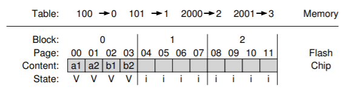  
ログベースのアプローチでは、パフォーマンスが向上し(しばらくの間一回しか必要な消去が行われず、ダイレクト・マップ・アプローチによる高価なread modify writeが回避されます)、信頼性が大幅に向上します。FTLは、すべてのページにわたって書き込みを分散し、wear levelingと呼ばれる処理を実行し、デバイスの寿命を延ばすことができます。さらに下のwear levelingについて説明します。

>> ASIDE: FTL MAPPING INFORMATION PERSISTENCE  
>> あなたは疑問に思うかもしれません。デバイスが電力を失う場合はどうなりますか？メモリ内のマッピングテーブルは消えますか？明らかに、このような情報は本当に失われてはいけません。なぜなら、デバイスは永続的なストレージデバイスとして機能しないためです。SSDには、マッピング情報を回復する手段が必要です。

最も簡単なことは、Out Of Band(OOB)領域と呼ばれる、各ページでマッピング情報を記録することです。デバイスの電源が切れて再起動されると、デバイスはOOB領域をスキャンしてメモリ内のマッピングテーブルを再構築します。この基本的なアプローチには問題があります。必要なすべてのマッピング情報を見つけるために大きなSSDをスキャンするのは遅いです。この制限を克服するために、一部のハイエンド端末では、より複雑なロギングとチェックポイント手法を使用して復旧を高速化しています。ロギングについては後でファイルシステムで詳しく説明します。

残念なことに、このログ構造化の基本的なアプローチにはいくつかの欠点があります。1つ目は、論理ブロックの上書きが、ガベージと呼ばれるもの、つまりドライブの周りの古いバージョンのデータとスペースを占有することにつながるということです。デバイスは、前記ブロックおよび将来の書き込みのための空き領域を見つけるためにガーベッジコレクション(GC)を定期的に実行しなければいけません。しかし、過度のガベージコレクションは書き込み増幅を引き上げ、パフォーマンスを低下させます。2つめは、メモリ内マッピングテーブルのコストが高いことです。デバイスが大きくなればなるほど、そのようなテーブルに必要なメモリが増えます。今度は順番にこれらについて話し合っていきます。

## 44.8 Garbage Collection
このようなログ構造アプローチの第1のコストは、ゴミが作成されることであり、ガベージコレクション(すなわち、dead-block reclamation)が行われなければいけません。私たちの継続的な例を使ってこれを理解しましょう。論理ブロック100,101,2000,2001がデバイスに書き込まれたことを思い出してください。さて、ブロック100とブロック101が内容c1とc2で再び書き込まれたとしましょう。書き込みは次の空きページ(この場合は物理ページ4と5)に書き込まれ、それに応じてマッピングテーブルが更新されます。このようなプログラミングを可能にするには、最初にブロック1を消去する必要があります。  
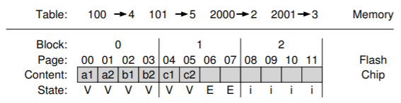  

物理ページ0と1はVALIDとマークされていますが、ブロック100と101の古いバージョンのようなゴミがあります。デバイスのログ構造上の性質のため、上書きするとガベージブロックが作成されます。そのため、新しい書き込みを実行するための空き領域を確保するためにデバイスを再利用する必要があります。

ガベージ・ブロック(デッド・ブロックとも呼ばれます)を見つけ出し、将来使用するためにそれらを再利用するプロセスは、ガベージ・コレクションと呼ばれ、現代のSSDの重要なコンポーネントです。基本的なプロセスは、1つまたは複数のゴミ・ページを含むブロックを見つけ、そのブロックからライブ(非ゴミ)ページを読み込み、それらのライブ・ページをログに書き出し、そして(最後に)書き込みに使用するためにブロック全体を再利用します。

例をあげて説明しましょう。デバイスは、上記のブロック0内の死んだページを再利用したいと決定します。ブロック0には、2つのデッドブロック(ページ0と1)と2つのライフブロック(ページ2と3、それぞれブロック2000と2001が含まれています)があります。そうするために、デバイスは以下を行います。  
- ブロック0からライブデータ(2および3ページ)を読み込む  
- ライブデータをログの最後に書き込む  
- ブロック0を消去する(後で使用するために解放する)   

ガベージコレクタを機能させるには、SSDが各ページがライブかデッドかを判断できるように、各ブロック内に十分な情報がなければなりません。この目的を達成する1つの自然な方法は、各ブロック内のある場所に、各ページ内にどの論理ブロックが格納されているかに関する情報を格納することです。デバイスは、マッピングテーブルを使用して、ブロック内の各ページがライブデータを保持するかどうかを判断できます。

(ガベージコレクションが行われる前の)この例から、ブロック0は論理ブロック100,101,2000,2001を保持していました。マッピングテーブルをチェックして(ガベージコレクション前のマッピングテーブル100 -> 4,101 -> 5、2000 ->2、2001 -> 3を含んでいる)、デバイスは、SSDブロック内の各ページがライブ情報を保持しているかどうかを容易に判定することができます。例えば、2000と2001はまだマップに参照されています。100と101はそうではないため、ガベージコレクションの候補となります。このガベージコレクションプロセスがこの例で完了すると、デバイスの状態は次のようになります。  
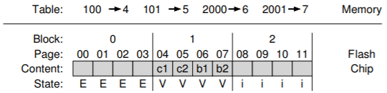  
ご覧のように、ガベージコレクションは高価な場合があり、ライブデータの読み込みと書き換えが必要です。再利用の理想的な候補は、死んだページだけで構成されるブロックです。この場合、高価なデータ移行なしでブロックを即座に消去して新しいデータに使用することができます。GCのコストを削減するために、一部のSSDはデバイスをoverprovisionをします[A + 08]。余分なフラッシュ容量を追加することで、クリーニングを遅らせてバックグラウンドにプッシュすることができ、デバイスが忙しくないときに実行されます。容量を増やすと、内部帯域幅も増加します。これは、クリーニングに使用できるため、クライアントに認識される帯域幅に害を与えません。現代の多くのドライブは、このように過度にoverprovisionし、優れた全体的なパフォーマンスを達成するための1つの鍵です。

## 44.9 Mapping Table Size
ログ構造化の第2のコストは、非常に大きなマッピングテーブルの可能性であり、デバイスの4 KBページごとに1つのエントリがあります。たとえば、1 TBの大きなSSDを使用すると、4 KBのページごとに1つの4バイトエントリが発生するため、これらのマッピングのためだけに1 GBのメモリが必要になります。従って、このページレベルFTL方式は実用的ではありません。

### Block-Based Mapping
マッピングのコストを削減する1つのアプローチは、ページごとではなく、デバイスのブロックごとにポインタを保持することだけであり、マッピング情報の量をSizeblock/Sizepageの係数だけ減少させます。このブロック・レベルのFTLは、仮想メモリー・システムでより大きなページ・サイズを持つことに似ています。その場合は、VPNのビット数を少し使って、仮想アドレスごとのオフセットを大きくします。

残念ながら、ログベースのFTL内でブロックベースのマッピングを使用することは、パフォーマンスの理由からうまく機能しません。最大の問題は、「小さな書き込み」で発生します(すなわち、物理ブロックのサイズより小さいもの)。この場合、FTLは古いブロックから大量のライブデータを読み込み、それを新しい書き込みにコピーする必要があります(小さな書き込みのデータと一緒に)。このデータコピーは、書き込み増幅を大幅に増加させ、したがって性能を低下させます。

この問題をより明確にするために、例を見てみましょう。クライアントが以前に論理ブロック2000,2001,2002,2003(内容、a、b、c、d)を書き出し、それらが物理ページ4,5,6,7の物理ブロック1内にあると仮定します。ページごとのマッピングでは、変換テーブルは、2000→4,2001→5,2002→6,2003→7の4つの論理ブロックのマッピングを記録する必要があります。

代わりに、ブロックレベルのマッピングを使用する場合、FTLはすべてのデータに対して単一のアドレス変換を記録するだけで済みます。ただし、アドレスマッピングは前の例と少し異なります。具体的には、フラッシュ内の物理ブロックのサイズであるチャンクに細断されるデバイスの論理アドレス空間を考えます。したがって、論理ブロックアドレスは、チャンク番号とオフセットの2つの部分からなります。4つの論理ブロックが各物理ブロック内に収まると仮定しているので、論理アドレスのオフセット部分は2ビット必要になります。残りの(最上位)ビットがチャンク番号を形成します。  
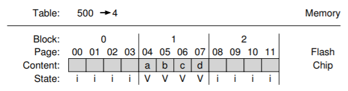  
ブロックベースのFTLでは、読み込みが容易です。最初に、FTLは、アドレスから最上位のビットを取り出すことによって、クライアントによって提示された論理ブロックアドレスからチャンク番号を抽出する。そのとき、FTLはテーブル内のチャンク番号から物理ページへのマッピングを検索します。最後に、FTLは、論理アドレスからのオフセットをブロックの物理アドレスに追加することによって、望んだフラッシュページのアドレスを計算します。

例えば、クライアントが論理アドレス2002への読出しを発行する場合、デバイスは論理チャンク番号(500)を抽出し、マッピングテーブル内の変換を検索し(4を見つける)、論理アドレス(2)からのオフセットを加算して変換します(4)。結果の物理ページアドレス(6)は、データが配置されている場所です。FTLはその物理アドレスに読み出しを発行し、望んだデータ(c)を得ることができます。

しかし、クライアントが論理ブロック2002(内容c')に書き込むとどうなるでしょうか？この場合、FTLは2000,2001,2003を読み込み、4つの論理ブロックすべてを新しい場所に書き出し、それに応じてマッピング・テーブルを更新する必要があります。ここに示すように、ブロック1(常駐していたデータ)は消去して再利用できます。  
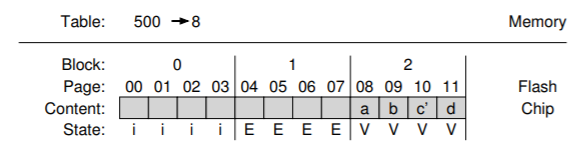  
この例からわかるように、ブロックレベルのマッピングは変換に必要なメモリ量を大幅に削減しますが、書き込みがデバイスの物理ブロックサイズよりも小さくなるとパフォーマンスに大きな問題が発生します。実際の物理ブロックは256KB以上になる可能性があるため、このような書き込みは非常に頻繁に発生する可能性があります。従って、よりよい解決策が必要です。その解決策が何であるかを私たちが教えてきた中で思いつくことはできますか？あなたはこの後を読む前に、あなた自身でそれを理解できますか？

### Hybrid Mapping
柔軟な書き込みを可能にするとともにマッピングコストを削減するために、最新のFTLの多くはハイブリッドマッピング技術を採用しています。このアプローチでは、FTLはいくつかのブロックを消去したままにして、すべての書き込みをそれらに指示します。これらはログブロックと呼ばれます。FTLは、純粋なブロック・ベースのマッピングで必要とされるすべてのコピーを行わずに、ログ・ブロック内の任意の場所の任意のページに書き込めるように、これらのログ・ブロックのページ単位のマッピングを保持します。

したがって、FTLには論理的に、メモリに2種類のマッピングテーブルがあります。すなわち、ログテーブルと呼ばれるページ単位のマッピングの小さなセットと、データテーブルのブロック単位のマッピングの大きなセットです。特定の論理ブロックを探すとき、FTLはまずログテーブルを調べます。論理ブロックの位置がそこに見つからない場合、FTLはデータテーブルを参照してその位置を見つけ、要求されたデータにアクセスします。

ハイブリッドマッピング戦略の鍵は、ログブロックの数を小さく保つことです。ログブロックの数を少なく保つために、FTLはログブロック(ページごとのポインタを持つ)を定期的に調べて、単一のブロックポインタだけが指し示すことができるブロックに切り替える必要があります。このスイッチは、ブロック[KK + 02]の内容に基づいて3つの主な技術のうちの1つによって実行されます。

たとえば、FTLが以前に論理ページ1000,1001,1002,1003を書き出し、物理ブロック2(物理ページ8,9,10,11)に配置したとします。1000,1001,1002,1003への書き込みの内容をそれぞれa、b、c、dとします。  
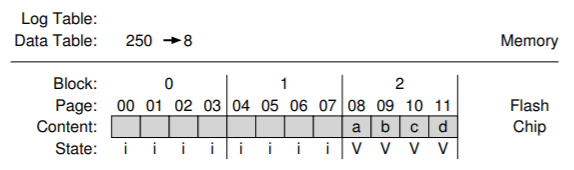  
ここで、クライアントが、現在利用可能なログブロックの1つ、例えば物理ブロック0(物理ページ0,1,2,3)に、これらのページ(データa', b', c', d')を全く同じ順序で上書きすると仮定します。この場合、FTLの状態は次のようになります。  
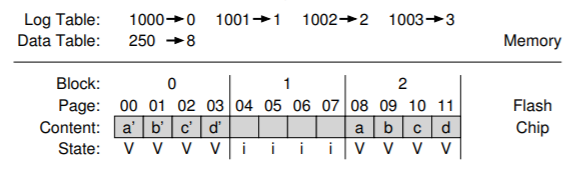  
これらのブロックは以前と全く同じ方法で記述されているため、FTLはswitch mergeと呼ばれる処理を実行できます。この場合、ログブロック(0)はページ0,1,2,3の格納場所になり、1つのブロックポインタで参照されます。古いブロック(2)は消去され、ログブロックとして使用されます。この最良の場合、ページ単位のポインタはすべて単一のブロックポインタに置き換えられます。  
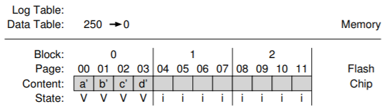  
このswitch mergeは、ハイブリッドFTLの最良のケースです。残念ながら、FTLはあまり運がない場合もあります。同じ初期条件(物理ブロック2に格納されている論理ブロック0,1,2,4)があり、クライアントが論理ブロック0と1だけを上書きする場合を考えてみましょう。  
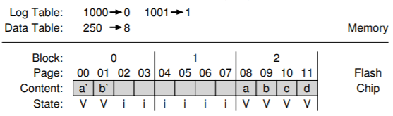  
この物理ブロックの他のページを再統一するために、単一のブロックポインタだけでそれらを参照できるようにするため、FTLはpartial merge(部分マージ)と呼ばれる処理を実行します。この操作では、2と3がブロック4から読み込まれ、ログに追加されます。結果として得られるSSDの状態は、上記のswitch mergeと同じです。ただし、この場合、FTLはその目的を達成するために余分なI/Oを実行する必要がありました(物理ページ18と19から論理ブロック2と3を読み取り、物理ページ22と23に書き出す)。したがって、書き込み増幅が増加します。

フル・マージ(full merge)と呼ばれるFTLが直面する最後のケースであり、さらに多くの作業が必要です。この場合、FTLは、クリーニングを実行するために他の多くのブロックからページを集める必要があります。たとえば、ページ0、4、8、12がログブロックAに書き込まれたとします。このログブロックをブロックマップページに切り替えるには、まずFTLが論理ブロック0,1,2,3を含むデータブロックを作成する必要があります。したがって、FTLは1,2,3を別の場所から読み取り、0,1,2,3を一緒に書き出す必要があります。次に、マージは、論理ブロック4について同じことをして、5,6,7を見つけてそれらを単一のデータブロックに調整する必要があります。論理ブロック8および12に対して同じことが行われなければならず、次に(最終的に)、ログブロックAは解放されます。驚くことではないが、頻繁な完全なマージはパフォーマンスに重大な損害を与える可能性があります[GY + 09]。

## 44.10 Wear Leveling
最後に、現代のFTLが実装しなければならない関連するバックグラウンド活動は、上記のようにウェアレベリングです。基本的な考え方は簡単です。複数の消去/プログラム・サイクルがフラッシュ・ブロックを消耗するため、FTLはデバイスのすべてのブロックにその作業を均等に広げるために最善を尽くすべきです。このようにして、すべてのブロックは、「人気の」ブロックがすぐに使用できなくなる代わりに、ほぼ同じ時間に消耗します。

基本的なログ構造化アプローチは、書き込み負荷を分散させるための最初の良い仕事を行い、ガベージコレクションも役立ちます。ただし、ブロックが上書きされない長寿命のデータでいっぱいになることがあります。この場合、ガベージコレクションはブロックを再利用することはないため、書き込み負荷の公平性を受け取ることはありません。

この問題を解決するには、FTLは定期的にそのブロックからライブデータをすべて読み込み、別の場所に書き直す必要があります。したがって、ブロックを再度書き込み可能にする必要があります。このウェアレベリングのプロセスは、SSDの書き込み増幅を増加させ、したがって、すべてのブロックがほぼ同じレートで確実に摩耗するように、余分なI/Oが必要になるため、パフォーマンスが低下します。多くの異なるアルゴリズムが文献[A + 08、M + 14]が存在します。これらに興味を持ったのであれば読んでみてください。

## 44.11 SSD Performance And Cost
クロージングする前に、最新のSSDのパフォーマンスとコストを調べて、永続的なストレージシステムでどのように使用されるのかを理解してみましょう。どちらの場合も、従来のハードディスクドライブ(HDD)と比較し、両者の最大の違いを強調します。

### Performance
ハード・ディスク・ドライブとは異なり、フラッシュ・ベースのSSDは機械的なコンポーネントを備えておらず、実際には「ランダム・アクセス」デバイスであるという点でDRAMに多くの点で似ています。ディスクドライブと比較してパフォーマンスの最大の違いは、ランダムな読み書きを実行するときに実現されます。一般的なディスクドライブでは1秒間に数百回のランダムI/Oしか実行できませんが、SSDの方がはるかに優れています。ここでは、近代的なSSDのデータを使用して、SSDの性能がどれだけ優れているかを確認します。我々は、FTLが生のチップの性能問題をどれくらいうまく隠すかに特に関心があります。

表44.4に、3つの異なるSSDと最先端のハードドライブのパフォーマンスデータを示します。データはいくつかの異なるオンラインソースから取得しました[S13、T15]。左の2つの列はランダムなI/Oパフォーマンスを示し、右の2つの列は順次なI/Oです。最初の3行はSamsung、Seagate、Intelの3種類のSSDのデータを表示し、最後の行はハードディスクドライブ(またはHDD)のパフォーマンスを示します。この場合はSeagateのハイエンドドライブです。

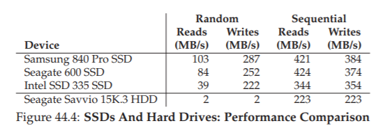  

テーブルから興味深い事実をいくつか学ぶことができます。まず、最も劇的なのは、SSDと唯一のハードドライブ間のランダムI/Oパフォーマンスの違いです。SSDはランダムI/Oで数十MB/sから数百MB/sを達成していますが、この「高性能」ハードドライブでは数MB/sのピークがあります(実際には2 MB/sになるように丸めました)。第2に、順次I/Oパフォーマンスの点で、違いがはるかに少ないことがわかります。順次I/Oパフォーマンスが必要なだけであれば、SSDのパフォーマンスでも向上しますが、ハードドライブはまだまだ良い選択です。第3に、SSDのランダム読み取りパフォーマンスがSSDランダム書き込みパフォーマンスほど良くないことがわかります。

このような予期しなかった良好なランダム書き込みパフォーマンスの理由は、ランダム書き込みを順次書き込みに変換してパフォーマンスを向上させる、多くのSSDのログ構造設計によるものです。最後に、SSDは順次I/OとランダムI/Oのパフォーマンスに差があるため、ハードドライブのファイルシステムを構築する方法については、後続の章で学習する多くのテクニックがSSDに適用されます。順次I/OとランダムI/Oの差の大きさは小さくなりますが、ランダムI/Oを減らすためにファイルシステムを設計する方法を慎重に考慮するには十分なギャップがあります。

### Cost
上で見たように、SSDのパフォーマンスは、順次I/Oを実行している場合でも、現代のハードドライブを大幅に上回ります。それでは、なぜSSDは記憶媒体としてハードドライブを完全に置き換わっていないのですか？その答えは簡単です。コスト、具体的には、容量単位あたりのコストです。現在、[A15]のSSDは、250GBのドライブでは150ドルの費用がかかります。そのようなSSDのコストは60セント/GBです。一般的なハードドライブは1TBのストレージで約50ドルかかります。つまり、1GBあたり5セントです。これら2つの記憶媒体の間にはまだ10倍以上のコスト差があります。

これらのパフォーマンスとコストの違いにより、大規模なストレージシステムの構築方法が決まります。パフォーマンスが主な関心事である場合、特にランダムな読み取りパフォーマンスが重要な場合は、SSDを使用するのが最適です。一方、大規模なデータセンターを組み立てて膨大な量の情報を保管したい場合、大きなコスト差がハードドライブに向かうでしょう。もちろん、ハイブリッドアプローチである、SSDとハードドライブの両方で組み立てられているストレージシステムがあります。より使用頻度が高い「ホット」データ用の少数のSSDで高性能を提供しつつ、コストを節約するためにハードドライブ上の(使用頻度の低い)データを保管するハイブリッドアプローチがあります。価格差が存在する限り、ハードドライブは使われ続けます。

## 44.12 Summary
フラッシュベースのSSDは、世界の経済を動かすデータセンター内のラップトップ、デスクトップ、およびサーバーで共通の存在になっています。したがって、あなたはおそらくそれらについて何かを知るべきでしょうか？

ここで悪いニュースがあります。この章(この本の多くのもののように)は、最新の状態を理解するための最初のステップにすぎません。実際のデバイス性能に関する研究(Chen et alらの[CK + 09]やGrupp et alらの[GC + 09]など)、FTLデザインの問題(作品を含むGuptaらの[GY + 09]、Huangらの[H + 14]、Kimらの[KK + 02]、Leeらの[L + 07]、Agrawalらの[A + 08] 、Zhangらの[Z + 12])、フラッシュで構成される分散システム(Gordon らの[CG + 09]およびCORFU らの[B + 12]を含む)があります。

学術論文を読むだけではありません。一般的なプレス(例えば、[V12])の最近の進歩についても読無必要があります。そこでは、実用的な(まだ、便利ではない)情報を学ぶことができます。サムスンが同じSSD内でTLCとSLCセルの両方を使用してパフォーマンスを最大化する(SLCが書き込みをすばやくバッファに入れることができる)だけでなく、最大容量(TLCはセルあたりより多くのビットを格納できる)を行っています。そして、彼らが言うように、これは氷山の先端です。おそらくMaらの優秀な(そして最近の)調査[M + 14]から始まって、あなた自身がこの研究の"氷山"についてもっと詳しく知ってください。しかし、注意してください。氷山は船の中でも最も強力なものを沈めることができます[W15]。

## 参考文献
[A+08] “Design Tradeoffs for SSD Performance”  
N. Agrawal, V. Prabhakaran, T. Wobber, J. D. Davis, M. Manasse, and R. Panigrahy  
USENIX ’08, San Diego California, June 2008  
An excellent overview of what goes into SSD design.

[A15] “Amazon Pricing Study”  
Remzi Arpaci-Dusseau  
February, 2015  
This is not an actual paper, but rather one of the authors going to Amazon and looking at current prices of hard drives and SSDs. You too can repeat this study, and see what the costs are today. Do it!

[B+12] “CORFU: A Shared Log Design for Flash Clusters”  
M. Balakrishnan, D. Malkhi, V. Prabhakaran, T. Wobber, M. Wei, J. D. Davis  
NSDI ’12, San Jose, California, April 2012  
A new way to think about designing a high-performace replicated log for clusters using Flash.

[BD10] “Write Endurance in Flash Drives: Measurements and Analysis”  
Simona Boboila, Peter Desnoyers  
FAST ’10, San Jose, California, February 2010  
A cool paper that reverse engineers flash-device lifetimes. Endurance sometimes far exceeds manufacturer predictions, by up to 100×.

[B07] “ZFS: The Last Word in File Systems”  
Jeff Bonwick and Bill Moore  
Available: http://www.ostep.org/Citations/zfs last.pdf  
Was this the last word in file systems? No, but maybe it’s close.

[CG+09] “Gordon: Using Flash Memory to Build Fast, Power-efficient Clusters for Data-intensive Applications”  
Adrian M. Caulfield, Laura M. Grupp, Steven Swanson  
ASPLOS ’09, Washington, D.C., March 2009  
Early research on assembling flash into larger-scale clusters; definitely worth a read.

[CK+09] “Understanding Intrinsic Characteristics and System Implications of Flash Memory based Solid State Drives”  
Feng Chen, David A. Koufaty, and Xiaodong Zhang  
SIGMETRICS/Performance ’09, Seattle, Washington, June 2009  
An excellent overview of SSD performance problems circa 2009 (though now a little dated).

[G14] “The SSD Endurance Experiment”  
Geoff Gasior  
The Tech Report, September 19, 2014  
Available: http://techreport.com/review/27062  
A nice set of simple experiments measuring performance of SSDs over time. There are many other similar studies; use google to find more.

[GC+09] “Characterizing Flash Memory: Anomalies, Observations, and Applications”  
L. M. Grupp, A. M. Caulfield, J. Coburn, S. Swanson, E. Yaakobi, P. H. Siegel, J. K. Wolf  
IEEE MICRO ’09, New York, New York, December 2009  
Another excellent characterization of flash performance.

[GY+09] “DFTL: a Flash Translation Layer Employing Demand-Based Selective Caching of Page-Level Address Mappings”  
Aayush Gupta, Youngjae Kim, Bhuvan Urgaonkar  
ASPLOS ’09, Washington, D.C., March 2009  
This paper gives an excellent overview of different strategies for cleaning within hybrid SSDs as well as a new scheme which saves mapping table space and improves performance under many workloads.

[H+14] “An Aggressive Worn-out Flash Block Management Scheme  
To Alleviate SSD Performance Degradation”  
Ping Huang, Guanying Wu, Xubin He, Weijun Xiao  
EuroSys ’14, 2014  
Recent work showing how to really get the most out of worn-out flash blocks; neat!  

[J10] “Failure Mechanisms and Models for Semiconductor Devices”  
Report JEP122F, November 2010  
Available: http://www.jedec.org/sites/default/files/docs/JEP122F.pdf  
A highly detailed discussion of what is going on at the device level and how such devices fail. Only for those not faint of heart. Or physicists. Or both.

[KK+02] “A Space-Efficient Flash Translation Layer For Compact Flash Systems”  
Jesung Kim, Jong Min Kim, Sam H. Noh, Sang Lyul Min, Yookun Cho  
IEEE Transactions on Consumer Electronics, Volume 48, Number 2, May 2002  
One of the earliest proposals to suggest hybrid mappings.

[L+07] “A Log Buffer-Based Flash Translation Layer Using Fully-Associative Sector Translation”  
Sang-won Lee, Tae-Sun Chung, Dong-Ho Lee, Sangwon Park, Ha-Joo Song  
ACM Transactions on Embedded Computing Systems, Volume 6, Number 3, July 2007  
A terrific paper about how to build hybrid log/block mappings.

[M+14] “A Survey of Address Translation Technologies for Flash Memories”  
Dongzhe Ma, Jianhua Feng, Guoliang Li  
ACM Computing Surveys, Volume 46, Number 3, January 2014  
Probably the best recent survey of flash and related technologies.

[S13] “The Seagate 600 and 600 Pro SSD Review”  
Anand Lal Shimpi  
AnandTech, May 7, 2013  
Available: http://www.anandtech.com/show/6935/seagate-600-ssd-review  
One of many SSD performance measurements available on the internet. Haven’t heard of the internet? No problem. Just go to your web browser and type “internet” into the search tool. You’ll be amazed at what you can learn.

[T15] “Performance Charts Hard Drives”  
Tom’s Hardware, January 2015  
Available: http://www.tomshardware.com/charts/enterprise-hdd-charts/  
Yet another site with performance data, this time focusing on hard drives.

[V12] “Understanding TLC Flash”  
Kristian Vatto  
AnandTech, September, 2012  
Available: http://www.anandtech.com/show/5067/understanding-tlc-nand  
A short description about TLC flash and its characteristics.

[W15] “List of Ships Sunk by Icebergs”  
Available: http://en.wikipedia.org/wiki/List of ships sunk by icebergs  
Yes, there is a wikipedia page about ships sunk by icebergs. It is a really boring page and basically everyone knows the only ship the iceberg-sinking-mafia cares about is the Titanic.

[Z+12] “De-indirection for Flash-based SSDs with Nameless Writes”  
Yiying Zhang, Leo Prasath Arulraj, Andrea C. Arpaci-Dusseau, Remzi H. Arpaci-Dusseau  
FAST ’13, San Jose, California, February 2013  
Our research on a new idea to reduce mapping table space; the key is to re-use the pointers in the file system above to store locations of blocks, instead of adding another level of indirection.