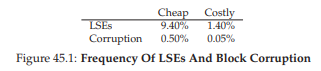
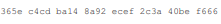
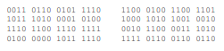
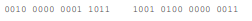
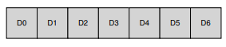
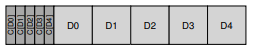
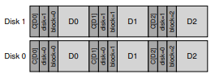

# 45 Data Integrity and Protection
これまでに研究してきたファイルシステムの基本的な進歩を超えて、多くの機能を検討する価値があります。この章では、信頼性にまた重点を置いて説明します（RAIDの章で以前にストレージシステムの信頼性を検討したことがあります）。具体的には、ファイルシステムやストレージシステムは、最新のストレージデバイスの信頼性の低い性質を考慮して、データが安全であることをどのように保証する必要がありますか？この一般的な領域は、data integrity（データ完全性）またはdata protection（データ保護）と呼ばれます。そこで、ストレージシステムがデータをあなたに返すときに、ストレージシステムに入力したデータと同じであることを保証するために使用される手法を検討します。

>> CRUX: HOW TO ENSURE DATA INTEGRITY  
>> ストレージに書き込まれたデータがシステムによってどのように確実に保護されるべきですか？どんな技術が必要ですか？そのようなテクニックを効率的にするには、省スペースと時間の両方のオーバーヘッドはどうですか？

## 45.1 Disk Failure Modes
RAIDについての章で学んだように、ディスクは完璧ではなく、失敗することもあります。初期のRAIDシステムでは、障害のモデルは非常に単純でした。ディスク全体が動作しているかまたは完全に故障しているか、これであれば、そのような障害の検出は簡単です。このようなディスク障害のフェールストップモデルは、RAIDの構築を比較的簡単にします[S90]。

あなたが学んでいないのは、現代のディスクが示す他のタイプの故障モードのすべてです。具体的には、Bairavasundaram et alです。現代のディスクは時には大部分は動作しているように見えますが、1つまたは複数のブロックに正常にアクセスするのに問題があります[B + 07、B + 08]。具体的には、 Latent Sector Errors（LSEs）とblock corruptionの2つのタイプのシングルブロック障害が共通して考慮する価値があります。ここで、それぞれをより詳しく説明します。

LSEsは、ディスクセクタ（またはセクタグループ）が何らかの形で損傷を受けたときに発生します。たとえば、何らかの理由でディスクヘッドが表面に接触した場合（ヘッドクラッシュ、通常の操作では起こらないもの）、表面が損傷してビットが判読不能になる可能性があります。宇宙線もビットを反転させることができ、不正確な内容につながります。幸いにも、ディスク内の Error Correcting Codes（ECC）は、ブロック内のディスク上のビットが正常であるかどうかを判断し、場合によっては、ブロックを修正するためにドライブで使用されます。ドライブがエラーを解決するのに十分な情報を持っていない場合、ディスクは、要求を発行されたときにエラーを返して読み取ります。

また、ディスク自体が検出できないような、ディスクブロックが破損することもあります。たとえば、バグのあるディスクファームウェアは、間違った場所にブロックを書き込む可能性があります。そのような場合、ディスクECCはブロックの内容が正常であることを示しますが、クライアントの観点からは、後でアクセスしたときに間違ったブロックが返されます。同様に、ブロックが障害のあるバスを経由してホストからディスクに転送されると、クライアントが望んでいない破損したデータがディスクに格納されます。これらのタイプの障害は、サイレントフォールトであるため特に危険です。故障したデータを戻すときに問題の兆候は見られません。

Prabhakaran et alは、ディスク障害のこのより現代的な見解を、部分ディスク故障モデル[P + 05]として説明しています。このビューでは、従来のフェイルストップモデルの場合のように、ディスク全体が引き続き故障する可能性があります。つまり、ディスクは見かけ上動作していますが、1つまたは複数のブロックがアクセス不能（すなわちLSE）になったり、間違った内容（すなわち、破損）を保持する可能性があります。したがって、一見して動作するディスクにアクセスすると、与えられたブロックを読み書きしようとするとき（サイレントではない部分的なフォールト）、エラーを返したり、間違ったデータを返すことがあります（部分的なサイレントフォールト）。これらの両方のタイプの障害は、まれですが、どれだけ稀でしょうか？図45.1は、2つのバイラバンダダラム研究[B + 07、B + 08]の結果の一部をまとめたものです。

図は、調査の過程で少なくとも1つのLSEまたはブロック破損を示したドライブの割合を示しています（約3年間、150万台以上のディスクドライブ）。この図はさらに、結果を「安価な」ドライブ（通常はSATAドライブ）と「高価な」ドライブ（通常はSCSIまたはFibreChannel）に細分しています。お分かりのように、より良いドライブを購入することで、両方のタイプの問題の頻度が（桁違いに）低下しますが、ストレージシステムでの処理方法を慎重に考えなければならないほど頻繁に発生します。

LSEsに関する追加的な調査結果は次のとおりです。  
- 複数のLSEsを使用する高価なドライブは、安価なドライブと同じくらい追加のエラーを発生させる可能性が高い
- ほとんどのドライブでは、年間エラー率は2年目に増加します
- ディスクサイズに合わせてLSEsの数が増えます
- LSEsを持つほとんどのディスクは50未満です
- LSEsを持つディスクは、追加のLSEsを開発する可能性が高い
- かなりの量の空間的および時間的局所性が存在する
- ディスクスクラブが便利です（ほとんどのLSEsはこのように見つかっています）

破損に関するいくつかの発見は次の通りです。  
- 破損の可能性は、同じドライブクラス内のさまざまなドライブモデルによって大きく異なります
- 年季による影響はモデルによって異なります
- 仕事量とディスクサイズが破損にほとんど影響しない
- 破損しているほとんどのディスクにはいくつかの破損しかありません
- 破損は、ディスク内またはRAID内のディスク間で独立していない
- 空間的局所性と時間的局所性が存在する
- LSEsとの相関は低い

これらの失敗の詳細については、元の論文[B + 07、B + 08]を読むべきでしょう。しかし、うまくいけば、要点は明らかです。信頼できるストレージシステムを本当に構築したいのであれば、LSEsと破損のブロックのそれぞれの検出と復旧のための機械を組み込む必要があります。

## 45.2 Handling Latent Sector Errors
部分的なディスク障害のこれらの2つの新しいモードを考えると、我々は今、それらについて何ができるのかを見極めるべきです。最初に2つのうちのlatent sector errorsと名前がついている簡単な方に取り組んでみましょう。

>> CRUX: HOW TO HANDLE LATENT SECTOR ERRORS  
>> ストレージシステムは latent sector errorsをどのように処理すべきですか？このような部分的な失敗を処理するには、どれくらい余分な機械が必要ですか？

結果として、latent sector errorsは（定義によって）容易に検出されるので、扱うのが簡単です。ストレージシステムがブロックにアクセスしようとしたときに、ディスクがエラーを返した場合、ストレージシステムは正しいデータを返すために必要な冗長メカニズムを使用するだけです。たとえば、ミラーリングされたRAIDでは、システムは代替コピーにアクセスする必要があります。パリティベースのRAID-4またはRAID-5システムでは、パリティグループの他のブロックからブロックを再構築する必要があります。したがって、LSEsなどの容易に検出される問題は、標準的な冗長性メカニズムを通じて容易に回復されます。

LSEsの普及率は、長年にわたりRAID設計に影響を与えてきました。フルディスク障害とLSEsの両方が同時に発生すると、特に興味深い問題がRAID-4/5システムで発生します。具体的には、ディスク全体が故障すると、RAIDはパリティグループ内の他のすべてのディスクを読み取り、欠損値を再計算することによってディスクを（たとえば、ホットスペアに）再構築しようと試みます。再構築中に他のディスクのいずれかでLSEが発生した場合、問題が発生します。再構成が正常に完了できません。

この問題を解決するために、いくつかのシステムでは余分な冗長性が追加されています。たとえば、NetAppのRAID-DPは、一つの[C + 04]ではなく2つのパリティディスクに相当します。再構成中にLSEが検出されると、余分なパリティが欠損ブロックを再構築するのに役立ちます。いつものように、各ストライプの2つのパリティブロックを維持する方がコストがかかります。しかし、NetApp WAFLファイルシステムのログ構造は、多くの場合、コストを軽減します[HLM94]。残りのコストは、第2のパリティブロック用の余分なディスクのスペースです。

## 45.3 Detecting Corruption: The Checksum
では、より挑戦的な問題であるデータ破損によるsilent failuresの問題に取り組んでみましょう。破損が発生した場合にユーザーが悪意のあるデータを取得するのを防ぐことができ、悪意あるデータを返すディスクに導けるでしょうか？

>> CRUX: HOW TO PRESERVE DATA INTEGRITY DESPITE CORRUPTION  
>> このようなサイレントな障害の性質を考えると、ストレージシステムは破損が発生したときに何を検出することができますか？どんな技術が必要ですか？どのように効率的に実装できますか？

latent sector errorsとは異なり、破損の検出は重要な問題です。ブロックが不良であるとクライアントがどのように伝えることができますか？特定のブロックが不良であることが分かったら、復旧は前と同じです。ブロックのコピーをいくつか用意する必要があります（うまくいけば、壊れていないこともあります）。したがって、我々はここで検出技術に焦点を当てます。

最新のストレージシステムでデータの整合性を保持するために使用される主なメカニズムはチェックサムと呼ばれます。チェックサムは、単にデータの塊（例えば4KBのブロック）を入力とし、そのデータ上の関数を計算してデータの内容（例えば4または8バイト）の小さな要約を生成する関数の結果です。この概要はチェックサムと呼ばれます。このような計算の目的は、データにチェックサムを格納し、その後にデータの現在のチェックサムが元のストレージ値と一致することを確認することによって、データが何らかの形で壊れているか、変更されているかどうかを検出できるようにすることです。

>> TIP: THERE’S NO FREE LUNCH  
>> There’s No Such Thing As A Free Lunch、つまりTNSTAAFLは古いアメリカのイディオムであり、あなたが何かを無料で手に入れているときには、実際には多少の費用がかかります。ダイナーが顧客に無料のランチを宣伝し、飲み物を引き出そうと考えていた昔からのものです。あなたが入ったときにだけ、あなたは"無料"ランチを取得するために、あなたは1つ以上のアルコール飲料を購入しなければならないことを認識しましたか？もちろん、特にあなたがアルコール依存症（または典型的な学部生）である場合、これは実際問題ではないかもしれません。

### Common Checksum Functions
多数の異なる関数がチェックサムを計算するために使用され、強さ（すなわち、それらがデータ保全性をいかに良好に保っているか）および速度（すなわち、それらをいかに迅速に計算することができるか）で変化します。ここではシステムに共通するトレードオフが発生します。通常、より多くの保護を受けるほど、コストが高くなります。free lunchなどはありません。

あるものは排他的論理和（XOR）に基づく単純なチェックサム関数です。XORベースのチェックサムの場合、チェックサムは、チェックサムされるデータブロックの各チャンクを排他的論理和（XOR）することによって計算され、ブロック全体のXORを表す単一の値を生成します。

これをより具体的にするために、16バイトのブロックに対して4バイトのチェックサムを計算していると想像してください（このブロックは実際にディスクセクタまたはブロックになるには小さすぎますが、例のために役立ちます）。16データバイトの16進数で、次のようになります。  
  
バイナリ形式で表示すると、次のようになります。  
  
行ごとに4バイトのグループにデータを並べたので、結果のチェックサムがどのようになるかを簡単に確認できます。各列でXORを実行して最終的なチェックサム値を取得します。  
  
結果は16進数で0x201b9403です。XORは合理的なチェックサムですが、限界があります。たとえば、チェックサム単位内の同じ位置の2ビットが変化した場合、チェックサムは破損を検出しません。このため、人々は他のチェックサム機能を調査しました。

もう1つの基本的なチェックサム機能は追加です。このアプローチには、高速であるという利点があります。オーバーフローを無視して、データの各チャンクに対して2の補数加算を実行するだけです。それはデータの多くの変化を検出することができるが、例えばデータがシフトされた場合には良くありません。

ちょっと複雑なアルゴリズムがFletcherチェックサムとして知られていますが、これは発明者John F. Fletcher氏[F82]の名前です。計算が非常に簡単で、2つのチェックバイトs1とs2の計算が必要です。具体的には、ブロックDがバイトd_1 ... d_nで構成され、s1は以下のように定義されます：s1 =（s1 + d_i）mod255（全てのd_iに対して計算される）。s2は、s2 =（s2 + s1）mod255（すべてのd_iに対して計算される）[F04]です。Fletcherのチェックサムは、すべてのシングルビット、ダブルビットエラー、および多くのバーストエラー[F04]を検出して、CRCとほぼ同じくらい強いです（下記参照）。

1つの最終的に使用されるチェックサムは、Cyclic Redundancy Check（CRC）として知られています。データブロックDを介してチェックサムを計算したいと仮定します。Dを大規模な2進数であるかのように扱います（結局のところビット列です）、合意された値（k）で割ります。この除算の残りはCRCの値です。明らかになったように、このバイナリモジュロ演算をむしろ効率的に実装することができ、したがってネットワーキングにおけるCRCの人気は高いです。詳細は[M13]を参照してください。

どのような方法を使用しても、完全なチェックサムがないことは明らかです。内容が同一ではない2つのデータブロックに同じチェックサムがある可能性があります。結局のところ、チェックサムを計算することは、何かを大きく（例えば4KB）取って、はるかに小さい（例えば4または8バイト）要約を生成することです。つまり、直感的でなければいけません。良いチェックサム関数を選ぶ際に、我々は衝突の可能性を最小限に抑えながら計算しやすいものを見つけることを試みています。

### Checksum Layout
チェックサムを計算する方法について少し理解したので、次にストレージシステムでチェックサムを使用する方法を分析しましょう。最初に問題となるのは、チェックサムのレイアウト、つまりどのようにチェックサムをディスクに保存すればよいでしょうか？

最も基本的なアプローチでは、各ディスクセクタ（またはブロック）にチェックサムを格納するだけです。データブロックDが与えられたら、そのデータC（D）でチェックサムを呼び出します。したがって、チェックサムがないと、ディスクレイアウトは次のようになります。  
  
チェックサムを使用すると、レイアウトはすべてのブロックに対して1つのチェックサムを追加します。  
  
チェックサムは通常小さい（例えば8バイト）ディスクであり、ディスクはセクタサイズのチャンク（512バイト）またはその倍数でしか書き込めないので、上記のレイアウトをどのように達成するかという問題があります。ドライブメーカーが採用している解決策の1つは、ドライブを520バイトのセクタでフォーマットすることです。1セクタあたり余分な8バイトを使用してチェックサムを格納することができます。このような機能を持たないディスクでは、ファイルシステムは512バイトのブロックにパックされたチェックサムを格納する方法を理解しなければなりません。そのような可能性の1つは次のとおりです。  
  
このスキームでは、n個のチェックサムがセクタ内に一緒に格納され、その後にn個のデータブロックが続き、次のn個のブロック用のチェックサムセクタが…と繰り返します。このスキームは、すべてのディスクで作業する利点がありますが、効率が低下する可能性があります。たとえば、ファイルシステムがブロックD1を上書きしたい場合、C（D1）を含むチェックサムセクタを読み込み、その中のC（D1）を更新してから、チェックサムセクタおよび新しいデータブロックを書き出す必要がありますD1（したがって、1回の読み出しと2回の書き込み）。 以前のアプローチ（1セクタあたり1つのチェックサムの）は単なる書き込みを実行するだけです。

## 45.4 Using Checksums
チェックサムレイアウトが決定したら、チェックサムの使用方法を実際に理解することができます。ブロックDを読むとき、クライアント（すなわち、ファイルシステムまたはストレージコントローラ）は、ディスクC_s（D）からそのチェックサムを読み取ります。これをstored checksum（したがって添え字C_s）と呼びます。次に、クライアントは、検索されたブロックDに対するチェックサムを計算します。これは、computed checksum（C_c（D））と呼ばれます。この時点で、クライアントはstored checksumとcomputed checksumを比較します。もしそれらが等しければ（すなわち、C_s（D）== C_c（D））、データは破損していない可能性があり、したがって安全にユーザに戻すことができます。もしそれらが等しくないとき（すなわち、C_s（D）!= C_c（D））、これは、格納されたチェックサムがその時点でのデータの値を反映しているため、データが格納されてから変更されたことを意味します。この場合、私たちはチェックサムが検出するのに役立つ破損があります。

破損を考えると、自然な疑問は私たちがそれについて何をすべきかということです。ストレージシステムに冗長コピーがある場合、その答えは簡単です。代わりに使用してみてください。ストレージシステムにそのようなコピーがない場合は、エラーを返す可能性があります。どちらの場合でも、破損の検出は魔法の弾丸ではないことを認識してください。他に破損していないデータを取得する方法がない場合、あなたは単に運がないだけです。

## 45.5 A New Problem: Misdirected Writes
上記の基本的なスキームは、破損したブロックの一般的なケースでうまくいきます。しかし、現代のディスクには、さまざまなソリューションを必要とする異常ないくつかのfailureモードがあります。関心のある第1のfailureモードは、misdirected write(誤った方向の書き込み)と呼ばれます。これは、間違った場所以外のデータをディスクに正しく書き込むディスクコントローラとRAIDコントローラで発生します。単一ディスクシステムでは、これは、ディスクがブロックD_xを（おそらくは）xに対応するのではなく、yをアドレス指定する（したがって、"破損する"D_y）ように書いたことを意味します。さらに、マルチ・ディスク・システムでは、コントローラは、ディスクiのxにアドレスするのではなく、むしろ他のディスクjに書き込むかもしれません。

>> CRUX: HOW TO HANDLE MISDIRECTED WRITES  
>> ストレージシステムまたはディスクコントローラは、misdirected writesをどのように検出すべきですか？チェックサムにはどのような追加機能が必要ですか？

驚くことではないですが、答えは簡単です。各チェックサムに少しだけ情報を追加してください。この場合、物理識別子（物理ID）を追加することは非常に役に立ちます。例えば、格納された情報がブロックのディスク及びセクタ番号と共にチェックサムC（D）を含むならば、クライアントが正しい情報がブロック内に存在するかどうかを容易に判断することができます。具体的には、クライアントがディスク10のブロック4（D_10,4）を読み取っている場合、格納された情報には、そのディスク番号とセクタオフセットが含まれている必要があります（下図参照）。情報が一致しない場合、間違った書込みが行われ、破損が検出されます。2ディスクシステムでこのような追加情報がどのように表示されるかの例を次に示します。この図では、チェックサムは通常は小さい（例えば8バイト）一方、ブロックははるかに大きい（例えば、4KB以上）ので、前の他のものと同様に、この数字は縮尺通りではないことに注意してください。  
  
ディスク上には冗長性がかなりあることがディスク上のフォーマットからわかります。各ブロックごとにディスク番号が各ブロック内で繰り返され、ブロックのオフセットもブロック自体の横に保持されます。冗長な情報の存在は驚くべきことではありません。冗長性は、エラー検出（この場合）および回復（他の場合）の鍵です。わずかな余分な情報は、完璧なディスクで厳密には必要とされませんが、問題が発生した場合に問題のある状況を検出するのに役立ちます。

## 45.6 One Last Problem: Lost Writes
残念ながら、間違った書込みは私たちが直面する最後の問題ではありません。具体的には、現代の記憶装置の中には、書込みが完了したことを装置が上位層に通知したにもかかわらず、失われた書込みとして知られる問題もあります。したがって、残っているのは、更新された新しいコンテンツではなく、ブロックの古いコンテンツです。

明らかな問題は、上記のチェックサム戦略（基本的なチェックサムや物理的な識別情報など）が失われた書き込みを検出するのに役立つかどうかです。残念なことに、答えはノーです。古いブロックは一致するチェックサムを持つ可能性が高く、上記の物理ID（ディスク番号とブロックオフセット）も正しいでしょう。

>> CRUX: HOW TO HANDLE LOST WRITES  
>> ストレージシステムまたはディスクコントローラは、失われた書き込みをどのように検出する必要がありますか？ チェックサムにはどのような追加機能が必要ですか？

[K + 08]に役立つさまざまな解決策があります。1つの古典的なアプローチ[BS04]は、書き込み検証またはread after writeを実行することです。書き込み後にデータを直ちに読み戻すことによって、システムはデータが実際にディスク表面に到達することを保証することができます。しかし、このアプローチは非常に遅く、書き込みを完了するために必要なI/Oの数が倍になります。

一部のシステムでは、システム内の他の場所でチェックサムを追加して、失われた書き込みを検出します。たとえば、SunのZFS（Zettabyte File System）には、各ファイルシステムのiノードとファイルに含まれるすべてのブロックの間接ブロックにチェックサムが含まれています。したがって、データブロック自体への書き込みが失われても、inode内のチェックサムは古いデータと一致しません。inodeとデータの両方への書き込みが同時に失われた場合にのみ、そのようなスキームは失敗しますが、（残念ながら可能です！）そのような状況はありません。

## 45.7 Scrubbing
この議論のすべてを考えると、あなたは疑問に思うかもしれません。いつこれらのチェックサムが実際にチェックされますか？もちろん、データがアプリケーションによってアクセスされるときにいくらかのチェックが行われますが、ほとんどのデータはアクセスすることはほとんどないため、チェックされません。チェックされていないデータは、信頼性の高いストレージシステムでは問題になります。ビット腐敗が特定のデータのすべてのコピーに最終的に影響する可能性があるからです。

この問題を解決するために、多くのシステムではさまざまな形式のディスクスクラビングが使用されています[K + 08]。システムのすべてのブロックを定期的に読み取り、チェックサムが有効かどうかをチェックすることで、ディスクシステムは、特定のデータ項目のすべてのコピーが破損する可能性を減らすことができます。典型的なシステムは、夜間または週単位でスキャンをスケジュールします。

## 45.8 Overheads Of Checksumming
終了する前に、データ保護のためにチェックサムを使用するオーバーヘッドのいくつかについて説明します。コンピュータシステムで一般的であるように、スペースと時間という2つの異なる種類のオーバーヘッドがあります。

スペースのオーバーヘッドには2つの形式があります。最初はディスク（または他の記憶媒体）自体にあります。格納された各チェックサムはディスク上の空き領域を占有します。これはもはやユーザーデータに使用できません。典型的な比率は、ディスク上のスペースのオーバーヘッドが0.19％であるため、4 KBのデータブロックにつき8バイトのチェックサムになります。

第2の種類のスペースオーバヘッドは、システムのメモリ内にある。データにアクセスするときに、チェックサムとデータそのもののためにメモリに余裕がなければなりません。しかし、システムが単にチェックサムをチェックし、それが一旦終了するこのオーバーヘッドは短命であり、懸念するものではありません。チェックサムがメモリに保持されている場合（メモリ破損[Z + 13]に対する保護レベルが追加されている場合）に限り、この小さなオーバーヘッドは観測可能です。

スペースのオーバーヘッドは小さいものの、チェックサムによる時間オーバーヘッドはかなり目立つことがあります。最低限、CPUは、データが格納されているとき（格納されているチェックサムの値を決定するとき）とアクセスされたとき（チェックサムを再度計算してそれを格納されたチェックサムと比較するとき）の各ブロックのチェックサムを計算する必要があります。チェックサム（ネットワークスタックを含む）を使用する多くのシステムで採用されているCPUオーバーヘッドを削減する方法の1つは、データコピーとチェックサムを1つの効率的なアクティビティに組み合わせることです。何らかの形で（例えば、カーネルページキャッシュからユーザバッファにデータをコピーするために）コピーが必要とされるので、コピー/チェックサムを組み合わせることは非常に効果的です。

CPUオーバーヘッド以外にも、いくつかのチェックサム方式により、余分なI/Oオーバーヘッドが発生する可能性があります。具体的には、チェックサムがデータとは区別されて格納されている（特にアクセスするための余計なI/Oが必要な場合）、background scrubbingに必要な余分なI/Oです。前者は設計によって減らすことができます。おそらくこのようなscrubbing活動がいつ行われるかを制御することによって、後者は調整され、その影響は制限されます。真夏の夜中に、生産労働者のほとんどが就寝してしまったので、このようなscrubbing活動を実行してストレージシステムの堅牢性を高める良い機会になるかもしれません。

## 45.9 Summary
現代のストレージシステムでは、チェックサムの実装と使用に焦点を当てて、データ保護について説明しました。異なるチェックサムが異なるタイプのフォルトに対して保護します。記憶装置が進化するにつれて、新しいfailure modesが間違いなく発生するでしょう。おそらくこのような変化は、研究界や産業界にこれらの基本的アプローチのいくつかを再び使ったり、まったく新しいアプローチを発明したりすることになるでしょう。それは時間が教えてくれるかもしれませんし、そうではないかもしれません。そういった意味で時間というのは面白いです。

## 参考文献

[B+07] “An Analysis of Latent Sector Errors in Disk Drives”  
Lakshmi N. Bairavasundaram, Garth R. Goodson, Shankar Pasupathy, Jiri Schindler  
SIGMETRICS ’07, San Diego, California, June 2007  
The first paper to study latent sector errors in detail. As described in the next citation [B+08], a collaboration between Wisconsin and NetApp. The paper also won the Kenneth C. Sevcik Outstanding Student Paper award; Sevcik was a terrific researcher and wonderful guy who passed away too soon. To show the authors it was possible to move from the U.S. to Canada and love it, he once sang us the Canadian national anthem, standing up in the middle of a restaurant to do so.

[B+08] “An Analysis of Data Corruption in the Storage Stack”  
Lakshmi N. Bairavasundaram, Garth R. Goodson, Bianca Schroeder,  
Andrea C. Arpaci-Dusseau, Remzi H. Arpaci-Dusseau  
FAST ’08, San Jose, CA, February 2008  
The first paper to truly study disk corruption in great detail, focusing on how often such corruption occurs over three years for over 1.5 million drives. Lakshmi did this work while a graduate student at Wisconsin under our supervision, but also in collaboration with his colleagues at NetApp where he was an intern for multiple summers. A great example of how working with industry can make for much more interesting and relevant research.

[BS04] “Commercial Fault Tolerance: A Tale of Two Systems”  
Wendy Bartlett, Lisa Spainhower  
IEEE Transactions on Dependable and Secure Computing, Vol. 1, No. 1, January 2004  
This classic in building fault tolerant systems is an excellent overview of the state of the art from both IBM and Tandem. Another must read for those interested in the area.

[C+04] “Row-Diagonal Parity for Double Disk Failure Correction”  
P. Corbett, B. English, A. Goel, T. Grcanac, S. Kleiman, J. Leong, S. Sankar  
FAST ’04, San Jose, CA, February 2004  
An early paper on how extra redundancy helps to solve the combined full-disk-failure/partial-disk-failure problem. Also a nice example of how to mix more theoretical work with practical.

[F04] “Checksums and Error Control”  
Peter M. Fenwick  
Copy Available: http://www.ostep.org/Citations/checksums-03.pdf  
A great simple tutorial on checksums, available to you for the amazing cost of free.

[F82] “An Arithmetic Checksum for Serial Transmissions”  
John G. Fletcher  
IEEE Transactions on Communication, Vol. 30, No. 1, January 1982  
Fletcher’s original work on his eponymous checksum. Of course, he didn’t call it the Fletcher checksum, rather he just didn’t call it anything, and thus it became natural to name it after the inventor. So don’t blame old Fletch for this seeming act of braggadocio. This anecdote might remind you of Rubik and his cube; Rubik never called it “Rubik’s cube”; rather, he just called it “my cube.”

[HLM94] “File System Design for an NFS File Server Appliance”  
Dave Hitz, James Lau, Michael Malcolm  
USENIX Spring ’94  
The pioneering paper that describes the ideas and product at the heart of NetApp’s core. Based on this system, NetApp has grown into a multi-billion dollar storage company. If you’re interested in learning more about its founding, read Hitz’s autobiography “How to Castrate a Bull: Unexpected Lessons on Risk, Growth, and Success in Business” (which is the actual title, no joking). And you thought you could avoid bull castration by going into Computer Science.

[K+08] “Parity Lost and Parity Regained”  
Andrew Krioukov, Lakshmi N. Bairavasundaram, Garth R. Goodson, Kiran Srinivasan, Randy Thelen, Andrea C. Arpaci-Dusseau, Remzi H. Arpaci-Dusseau  
FAST ’08, San Jose, CA, February 2008  
This work of ours, joint with colleagues at NetApp, explores how different checksum schemes work (or don’t work) in protecting data. We reveal a number of interesting flaws in current protection strategies, some of which have led to fixes in commercial products.

[M13] “Cyclic Redundancy Checks”  
Author Unknown  
Available: http://www.mathpages.com/home/kmath458.htm  
Not sure who wrote this, but a super clear and concise description of CRCs is available here. The internet is full of information, as it turns out.

[P+05] “IRON File Systems”  
Vijayan Prabhakaran, Lakshmi N. Bairavasundaram, Nitin Agrawal, Haryadi S. Gunawi, Andrea C. Arpaci-Dusseau, Remzi H. Arpaci-Dusseau  
SOSP ’05, Brighton, England, October 2005  
Our paper on how disks have partial failure modes, which includes a detailed study of how file systems such as Linux ext3 and Windows NTFS react to such failures. As it turns out, rather poorly! We found numerous bugs, design flaws, and other oddities in this work. Some of this has fed back into the Linux community, thus helping to yield a new more robust group of file systems to store your data.

[RO91] “Design and Implementation of the Log-structured File System”  
Mendel Rosenblum and John Ousterhout  
SOSP ’91, Pacific Grove, CA, October 1991  
Another reference to this ground-breaking paper on how to improve write performance in file systems.

[S90] “Implementing Fault-Tolerant Services Using The State Machine Approach: A Tutorial”  
Fred B. Schneider  
ACM Surveys, Vol. 22, No. 4, December 1990  
This classic paper talks generally about how to build fault tolerant services, and includes many basic definitions of terms. A must read for those building distributed systems.

[Z+13] “Zettabyte Reliability with Flexible End-to-end Data Integrity”  
Yupu Zhang, Daniel S. Myers, Andrea C. Arpaci-Dusseau, Remzi H. Arpaci-Dusseau  
MSST ’13, Long Beach, California, May 2013  
Our own work on adding data protection to the page cache of a system, which protects against memory corruption as well as on-disk corruption.
