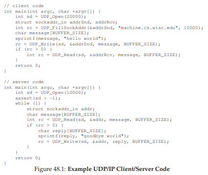
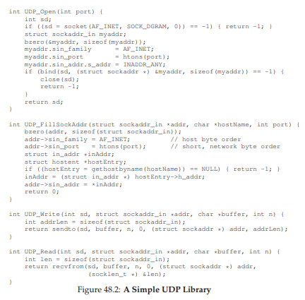
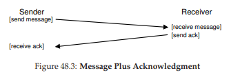
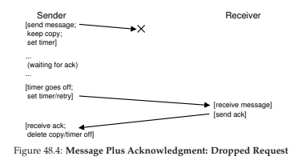
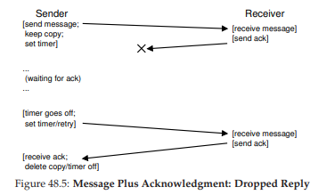

# 48 Distributed Systems
分散システムは世界の顔を変えました。あなたのWebブラウザが地球上の他のどこかのWebサーバに接続するとき、それは単純な形式のクライアント/サーバ分散システムのように見えます。しかし、GoogleやFacebookなどの最新のWebサービスにコンタクトすると、ただ1台のマシンと対話するだけではありません。これらの複雑なサービスの舞台裏では、大規模な収集(すなわち、数千件)のマシンから構築され、それぞれが協力してサイトの特定のサービスを提供します。したがって、分散システムを研究することが興味深いのは明らかです。実際、それはクラス全体にふさわしいものです。ここでは、主要なトピックのいくつかを紹介します。

分散システムを構築する際には、数多くの新たな課題が生じます。我々が重点的に取り組むのは失敗です。「完璧な」コンポーネントやシステムを構築する方法を知らない(そして、決してそうなることはありません)ので、機械、ディスク、ネットワーク、およびソフトウェアはすべて時々失敗します。しかし、現代のWebサービスを構築するときには、失敗しないかのようにクライアントに表示したいと考えています。どうすればこの作業を達成できますか？

>> THE CRUX:HOW TO BUILD SYSTEMS THAT WORK WHEN COMPONENTS FAIL  
>> 常に正しく動作しない部品から作業システムを構築するにはどうすればよいですか？基本的な質問は、RAIDストレージアレイで議論したトピックのいくつかを思い出させるはずです。しかし、ここでの問題は、ソリューションと同様に、より複雑になる傾向があります。

面白いことに、障害は分散システムを構築する上での中心的課題ですが、チャンスでもあります。マシンは失敗します。マシンが故障したという事実だけでは、システム全体が故障しなければならないということを意味するものではありません。一連のマシンをまとめて、コンポーネントが定期的に故障しているにもかかわらず、ほとんど失敗しないシステムを構築することができます。この現実は、分散システムの中心的な美しさと価値です。なぜなら、それらがGoogleやFacebookなど、あなたが使っているすべての最新のWebサービスの下にある理由です。

>> TIP: COMMUNICATION IS INHERENTLY UNRELIABLE  
>>事実上すべての状況において、通信を根本的に信頼できない活動と見なすことは良いことです。ビットの破損、ダウンや動いていないリンクやマシン、着信パケットのバッファスペースの不足は、すべて同じ結果につながります。パケットが宛先に到達しないことがあります。そのような信頼できないネットワークの上に信頼できるサービスを構築するためには、パケット損失に対処できる技術を検討する必要があります。

その他の重要な問題も存在します。システムのパフォーマンスはよく重要です。私たちの分散システムを一緒に接続するネットワークで、システム設計者は、与えられたタスクをどのように達成するか、送信されるメッセージの数を減らし、通信を効率的(低い待ち時間、高帯域幅)にできる限り慎重に考えなければならないことがよくあります。

最後に、セキュリティも必要な考慮事項です。遠隔地に接続するとき、遠隔地の当事者が誰であるかを保証することが中心的な問題になります。さらに、第三者が2つの間の進行中の通信を監視または変更できないようにすることもまた課題です。

ここでは、分散システムで最も新しい通信の基本的な側面について説明します。すなわち分散システム内のマシンは、どのように相互に通信する必要がありますか？利用可能な最も基本的なプリミティブ、メッセージから始めそれらの上にいくつかのより高いレベルのプリミティブを構築します。上記したように、障害は中心的な焦点になります。通信レイヤが障害をどのように処理すべきですか？

## 48.1 Communication Basics
現代のネットワークの中心的な教えは、通信は根本的に信頼性がないということです。広域インターネットでも、Infinibandなどのローカルエリア高速ネットワークでも、パケットは定期的に失われたり、破損したり、宛先に到達しない場合があります。

パケットの損失や破損の原因は多数あります。時には伝送中に、いくつかのビットが電気的または他の同様の問題のために反転されます。場合によっては、ネットワークリンクやパケットルーター、リモートホストなど、システム内の要素が何らかの形で損傷を受けたり正しく動作しないことがあります。ネットワークケーブルが誤って切断されることがあります。

しかし、より根本的なのは、ネットワークスイッチ、ルータ、エンドポイント内でのバッファリングの不足によるパケット損失です。具体的には、すべてのリンクが正しく機能し、システム内のすべてのコンポーネント(スイッチ、ルータ、エンドホスト)が期待どおりに稼動していることを保証できる場合でも、次の理由により、まだ失われる可能性があります。パケットがルータに到着したとします。処理されるパケットについては、ルータ内のどこかのメモリに配置する必要があります。このようなパケットが多数到着すると、ルータ内のメモリがすべてのパケットに対応できない可能性があります。その時点でルータが持つ唯一の選択肢は、1つまたは複数のパケットをドロップすることです。この同様の現象はエンドホストでも発生します。単一のマシンに大量のメッセージを送信すると、マシンのリソースが容易に圧倒され、パケット損失が再び発生します。

従って、パケット損失はネットワーキングにおいて基本的なものです。したがって、問題は次のようになります。これをどう処理しますか？



## 48.2 Unreliable Communication Layers
1つの簡単な方法はこれです。それに対処しないことです。一部のアプリケーションでは、パケットロスを処理する方法が分かっているため、よく聞かれるエンドツーエンド(章の最後を見てください)の議論の一例である、基本的な信頼性の低いメッセージングレイヤーと通信できるようにするのが便利な場合があります。このような信頼性の低いレイヤの優れた例は、今日のほぼすべての現代システムで利用可能なUDP/IPネットワーキングスタックにあります。UDPを使用するには、通信エンドポイントを作成するためにソケットAPIを使用します。他のマシン上(または同じマシン上)のプロセスは元のプロセスにUDPデータグラムを送ります(データグラムは最大サイズまでの固定サイズのメッセージです)。



図48.1と図48.2に、UDP/IPの上に構築された単純なクライアントとサーバーを示します。クライアントは、サーバーにメッセージを送信し応答を返します。この少量のコードで分散システムの構築を始めてみてください。

UDPは、信頼性の低い通信レイヤの大きな例です。それを使用すると、パケットが紛失(ドロップ)し、宛先に到達しないという状況に遭遇します。送信者は決して損失の通知されません。しかし、それはUDPが何の失敗に対しても守らないということを意味するものではありません。たとえば、UDPにはいくつかの形式のパケット破損を検出するためのチェックサムが含まれています。

しかし、多くのアプリケーションは単に宛先にデータを送信し、パケットの消失を心配する必要がないため、もっと多くの仕組みが必要です。具体的には、信頼できないネットワーク上に信頼できる通信が必要です。

>> TIP: USE CHECKSUMS FOR INTEGRITY  
>> チェックサムは、最新のシステムで迅速かつ効果的に破損を検出するためによく使用される方法です。単純なチェックサムは加算です。データのまとまりのバイトを合計します。もちろん基本的な巡回冗長コード(CRC)、フレッチャーチェックサム、その他多数の他の多くの洗練されたチェックサムが作成されています[MK09]。
ネットワークでは、チェックサムは次のように使用されます。あるマシンから別のマシンにメッセージを送信する前に、そのメッセージのバイトのチェックサムを計算します。次に、メッセージとチェックサムの両方を宛先に送信します。宛先では、受信側は受信メッセージ上のチェックサムを計算します。この計算されたチェックサムが送信されたチェックサムと一致する場合、受信者は、データが送信中に破損しない可能性があるという確信を感じることができます。
チェックサムは、いくつかの異なる軸に沿って評価することができます。効率性の主な考慮事項の1つは、データの変更がチェックサムの変更につながるかどうかです。チェックサムが強ければ強いほど、データの変化が気付かれなくなります。パフォーマンスはもう一つの重要な基準です。チェックサムの計算にはどのくらいのコストがかかりますか？残念なことに、有効性とパフォーマンスはよく不安定です。つまり、高品質のチェックサムは計算コストがかかることがあります。人生はまた完璧ではありません。

## 48.3 Reliable Communication Layers
信頼性の高い通信レイヤを構築するには、パケットロスを処理するための新しいメカニズムと技術が必要です。クライアントが信頼性の低い接続を介してサーバーにメッセージを送信する簡単な例を考えてみましょう。最初に質問しなければならないのは、送信者は受信者が実際にメッセージを受信したことをどのように知っていますか？ということです。私たちが使用するテクニックは、肯定応答またはackと呼ばれています。アイデアは単純です。送信者は受信者にメッセージを送信します。受信者はその受付の肯定応答のために短いメッセージを送り返します。図48.3にプロセスを示します。  


送信者がメッセージの肯定応答を受信すると、受信者が実際に元のメッセージを受信したことを安心することができます。しかし、肯定応答を受信しなかった場合、送信者は何をすべきですか？



このケースを処理するには、タイムアウトと呼ばれる追加のメカニズムが必要です。送信者がメッセージを送信すると、送信者は一定時間後にタイマーをオフにするように設定するようになります。その時点で確認応答が受信されなかった場合、送信者はメッセージが失われたと判断しまう。次に、送信者は単に送信の再試行を行い今度は同じメッセージを再度送信し、この時間が経過することを期待します。このアプローチが機能するためには、送信者はメッセージをもう一度送信する必要がある場合に備えて、メッセージのコピーを保持する必要があります。タイムアウトと再試行の組み合わせにより、アプローチのタイムアウト/再試行と呼ぶ人もいました。かなり賢いネットワーキングタイプでしょう？違いますか？図48.4に例を示します。



残念ながら、この形式のタイムアウト/再試行では十分ではありません。図48.5にトラブルの原因となるパケットロスの例を示します。この例では、失われた元のメッセージではなく確認応答です。送信者の観点からは状況は同じように見えます。応答が受信されず、タイムアウトと再試行が順番に行われます。しかし受信機の観点からは、それは全く異なっています。今では同じメッセージが2回受信されました！これがOKである場合もありますが、一般的にはそうではありません。ファイルをダウンロードしているときに何が起こり、余分なパケットがダウンロード内で繰り返されるか想像してください。したがって、信頼できるメッセージ層を目指しているときには、通常、各メッセージが受信者によって1回だけ受信されることを保証したいと考えています。

受信者が重複メッセージの送信を検出できるようにするには、送信者は各メッセージを独自の方法で識別しなければならず、受信者は以前に各メッセージを見たかどうかを追跡する必要があります。受信者が重複した送信を見た場合、単にメッセージを確認するだけですが、(重要なことに)データを受信するアプリケーションにメッセージを渡しません。したがって、送信者はackを受信しますが、メッセージは2回受信されず、上記の1回のセマンティクスは維持されます。

重複したメッセージを検出する方法はたくさんあります。たとえば、送信者はメッセージごとに一意のIDを生成できます。受信者はそれまでに見たすべてのIDを追跡することができます。このアプローチはうまくいくかもしれませんが、非常にコストがかかり、無制限のメモリですべてのIDを追跡する必要があります。

メモリをほとんど必要としない簡単なアプローチではこの問題が解決され、メカニズムはシーケンスカウンタとして知られています。シーケンスカウンタでは、送信側と受信側は、各側が維持するカウンタの開始値(例えば、1)で合意します。メッセージが送信されるたびに、カウンタの現在の値がメッセージとともに送信されます。このカウンタ値(N)はメッセージのIDになります。メッセージが送信された後、送信側は値を(N + 1に)インクリメントします。

受信者は、その送信者からの着信メッセージのIDの期待値としてそのカウンタ値を使用します。受信したメッセージ(N)のIDが受信者のカウンタ(N)と一致する場合、メッセージを確認してアプリケーションに渡します。この場合、受信者はこのメッセージが最初に受信されたと判断します。次に受信者はそのカウンタを(N + 1に)インクリメントし、次のメッセージを待ちます。

ackが失われた場合、送信者はメッセージNをタイムアウトして再送します。この時点では、受信者のカウンタはより高い(N + 1)ため、受信者は既にこのメッセージを受信したことを知ります。したがって、メッセージを確認しますが、アプリケーションに渡すことはありません。この簡単な方法で、シーケンスカウンタを使用して重複を避けることができます。

最も一般的に使用される信頼性の高い通信レイヤーは、TCP/IPと呼ばれます。TCPは、ネットワーク[VJ88]の輻輳を処理するための機械、複数の未解決の要求、その他数百の小さな微調整と最適化を含めて、上で説明したよりもはるかに洗練されています。あなたが好奇心が強いならそれについてぜひ読んでください。より良い方法として、ネットワーキングコースを受講することで、その教材をうまく学ぶことができます。

## 48.4 Communication Abstractions
基本的なメッセージング層が与えられたら、この章の次の質問でアプローチします。分散システムを構築するときに、通信の概念を使用する必要がありますか？

>> TIP: BE CAREFUL SETTING THE TIMEOUT VALUE  
>> 議論から推測できるように、タイムアウト値を正しく設定することは、タイムアウトを使用してメッセージ送信を再試行する重要な側面です。タイムアウトが小さすぎると、送信者は不必要にメッセージを再送信し、送信者とネットワークのリソースにCPU時間を浪費します。タイムアウトが大きすぎる場合、送信者は再送信に時間がかかり過ぎるため、送信者のパフォーマンスが低下します。したがって、単一のクライアントとサーバーの観点から見た「正しい」値は、パケットの損失を検出するのに十分な時間だけ待ちますが、それ以上は待機しません。
しかし、分散システムには単一のクライアントとサーバ以上のものがあります。これについては後の章で説明します。多くのクライアントが単一のサーバーに送信するシナリオでは、サーバーでのパケット損失が、サーバーが過負荷になっていることを示す指標になる場合があります。もしそうであった場合、クライアントは異なる適応方法で再試行することがあります。たとえば、最初のタイムアウトの後、クライアントはタイムアウト値をより高い量、おそらく元の値の2倍に増やす可能性があります。初期のアロハネットワークの先駆けで、初期イーサネットで採用されている[A70]、このような指数関数的なバックオフスキームは、過剰な再送信によってリソースが過負荷になる状況を回避します。ロバストシステムは、この性質の過負荷を避けるために努力しています。

システムコミュニティは、長年にわたり多くのアプローチを開発してきました。1つの作業でOSの抽象化が行われ、分散環境で動作するように拡張されました。例えば、Distributed Shared Memory(DSM)システムは、異なるマシン上のプロセスが大きな仮想アドレス空間[LH89]を共有することを可能にします。この抽象化によって、分散計算はマルチスレッドアプリケーションのようなものに変わります。唯一の違いは、これらのスレッドが同じマシン内の異なるプロセッサではなく、異なるマシン上で実行されることです。

ほとんどのDSMシステムの動作する方法は、OSの仮想メモリシステムを使用する方法です。あるマシンでページにアクセスすると、2つのことが起こります。最初の(最良の)ケースでは、ページは既にマシン上にローカルに存在しているため、データが迅速にフェッチされます。2番目のケースでは、ページは現在他のマシンにあります。ページフォルトが発生し、ページフォールトハンドラが他のマシンにメッセージを送信してページをフェッチし、要求プロセスのページテーブルにインストールして実行を続行します。

このアプローチは今日多くの理由で広く使用されていません。DSMの最大の問題は、障害の処理方法です。たとえば、マシンが故障した場合などを想像してみてください。そのマシンのページはどうなりますか？分散計算のデータ構造がアドレス空間全体に広がっている場合はどうでしょうか？この場合、これらのデータ構造の一部は突然使用できなくなります。あなたのアドレス空間の一部が失われたときの失敗を扱うことは困難です。「次の」ポインタがそのアドレス空間の一部分を指し示すlinked listを想像してください。とんでもない！

さらなる問題はパフォーマンスです。通常、コードを書くとき、メモリへのアクセスは安いと仮定します。DSMシステムでは、一部のアクセスは安価ですが、他のものはページフォルトやリモートマシンからの高価なフェッチを引き起こします。したがって、このようなDSMシステムのプログラマは、ほとんど通信が全く起こらず、そのようなアプローチのポイントの多くを解決するような計算を構成することにかなり注意する必要がありました。この分野では多くの研究が行われましたが、実用的な影響はほとんどありませんでした。今日では、誰もDSMを使用して信頼性の高い分散システムを構築していません。

## 48.5 Remote Procedure Call (RPC)
OSの抽象化は分散システムを構築するうえで貧弱な選択であることが判明しましたが、プログラミング言語(PL)抽象化ははるかに理にかなっています。最も支配的な抽象化は、Remote Procedure Callまたは略してRPCのアイデア[BN84]に基づいています。

リモートプロシージャコールパッケージはすべて、単純な目的を持っています。つまり、リモートマシン上でコードを実行するプロセスをローカル関数を呼び出すのと同じくらい簡単にすることです。したがって、クライアントに対してプロシージャー呼び出しが行われ、しばらくしてから結果が戻されます。サーバーは、エクスポートしたいルーチンを単に定義します。残りの魔法はRPCシステムによって処理され、一般的に二つあります。1つ目はRPCシステムには一般にスタブジェネレータ(プロトコルコンパイラと呼ばれることもあります)、二つ目は、実行時ライブラリがあります。ここでこれらの各部分をより詳しく見ていきます。

### Stub Generator
スタブジェネレータの仕事は簡単です。関数の引数と結果をメッセージの中に入れ、パッキングする際の苦痛の一部を自動化して取り除くことです。数多くの利点が生まれます。設計上、手作業でそのようなコードを書く際に起こる単純な間違いを避けることができます。さらに、スタブコンパイラは、おそらくそのようなコードを最適化して、パフォーマンスを向上させることができます。このようなコンパイラへの入力は、単にサーバーがクライアントにエクスポートする呼び出しのセットです。概念的には、これは次のような単純なものです。
```c
interface {
int func1(int arg1);
int func2(int arg1, int arg2);
};
```
スタブジェネレータはこのようなインタフェースをとり、いくつかの異なるコードを生成します。クライアントの場合、クライアントスタブが生成されます。クライアントスタブは、インタフェースで指定された各関数を含みます。このRPCサービスを使用したいクライアントプログラムはこのクライアントスタブにリンクし、RPCを作成するためにそのクライアントスタブを呼び出します。

内部的には、クライアントスタブのこれらの各機能は、リモートプロシージャコールを実行するために必要なすべての作業を行います。クライアントに対して、コードは単に関数呼び出しとして現れます(例えば、クライアントはfunc1(x)を呼び出す)。内部的には、`func1()`のクライアントスタブ内のコードはこれを行います：  
- メッセージバッファを作成します。メッセージバッファは通常、あるサイズのバイトの連続した配列です。

- 必要な情報をメッセージバッファにパックする。この情報には、関数が必要とするすべての引数(例えば、上の例ではfunc1の整数)など、呼び出される関数の識別子が含まれています。この情報をすべて1つの連続したバッファに入れるプロセスは、the marshaling of argumentsまたはthe serialization of the messageと呼ばれることがあります。

- 宛先RPCサーバーにメッセージを送信します。RPCサーバーとの通信、およびRPCサーバーが正しく動作するために必要なすべての詳細は、RPCランタイムライブラリによって処理されます(後述)。

- 返事を待ちます。関数呼び出しは通常同期的であるため、呼び出しはその完了を待ちます。

- リターンコードと他の引数をアンパックします。関数が単一の戻りコードを返すだけの場合、このプロセスは簡単です。しかし、より複雑な関数はより複雑な結果(例えばリスト)を返す可能性があり、したがってスタブはそれらをアンパックする必要があります。この手順は、unmarshalingまたはdeserializationとも呼ばれます。

- 発信者に戻ります。最後に、クライアント・スタブからクライアント・コードに戻ります。

サーバーの場合は、コードも生成されます。サーバーで実行される手順は次のとおりです。
- メッセージを解凍します。unmarshalingまたはdeserializationと呼ばれるこの手順は、着信メッセージから情報を取り出します。 関数の識別子と引数が抽出されます。

- 実際の関数を呼び出します。最後に！リモート関数が実際に実行されるところに達しました。RPCランタイムはIDで指定された関数を呼び出し、目的の引数を渡します。

- 結果をパッケージ化する。戻り引数は、単一の応答バッファにマーシャリングされます。

- 返信を送信します。最後に返信が発信者に送信されます。

スタブコンパイラで考慮すべき他の重要な問題がいくつかあります。最初のものは複雑な引数です。つまり、複雑なデータ構造をどのようにパッケージ化して送信しますか？たとえば、`write()`システムコールを呼び出すときには、整数ファイル記ディスクリプタ、バッファへのポインタ、書き込まれるバイト数(ポインタで始まる)を示すサイズの3つの引数が渡されます。RPCパッケージにポインタが渡された場合、そのポインタをどのように解釈するのかを把握し、正しい動作を実行できる必要があります。通常これはよく知られているタイプ(RPCコンパイラが理解できるサイズのデータをチャンクを渡すために使用されるバッファtなど)や、データ構造に詳細情報を付けることによって、コンパイラがどのバイトをシリアル化する必要があるか知ることが可能です。

別の重要な問題は、並行性に関するサーバーの構成です。シンプルなサーバーは単純なループで要求を待機し、各要求を1つずつ処理します。しかし、あなたが推測したように、これは非常に非効率的である可能性があります。1つのRPCコールを(例えば、I/O上で)ブロックすると、サーバリソースが浪費されます。したがって、ほとんどのサーバーは、何らかの並行方式で構築されます。一般的な構成はスレッドプールです。この構成では、サーバーの起動時に有限のスレッドセットが作成されます。メッセージが到着すると、これらのワーカースレッドの1つにディスパッチされ、RPC呼び出しの処理が行われ、最終的に応答します。この間、メインスレッドは他の要求を受信し続け、おそらくそれらを他のワーカーにディスパッチします。このような構成により、サーバー内での同時実行が可能になり、その使用率が向上します。RPC呼び出しが正しい動作を保証するためにロックおよび他の同期プリミティブを使用する必要があるため、プログラミングがかなり複雑であり、標準コストも同様に発生します。

### Run-Time Library
ランタイムライブラリは、RPCシステムでの重い作業の多くを処理します。ほとんどのパフォーマンスと信頼性の問題がここで処理されます。このようなランタイムレイヤを構築する際の主要な課題のいくつかについて説明します。

我々が克服しなければならない最初の課題の1つは、リモートサービスを見つける方法です。命名のこの問題は分散システムにおける共通の問題であり、ある意味では現在の議論の範囲を超えています。最も簡単なアプローチは、既存のネーミングシステム(例えば、現在のインターネットプロトコルによって提供されるホスト名およびポート番号)上に構築されます。このようなシステムでは、クライアントは、使用しているポート番号だけでなく、目的のRPCサービスを実行しているマシンのホスト名またはIPアドレスを知っていなければなりません(ポート番号は、複数の通信チャネルを一度に許可する)。プロトコルスイートは、システム内の他のマシンからパケットを特定のアドレスにルーティングするメカニズムを提供する必要があります。命名についての良い議論のためには、インターネット上のDNSと名前解決について読むか、SaltzerとKaashoekの本[SK09]の優秀な章を読んだほうが良いでしょう。

クライアントが特定のリモートサービスのためにどのサーバーと通信するべきかを知ったら、次の質問はどのトランスポートレベルのプロトコルがRPCを構築すべきかということです。具体的には、RPCシステムがTCP/IPなどの信頼性の高いプロトコルを使用するか、UDP/IPなどの信頼性の低い通信レイヤー上に構築する必要がありますか？

純粋にその選択は容易です。明らかに、リモートサーバーに確実にリクエストを送付したいと願っており、確実に回答を受け取ることを希望しています。したがって、TCPなどの信頼性の高いトランスポートプロトコルを選択する必要があります。

残念ながら、信頼できる通信層の上にRPCを構築すると、パフォーマンスが大幅に低下する可能性があります。上記の議論から、信頼性の高い通信レイヤーがどのように機能するかを思い出してください。肯定応答とタイムアウト/リトライです。したがって、クライアントがRPC要求をサーバーに送信すると、サーバーは応答を返して、呼び出し元が要求を受信したことを認識します。同様に、サーバーがクライアントに応答を送信すると、クライアントは受信したことをサーバーが認識するように応答します。信頼できる通信レイヤの上に要求/応答プロトコル(RPCなど)を構築することによって、2つの「余分な」メッセージが送信されます。

このため、多くのRPCパッケージは、UDPなどの信頼性の低い通信レイヤーの上に構築されています。これにより、より効率的なRPCレイヤーが可能になりますが、RPCシステムに信頼性を提供する責任が追加されます。RPC層は、前述のように、タイムアウト/リトライと確認応答を使用して、望ましいレベルの責任を達成します。何らかの形式のシーケンス番号付けを使用することによって、通信層は、各RPCが正確に1回(障害がない場合)、または最大で1回(障害が発生した場合)発生することを保証できます。

### Other Issues
RPCランタイムにも同様に処理する必要のある問題がいくつかあります。たとえば、リモートコールの完了に時間がかかる場合はどうなりますか？私たちのタイムアウト機構が与えられると、長時間実行される遠隔呼び出しは、クライアントに失敗として現れる可能性があり、したがって再試行を引き起こし、したがってここでは注意が必要です。1つの解決方法は、応答がすぐに生成されない場合に明示的な確認応答(受信者から送信者へ)を使用することです。これにより、クライアントは要求を受信したサーバーを知ることができます。その後、しばらくしてから、クライアントは定期的にサーバーがリクエストの作業しているかどうかを尋ねることができます。サーバが"yes"と言っている場合、クライアントは待っていなければなりません(結局のところ、手続き呼び出しが実行を完了するのに時間がかかることがあります)。

ランタイムには、単一のパケットに収まるものよりも大きな引数を持つプロシージャ・コールも処理する必要があります。いくつかの下位レベルのネットワークプロトコルは、送信側の断片化(より大きなパケットをより小さいパケットのセットにする)と受信側の再アセンブリ(小さな部分をより大きな論理全体に分解する)を提供します。そうでなければ、RPCランタイムはそのような機能自体を実装しなければならないかもしれません。詳細は、BirrellとNelsonの優れたRPCペーパーを参照してください[BN84]。

多くのシステムが扱う1つの問題は、バイトオーダーの問題です。ご存じのように、値を格納するのにビッグエンディアンのオーダー、またはリトルエンディアンのオーダーを使用されるマシンもあります。ビッグエンディアンは、アラビア数字のように、最上位ビットから最下位ビットまでのバイト(整数)を格納します。リトルエンディアンはその逆です。どちらも数値情報を保存するのにも同様に有効です。ここでの問題は、異なるエンディアンのマシン間でのやりとり方法です。

>> Aside: The End-to-End Argument  
>> エンド・ツー・エンドの引数は、システム内の最高レベル、すなわち通常「終わり」のアプリケーションが最終的に、特定の機能を真に実装できる階層化されたシステム内の唯一の場所である場合をもたらします。彼らの画期的な論文[SRC84]では、優れた例として、2つのマシン間での信頼性の高いファイル転送が挙げられます。もし、マシンAからマシンBにファイルを転送したいとき、B上で終了するバイトがAで開始したバイトとまったく同じであることを確認するには、この「エンドツーエンド」チェックが必要です。ネットワークまたはディスクなどの低レベルの信頼できる機械は、そのような保証を提供しません。  
コントラストは、信頼性の高いファイル転送の問題を、システムの下位レイヤに信頼性を追加することによって解決しようとするアプローチです。たとえば、信頼性の高い通信プロトコルを構築し、それを使用して信頼性の高いファイル転送を構築するとします。通信プロトコルは、タイムアウト/リトライ、肯定応答、およびシーケンス番号を使用して、送信者によって送信された各バイトが受信者によって順番に受信されることを保証します。残念なことに、このようなプロトコルを使用しても信頼性の高いファイル転送はできません。通信が行われる前に送信者のメモリでバイトが壊れているとか、受信者がデータをディスクに書き込んだときに何か悪いことが起きたとします。そのような場合、たとえバイトがネットワーク上で確実に配信されたとしても、私たちのファイル転送は最終的には信頼できません。信頼性の高いファイル転送を構築するには、エンドツーエンドチェックの信頼性が必要です。具体的には、転送の完了後、受信者ディスクのファイルを読み戻し、チェックサムを計算し、そのチェックサムと送信者のファイルと比べる必要があります。  
この必然的なことは、下位層が余分な機能を提供することによって、実際にシステムの性能を向上させることができ、あるいはシステムを最適化できることである。したがって、システム内の低レベルでこのような機械を使用することを排除すべきではありません。むしろ、全体的なシステムやアプリケーションで最終的に使用される場合、そのような機械の有用性を慎重に検討する必要があります。

RPCパッケージは、メッセージフォーマット内で明確なエンディアンを提供することによって、これを処理します。SunのRPCパッケージでは、XDR(eXternal Data Representation)レイヤーがこの機能を提供します。メッセージを送信または受信するマシンがXDRのエンディアンと一致する場合、メッセージは単に期待どおりに送受信されます。しかし、マシンの通信がエンディアンが異なる場合、メッセージ内の各情報を変換する必要があります。したがって、エンディアンの差はパフォーマンスコストを小さくすることができます。

最後の問題は、通信の非同期性をクライアントに公開するかどうかであるため、パフォーマンスの最適化が可能になります。具体的には、典型的なRPCは同期的に行われます。すなわち、クライアントがプロシージャコールを発行するとき、プロシージャコールが戻るのを待ってから続行する必要があります。この待ち時間は長くなる可能性があり、クライアントが他の作業を行う可能性があるため、RPCパッケージによってはRPCを非同期に呼び出すことができます。非同期RPCが発行されると、RPCパッケージは要求を送信してすぐに戻ります。クライアントは他のRPCやその他の有用な計算を呼び出すなど、自由に他の作業を行うことができます。クライアントはある時点で、非同期RPCの結果を見たいと思うでしょう。RPC層にコールバックして、未処理のRPCが完了するのを待つように指示します。この時点で戻り引数にアクセスできます。

## 48.6 Summary
私たちは、新しいトピック、分散システム、そしてその主要な問題の導入を見てきました。これは、現在は一般的なイベントである障害をどのように処理するかです。彼らがGoogleの中で言うように、デスクトップマシンだけでは障害はまれです。何千ものマシンを持つデータセンターにいると、常に障害が発生しています。どの分散システムの鍵も、その失敗をどのように処理するかです。

通信は、分散システムの核心を形成することもわかりました。その通信の一般的な抽象化は、クライアントがサーバー上でリモート呼び出しを行うことを可能にするリモートプロシージャコール(RPC)にあります。RPCパッケージは、ローカルプロシージャコールを厳密に反映したサービスを提供するために、タイムアウト/リトライと確認応答を含む詳細情報のすべてを処理します。

RPCパッケージを実際に理解する最良の方法は、もちろん自分で使用することです。SunのRPCシステムは、スタブコンパイラrpcgenを使用して古いものです。GoogleのgRPCとApache Thriftは、現代的なものと同じです。1つを試し、すべての気に病むことが何であるかを見てください。

## 参考文献
[A70] “The ALOHA System — Another Alternative for Computer Communications”  
Norman Abramson  
The 1970 Fall Joint Computer Conference  
The ALOHA network pioneered some basic concepts in networking, including exponential back-off and retransmit, which formed the basis for communication in shared-bus Ethernet networks for years.

[BN84] “Implementing Remote Procedure Calls”  
Andrew D. Birrell, Bruce Jay Nelson  
ACM TOCS, Volume 2:1, February 1984  
The foundational RPC system upon which all others build. Yes, another pioneering effort from our friends at Xerox PARC.

[MK09] “The Effectiveness of Checksums for Embedded Control Networks”  
Theresa C. Maxino and Philip J. Koopman  
IEEE Transactions on Dependable and Secure Computing, 6:1, January ’09  
A nice overview of basic checksum machinery and some performance and robustness comparisons between them.

[LH89] “Memory Coherence in Shared Virtual Memory Systems”  
Kai Li and Paul Hudak  
ACM TOCS, 7:4, November 1989  
The introduction of software-based shared memory via virtual memory. An intriguing idea for sure, but not a lasting or good one in the end.

[SK09] “Principles of Computer System Design”  
Jerome H. Saltzer and M. Frans Kaashoek  
Morgan-Kaufmann, 2009  
An excellent book on systems, and a must for every bookshelf. One of the few terrific discussions on naming we’ve seen.

[SRC84] “End-To-End Arguments in System Design”  
Jerome H. Saltzer, David P. Reed, David D. Clark  
ACM TOCS, 2:4, November 1984  
A beautiful discussion of layering, abstraction, and where functionality must ultimately reside in computer systems.

[VJ88] “Congestion Avoidance and Control”  
Van Jacobson  
SIGCOMM ’88  
A pioneering paper on how clients should adjust to perceived network congestion; definitely one of the key pieces of technology underlying the Internet, and a must read for anyone serious about systems, and for Van Jacobson’s relatives because well relatives should read all of your papers.