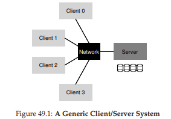
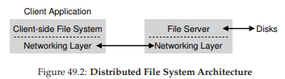
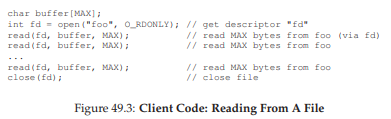
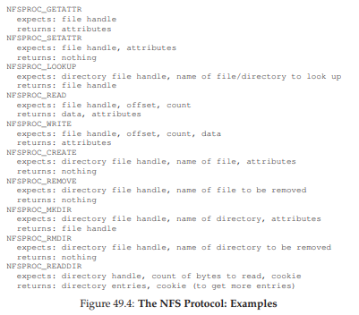
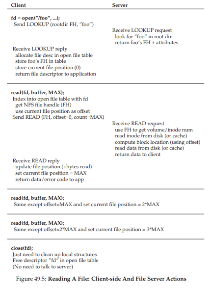
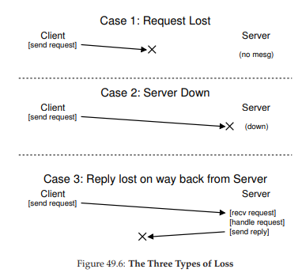
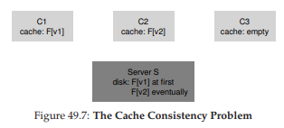

# 49 Sun’s Network File System (NFS)
分散クライアント/サーバーコンピューティングの最初の用途の1つは、分散ファイルシステムの分野でした。このような環境では、多数のクライアントマシンと1つのサーバー(またはいくつか)が存在します。サーバはそのデータをディスクに保存し、クライアントは整形式プロトコルメッセージを通じてデータを要求します。図49.1に基本設定を示します。



画像からわかるように、サーバーにはディスクがあり、クライアントはネットワーク上のメッセージを送信して、それらのディスク上のディレクトリとファイルにアクセスします。なぜこの取り決めに迷惑をかけるのですか？(つまり、クライアントにローカルディスクを使用させるのはどうですか？)主に、この設定により、クライアント間でデータを簡単に共有できます。したがって、あるマシン(クライアント0)のファイルにアクセスしてから別のマシン(クライアント2)を使用すると、ファイルシステムのビューは同じになります。あなたのデータは、これらの異なるマシン間で自然に共有されます。二次的な利点は、集中管理です。たとえば、多数のクライアントからではなく、少数のサーバーマシンからファイルをバックアップすることができます。もう1つの利点はセキュリティです。ロックされたマシンルーム内のすべてのサーバーを使用すると、特定の種類の問題が発生するのを防ぐことができます。

>> CRUX: HOW TO BUILD A DISTRIBUTED FILE SYSTEM  
>> どのように分散ファイルシステムを構築しますか？考えるべき重要な側面は何ですか？何が悪くなるのは簡単ですか？既存のシステムから何を学ぶことができますか？

## 49.1 A Basic Distributed File System
ここでは、単純化された分散ファイルシステムのアーキテクチャについて検討します。シンプルなクライアント/サーバ分散ファイルシステムには、これまで検討してきたファイルシステムよりも多くのコンポーネントがあります。クライアント側には、クライアント側のファイルシステムを通じてファイルとディレクトリにアクセスするクライアントアプリケーションがあります。クライアントアプリケーションは、サーバーに格納されているファイルにアクセスするために、クライアント側ファイルシステムにたいしてシステムコール(`open()`、`read()`、`write()`、`close()`、`mkdir()`など)を発行します。したがって、クライアントアプリケーションにとって、ファイルシステムは、おそらくパフォーマンスを除いて、ローカル(ディスクベース)ファイルシステムと異なるものではないようです。このように、分散ファイルシステムはファイルへの透過的なアクセスを提供します。結局のところ、誰が異なるAPIセットを必要とするファイルシステムを使用したいのか、また、そうでなければ使用する苦痛があったのでしょうか？

クライアントサイドファイルシステムの役割は、これらのシステムコールを処理するために必要なアクションを実行することです。たとえば、クライアントが`read()`要求を発行した場合、クライアント側のファイルシステムは、特定のブロックを読み取るために、サーバー側のファイルシステム(またはファイルサーバーと呼ばれる)にメッセージを送信することがあります。ファイルサーバはディスク(またはそれ自身のインメモリキャッシュ)からブロックを読み込み、要求されたデータのメッセージをクライアントに返します。クライアント側のファイルシステムは、`read()`システムコールに提供されたユーザバッファにデータをコピーします。これで要求は完了します。クライアント上の同じブロックの後続の`read()`は、クライアントメモリまたはクライアントのディスクにもキャッシュされることに注意してください。そのような場合には、ネットワークトラフィックを生成する必要はありません。



この簡単な概要から、クライアント/サーバー分散ファイルシステムには、クライアント側のファイルシステムとファイルサーバーという2つの重要なソフトウェアが存在することがわかります。一緒に動作することによって、分散ファイルシステムの動作が決まります。今では、特定のシステムのSunのNetwork File System(NFS)を検討する必要があります。

>> ASIDE: WHY SERVERS CRASH  
>> NFSv2プロトコルの詳細に入る前に、なぜサーバがクラッシュするのでしょうか？まあ、あなたが推測するかもしれないが、多くの理由があります。サーバは単に停電に悩まされることがあります(一時的に)。電源が復旧した場合にのみ、マシンを再起動することができます。サーバーは、よく数十万行または数百万行のコードで構成されています。したがって、彼らにはバグがあります(良いソフトウェアでも100〜1000行のコードあたりいくつかのバグがあります)ので、最終的にバグが発生し、クラッシュする可能性があります。また、メモリリークもあります。メモリリークがわずかであっても、システムのメモリ不足やクラッシュが発生します。最後に、分散システムでは、クライアントとサーバーの間にネットワークがあります。ネットワークが変な動作している場合(たとえば、パーティション化され、クライアントとサーバーは動作しているが通信できない場合など)、リモートマシンがクラッシュしたように見えるかもしれませんが、実際にはネットワーク経由で到達できないのです。

## 49.2 On To NFS
最も初期で成功した分散システムの1つがSun Microsystemsによって開発され、Sun Network File System(またはNFS)として知られています[S86]。Sunは独自のクローズドシステムを構築する代わりに、クライアントとサーバーが通信するために使用する正確なメッセージフォーマットを指定するオープンプロトコルを開発しました。異なるグループが独自のNFSサーバーを開発し、相互運用性を維持しながらNFS市場で競合する可能性があります。現在、NFSサーバー(Oracle/Sun、NetApp [HLM94]、EMC、IBMなど)を販売する企業が数多くあり、NFSの普及はこの「公開市場」アプローチに起因する可能性が高いです。

## 49.3 Focus: Simple and Fast Server Crash Recovery
この章では、古典的なNFSプロトコル(バージョン2、a.k.a. NFSv2)について説明します。これは長年の標準です。NFSv3への移行では小さな変更が加えられ、NFSv4への移行ではより大きなプロトコル変更が行われました。しかし、NFSv2はすばらしくかつ不満足である、この両方の焦点は役立ちます。

NFSv2では、プロトコルの設計における主な目標は、シンプルで高速なサーバークラッシュリカバリでした。マルチクライアント、単一サーバー環境ではこの目標は大きな意味を持ちます。サーバーがダウンしている(または利用できない)場合、すべてのクライアントマシン(およびそのユーザー)は不幸で非生産的になります。したがって、サーバーが進むにつれて、システム全体も同様になります。

## 49.4 Key To Fast Crash Recovery: Statelessness
この単純な目標は、NFSv2ではstateless protocolと呼ばれるものを設計することによって実現されています。サーバーは、設計上、各クライアントで何が起こっているかについては把握していません。たとえば、どのクライアントがどのブロックをキャッシュしているか、または各クライアントで現在開いているファイル、ファイルの現在のファイルポインタの位置などは、サーバーが認識しません。単純に言えば、サーバーはクライアントが何をやっているかを知らなくてよいのです。むしろ、プロトコルは、要求を完了するために必要なすべての情報を各プロトコル要求で配信するように設計されています。それが今ではない場合、このステートレスなアプローチは、我々がプロトコルを以下でより詳細に議論するにつれてより意味を持っていくでしょう。

ステートフル(ステートレスではない)プロトコルの例については、`open()`システムコールを考慮してください。パス名を指定すると、`open()`はファイルディスクリプタ(整数)を返します。このディスクリプタは、このアプリケーションコードのように、後続の`read()`または`write()`要求でさまざまなファイルブロックにアクセスするために使用されます(システムコールの適切なエラーチェックはスペース上の理由から省略されています)。



クライアント側のファイルシステムが、「ファイル'foo'を開いてディスクリプタを返す」というプロトコルメッセージをサーバーに送信することによってファイルを開くとします。ファイルサーバーはファイルをローカルに開き、ディスクリプタをクライアントに返します。その後の読み込みでは、クライアントアプリケーションはそのディスクリプタを使用して`read()`システムコールを呼び出します。クライアント側のファイルシステムは、ファイル内のディスクリプタをファイルサーバーに渡し、「ディスクリプタによって参照されるファイルからいくつかのバイトを読み取って、ここに渡します」と言っています。

この例では、ファイルディスクリプタはクライアントとサーバーの間の共有状態の一部です(Ousterhoutは分散状態[O91]と呼んでいます)。私たちが上記のように共有状態はクラッシュリカバリを複雑にします。最初の読み取りが完了した後で、クライアントが2番目の読み取りを発行する前に、サーバーがクラッシュしたとします。サーバーが起動して再び実行されると、クライアントは次に2回目の読み取りを発行します。残念ながら、サーバはfdがどのファイルを参照しているのか全く分かりません。その情報は一時的(すなわち、メモリ内)であり、したがってサーバがクラッシュしたときに失われました。この状況に対処するために、クライアントとサーバーは何らかのリカバリープロトコルに従わなければなりません。つまり、クライアントは、サーバーが知る必要のある情報をサーバーに伝えるために十分な情報をメモリに保持しないといけません(この場合そのファイルディスクリプタfdはファイルfooを参照します)。

ステートフルなサーバーがクライアントのクラッシュに対処しなければならないという事実を考えると、さらに悪化します。たとえば、ファイルを開いてクラッシュするクライアントを想像してみてください。`open()`はサーバー上のファイルディスクリプタを使います。サーバーはどのようにしてファイルを閉じることができますか？通常の操作では、クライアントは最終的に`close()`を呼び出して、ファイルを閉じるべきであることをサーバーに通知します。しかし、クライアントがクラッシュすると、サーバは`close()`を受け取ることはありません。そのため、ファイルを閉じるためにクライアントがクラッシュしたことに気づく必要があります。

これらの理由から、NFSの設計者はステートレスなアプローチを追求することに決めました。各クライアント操作には、要求を完了するために必要なすべての情報が含まれています。派手なクラッシュリカバリは不要です。サーバーはただちに再起動し、クライアントは最悪の場合、要求を再試行する必要があります。

## 49.5 The NFSv2 Protocol
したがって、NFSv2プロトコル定義に到達します。私たちの問題は簡単です。

>> THE CRUX: HOW TO DEFINE A STATELESS FILE PROTOCOL  
>> ステートレスな操作を可能にするためにネットワークプロトコルをどのように定義できますか？明らかに、`open()`のようなステートフルな呼び出しは(サーバーが開いているファイルを追跡するために)議論の一部になることはできません。ただし、クライアントアプリケーションは、`open()`、`read()`、`write()`、`close()`などの標準API callを呼び出して、ファイルやディレクトリにアクセスする必要があります。したがって、洗練された質問として、どのようにプロトコルがPOSIXファイルシステムAPIをステートレスにサポートするかを定義することができますか？

NFSプロトコルの設計を理解するための鍵は、ファイルハンドルを理解することです。ファイルハンドルは、特定の操作で操作されるファイルまたはディレクトリを一意に記述するために使用されます。したがって、多くのプロトコル要求にはファイルハンドルが含まれています。

ファイルハンドルには、ボリューム識別子、iノード番号、世代番号という3つの重要な要素があると考えることができます。これらの3つの項目は、クライアントがアクセスしたいファイルまたはディレクトリを一意の識別子で構成します。ボリューム識別子は、要求が参照するファイルシステムをサーバーに通知します(NFSサーバーは複数のファイルシステムをエクスポートできます)。inode番号は、要求がそのパーティション内のどのファイルにアクセスしているかをサーバーに伝えます。最後に、iノード番号を再利用する場合は世代番号が必要です。inode番号が再利用されるたびにインクリメントすることで、古いファイルハンドルを持つクライアントが、新しく割り当てられたファイルに誤ってアクセスすることがないようにします。

ここでは、プロトコルの重要な部分の概要を示します。完全なプロトコルは他の場所でも利用可能です(NFS [C00]の詳細な概要については、Callaghanの本を参照してください)。



ここでは、プロトコルの重要な要素について簡単に説明します。最初に、LOOKUPプロトコルメッセージを使用してファイルハンドルを取得し、その後ファイルデータにアクセスするために使用します。クライアントは、ディレクトリファイルのハンドルと検索するファイルの名前を渡し、そのファイル(またはディレクトリ)のハンドルに加えて、その属性もサーバーからクライアントに返されます。

たとえば、クライアントがファイルシステム(/)のルートディレクトリのディレクトリファイルハンドルをすでに持っているとします(実際には、NFSマウントプロトコルで取得されますが、これはクライアントとサーバーが最初に接続された方法です。簡潔さのためにマウントプロトコルをここで議論しません)。クライアント側で実行中のアプリケーションが/foo.txtファイルを開くと、クライアント側のファイルシステムはルックアップ要求をサーバーに送信し、ルートファイルハンドルと名前foo.txtを渡します。成功すると、foo.txtのファイルハンドル(および属性)が返されます。

不思議に思われる場合は、属性は、ファイル作成時間、最終変更時刻、サイズ、所有権とアクセス許可情報などのフィールドといったファイルシステムが各ファイルについて追跡するメタデータだけです。つまり同じタイプの情報を含む、ファイルに対して`stat()`を呼び出すと元に戻ります。

ファイルハンドルが利用可能になると、クライアントはファイルに対してREADおよびWRITEプロトコルメッセージを発行してファイルを読み書きすることができます。READプロトコルメッセージは、プロトコルが、ファイル内のオフセットと、読み込むバイト数をファイルのファイルハンドルに沿って渡すことを要求します。次に、サーバーは読み取りを発行することができます(結局のところ、ハンドルはサーバーにどのボリュームとどのiノードから読み取るべきかを通知し、オフセットとカウントは読み取るファイルのバイトを指示します)。クライアントにデータを返します(または障害が発生した場合はエラー)。WRITEは、データがクライアントからサーバーに渡され、成功コードのみが返される点を除いて、同様に処理されます。

最後の1つの興味深いプロトコルメッセージは、GETATTR要求です。ファイルハンドルがあれば、ファイルの最後の変更時刻を含めて、そのファイルの属性を取り出せます。私たちがキャッシュを議論するときに、なぜこのプロトコル要求がNFSv2で重要であるのかを見ていきます(なぜそうなっているか推測できますか？)。

## 49.6 From Protocol to Distributed File System
うまくいけば、このプロトコルがクライアント側のファイルシステムとファイルサーバを介してファイルシステムにどのように変換されているのかが分かるはずです。クライアント側のファイルシステムは開いているファイルを追跡し、一般にアプリケーション要求を関連する一連のプロトコルメッセージに変換します。サーバーは単にプロトコルメッセージに応答します。プロトコルメッセージには、要求を完了するために必要なすべての情報が含まれています。

たとえば、ファイルを読み取る単純なアプリケーションを考えてみましょう。図(図49.5)では、アプリケーションがどのようなシステムコールを行うか、そしてクライアント側のファイルシステムとファイルサーバがそのような呼び出しに応答する際の動作を示します。

図においてのいくつかのコメントがあります。まず、NFSファイルハンドルへの整数ファイルディスクリプタである、現在のファイルポインタのマッピングなど、クライアントがファイルアクセスのすべての関連状態をどのように追跡しているかに注目してください。これにより、クライアントは、各読み取り要求(もしかしたら、あなたは明示的に読み取るオフセットを指定していないことに気づいたかもしれません)を、正しくフォーマットされた読み取りプロトコルメッセージに変換して、ファイルから読み取るバイトを正確にサーバーに通知します。読み込みが成功すると、クライアントは現在のファイルの位置を更新します。後続の読み取りは同じファイルハンドルで発行されますが、異なるオフセットが発行されます。

次に、サーバーとのやりとりがどこに発生しているかがわかります。最初にファイルを開くと、クライアント側のファイルシステムはLOOKUP要求メッセージを送信します。実際には長いパス名を渡す必要がある場合(例：/home/remzi/foo.txt)、クライアントは3つのルックアップを送信します。1つはディレクトリ/のホームをルックアップし、もう1つはremziのホームをルックアップし、最後にremziのfoo.txtをルックアップします。

第3に、各サーバー要求が、要求全体を完了するために必要なすべての情報をどのように持っているかに気付くことがあります。この設計ポイントは、サーバーの障害から正常に回復できるようにするために重要です。ここで詳しく議論していきます。サーバーは要求に応答できる状態を必要としないことを保証します。



>> TIP: IDEMPOTENCY IS POWERFUL  
>> Idempotency(冪等:ある操作を1回行っても複数回行っても結果が同じであること)は、信頼性の高いシステムを構築する際に役立ちます。操作を複数回発行できる場合、操作の失敗を処理する方がはるかに簡単です。あなたはそれを再試行することができます。操作が冪等でない場合、人生はより困難になります。

## 49.7 Handling Server Failure with Idempotent Operations
クライアントがサーバーにメッセージを送信すると、応答を受信しないことがあります。この失敗に対するさまざまな理由が考えられます。場合によっては、ネットワークによってメッセージが破棄されることがあります。ネットワークはメッセージを失うので、要求または応答のいずれかが失われる可能性があり、したがってクライアントは決して応答を受信しません。

また、サーバーがクラッシュしたため、現在メッセージに応答していない可能性もあります。少し後に、サーバーは再起動され、再度実行を開始しますが、その間にすべての要求が失われます。これらのすべてのケースでは、クライアントに質問が残されます。サーバーがタイムリーに返信しないときにはどうすればよいでしょうか？

NFSv2では、クライアントはこれらのすべての障害を、一様かつ均一な方法で処理します。単純に要求を再試行します。具体的には、要求を送信した後、クライアントは、指定された時間が経過した後にタイマーをオフにするように設定します。タイマーがオフになる前に応答が受信されると、タイマーはキャンセルされ、すべて正常となります。ただし、応答が受信される前にタイマーが切れた場合、クライアントは要求が処理されていないとみなして再送信します。サーバーが応答すると、すべて正常であり、クライアントは問題をきちんと処理しています。

クライアントの要求を単純に再試行する能力(障害の原因にかかわらず)は、ほとんどのNFS要求の重要な特性によるものです。それらは冪等です。操作を複数回実行した結果が操作を1回実行した結果と同等である場合、操作は冪等と呼ばれます。たとえば、値をメモリ位置に3回格納する場合は、1回と同じです。したがって、「値をメモリに格納する」は、等価な演算です。ただし、カウンターを3回インクリメントした場合は、カウンターを1回だけ増やすのとは異なる量になります。従って、「インクリメントカウンタ」は冪等ではありません。より一般的には、データを読み取るだけの操作は明らかに冪等です。データを更新する操作は、このプロパティがあるかどうかを判断するために、より慎重に検討する必要があります。

NFSにおけるクラッシュリカバリの設計の中心は、最も一般的な操作のidempotencyです。LOOKUPとREADの要求は、ファイルサーバからの情報の読み取りのみを行い、更新はしないため、冪等があります。さらに興味深いことに、WRITEリクエストも冪等でもあります。たとえば、WRITEが失敗した場合、クライアントは単純にWRITEを再試行できます。WRITEメッセージには、データ、カウント、およびデータを書き込む正確なオフセットが含まれています。したがって、複数の書き込みの結果が単一の結果の結果と同じであるという知識をもって繰り返すことができます。



このようにして、クライアントは統一された方法ですべてのタイムアウトを処理できます。WRITE要求が単純に失われた場合(上記のケース1)、クライアントは再試行し、サーバは書き込みを実行し、すべて正常です。リクエストが送信されている間にサーバーがダウンした場合でも、2番目のリクエストが送信されたときにバックアップと実行が行われ、すべてが正常に動作します(ケース2)。最後に、サーバは実際にWRITE要求を受信し、そのディスクへの書き込みを発行し、応答を送信します。この返信が失われる可能性があり(ケース3)、再びクライアントがリクエストを再送信します。サーバーが要求を再度受け取ると、まったく同じことを単に実行します。データをディスクに書き込んで、それが完了したことを応答します。今度はクライアントが応答を受け取ると、すべて正常にクライアントはメッセージ損失とサーバー障害の両方を一様に処理します。

いくつかの操作は冪等にするのが難しいです。たとえば、すでに存在するディレクトリを作成しようとすると、mkdir要求が失敗したことが通知されます。したがって、NFSでは、ファイルサーバがMKDIRプロトコルメッセージを受信してそれを正常に実行しますが、応答が失われた場合、クライアントはそれを繰り返して、実際に操作が最初に成功した後に再試行で失敗したときに、その障害に遭遇します。したがって、人生は完璧ではありません。

>> TIP: PERFECT IS THE ENEMY OF THE GOOD (VOLTAIRE’S LAW)  
>> あなたが美しいシステムを設計するときでさえ、すべてのコーナーケースがあなたが思うように正確に動作しないことがあります。上記のmkdirの例を参照してください。異なるセマンティクスを持つようにmkdirを再設計することができます。それによって、それは冪等になります(あなたがそうする方法を考えてください)。しかし、なぜ煩わしいのでしょうか？NFS設計の哲学は重要なケースの大部分をカバーしており、全体的にシステム設計は障害に関してきれいで簡単です。言い換えると、システムは完璧ではなく、まだシステムを構築していくことは良いエンジニアリングです。明らかに、この知恵はヴォルテールによって言及されています。「賢明なイタリア人は、最高は良の敵であると言っている」そのため、これをヴォルテールの法則と呼んでいます。

## 49.8 Improving Performance: Client-side Caching
分散ファイルシステムはさまざまな理由から有効ですが、ネットワーク全体ですべての読み取りおよび書き込み要求を送信すると、パフォーマンスに大きな問題が発生する可能性があります。ネットワークは通常、ローカルメモリやディスクと比べて高速ではありません。したがって、別の問題があります。分散ファイルシステムのパフォーマンスをどのように改善できますか？

上のサブタイトルの大胆な言葉を読んで、あなたが推測するかもしれない答えは、クライアント側のキャッシュです。NFSクライアント側のファイルシステムは、サーバーから読み取ったファイルデータ(およびメタデータ)をクライアントメモリにキャッシュします。したがって、第1のアクセスが高価である(すなわち、ネットワーク通信を必要とする)間に、その後のアクセスはクライアントメモリから非常に迅速にサービスされます。

キャッシュは、書き込み用の一時バッファとしても機能します。クライアントアプリケーションが最初にファイルに書き込むとき、クライアントはデータをサーバーに書き出す前に、データをクライアントメモリ(ファイルサーバーから読み取ったデータと同じキャッシュ内)にバッファリングします。このような書き込みバッファリングは、実際の書き込みパフォーマンスとアプリケーション`write()`の待ち時間を切り離すために便利です。つまり、`write()`へのアプリケーションの呼び出しはただちに成功します(クライアント側ファイルシステムのキャッシュにデータを入れます)。あとでデータはファイルサーバーに書き出されます。

したがって、NFSクライアントはデータをキャッシュし、パフォーマンスは通常優れており、完了しました。本当にそうでしょうか？残念ながら、それほどではありません。複数のクライアントキャッシュを持つあらゆる種類のシステムにキャッシュを追加することは、キャッシュの一貫性の問題と呼ばれる大きく興味深い課題を引き起こします。

## 49.9 The Cache Consistency Problem
キャッシュ一貫性の問題は、2つのクライアントと1つのサーバーで最もよく説明されています。クライアントC1がファイルFを読み取り、そのファイルのコピーをローカルキャッシュに保持すると仮定します。次に、別のクライアントC2がファイルFを上書きし、その内容を変更するとします。新しいバージョンのファイルF(バージョン2)、またはF[v2]と古いバージョンF[v1]を呼び出すことで、2つの異なるファイル名を保持することができます。(ただし、ファイル名は同じですが、内容が異なるだけです)最後に、ファイルFにまだアクセスしていない第3のクライアントC3が存在します。



あなたはおそらく、今後の問題を見ることができます(図49.7)。実際、2つの副問題があります。第1の副問題は、クライアントC2がそれらの書き込みをそのキャッシュに一時的にバッファリングしてから、それらをサーバに送ることができることです。この場合、F[v2]はC2のメモリに格納されていますが、別のクライアント(たとえばC3)からFにアクセスすると、古いバージョンのファイル(F[v1])が取り出されます。したがって、クライアントでの書き込みをバッファリングすることによって、他のクライアントがファイルの古いバージョンを取得する可能性があります。マシンC2にログインし、Fを更新してからC3にログインしてファイルを読み込もうとすると、古いコピーを取得する場合を想像してください。確かに、これはイライラする可能性があります。したがって、キャッシュ一貫性問題のupdate visibility(更新の可視性)と呼ばれている側面を見てみましょう。あるクライアントからの更新が他のクライアントでいつ見えるようになるのですか？

キャッシュ一貫性の第2の副問題は失効したキャッシュです。この場合、C2は最終的にファイルサーバーへの書き込みをフラッシュし、したがってサーバーは最新バージョン(F[v2])を持ちます。しかし、C1はキャッシュ内にF[v1]を保持しています。C1上で実行されているプログラムがファイルFを読み込んだ場合、それは古いバージョン(F[v1])であり、最新のコピー(F[v2])ではなく(よく)望ましくありません。

NFSv2実装は、これらのキャッシュ一貫性の問題を2つの方法で解決します。第1に、更新の可視性に対処するために、クライアントはflush on close(close to open)consistency semantics(整合性セマンティクス)と呼ばれることを実装します。具体的には、ファイルがクライアントアプリケーションに書き込まれ、続いてクライアントアプリケーションによって閉じられると、クライアントはすべての更新(つまり、キャッシュ内のダーティページ)をサーバーにフラッシュします。flush on closeの一貫性により、NFSは、別のノードからの次のオープンに最新のファイル・バージョンが確実に表示されるようにします。

次に、古いキャッシュの問題に対処するために、NFSv2クライアントはまず、キャッシュされたコンテンツを使用する前にファイルが変更されているかどうかを確認します。具体的には、ファイルを開くときに、クライアント側のファイルシステムは、ファイルの属性を取得するためにGETATTR要求をサーバーに発行します。重要なことに、属性には、ファイルがサーバー上で最後に変更された時期に関する情報が含まれています。変更時刻がクライアントキャッシュにフェッチされた時刻よりも新しい場合、クライアントはファイルを無効にしてクライアントキャッシュから削除し、その後の読み込みがサーバーに送られ、最新バージョンのファイルを取得するようにします。一方、クライアントがファイルの最新バージョンを持っていると判断すると、キャッシュされたコンテンツが使用され、パフォーマンスが向上します。

Sunのオリジナルチームがこの解決策を古いキャッシュの問題に実装したとき、彼らは新しい問題を認識しました。突然、NFSサーバーにGETATTR要求があふれていました。従うべき良いエンジニアリングの原則は、一般的なケースを設計し、それをうまく機能させることです。ここでは、ファイルが単一のクライアント(おそらくは繰り返し)からのみアクセスされたのが一般的でしたが、クライアントは常に他の誰もファイルを変更していないことを確認するためにGETATTR要求をサーバーに送信しなければなりませんでした。このように、ほとんどの場合、誰もが「誰かこのファイルを変更した？」と尋ね、常時確認し、クライアントはサーバを攻撃してしまいます。

このような状況(多少)を改善するために、属性キャッシュが各クライアントに追加されました。クライアントはそれにアクセスする前にファイルを検証しますが、たいていの場合、属性キャッシュを調べて属性を取得するだけです。特定のファイルの属性は、ファイルが最初にアクセスされたときにキャッシュに格納され、一定の時間(たとえば3秒)後にタイムアウトになります。したがって、これらの3秒間に、すべてのファイルアクセスは、キャッシュされたファイルを使用することがOKであると判断し、サーバーとのネットワーク通信を行わずに実行します。

## 49.10 Assessing NFS Cache Consistency
NFSキャッシュの一貫性についての最後の言葉。flush on closeの振る舞いが「意味をなす」ために追加されましたが、特定のパフォーマンス問題が発生しました。具体的には、一時ファイルまたは短命ファイルがクライアントで作成され、すぐに削除された場合でも、サーバーに強制されます。より理想的な実装では、このような短命ファイルは削除されるまでメモリ内に保持されるため、サーバーのやりとりが完全になくなり、パフォーマンスが向上する可能性があります。

さらに重要なのは、NFSに属性キャッシュを追加すると、ファイルのどのバージョンが取得されているかを正確に理解することが難しくなりました。時々あなたは最新バージョンを手に入れます。属性キャッシュがまだタイムアウトしていない場合、クライアントがクライアントメモリにあったものをあなたに提供するため、古いバージョンを取得することがあります。ほとんどの場合、これは大丈夫でしたが、時には変な行動につながることもあります。

そこで、NFSクライアントのキャッシュというおかしな点について説明しました。これは、実装の詳細が、ユーザの観測可能なセマンティクスを定義する役目をする興味深い例です。

## 49.11 Implications on Server-Side Write Buffering
これまでのところ、クライアントのキャッシュに焦点が当てられていました。それは興味深い問題のほとんどが発生する場所です。しかし、NFSサーバーはメモリが大量に消費されるマシンであることが多いため、キャッシュに関する懸念もあります。データ(およびメタデータ)がディスクから読み込まれると、NFSサーバーはそのデータをメモリに保持し、その後のデータ(およびメタデータ)の読み取りはディスクには行きません。これにパフォーマンスが(少し)向上します。

より興味深いのは、書き込みバッファリングの場合です。NFSサーバは、書込みが安定した記憶装置(例えば、ディスクまたは他の永続的デバイス)に強制されるまで、WRITEプロトコル要求で成功を返すことは絶対にありえません。サーバーのメモリにデータのコピーを置くことができますが、WRITEプロトコル要求でクライアントに成功を返すと、正しく動作しなくなる可能性があります。なぜかあなたは理解できますか？

答えは、クライアントがサーバーの障害をどのように処理するかについての前提にあります。クライアントが発行した次の書き込み順序を想像してみてください。
```c
write(fd, a_buffer, size); // fill first block with a’s
write(fd, b_buffer, size); // fill second block with b’s
write(fd, c_buffer, size); // fill third block with c’s
```
これらの書き込みは、ファイルの3つのブロックをa、b、cのブロックで上書きします。したがって、ファイルは最初に次のように見えます。
```
xxxxxxxxxxxxxxxxxxxxxxxxxxxxxxxxxxxxxxxxxxxxxxxxxxxxxxxxxxxx
yyyyyyyyyyyyyyyyyyyyyyyyyyyyyyyyyyyyyyyyyyyyyyyyyyyyyyyyyyyy
zzzzzzzzzzzzzzzzzzzzzzzzzzzzzzzzzzzzzzzzzzzzzzzzzzzzzzzzzzzz
```
これらの書き込み後の最終的な結果は、x、y、zがそれぞれa、b、cで上書きされることを期待するかもしれません。
```
aaaaaaaaaaaaaaaaaaaaaaaaaaaaaaaaaaaaaaaaaaaaaaaaaaaaaaaaaaaa
bbbbbbbbbbbbbbbbbbbbbbbbbbbbbbbbbbbbbbbbbbbbbbbbbbbbbbbbbbbb
cccccccccccccccccccccccccccccccccccccccccccccccccccccccccccc
```
ここでは、この3つのクライアントの書き込みが、3つの異なるWRITEプロトコル・メッセージとしてサーバーに発行されたと想定します。第1のWRITEメッセージがサーバによって受信され、ディスクに発行され、クライアントがその成功を通知したと仮定します。ここで、2番目の書き込みがメモリにバッファリングされていると仮定し、サーバーはクライアントに成功を報告してから、強制的にディスクに書き込みます。残念ながら、サーバーはディスクに書き込む前にクラッシュします。サーバーはすぐに再起動し、3回目の書き込み要求を受信します。これも成功します。したがって、クライアントに対してはすべての要求は成功しましたが、ファイルの内容が次のようになっていることに驚いています。
```
aaaaaaaaaaaaaaaaaaaaaaaaaaaaaaaaaaaaaaaaaaaaaaaaaaaaaaaaaaaa
yyyyyyyyyyyyyyyyyyyyyyyyyyyyyyyyyyyyyyyyyyyyyyyyyyyyyyyyyyyy <--- oops
cccccccccccccccccccccccccccccccccccccccccccccccccccccccccccc
```
Yikes！サーバーは、2番目の書き込みがディスクにコミットする前に成功したことをクライアントに通知したため、古いチャンクがファイルに残されます。これは、アプリケーションによっては致命的なものです。この問題を回避するには、クライアントに成功を通知する前に、NFSサーバーが各書き込みを安定した(永続的な)ストレージにコミットする必要があります。これにより、クライアントは書き込み中にサーバー障害を検出し、最終的に成功するまで再試行できます。そうすることで、上の例のようにファイルの内容が混ざってしまうことはありません。

この要件がNFSサーバーの実装で発生する問題は、書き込みパフォーマンスに対して大きな注意を払っていないため、パフォーマンスの大きなボトルネックになる可能性があることです。事実、書き込みを迅速に実行できるNFSサーバを構築するという単純な目的で、一部の企業(Network Applianceなど)が生まれました。彼らが使用するトリックの1つは、最初にbattery backed memoryに書き込みを入れることで、データを失うことがなく、すぐにディスクに書き込む必要もなく、書き込み要求にすばやく応答することができます。2番目のトリックは、最終的にそうする必要があるときにディスクにすばやく書き込むように設計されたファイルシステム設計を使用することです[HLM94、RO91]。

## 49.12 Summary
私たちは、NFS分散ファイルシステムの導入を見てきました。NFSは、サーバの障害に直面している単純かつ高速なリカバリのアイデアを中心にしており、慎重なプロトコル設計によってこの目的を達成しています。操作の強制力は不可欠です。クライアントが失敗した操作を安全に再生できるので、サーバーが要求を実行したかどうかにかかわらず、そうすることは大丈夫です。

また、マルチクライアント、シングルサーバシステムへのキャッシングの導入が複雑になる可能性もあります。特に、システムは、合理的に動作するためにキャッシュ一貫性の問題を解決する必要があります。しかし、NFSはやや特殊なやり方でこれを実行しますが、これは時折、観察可能な変な動作を引き起こすことがあります。最後に、サーバーのキャッシュをどのように扱うのが難しいのかを見てみましょう。成功を返す前に、サーバーへの書き込みを安定したストレージに強制する必要があります(それ以外の場合はデータが失われる可能性があります)。

私たちは確かに関連性の高い他の問題、特にセキュリティについては話していません。初期のNFS実装におけるセキュリティは非常に緩慢でした。クライアント上の任意のユーザーが他のユーザーとして偽装して、実質的にすべてのファイルにアクセスすることはかなり容易でした。より重大な認証サービス(例えば、Kerberos [NT94])とのその後の統合は、これらの明白な欠点に対処してきました。

## 参考文献
[C00] “NFS Illustrated”  
Brent Callaghan  
Addison-Wesley Professional Computing Series, 2000  
A great NFS reference; incredibly thorough and detailed per the protocol itself.

[HLM94] “File System Design for an NFS File Server Appliance”  
Dave Hitz, James Lau, Michael Malcolm  
USENIX Winter 1994. San Francisco, California, 1994  
Hitz et al. were greatly influenced by previous work on log-structured file systems.

[NT94] “Kerberos: An Authentication Service for Computer Networks”  
B. Clifford Neuman, Theodore Ts’o  
IEEE Communications, 32(9):33-38, September 1994  
Kerberos is an early and hugely influential authentication service. We probably should write a book chapter about it sometime...

[O91] “The Role of Distributed State”  
John K. Ousterhout  
Available: ftp://ftp.cs.berkeley.edu/ucb/sprite/papers/state.ps  
A rarely referenced discussion of distributed state; a broader perspective on the problems and challenges.

[P+94] “NFS Version 3: Design and Implementation”  
Brian Pawlowski, Chet Juszczak, Peter Staubach, Carl Smith, Diane Lebel, Dave Hitz  
USENIX Summer 1994, pages 137-152  
The small modifications that underlie NFS version 3.

[P+00] “The NFS version 4 protocol”  
Brian Pawlowski, David Noveck, David Robinson, Robert Thurlow  
2nd International System Administration and Networking Conference (SANE 2000)  
Undoubtedly the most literary paper on NFS ever written.

[RO91] “The Design and Implementation of the Log-structured File System”  
Mendel Rosenblum, John Ousterhout  
Symposium on Operating Systems Principles (SOSP), 1991  
LFS again. No, you can never get enough LFS.

[S86] “The Sun Network File System: Design, Implementation and Experience”  
Russel Sandberg  
USENIX Summer 1986  
The original NFS paper; though a bit of a challenging read, it is worthwhile to see the source of these wonderful ideas.

[Sun89] “NFS: Network File System Protocol Specification”  
Sun Microsystems, Inc. Request for Comments: 1094, March 1989  
Available: http://www.ietf.org/rfc/rfc1094.txt  
The dreaded specification; read it if you must, i.e., you are getting paid to read it. Hopefully, paid a lot. Cash money!

[V72] “La Begueule”  
Francois-Marie Arouet a.k.a. Voltaire  
Published in 1772  
Voltaire said a number of clever things, this being but one example. For example, Voltaire also said “If you have two religions in your land, the two will cut each others throats; but if you have thirty religions, they will dwell in peace.” What do you say to that, Democrats and Republicans?

[prev](../48/48.md)|[next](../50/50.md)