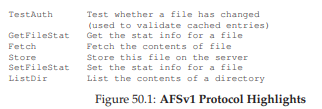
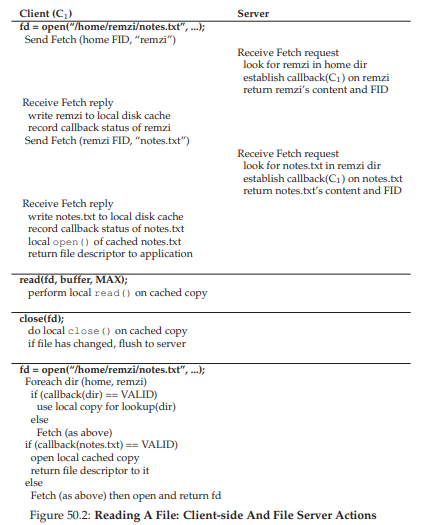
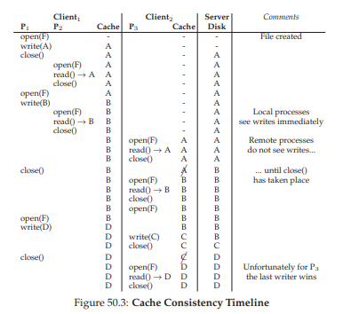
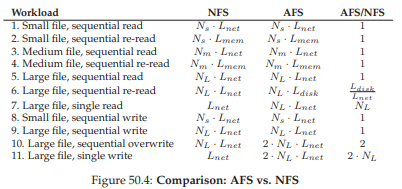

# 50 The Andrew File System (AFS)
Andrew File Systemは、カーネギーメロン大学（CMU）で1980年代に導入されました[H + 88]。カーネギーメロン大学のSatyanarayanan教授（略して「Satya」）が率いるこのプロジェクトの主な目標は簡単でした。それはスケールです。具体的には、サーバーができるだけ多くのクライアントをサポートできるように、分散ファイルシステムをどのように設計できますか？

興味深いことに、スケーラビリティに影響を与える設計と実装には、さまざまな側面があります。最も重要なのは、クライアントとサーバーの間のプロトコルの設計です。たとえば、NFSでは、プロトコルによって、クライアントは定期的にサーバーをチェックして、キャッシュされた内容が変更されたかどうかを判断します。各チェックではサーバーリソース（CPUおよびネットワーク帯域幅を含む）が使用されるため、このようなチェックを頻繁に行うと、サーバーが応答できるクライアントの数が制限され、スケーラビリティが制限されます。

AFSはまた、当初から合理的な目に見える動作がファーストクラスの関心事であった点でNFSとは異なります。NFSでは、クライアント側のキャッシュタイムアウト間隔を含む低レベルの実装の詳細に直接依存するため、キャッシュの一貫性は記述しにくいです。AFSでは、キャッシュの一貫性は簡単で分かりやすく、ファイルがオープンされると、クライアントは通常、サーバーから最新の一貫性のあるコピーを受け取ります。

## 50.1 AFS Version 1
AFS [H + 88、S + 85]の2つのバージョンについて説明します。最初のバージョン（AFSv1と呼ばれますが、実際は元のシステムはITC分散ファイルシステム[S + 85]と呼ばれていました）では、基本的な設計の一部が行われていましたが、スケールの設計はされていません。それを含めて再設計された最終的なプロトコルがあります（AFSv2、または単にAFSと呼ぶ）[H + 88]。ここで最初のバージョンについて説明します。

AFSのすべてのバージョンの基本的な考え方の1つは、ファイルにアクセスしているクライアント・マシンのローカル・ディスク上のファイル全体のキャッシュです。ファイルをopen（）するとき、ファイル全体（存在する場合）がサーバーからフェッチされ、ローカルディスク上のファイルに保存されます。後続のアプリケーションのread（）およびwrite（）操作は、ファイルが格納されているローカルファイルシステムにリダイレクトされます。したがって、これらの操作はネットワーク通信を必要とせず、高速です。最後に、close（）のときに、ファイル（変更されている場合）がサーバーにフラッシュされます。NFSはブロックをキャッシュします（ファイル全体ではなく、NFSはファイル全体のすべてのブロックをキャッシュすることはもちろんですが）が、クライアントメモリ（ローカルディスクではありません）にキャッシュするキャッシュとは明らかに対照的です。

もう少し詳しく説明しましょう。クライアント・アプリケーションが最初にopen（）を呼び出すと、（AFS設計者がVenusと呼ぶ）AFSクライアント側コードは、フェッチプロトコル・メッセージをサーバーに送信します。フェッチプロトコルメッセージは、ファイルサーバ（Viceと呼ばれるグループ）に目的のファイル（たとえば、/home/remzi/notes.txt）のパス名全体を渡します。その後、パス名をたどって目的のファイルを探し、ファイル全体をクライアントに戻します。クライアントサイドのコードは、クライアントのローカルディスクにファイルを（ローカルディスクに書き込むことによって）キャッシュします。上記のように、後続のread（）およびwrite（）システム・コールはAFSでは厳密にローカルです（サーバとの通信は発生しません）。それらは単にファイルのローカルコピーにリダイレクトされます。read（）とwrite（）の呼び出しはローカルファイルシステムへの呼び出しと同じように動作するため、ブロックにアクセスするとクライアントのメモリにもキャッシュされます。したがって、AFSはクライアント・メモリーも使用して、ローカル・ディスクにあるブロックのコピーをキャッシュします。最後に、終了すると、AFSクライアントは、ファイルが変更された（すなわち、書き込みのために開かれた）か否かをチェックします。もしそうであったら、新しいバージョンをStoreプロトコルメッセージでサーバーにフラッシュし、ファイルとパス名の全体を永続的な保存のためにサーバーに送信します。

次回にファイルにアクセスするとき、AFSv1はずっと効率的です。具体的には、クライアント側コードは、ファイルが変更されたかどうかを判断するために、最初に（TestAuthプロトコルメッセージを使用して）サーバーに接続します。そうでない場合、クライアントはローカルにキャッシュされたコピーを使用し、ネットワーク転送を回避してパフォーマンスを向上させます。上記の図は、AFSv1のプロトコル・メッセージの一部を示しています。この初期のバージョンのプロトコルでは、ファイルの内容のみがキャッシュされていました。たとえば、ディレクトリはサーバーに保存されていました。

>> TIP: MEASURE THEN BUILD (PATTERSON’S LAW)  
>> 私たちのアドバイザーであるDavid Patterson（RISCとRAIDの名声）は、この問題を解決する新しいシステムを構築する前に、常にシステムの測定と問題の実証を促していました。本能ではなく実験的証拠を用いることで、システム構築のプロセスをより科学的な取り組みに変えることができます。そうすることで、改善されたバージョンが開発される前に、システムをどの程度正確に測定するかを考えさせるという利点があります。最終的に新しいシステムを構築するときには、結果的に2つの点が優れています。まず、実際の問題を解決しているという証拠があります。次に、新しいシステムを適切な場所で測定し、実際に最新の状態を改善する方法を示しました。それで、私たちはこれをパターソンの法則と呼んでいます。

## 50.2 Problems with Version 1
この最初のバージョンのAFSのいくつかの重要な問題は、設計者がファイルシステムを再考する動機となりました。問題を詳細に調べるために、AFSの設計者は、何が間違っていたのかを見つけるために、既存のプロトタイプを測定するのに多大な時間を費やしました。このような実験は良いことです。なぜなら、測定はシステムの仕組みとその改善方法を理解する鍵です。具体的なデータを得ることは、システム構築の必要な部分です。彼らの研究では、AFSv1の主な2つの問題点を発見しました。

- パストラバーサルコストが高すぎます：  
フェッチまたはストアプロトコル要求を実行するとき、クライアントはパス名全体（たとえば、/home/remzi/notes.txt）をサーバーに渡します。サーバは、ファイルにアクセスするためには、完全なパス名トラバーサルを実行しなければなりません。最初にルートディレクトリでhomeを探し、次にhomeでremziを探します。そして最終的に目的のファイルが位置しているところまで下がっていきます。一度に多くのクライアントがサーバーにアクセスすると、AFSの設計者は、サーバーがディレクトリー・パスを辿るだけのCPU時間の大部分を費やしていることに気付きました。

- クライアントが多すぎるTestAuthプロトコルメッセージを発行します。  
NFSやGETATTRプロトコル・メッセージの過多のように、AFSv1はローカル・ファイル（またはその統計情報）がTestAuthプロトコル・メッセージで有効かどうかを確認するために大量のトラフィックを生成しました。したがって、サーバーは、キャッシュされたファイルのコピーを使用することがOKであったかどうかをクライアントに伝えるのに多くの時間を費やしました。ほとんどの場合、答えはファイルが変更されていないということでした。

実際には、AFSv1には2つの問題がありました。サーバー間で負荷が分散されていないため、サーバーはクライアントごとに異なるプロセスを使用し、コンテキスト切り替えやその他のオーバーヘッドを引き起こしました。負荷の不均衡の問題は、負荷を分散するために管理者がサーバー間を移動できるボリュームを導入することで解決されました。プロセスの代わりにスレッドを使用してサーバーを構築することにより、コンテキスト・スイッチの問題がAFSv2で解決されました。しかし、文書のスペースのために、ここでは、システムの規模を制限する上記の2つの主要なプロトコル問題に焦点を当てています。

## 50.3 Improving the Protocol
上記の2つの問題は、AFSのスケーラビリティを制限しました。サーバCPUがシステムのボトルネックになり、各サーバは過負荷にならないために20クライアントにしかサービスできませんでした。サーバーがTestAuthメッセージを受信しすぎていて、フェッチまたはストアメッセージを受信したときに、ディレクトリ階層を走査するのに時間がかかり過ぎていました。したがって、AFS設計者は問題に直面していました。

>> THE CRUX: HOW TO DESIGN A SCALABLE FILE PROTOCOL  
>> どのようにしてサーバ相互作用の数を最小限にするためにプロトコルを再設計するべきですか？つまり、TestAuthメッセージの数をどのように減らすことができますか？さらに、これらのサーバーのやりとりを効率的にするためにプロトコルをどのように設計することができますか？これらの問題の両方を攻撃することにより、新しいプロトコルはAFSというよりスケーラブルなバージョンになります。

## 50.4 AFS Version 2
AFSv2では、クライアント/サーバーの対話数を減らすためのコールバックという概念が導入されました。コールバックとは、サーバーからクライアントへの約束であり、クライアントがキャッシュしているファイルが変更されたときにサーバーがクライアントに通知することを意味します。この状態をシステムに追加することで、クライアントはサーバーに接続しなくても、キャッシュされたファイルがまだ有効かどうかを調べる必要がなくなります。むしろ、サーバーはそれがそうでないと指示するまでファイルが有効であるとみなします。ポーリングと割り込みの類推に注意してください。

AFSv2では、クライアントが関心を持っているファイルを指定するために、パス名ではなくfile identifier（FID）（NFSファイルハンドルに似ています）という概念も導入されました。AFSのFIDは、ボリューム識別子、ファイル識別子、uniquifier（ファイルが削除されたときにボリュームとファイルIDの再利用を可能にするため）があります。したがって、サーバーにパス名全体を送信し、サーバーがパス名を調べて目的のファイルを見つけるのではなく、クライアントはパス名を一度に1つずつ歩き、結果をキャッシングしてサーバーの負荷を軽減します。

たとえば、クライアントが/home/remzi/notes.txtファイルにアクセスし、homeが/にマウントされたAFSディレクトリー（つまり、/がローカル・ルート・ディレクトリーであったが、ホームとその子がAFSにある）であった場合、クライアントは最初にhomeのディレクトリ内容を取得し、それらをローカルディスクにキャッシュし、ホームにコールバックを設定します。次に、クライアントはディレクトリremziをフェッチし、ローカルディスクにキャッシュし、remziでコールバックを設定します。最後に、クライアントはnotes.txtを取得し、この通常のファイルをローカルディスクにキャッシュし、コールバックを設定し、最後ファイルディスクリプタを呼び出しアプリケーションに返します。要約については、図50.2を参照してください。

しかし、NFSとの主な違いは、ディレクトリまたはファイルの各フェッチでAFSクライアントがサーバーとコールバックを確立し、サーバーがキャッシュ状態の変更をクライアントに通知することを保証することです。利点は明白です。/home/remzi/notes.txtへの最初のアクセスは（上記のように）多数のクライアント/サーバ・メッセージを生成しますが、ファイルnotes.txtと同様にすべてのディレクトリのコールバックを確立します。アクセスは全てローカルであり、サーバーとのやり取りはまったく必要ありません。したがって、クライアントでファイルがキャッシュされる一般的なケースでは、AFSはローカルディスクベースのファイルシステムとほぼ同じように動作します。1つのファイルに複数回アクセスすると、2回目のアクセスはファイルにローカルでアクセスするのと同じくらい速くなければなりません。

>> ASIDE: CACHE CONSISTENCY IS NOT A PANACEA  
>> 分散ファイルシステムについて論じるときには、ファイルシステムが提供するキャッシュの一貫性が非常に重要です。しかし、このベースラインの一貫性は、複数のクライアントからのファイルアクセスに関するすべての問題を解決するものではありません。たとえば、複数のクライアントがチェックインとコードのチェックアウトを実行するコードリポジトリを構築している場合、基礎となるファイルシステムに依存してすべての作業を行うことはできません。そのような同時アクセスが発生した場合に「正しい」ことが起こることを確実にするために、明示的なファイルレベルのロックを使用する必要があります。実際、同時更新を本当に気にするアプリケーションは、競合を処理するための余分な機構を追加します。この章で説明したベースラインの一貫性と以前のものは、主にカジュアルな使用に役立ちます。つまり、ユーザーが別のクライアントにログインすると、合理的なバージョンのファイルが表示されます。これらのプロトコルからもっと多くのことを期待することは、失敗、失望、そして涙が詰まった不満のために自分自身で設定することです。

## 50.5 Cache Consistency
私たちがNFSについて議論したとき、私たちが検討したキャッシュ一貫性の2つの側面、update visibility（更新の可視性）とcache staleness(キャッシュが古くなる)がありました。更新の可視性では、問題は次のような場合です。サーバーはいつ新しいバージョンのファイルで更新されますか？cache stalenessの問題は次のとおりです。サーバーに新しいバージョンがインストールされると、古いバージョンのキャッシュされたコピーではなく新しいバージョンがクライアントに表示されるまでの時間はどのくらいですか？

コールバックとファイル全体のキャッシュのために、AFSによって提供されるキャッシュ一貫性は、記述し理解しやすいです。考慮すべき重要な2つのケースがあります。異なるマシン上のプロセス間の一貫性と、同じマシン上のプロセス間の一貫性です。

異なるマシン間では、AFSにより、サーバーで更新が表示され、更新されたファイルがクローズされたときとまったく同じ時刻にキャッシュ・コピーが無効になります。クライアントはファイルを開き、それに（おそらくは繰り返して）書き込みを行います。最終的に閉じられると、新しいファイルはサーバーにフラッシュされます（したがって可視化されます）。この時点で、サーバーはキャッシュされたコピーを持つクライアントのコールバックを「break(中断)」します。ブレークは、各クライアントに連絡して、ファイル上のコールバックがもはや有効ではないことを通知することで実現されます。この手順では、クライアントがファイルの失効したコピーを読み取らないようにします。これらのクライアントで後で開くと、サーバーから新しいバージョンのファイルを再度取得する必要があります（また、新しいバージョンのファイルでコールバックを再確立する役割も果たします）。

AFSは、同じマシン上のプロセス間でこの単純なモデルを例外にします。この場合、ファイルへの書き込みは、他のローカルプロセスに即座に見えます（すなわち、最新の更新を見るためにファイルが閉じられるまで待つ必要はない）。この動作は、一般的なUNIXのセマンティクスに基づいているため、単一のマシンを使用すると、期待どおりに動作します。別のマシンに切り替える場合にのみ、より一般的なAFS整合性メカニズムを検出できます。

さらなる議論に値する興味深いものがクロスマシンの場合に1つあります。特に、異なるマシン上のプロセスが同時にファイルを変更している場合、AFSは当然のことながら最後の書き込んだもの（おそらくlast closer winsと呼ばれる）を採用しています。具体的には、close（）を最後に呼び出したクライアントは、最後にサーバー上のファイル全体を更新し、したがって「勝った」ファイル、つまり他の人が見ることができるようにサーバー上に残っているファイルになります。結果は、1つのクライアントまたは別のクライアントによって全体的に生成されたファイルです。NFSのようなブロックベースのプロトコルとの違いに注意してください。NFSでは、個々のブロックの書き込みが、各クライアントがファイルを更新するときにサーバにフラッシュされる可能性があり、最終的にサーバ上のファイルが両方のクライアントからの複数の更新が混ざった状態になります。多くの場合、そのような混合ファイル出力はあまり意味がありません。すなわち、2つのクライアントによってJPEG画像が改変されると想像してみてください。結果として生じる書き込みの混合は、有効なJPEGを構成しない可能性があります。

これらの異なるシナリオのいくつかを示すタイムラインを図50.3に示します。列は、Client1とそのキャッシュ状態の2つのプロセス（P1とP2）、Client2の1つのプロセス（P3）とそのキャッシュ状態、およびサーバー（Server）の動作を示しています。全てが想像上、Fと呼ばれる単一のファイル上で動作します。サーバーの場合、図は左の操作が完了した後のファイルの内容を単純に示しています。それを読んで、なぜそれぞれの読み取りが結果を返すのか理解できるかどうかを確認してください。あなたが迷った場合、右のコメント欄が役立ちます。

## 50.6 Crash Recovery
上記の説明から、クラッシュリカバリがNFSよりも関与していることがわかります。あなたは正しいでしょう。例えば、クライアントC1が再起動しているときなど、サーバ（S）がクライアント（C1）に接続できない短い時間があるとします。C1は利用できませんが、Sは1つ以上のコールバックリコールメッセージを送信しようとしている可能性があります。例えば、C1がそのローカルディスク上にファイルFをキャッシュし、次にC2（別のクライアント）がFを更新したとすると、Sはそのファイルをキャッシュしてローカルキャッシュから削除するメッセージをすべてのクライアントに送信します。C1は再起動時にクリティカルなメッセージを見逃す可能性があるため、システムに再参加する際にC1はすべてのキャッシュ内容を疑わしいものとして扱う必要があります。したがって、ファイルFへの次のアクセス時に、C1は、ファイルFのキャッシュされたコピーがまだ有効であるかどうかをサーバに（TestAuthプロトコルメッセージを用いて）尋ねるべきです。もしそうなら、C1はそれを使うことができます。もしそうでなければ、C1はサーバから新しいバージョンを取り出すべきです。

クラッシュ後のサーバー回復もより複雑です。発生する問題は、コールバックがメモリ内に保持されていることです。したがって、サーバが再起動すると、どのクライアントマシンがどのファイルを持っているかは分かりません。したがって、サーバーを再起動すると、サーバーの各クライアントは、サーバーがクラッシュして、すべてのキャッシュの内容を疑わしいものとして扱い、それを使用する前にファイルの有効性を再確立する必要があります。したがって、サーバクラッシュは、各クライアントがタイムリーにクラッシュを認識していることを保証しなければならない、またはクライアントが古いファイルにアクセスする危険性がある大きなイベントです。このような回復を実装するには多くの方法があります。たとえば、サーバーを起動して再度実行するときに、それぞれのクライアントに対して（「キャッシュ内容を信頼しないで」）とメッセージを送ります。またはクライアントが定期的にサーバーが稼動していることを確認します（heartbeatメッセージと呼ばれています）。ご覧のように、よりスケーラブルで合理的なキャッシングモデルを構築するコストがあります。NFSでは、クライアントはほとんどサーバクラッシュに気付けませんでした。

## 50.7 Scale And Performance Of AFSv2
新しいプロトコルを導入したことで、AFSv2が測定され、元のバージョンよりもはるかにスケーラブルであることがわかりました。実際、各サーバーは約20のクライアントではなく約50のクライアントをサポートできます。さらに利点は、クライアント側のパフォーマンスがローカルのパフォーマンスに非常に近くなることでした。一般的なケースでは、すべてのファイルアクセスがローカルであったためです。ファイルの読み込みは通常、ローカルのディスクキャッシュ（および場合によってはローカルメモリ）に送られます。クライアントが新しいファイルを作成したり、既存のファイルに書き込んだ場合にのみ、Storeメッセージをサーバーに送信し、新しい内容でファイルを更新する必要がありました。

一般的なファイル・システム・アクセス・シナリオをNFSと比較することにより、AFSパフォーマンスに関するいくつかの見通しを得ることもできます。図50.4は、我々の定性的比較の結果を示しています。

図では、さまざまなサイズのファイルに対して、一般的な読み書きパターンを分析的に調べます。小さなファイルにはN_s個のブロックがあります。中規模のファイルにはN_m個のブロックがあります。大きなファイルにはN_Lブロックがあります。中小のファイルはクライアントのメモリに収まると仮定します。大容量のファイルはローカルディスクに収められますが、クライアントメモリには収まりません。

また、分析のために、ファイルブロックのリモートサーバーへのネットワーク経由のアクセスには、L_netの時間単位がかかります。ローカルメモリへのアクセスにはL_memが必要で、ローカルディスクへのアクセスにはL_diskが必要です。一般的な前提は、L_net > L_disk > L_memです。最後に、ファイルへの最初のアクセスがどのキャッシュでもヒットしないと仮定します。関連するキャッシュがファイルを保持するのに十分な容量を有する場合、引き続くファイルアクセス（すなわち、「再読み込み」）はキャッシュ内でヒットします。

図の列は、特定の操作（例えば、小さなファイル順次読み取り）がNFSまたはAFSのいずれかにおおよそかかる時間を示しています。右端の列には、AFSとNFSの比率が表示されています。

我々は以下のような観察を行います。まず、多くの場合、各システムのパフォーマンスはほぼ同等です。例えば、最初にファイル（例えば、仕事量1、3、5）を読み取るとき、リモートサーバからファイルをフェッチする時間がほとんどであり、両方のシステムで同じです。この場合、ファイルをローカル・ディスクに書き込む必要があるため、AFSが遅いと考えるかもしれません。ただし、これらの書き込みはローカル（クライアント側）のファイルシステムキャッシュによってバッファされるため、コストは隠されている（上手く消している）可能性があります。同様に、AFSがキャッシュされたコピーをディスクに保管するため、ローカル・キャッシュ・コピーからのAFS読み取りが遅くなると考えるかもしれません。ただし、AFSはここでもローカル・ファイル・システムのキャッシングから利益を得ています。AFS上の読み取りはクライアント側のメモリー・キャッシュでヒットし、パフォーマンスはNFSと似ています。

第2に、大きなファイルシーケンシャル再読み込み（Workload 6）の間に興味深い違いが生じます。AFSは大きなローカル・ディスク・キャッシュを持っているため、ファイルに再度アクセスするとそこからファイルにアクセスします。対照的に、NFSはクライアントメモリ内のブロックのみをキャッシュすることができます。その結果、大きなファイル（すなわち、ローカルメモリよりも大きいファイル）が再読された場合、NFSクライアントはリモートサーバからファイル全体を再フェッチする必要があります。したがって、AFSは、リモートアクセスが実際にローカルディスクよりも遅いと仮定すると、この場合はL_net / L_diskの要因によってNFSより速くなります。この場合のNFSはサーバーの負荷を増加させ、規模にも影響します。

第3に、（新しいファイルの）順次書き込みは、両方のシステム（Workloads 8,9）で同様に実行する必要があることに注意してください。この場合、AFSはファイルをローカル・キャッシュ・コピーに書き込みます。ファイルがクローズされると、AFSクライアントはプロトコルに従ってサーバーへの書き込みを強制します。NFSはクライアント側のメモリ圧迫のために、おそらくいくつかのブロックをサーバーに強制しますが、ファイルが閉じられたときにサーバーに書き込むことで、NFSフflush on closeの一貫性を維持します。すべてのデータをローカル・ディスクに書き込むため、AFSの方が遅いと考えるかもしれません。しかし、それがローカルのファイルシステムに書き込んでいることに気づいてください。これらの書き込みは最初にページ・キャッシュにコミットされ、後で（バックグラウンドで）ディスクにのみ行われるため、AFSはクライアント側のメモリキャッシング基盤のパフォーマンスが向上するため、メリットを受けます。

第4に、順次ファイルの上書き（Workload 10）でAFSが悪化することに注意してください。ここまでは、書き込んだ仕事量も新しいファイルを作成していると想定していました。今回の場合、ファイルが存在し上書きされます。上書きはAFSにとって特に悪いケースです。これは、クライアントが古いファイルを最初にフェッチし、後でそのファイルを上書きするためです。対照的に、NFSは単にブロックを上書きして、最初の（役に立たない）読み込みを回避します。

最後に、大容量ファイル内の小さなデータ・サブセットにアクセスする仕事量は、AFS（Workloads 7,11）よりもNFSが優れたパフォーマンスを発揮します。このような場合、AFSプロトコルは、ファイルがオープンされたときにファイル全体をフェッチします。残念ながら、わずかな読み取りまたは書き込みしか実行されません。さらに悪いことに、ファイルが変更されると、ファイル全体がサーバーに書き戻され、パフォーマンスの影響が倍増します。NFSは、ブロックベースのプロトコルとして、読み取りまたは書き込みのサイズに比例する入出力を実行します。

全体的に見て、NFSとAFSは異なる仮定をしており、結果としてパフォーマンスの結果が異なることは驚くことではありません。これらの違いが重要かどうかは、いつものように仕事量の問題です。

>> ASIDE: THE IMPORTANCE OF WORKLOAD  
>> どのシステムを評価するかの課題は、仕事量の選択です。コンピュータシステムは非常に多くの異なる方法で使用されるため、選択する仕事量は多種多様です。適切な設計上の決定を下すために、ストレージシステムの設計者はどの仕事量を重要なものにするべきですか？  
AFSの設計者は、ファイルシステムの使用状況を測定した経験から、特定の仕事量の前提を設定しました。特に、ほとんどのファイルは頻繁に共有されず、すべてが順番にアクセスされると想定していました。これらの仮定を前提とすると、AFS設計は完璧な意味を持ちます。  
しかし、これらの仮定は必ずしも正しいとは限りません。たとえば、情報を定期的にログに追加するアプリケーションを考えてみましょう。既存の大きなファイルに少量のデータを追加するこれらの小さなログ書き込みは、AFSにとってかなり問題です。他の多くの困難な仕事量、例えばトランザクションデータベースにおけるランダムな更新も同様に存在します。  
どのタイプの仕事量が共通しているかについての情報を得るための1つの場所は、実行されたさまざまな調査研究によるものです。AFSの遡及[H + 88]を含む仕事量分析[B + 91、H + 11、R + 00、V99]の良い例については、これらの調査のいずれかを参照してください。  

## 50.8 AFS: Other Improvements
バークレーのFFS（シンボリックリンクやその他の機能を追加した）の紹介で見たように、AFSの設計者は、システムを構築してシステムを使いやすく管理するための多くの機能を追加する機会を得ました。たとえば、AFSは真のグローバル名前空間をクライアントに提供し、すべてのファイルの名前がすべてのクライアント・マシンで同じになるようにします。対照的にNFSでは、各クライアントがNFSサーバーを好みの方法でマウントすることができます。したがって、慣例（および管理上の努力）によってのみ、クライアント間で同様のファイル名が付けられます。

AFSはまた、セキュリティを真剣に受け入れ、ユーザーを認証するメカニズムを組み込み、ユーザーが望む場合に一連のファイルを秘密に保つことができるようにしました。NFSはこれとは対照的に、長年にわたりセキュリティはきわめて原始的なサポートを持っていました。

AFSには、柔軟なユーザー管理アクセス制御のための機能も含まれています。したがって、AFSを使用する場合、ユーザーは誰がどのファイルに正確にアクセスできるかを非常に制御できます。NFSは、ほとんどのUNIXファイルシステムと同様に、この種の共有のサポートをまったくしません。

最後に、前述したようにAFSはツールを追加して、システム管理者のサーバー管理を簡素化します。システム管理について考えてみると、AFSは遥か先をいっていました。

## 50.9 Summary
AFSは、NFSで見たものとはまったく異なる分散ファイルシステムの構築方法を示しています。AFSのプロトコル設計は特に重要です。（ファイル全体のキャッシュとコールバックを通じて）サーバーのやりとりを最小限に抑えることで、各サーバーは多くのクライアントをサポートし、特定のサイトを管理するために必要なサーバーの数を減らすことができます。単一の名前空間、セキュリティー、アクセス制御リストを含む他の多くの機能は、AFSを使用するうえできわめてうれしいものです。AFSによって提供される一貫性モデルは、理解しやすく、理由を説明するのが簡単であり、時々NFSで観測されるような時折変わった動作につながることはありません。

おそらく残念ながら、AFSは減少傾向にあるでしょう。NFSはオープンスタンダードとなったため、多くの異なるベンダーがそれをサポートし、CIFS（Windowsベースの分散ファイルシステムプロトコル）とともにNFSが市場を支配していました。ウィスコンシンを含む様々な教育機関のように、AFSのインストールは随時見られますが、唯一の影響は実際のシステムそのものではなく、AFSのアイデアによるものです。実際、NFSv4は、サーバ状態（例えば、「オープン」プロトコルメッセージ）を追加するので、基本的なAFSプロトコルと似ているようなものが増えてきています。

## 参考文献
[B+91] “Measurements of a Distributed File System”  
Mary Baker, John Hartman, Martin Kupfer, Ken Shirriff, John Ousterhout  
SOSP ’91, Pacific Grove, California, October 1991  
An early paper measuring how people use distributed file systems. Matches much of the intuition found in AFS.

[H+11] “A File is Not a File: Understanding the I/O Behavior of Apple Desktop Applications”  
Tyler Harter, Chris Dragga, Michael Vaughn, Andrea C. Arpaci-Dusseau, Remzi H. Arpaci-Dusseau  
SOSP ’11, New York, New York, October 2011  
Our own paper studying the behavior of Apple Desktop workloads; turns out they are a bit different than many of the server-based workloads the systems research community usually focuses upon. Also a good recent reference which points to a lot of related work.

[H+88] “Scale and Performance in a Distributed File System”  
John H. Howard, Michael L. Kazar, Sherri G. Menees, David A. Nichols, M. Satyanarayanan, Robert N. Sidebotham, Michael J. West  
ACM Transactions on Computing Systems (ACM TOCS), page 51-81, Volume 6, Number 1, February 1988  
The long journal version of the famous AFS system, still in use in a number of places throughout the world, and also probably the earliest clear thinking on how to build distributed file systems. A wonderful combination of the science of measurement and principled engineering.

[R+00] “A Comparison of File System Workloads”  
Drew Roselli, Jacob R. Lorch, Thomas E. Anderson  
USENIX ’00, San Diego, California, June 2000  
A more recent set of traces as compared to the Baker paper [B+91], with some interesting twists.

[S+85] “The ITC Distributed File System: Principles and Design”  
M. Satyanarayanan, J.H. Howard, D.A. Nichols, R.N. Sidebotham, A. Spector, M.J. West  
SOSP ’85, Orcas Island, Washington, December 1985  
The older paper about a distributed file system. Much of the basic design of AFS is in place in this older system, but not the improvements for scale. The name change to “Andrew” is an homage to two people both named Andrew, Andrew Carnegie and Andrew Mellon. Thesee two rich dudes started the Carnegie Institute of Technology and the Mellon Institute of Industrial Research, respectively, which eventually merged to become what is now known as Carnegie Mellon University.

[V99] “File system usage in Windows NT 4.0”  
Werner Vogels  
SOSP ’99, Kiawah Island Resort, South Carolina, December 1999  
A cool study of Windows workloads, which are inherently different than many of the UNIX-based studies that had previously been done.